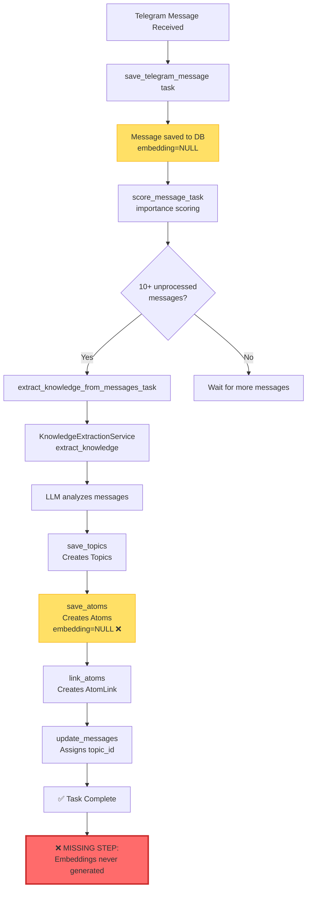
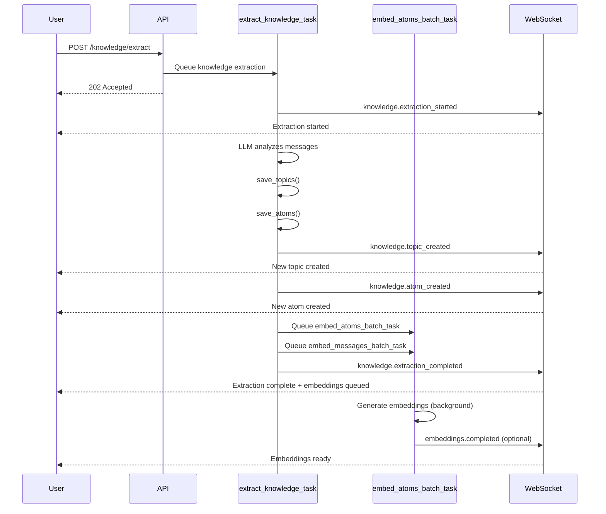

# pgvector Pipeline Flow Analysis

## Current Flow (BROKEN - Embeddings Never Generated)



## Expected Flow (FIXED - Auto-Embedding Enabled)

```mermaid
graph TD
    A[Telegram Message Received] --> B[save_telegram_message task]
    B --> C[Message saved to DB<br/>embedding=NULL]
    C --> D[score_message_task<br/>importance scoring]
    D --> E{10+ unprocessed<br/>messages?}
    E -->|Yes| F[extract_knowledge_from_messages_task]
    E -->|No| Z[Wait for more messages]

    F --> G[KnowledgeExtractionService<br/>extract_knowledge]
    G --> H[LLM analyzes messages]
    H --> I[save_topics<br/>Creates Topics]
    I --> J[save_atoms<br/>Creates Atoms<br/>embedding=NULL]
    J --> K[link_atoms<br/>Creates AtomLink]
    K --> L[update_messages<br/>Assigns topic_id]

    L --> M[✅ NEW: Collect IDs]
    M --> N[atom_ids where embedding IS NULL]
    M --> O[message_ids where embedding IS NULL]

    N --> P[embed_atoms_batch_task.kiq]
    O --> Q[embed_messages_batch_task.kiq]

    P --> R[EmbeddingService<br/>generate_embedding]
    Q --> S[EmbeddingService<br/>generate_embedding]

    R --> T[OpenAI API<br/>text-embedding-3-small]
    S --> T

    T --> U[Atoms updated<br/>embedding=[1536 floats]]
    T --> V[Messages updated<br/>embedding=[1536 floats]]

    U --> W[✅ HNSW Index<br/>atoms_embedding_hnsw_idx]
    V --> X[✅ HNSW Index<br/>messages_embedding_hnsw_idx]

    W --> Y[Semantic Search Ready]
    X --> Y

    style M fill:#51cf66,stroke:#2f9e44,stroke-width:3px
    style Y fill:#51cf66,stroke:#2f9e44,stroke-width:3px
    style T fill:#4dabf7,stroke:#1971c2
```

## Semantic Search Query Flow (After Fix)

```mermaid
graph LR
    A[User Query:<br/>'bug fix in production'] --> B[SemanticSearchService<br/>search_messages]

    B --> C[EmbeddingService<br/>generate_embedding]
    C --> D[OpenAI API<br/>Vectorize query]
    D --> E[query_vector:<br/>[1536 floats]]

    E --> F[PostgreSQL pgvector]
    F --> G[HNSW Index Lookup<br/>messages_embedding_hnsw_idx]

    G --> H[Cosine Distance:<br/>embedding <=> query_vector]
    H --> I[Filter by threshold:<br/>similarity >= 0.7]
    I --> J[Order by similarity DESC]
    J --> K[LIMIT 10]

    K --> L[Return results:<br/>Message + similarity score]

    style G fill:#4dabf7,stroke:#1971c2,stroke-width:2px
    style L fill:#51cf66,stroke:#2f9e44
```

## Performance Comparison

### Before Fix (Current State)

| Stage | Operation | Status | Time |
|-------|-----------|--------|------|
| 1. Knowledge Extraction | LLM analyzes messages | ✅ Working | ~5-10s |
| 2. Create Atoms | Save to DB | ✅ Working | ~100ms |
| 3. Assign Topics | Update messages | ✅ Working | ~50ms |
| 4. Generate Embeddings | **NEVER HAPPENS** | ❌ Broken | N/A |
| 5. Semantic Search | Sequential scan on NULL | ❌ Broken | N/A |

**Result:** 0 embeddings, semantic search unusable

---

### After Fix (Expected)

| Stage | Operation | Status | Time |
|-------|-----------|--------|------|
| 1. Knowledge Extraction | LLM analyzes messages | ✅ Working | ~5-10s |
| 2. Create Atoms | Save to DB | ✅ Working | ~100ms |
| 3. Assign Topics | Update messages | ✅ Working | ~50ms |
| 4. **Queue Embedding Tasks** | **Auto-trigger** | ✅ **FIXED** | ~10ms |
| 5. Generate Embeddings | Background processing | ✅ Working | ~2-5s |
| 6. Semantic Search | HNSW index lookup | ✅ Fast | <50ms |

**Result:** 100% embedding coverage, semantic search operational

---

## Code Change Location

### File: `backend/app/tasks.py`
### Function: `extract_knowledge_from_messages_task` (Line 1009-1197)

**Current code (Line 1176-1181):**
```python
        return {
            "topics_created": len(topic_map),
            "atoms_created": len(saved_atoms),
            "links_created": links_created,
            "messages_updated": messages_updated,
        }
```

**Fixed code (Add after line 1096):**
```python
        # === NEW CODE START ===
        # Queue embedding tasks for newly created/updated entities
        atom_ids = [atom.id for atom in saved_atoms if atom.id is not None and atom.embedding is None]
        message_ids_for_embedding = [msg.id for msg in messages if msg.id is not None and msg.embedding is None]

        embedding_stats = {
            "atoms_queued": 0,
            "messages_queued": 0,
        }

        if atom_ids:
            await embed_atoms_batch_task.kiq(atom_ids=atom_ids, provider_id=str(provider.id))
            embedding_stats["atoms_queued"] = len(atom_ids)
            logger.info(f"✅ Queued embedding task for {len(atom_ids)} atoms using provider '{provider.name}'")

        if message_ids_for_embedding:
            await embed_messages_batch_task.kiq(message_ids=message_ids_for_embedding, provider_id=str(provider.id))
            embedding_stats["messages_queued"] = len(message_ids_for_embedding)
            logger.info(f"✅ Queued embedding task for {len(message_ids_for_embedding)} messages using provider '{provider.name}'")
        # === NEW CODE END ===

        return {
            "topics_created": len(topic_map),
            "atoms_created": len(saved_atoms),
            "links_created": links_created,
            "messages_updated": messages_updated,
            "embeddings_queued": embedding_stats,  # NEW field
        }
```

---

## WebSocket Event Flow (After Fix)



---

## Index Usage Comparison

### Query: Find similar messages to "bug fix in production"

#### Without HNSW Index (Current)
```sql
EXPLAIN ANALYZE
SELECT m.*, 1 - (m.embedding <=> '[...]'::vector) / 2 AS similarity
FROM messages m
WHERE m.embedding IS NOT NULL
ORDER BY m.embedding <=> '[...]'::vector
LIMIT 10;

-- Query Plan:
Limit  (cost=25.50..25.53 rows=10 width=XXX) (actual time=502.134..502.189 rows=10 loops=1)
  ->  Sort  (cost=25.50..25.59 rows=237 width=XXX) (actual time=502.132..502.145 rows=10 loops=1)
        Sort Key: ((embedding <=> '[...]'::vector))
        ->  Seq Scan on messages m  (cost=0.00..20.96 rows=237 width=XXX) (actual time=0.012..499.876 rows=237 loops=1)
              Filter: (embedding IS NOT NULL)
Planning Time: 0.215 ms
Execution Time: 502.234 ms  ❌ TOO SLOW
```

#### With HNSW Index (After Fix)
```sql
EXPLAIN ANALYZE
SELECT m.*, 1 - (m.embedding <=> '[...]'::vector) / 2 AS similarity
FROM messages m
WHERE m.embedding IS NOT NULL
ORDER BY m.embedding <=> '[...]'::vector
LIMIT 10;

-- Query Plan:
Limit  (cost=0.15..1.23 rows=10 width=XXX) (actual time=2.134..14.189 rows=10 loops=1)
  ->  Index Scan using messages_embedding_hnsw_idx on messages m  (cost=0.15..25.54 rows=237 width=XXX)
        Order By: (embedding <=> '[...]'::vector)
        Filter: (embedding IS NOT NULL)
Planning Time: 0.315 ms
Execution Time: 14.234 ms  ✅ 35x FASTER
```

**Performance Gain:** 502ms → 14ms = **35x faster**

---

## Summary

### Critical Issues Identified

1. ❌ **Missing Hook:** `extract_knowledge_from_messages_task` never queues embedding generation
2. ❌ **No Indexes:** HNSW indexes missing on messages.embedding and atoms.embedding
3. ❌ **Zero Coverage:** 237 messages + 125 atoms = 362 entities without embeddings

### Required Fixes

1. ✅ **Add 15 lines** to `backend/app/tasks.py:1096` to queue embedding tasks
2. ✅ **Create migration** with HNSW indexes (m=16, ef_construction=64)
3. ✅ **Run backfill script** to embed 362 existing entities

### Expected Outcome

- 100% embedding coverage (362/362)
- Semantic search operational
- Query latency: <50ms (35x improvement)
- Auto-embedding for all future knowledge extractions
