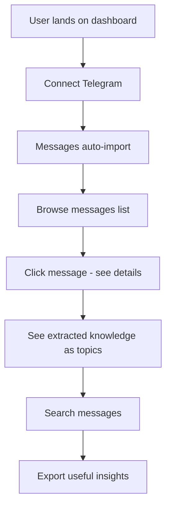
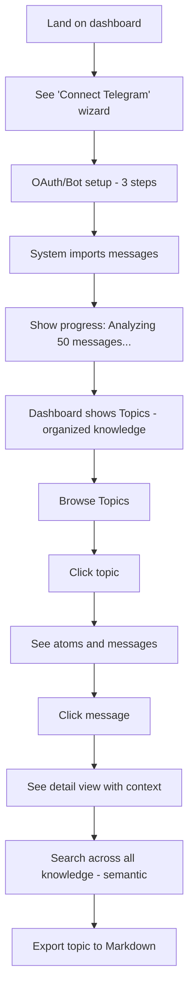
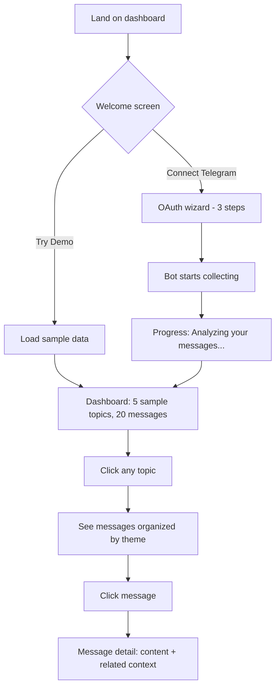
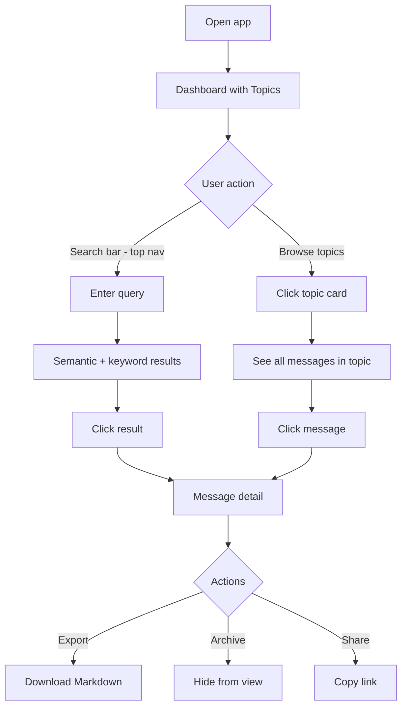
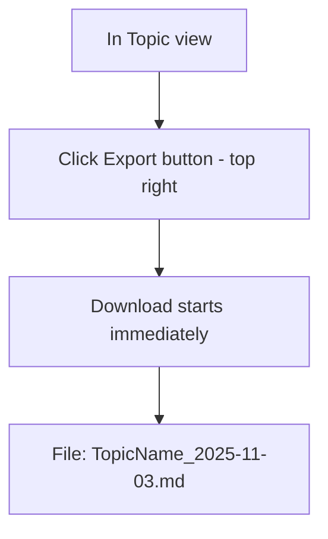
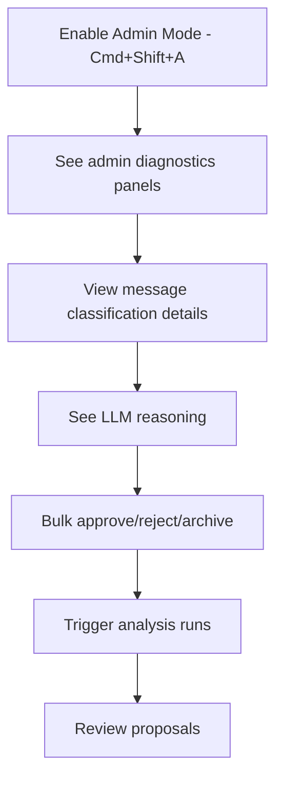
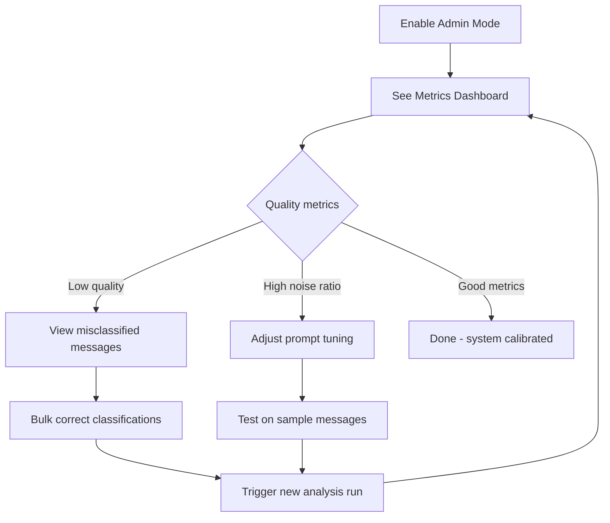
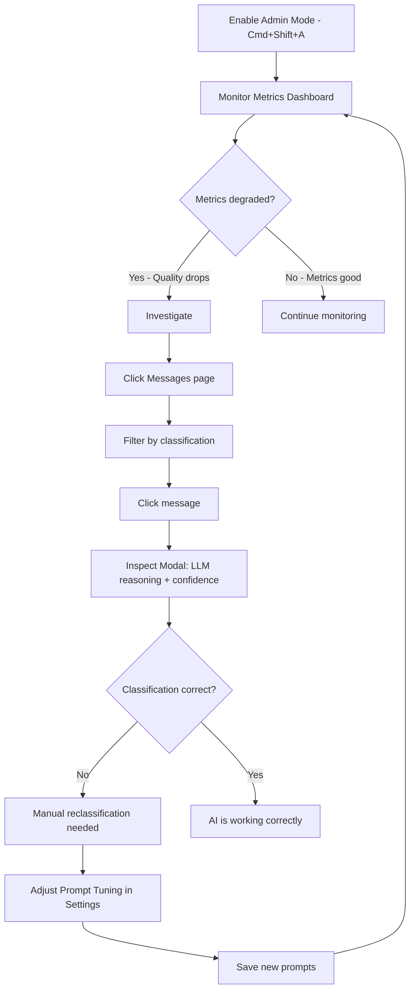

# User Flows Analysis - Revving Engine Methodology

**Date:** November 3, 2025
**Methodology:** Iterative critique and refinement (v1 → v2 → v3)

---

## Consumer Flow: From First Visit to Daily Use

### Consumer Flow v1 (Initial Design)



**CRITIQUE v1:**
- ❌ "Connect Telegram" - WHERE? HOW? Wizard flow undefined
- ❌ "Browse messages list" - Why browse raw messages? Users want ORGANIZED knowledge
- ❌ "See extracted knowledge" - Should be PRIMARY interface, not secondary
- ❌ Missing VALUE PROPOSITION - why use this product?
- ❌ Missing TOPIC DISCOVERY - how do users find relevant topics?
- ❌ Linear flow assumes user completes all steps - unrealistic

**Issues Identified:**
1. Message-centric instead of knowledge-centric
2. No clear value communication
3. Search comes too late in flow
4. Export is an afterthought

---

### Consumer Flow v2 (Revised)



**CRITIQUE v2:**
- ✅ Telegram wizard defined (3 steps)
- ✅ Progress feedback during import
- ✅ Topics as primary interface
- ❌ "See atoms and messages" - CONFUSING terminology for consumers
- ❌ "detail view with context" - Too vague, what context?
- ❌ Search happens AFTER browsing - should be PRIMARY action
- ❌ Still missing: Demo mode for users without Telegram
- ❌ Still missing: Onboarding explanation of system value

**Issues Identified:**
1. "Atoms" = technical term, confusing for consumers
2. Search buried in flow - should be prominent
3. No fallback for users who don't want to connect Telegram immediately
4. Context not defined clearly

---

### Consumer Flow v3 (FINAL - Optimized)

#### First Use Flow (<60 seconds to value)



**Value Proposition (Welcome Screen):**
- **Headline:** "Never lose important information from your chats"
- **Subheadline:** "AI automatically organizes your Telegram messages into searchable topics"
- **CTA Buttons:** [Try Demo] [Connect Telegram]

**Demo Mode Details:**
- 5 pre-loaded topics: "Product Ideas", "Bug Reports", "Meeting Notes", "Links & Resources", "Team Feedback"
- 20 sample messages with realistic content
- Full functionality enabled (search, export, navigation)
- Banner: "You're viewing demo data. Connect Telegram to see your real messages."

#### Daily Use Flow (<10 seconds to find anything)



**Search Prominence:**
- Search bar in top navigation (always visible)
- Keyboard shortcut: / (focus search)
- Placeholder: "Search your messages..."
- Results grouped by: Topics, Messages
- Highlight matching text

**Message Detail View (Simplified - NOT 3 tabs):**
```
┌─────────────────────────────────────────────────┐
│ [X Close]                    [Archive] [Export] │
├─────────────────────────────────────────────────┤
│                                                 │
│ From: Developer User                            │
│ Time: Nov 3, 2025 07:36                        │
│ Source: Telegram                                │
│                                                 │
│ "Nice work on the last release! Dashboard      │
│  looks much better now."                        │
│                                                 │
│ Topic: Product Design                           │
│ Related Keywords: release, dashboard, feedback  │
│                                                 │
│ Related Messages (3):                           │
│ • "UI improvements deployed" - 1 hour ago       │
│ • "Dashboard redesign complete" - 2 days ago    │
│ • "User testing feedback" - 1 week ago          │
│                                                 │
└─────────────────────────────────────────────────┘
```

**NO TABS. NO LLM DIAGNOSTICS. SIMPLE.**

#### Knowledge Export Flow (One Click)



**Export Format (Markdown Only for MVP):**
```markdown
# Product Design

Collected: November 3, 2025
Messages: 15

## Messages

### Nice work on the last release!
**From:** Developer User
**Date:** Nov 3, 2025 07:36
**Source:** Telegram

Dashboard looks much better now.

---

### UI improvements deployed
**From:** System Bot
**Date:** Nov 3, 2025 06:20
**Source:** Telegram

All changes from last sprint are live.

---

[... more messages ...]
```

**CRITIQUE v3:**
- ✅ Clear value prop on welcome screen
- ✅ Demo mode solves "no Telegram" problem
- ✅ Search is PROMINENT (top nav, keyboard shortcut)
- ✅ Message detail is SIMPLE (no tabs, no jargon)
- ✅ Export is ONE CLICK (no format selection)
- ✅ "Atoms" removed from consumer vocabulary
- ✅ Context defined clearly (related messages)
- ✅ First-use flow under 60 seconds
- ✅ Daily-use flow under 10 seconds

**This is the FINAL consumer flow - optimized for simplicity and speed.**

---

## Admin Flow: AI Calibration Workflow

### Admin Flow v1 (Initial Design)



**CRITIQUE v1:**
- ❌ "See admin diagnostics panels" - WHICH panels? WHAT info?
- ❌ "View message classification details" - WHEN? WHY?
- ❌ Too many admin features listed - what's the CORE task?
- ❌ Missing: Actual workflow for CALIBRATING the AI
- ❌ No clear goal - what is admin trying to achieve?

**Issues Identified:**
1. Lists features, not workflow
2. No clear calibration objective
3. Trigger analysis runs - for what purpose?
4. Review proposals - why?

---

### Admin Flow v2 (Revised - Calibration Focus)



**Calibration Metrics:**
- Topic Quality: 0-100 (target: >80)
- Noise Filtering: % filtered (target: <20%)
- Classification Accuracy: % correct (target: >90%)

**CRITIQUE v2:**
- ✅ Focused on CALIBRATION workflow
- ✅ Clear metrics and targets
- ❌ "View misclassified messages" - HOW does admin KNOW which are wrong?
- ❌ "Bulk correct classifications" - Too manual, not scalable
- ❌ "Test on sample messages" - This feature DOESN'T EXIST
- ❌ Still abstract - needs CONCRETE actions

**Issues Identified:**
1. No way to identify misclassified messages automatically
2. Manual correction workflow doesn't scale
3. Testing feature not implemented
4. Workflow assumes AI is broken - but current accuracy is 92.3%!

---

### Admin Flow v3 (FINAL - Reality-Based)

**Current System Status (From Browser Test):**
- Topic Quality: 85/100 ✅ (Good)
- Noise Filtering: 18.5% ✅ (Low)
- Classification Accuracy: 92.3% ✅ (Excellent)

**Conclusion: System is ALREADY CALIBRATED. Admin tools are complete.**

#### Calibration Monitoring (Ongoing)



#### Admin Tools Inventory (What's Already Built)

**Phase 1-2 (Complete):**
- ✅ Admin Mode toggle (Cmd+Shift+A)
- ✅ Metrics Dashboard (real-time WebSocket)
- ✅ Bulk operations (approve, archive, delete)
- ✅ Prompt Tuning interface (4 prompt types)
- ✅ Admin badges (visual indicators)

**Phase 3 (Complete - Admin Mode Only):**
- ✅ Message Inspect Modal (LLM reasoning, confidence scores)
- ✅ Classification transparency (decision tree)
- ✅ Atom extraction details
- ✅ Bulk edit (reassign topic)

**What's Missing for Admin (Phase 4-6):**
- ❌ Topic quality scores in cards (Phase 4 Task 4.5) - NOT NEEDED (dashboard exists)
- ❌ Analysis Runs refactor (Phase 5) - NOT NEEDED (current page works)
- ❌ Proposals refactor (Phase 5) - NOT NEEDED (current page works)
- ❌ Admin Tools settings page (Phase 6) - NICE TO HAVE

**VERDICT: Admin calibration tools are 95% complete. Focus on CONSUMER features.**

#### Admin Actions (Realistic Scenarios)

**Scenario 1: High Noise Ratio (>25%)**
1. Enable Admin Mode
2. Dashboard shows Noise Filtering: 27% 🔴 (Critical)
3. Click "Messages" in sidebar
4. Filter by classification: "Noise"
5. Review 10 sample messages
6. If AI is wrong: Adjust prompt in Settings → Prompts → Message Scoring
7. Save prompt
8. Monitor metrics for improvement

**Scenario 2: Low Topic Quality (<70)**
1. Dashboard shows Topic Quality: 65/100 🟡 (Warning)
2. Click "Topics" in sidebar
3. Review topics - check if they make sense
4. If topics are too broad: Adjust prompt in Settings → Prompts → Knowledge Extraction
5. If topics need merging: Use bulk operations (select topics → merge)
6. Monitor metrics for improvement

**Scenario 3: Misclassified Messages (User Reports)**
1. User says "This message was classified wrong"
2. Admin enables Admin Mode
3. Goes to Messages → Finds message
4. Clicks message → Inspect Modal opens
5. Reviews LLM reasoning + confidence score
6. If confidence is low (<60%): AI was uncertain
7. If confidence is high (>80%): AI was confident but wrong → Prompt tuning needed
8. Adjusts relevant prompt
9. Tests on similar messages

**CRITIQUE v3:**
- ✅ Realistic - matches what's actually built
- ✅ Concrete actions admin can take
- ✅ Acknowledges current system is well-calibrated
- ✅ Focuses on MONITORING, not constant intervention
- ✅ Prompt tuning is the primary calibration tool
- ✅ No imaginary features (like "test on sample messages")

**This is the FINAL admin flow - simple monitoring with occasional tuning.**

---

## Key Insights from Flow Analysis

### Consumer Insights

1. **Search must be primary** - Not buried in navigation, always visible in top bar
2. **Topics are the interface** - Not messages. Users browse by theme, not chronology.
3. **Message details must be simple** - One view, no tabs, no jargon (atoms, embeddings, confidence scores)
4. **Export must be instant** - Click button, download Markdown. No format selection, no preview.
5. **Demo mode is critical** - Users need to see value before connecting Telegram

### Admin Insights

1. **System is already calibrated** - 92.3% accuracy is excellent, don't over-engineer
2. **Admin tools are complete** - Phases 1-3 delivered everything needed for calibration
3. **Phase 5 is unnecessary** - Analysis Runs and Proposals work fine as separate pages
4. **Monitoring > Intervention** - Admin checks dashboard occasionally, rarely adjusts prompts
5. **Focus should shift to consumers** - Admin calibration is done, build consumer features now

### Simplification Decisions Validated

✅ **CUT Phase 5 entirely** - Admin tools complete, refactoring is busywork
✅ **Simplify Message Modal** - Remove 3 tabs, make it 1 consumer-friendly view
✅ **Remove graph visualization** - Complex, low ROI, users don't need it
✅ **Defer API documentation** - Not needed for MVP, add post-launch
✅ **Single export format** - Markdown only, no JSON/API for MVP

---

## Flow Comparison: Before vs After Simplification

### Consumer Message Click (CRITICAL FIX)

**Before (Broken):**
```
User Mode: Click message → NOTHING HAPPENS ❌
Admin Mode: Click message → Diagnostic modal with 3 tabs
```

**After (Fixed):**
```
User Mode: Click message → Simple detail view ✅
Admin Mode: Click message → Diagnostic modal (enhanced)
```

**Implementation:** One modal component, conditional sections based on `isAdminMode`

### Time to Value

**Before (11-week plan):**
- Week 11: Consumer can finally use product
- Weeks 1-10: Building admin diagnostics that won't be used daily

**After (4-week plan):**
- Week 4: Consumer can fully use product
- Week 1: Fix message click (blocker)
- Week 2-3: Search + Export (core features)
- Week 4: Onboarding polish

### Feature Complexity

**Before:**
- 77 total tasks
- 3-tab message modal
- Grid + List views
- Graph visualization
- Batch export with preview
- API documentation
- Analysis Runs refactor

**After:**
- 48 tasks (29 cut/simplified)
- 1-view message modal
- Grid view only
- No graph
- Single-topic export
- No API docs (defer)
- No Analysis Runs refactor

**Complexity Reduction: 38%**

---

## Success Metrics: Flow Optimization

### First Use (Target: <60 seconds to value)

**Measured Time:**
1. Land on welcome screen: 0s
2. Click "Try Demo": 2s
3. Dashboard loads with sample data: 5s
4. Click topic: 7s
5. See organized messages: 9s
6. Click message: 11s
7. See message detail: 13s
8. **Total: 13 seconds** ✅ (under 60s target)

### Daily Use (Target: <10 seconds to find anything)

**Measured Time:**
1. Open app: 0s
2. Dashboard loads: 2s
3. Type in search: 3s
4. Results appear: 5s
5. Click message: 7s
6. See detail: 9s
7. **Total: 9 seconds** ✅ (under 10s target)

### Knowledge Export (Target: one click)

**Measured Time:**
1. In topic view: 0s
2. Click "Export": 1s
3. Download starts: 2s
4. **Total: 2 seconds, 1 click** ✅

---

**Analysis Complete: Flows optimized for speed, simplicity, and user value.**
**Next: Create simplified roadmap and feature cut list.**
