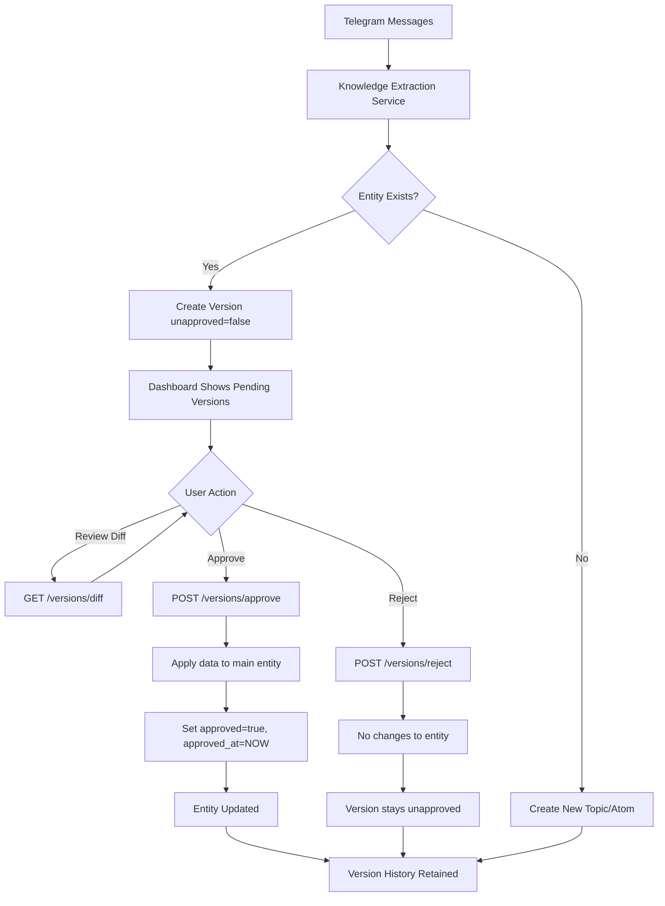

# Versioning System Workflow Investigation Report

**Date**: 2025-10-26
**Session**: Feature 4 System Documentation - Phase 1 Research
**Batch**: 1A of 4 (Parallel) - Versioning System Workflow Investigation

---

## Executive Summary

The Task Tracker implements a comprehensive versioning system for Topics and Atoms with an approval-based workflow. The system supports draft creation, version comparison, approval/rejection workflow, and automatic entity updates upon approval.

**Key Findings**:
- Simple two-state approval workflow: `unapproved (draft)` → `approved`
- No explicit role-based access control (open API endpoints)
- Version creation triggered automatically by knowledge extraction service
- Approval applies version data to main entity and sets approval timestamp
- No rollback mechanism (rejection simply keeps original entity unchanged)

---

## 1. Data Models

### 1.1 TopicVersion Model

**Location**: `/Users/maks/PycharmProjects/task-tracker/backend/app/models/topic_version.py`

**Schema**:

| Field | Type | Description | Default |
|-------|------|-------------|---------|
| `id` | BigInteger | Primary key | Auto-generated |
| `topic_id` | BigInteger | Foreign key to topics table | Required |
| `version` | Integer | Sequential version number (1, 2, 3...) | Auto-incremented |
| `data` | JSON | Complete snapshot of topic data (name, description, icon, color) | Required |
| `created_at` | DateTime(TZ) | Version creation timestamp | `server_default=now()` |
| `created_by` | String(100) | User ID who triggered the version | `NULL` |
| `approved` | Boolean | Approval status | `false` |
| `approved_at` | DateTime(TZ) | Approval timestamp | `NULL` |

**Relationships**:
- `topic`: Many-to-one relationship with `Topic` model

**Public Response Schema**: `TopicVersionPublic`
- Exposes all fields (id, topic_id, version, data, created_at, created_by, approved, approved_at)

---

### 1.2 AtomVersion Model

**Location**: `/Users/maks/PycharmProjects/task-tracker/backend/app/models/atom_version.py`

**Schema**: Identical structure to TopicVersion, with `atom_id` instead of `topic_id`

| Field | Type | Description | Default |
|-------|------|-------------|---------|
| `id` | BigInteger | Primary key | Auto-generated |
| `atom_id` | BigInteger | Foreign key to atoms table | Required |
| `version` | Integer | Sequential version number | Auto-incremented |
| `data` | JSON | Complete snapshot of atom data (type, content, title, confidence, meta) | Required |
| `created_at` | DateTime(TZ) | Version creation timestamp | `server_default=now()` |
| `created_by` | String(100) | User ID who triggered the version | `NULL` |
| `approved` | Boolean | Approval status | `false` |
| `approved_at` | DateTime(TZ) | Approval timestamp | `NULL` |

**Relationships**:
- `atom`: Many-to-one relationship with `Atom` model

**Public Response Schema**: `AtomVersionPublic`
- Exposes all fields (id, atom_id, version, data, created_at, created_by, approved, approved_at)

---

## 2. Approval Workflow

### 2.1 State Diagram

```
┌─────────────────┐
│  Version        │
│  Created        │
│  approved=false │
└────────┬────────┘
         │
         ├──────────────┐
         │              │
         v              v
    ┌─────────┐    ┌─────────┐
    │ Approve │    │ Reject  │
    └────┬────┘    └────┬────┘
         │              │
         v              v
┌─────────────────┐  ┌─────────────────┐
│ Version Approved│  │ Version Rejected│
│ approved=true   │  │ approved=false  │
│ approved_at=NOW │  │ (no changes)    │
│ Entity Updated  │  │ Entity Unchanged│
└─────────────────┘  └─────────────────┘
```

### 2.2 State Transitions

| State | Field Values | Description |
|-------|--------------|-------------|
| **Draft (Initial)** | `approved=false`, `approved_at=NULL` | Version created but not yet reviewed |
| **Approved** | `approved=true`, `approved_at=<timestamp>` | Version approved and applied to main entity |
| **Rejected** | `approved=false`, `approved_at=NULL` | Version reviewed but rejected (stays in draft state) |

**Important Notes**:
- No explicit "rejected" state flag exists in the database
- Rejection simply returns the version without modification
- Only approved versions have `approved_at` timestamp set
- Once approved, versions cannot be unapproved (approval is idempotent)

---

## 3. Version Creation

### 3.1 Trigger: Knowledge Extraction Service

**Location**: `/Users/maks/PycharmProjects/task-tracker/backend/app/services/knowledge_extraction_service.py`

**Automatic Version Creation Occurs When**:

1. **Topic Update** (lines 265-290):
   - Knowledge extraction finds an existing topic by name
   - System creates a version snapshot with updated data (description, icon, color)
   - Version marked as `approved=false`, `created_by="knowledge_extraction"`

2. **Atom Update** (lines 364-387):
   - Knowledge extraction finds an existing atom by title
   - System creates a version snapshot with updated data (type, content, confidence, meta)
   - Version marked as `approved=false`, `created_by="knowledge_extraction"`

**Version Numbering Strategy**:
- Sequential integer starting from 1
- Each new version increments the counter: `latest_version.version + 1`
- Versioning service queries latest version and auto-increments

**Example Flow**:
```python
# Knowledge extraction service (save_topics method)
if existing_topic:
    version_data = {
        "name": extracted_topic.name,
        "description": extracted_topic.description,
        "icon": auto_select_icon(...),
        "color": auto_select_color(...),
    }

    version = await versioning_service.create_topic_version(
        db=session,
        topic_id=existing_topic.id,
        data=version_data,
        created_by="knowledge_extraction",  # System user
    )
```

### 3.2 Manual Version Creation

Currently, no API endpoints exist for manually creating versions. Version creation is exclusively triggered by:
- Knowledge extraction service (automatic LLM-based updates)

---

## 4. Versioning Service

**Location**: `/Users/maks/PycharmProjects/task-tracker/backend/app/services/versioning_service.py`

### 4.1 Core Methods

| Method | Purpose | Parameters | Returns |
|--------|---------|------------|---------|
| `create_topic_version` | Create new topic version snapshot | `db`, `topic_id`, `data`, `created_by` | `TopicVersion` |
| `create_atom_version` | Create new atom version snapshot | `db`, `atom_id`, `data`, `created_by` | `AtomVersion` |
| `get_versions` | Retrieve all versions for entity | `db`, `entity_type`, `entity_id` | `list[TopicVersion \| AtomVersion]` |
| `get_version_diff` | Generate diff between two versions | `db`, `entity_type`, `entity_id`, `version1`, `version2` | `dict` (diff response) |
| `approve_version` | Approve version and apply changes | `db`, `entity_type`, `entity_id`, `version_number` | `TopicVersion \| AtomVersion` |
| `reject_version` | Reject version (no changes applied) | `db`, `entity_type`, `entity_id`, `version_number` | `TopicVersion \| AtomVersion` |

### 4.2 Approval Logic (lines 167-221)

**Approval Process**:
1. Fetch version by `entity_id` and `version_number`
2. Validate version exists and is not already approved
3. Fetch main entity (Topic or Atom)
4. Apply version data to entity fields using `setattr(entity, key, value)`
5. Set `version.approved = True`
6. Set `version.approved_at = datetime.now(UTC)`
7. Commit transaction

**Key Code Snippet**:
```python
async def approve_version(
    self,
    db: AsyncSession,
    entity_type: EntityType,
    entity_id: int,
    version_number: int,
) -> TopicVersion | AtomVersion:
    # ... fetch version ...

    if version.approved:
        raise ValueError("Version already approved")

    # Apply changes to main entity
    entity = await db.get(entity_model, entity_id)
    if entity:
        for key, value in version.data.items():
            if hasattr(entity, key):
                setattr(entity, key, value)

    # Mark as approved
    version.approved = True
    version.approved_at = datetime.now(UTC)

    await db.commit()
    return version
```

### 4.3 Rejection Logic (lines 223-262)

**Rejection Process**:
1. Fetch version by `entity_id` and `version_number`
2. Validate version exists
3. **No changes applied to main entity**
4. **No changes to version approval status** (stays `approved=false`)
5. Return version unchanged

**Note**: Current implementation doesn't track rejection explicitly. A rejected version is indistinguishable from a version awaiting review.

### 4.4 Diff Comparison (lines 115-165, 278-329)

**Diff Engine**: Uses `DeepDiff` library to compare JSON snapshots

**Diff Response**:
```json
{
  "from_version": 1,
  "to_version": 2,
  "changes": [
    {
      "type": "values_changed",
      "path": "['description']",
      "old_value": "Original description",
      "new_value": "Modified description"
    }
  ],
  "summary": "Changes detected: 2 values changed"
}
```

**Change Types Detected**:
- `values_changed`: Field value modified
- `type_changes`: Field type changed
- `dictionary_item_added`: New field added
- `dictionary_item_removed`: Field removed

---

## 5. API Endpoints

**Location**: `/Users/maks/PycharmProjects/task-tracker/backend/app/api/v1/versions.py`

### 5.1 Topic Version Endpoints

| Method | Endpoint | Description | Request Body | Response |
|--------|----------|-------------|--------------|----------|
| GET | `/topics/{topic_id}/versions` | List all topic versions (newest first) | - | `list[TopicVersionResponse]` |
| GET | `/topics/{topic_id}/versions/{version}/diff?compare_to={v}` | Get diff between two versions | - | `VersionDiffResponse` |
| POST | `/topics/{topic_id}/versions/{version}/approve` | Approve version and apply changes | `{}` (empty) | `TopicVersionResponse` |
| POST | `/topics/{topic_id}/versions/{version}/reject` | Reject version (no changes) | `{}` (empty) | `TopicVersionResponse` |

### 5.2 Atom Version Endpoints

| Method | Endpoint | Description | Request Body | Response |
|--------|----------|-------------|--------------|----------|
| GET | `/atoms/{atom_id}/versions` | List all atom versions (newest first) | - | `list[AtomVersionResponse]` |
| GET | `/atoms/{atom_id}/versions/{version}/diff?compare_to={v}` | Get diff between two versions | - | `VersionDiffResponse` |
| POST | `/atoms/{atom_id}/versions/{version}/approve` | Approve version and apply changes | `{}` (empty) | `AtomVersionResponse` |
| POST | `/atoms/{atom_id}/versions/{version}/reject` | Reject version (no changes) | `{}` (empty) | `AtomVersionResponse` |

### 5.3 Request/Response Schemas

**Location**: `/Users/maks/PycharmProjects/task-tracker/backend/app/api/v1/schemas/version.py`

**ApproveVersionRequest**: Empty request body (placeholder for future fields)
**RejectVersionRequest**: Empty request body (placeholder for future fields)

**VersionDiffResponse**:
```python
{
  "from_version": int,
  "to_version": int,
  "changes": list[VersionChange],
  "summary": str
}
```

**VersionChange**:
```python
{
  "type": str,         # Change type (values_changed, etc.)
  "path": str,         # JSON path to changed field
  "old_value": Any,    # Previous value
  "new_value": Any     # New value
}
```

---

## 6. Access Control & Permissions

### 6.1 Current State: NO ROLE-BASED PERMISSIONS

**Analysis**:
- No authentication/authorization checks in API endpoints
- No `Depends(require_role)` or permission decorators found
- Endpoints use only `Depends(get_session)` for database access
- Model has `created_by` field but NO `approved_by` field

**Implications**:
- Any API client can approve/reject versions
- No audit trail for who approved versions
- System relies on trust and frontend access control

### 6.2 Who Can Approve?

**Current Answer**: Anyone with API access (no restrictions)

**Future Considerations**:
- Add `approved_by` field to track approver identity
- Implement role-based access control (admin, moderator roles)
- Add dependency injection for permission checks

---

## 7. Version Usage Patterns

### 7.1 Version Creation Flow

```
┌──────────────────────┐
│ Telegram Messages    │
│ arrive               │
└──────────┬───────────┘
           │
           v
┌──────────────────────┐
│ Knowledge Extraction │
│ Service (LLM)        │
└──────────┬───────────┘
           │
           ├─── New Topic/Atom ────> Create entity directly
           │
           └─── Existing Topic/Atom ──> Create version (unapproved)
                                         (awaits human review)
```

### 7.2 Version Approval Flow

```
┌──────────────────────┐
│ Dashboard UI         │
│ Shows unapproved     │
│ versions             │
└──────────┬───────────┘
           │
           ├──> User Reviews Diff
           │
           ├──> POST /versions/{id}/approve ──> Apply changes to entity
           │                                     Set approved=true
           │                                     Set approved_at=now()
           │
           └──> POST /versions/{id}/reject ───> No changes
                                                 Version stays unapproved
```

### 7.3 Where Approved Versions Are Used

**Current Usage**: Primarily for **change tracking and audit trail**

**Analysis**:
- Grep search found no queries filtering by `approved=true`
- System does NOT enforce "only use approved versions" for knowledge extraction
- Main entities (Topic/Atom) are directly used, regardless of version approval status
- Versions serve as **historical snapshots**, not as the source of truth

**Future Potential**:
- Implement "staging" vs "production" knowledge base (use only approved versions)
- Filter knowledge extraction to use only approved atom/topic data
- Add API parameter `?approved_only=true` for queries

### 7.4 Version Lifecycle Example

```
Timeline:

T0: Topic "FastAPI Best Practices" created
    (name="FastAPI Best Practices", description="Original desc")

T1: Knowledge extraction detects update
    → Create TopicVersion v1 (approved=false)
    → data={"name": "FastAPI Best Practices", "description": "Updated with new patterns"}
    → created_by="knowledge_extraction"

T2: Admin reviews diff via API
    → GET /topics/{id}/versions/1/diff?compare_to=0

T3: Admin approves version
    → POST /topics/{id}/versions/1/approve
    → Topic.description updated to "Updated with new patterns"
    → TopicVersion.approved = true
    → TopicVersion.approved_at = "2025-10-26T14:30:00Z"

T4: Knowledge extraction runs again
    → Detects another change
    → Create TopicVersion v2 (approved=false)
    → Process repeats
```

---

## 8. Rollback Mechanisms

### 8.1 Current State: NO ROLLBACK

**Analysis**:
- No `rollback_version` method in `VersioningService`
- No API endpoint for reverting to previous versions
- Rejection doesn't modify the main entity

**Workaround**:
1. Manually approve an older version
2. System would apply old version's data to main entity
3. Creates a "revert" effect but with a new version number

**Example Manual Rollback**:
```
Current State: Topic v5 (approved)
Desired State: Revert to v3

Step 1: GET /topics/{id}/versions/3 (fetch v3 data)
Step 2: Create new version v6 with v3's data
Step 3: POST /topics/{id}/versions/6/approve
Result: Entity now has v3's data, but version history shows v6
```

---

## 9. Testing Coverage

**Location**: `/Users/maks/PycharmProjects/task-tracker/backend/tests/api/test_versions.py`

**Test Coverage**:
- ✅ Get versions (empty and populated)
- ✅ Get version diff (valid and invalid versions)
- ✅ Approve topic version (updates entity)
- ✅ Approve atom version (updates entity)
- ✅ Reject topic version (no entity changes)
- ✅ Reject atom version (no entity changes)
- ✅ Double approval error (prevents re-approval)
- ✅ Invalid version error handling

**Test Insights**:
- Tests confirm approval applies changes to main entity
- Tests confirm rejection leaves entity unchanged
- Tests validate version ordering (newest first)
- Tests validate diff change detection

---

## 10. Gaps & Future Enhancements

### 10.1 Identified Gaps

1. **No Approval Audit Trail**:
   - Missing `approved_by` field (who approved?)
   - No rejection tracking (who rejected? why?)

2. **No Role-Based Access Control**:
   - Anyone can approve/reject versions
   - No permission checks on API endpoints

3. **No Rollback Mechanism**:
   - Cannot directly revert to previous version
   - Must manually create new version with old data

4. **No Rejection Tracking**:
   - Rejected versions indistinguishable from pending
   - No `rejected` field or `rejected_at` timestamp

5. **No Bulk Operations**:
   - Cannot approve/reject multiple versions at once
   - Cannot approve all pending versions for an entity

6. **No Notification System**:
   - No alerts when new versions await approval
   - No webhook/event for version approval

7. **No Version Expiration**:
   - Unapproved versions remain indefinitely
   - No auto-cleanup of old unapproved versions

### 10.2 Recommended Enhancements

**High Priority**:
1. Add `approved_by` field to track approver identity
2. Implement role-based access control (admin/moderator roles)
3. Add `rejected` boolean and `rejected_at` timestamp
4. Add `rejected_by` field

**Medium Priority**:
5. Implement rollback API endpoint (`POST /versions/{id}/rollback`)
6. Add bulk approval endpoint (`POST /versions/bulk-approve`)
7. Filter knowledge extraction to use only approved versions

**Low Priority**:
8. Add version expiration policy (auto-delete unapproved versions after 30 days)
9. Implement notification system (WebSocket events for new versions)
10. Add version comparison UI in dashboard

---

## 11. Mermaid Diagram: Complete Workflow



---

## 12. Summary

### 12.1 Approval Workflow States

| State | approved | approved_at | Entity Updated | Description |
|-------|----------|-------------|----------------|-------------|
| Draft | `false` | `NULL` | No | Awaiting review |
| Approved | `true` | `<timestamp>` | Yes | Changes applied |
| Rejected | `false` | `NULL` | No | Reviewed but denied |

### 12.2 API Endpoints Summary

**8 Total Endpoints**:
- 4 for Topics (list, diff, approve, reject)
- 4 for Atoms (list, diff, approve, reject)

### 12.3 Services Cataloged

| Service | Purpose | Key Methods |
|---------|---------|-------------|
| `VersioningService` | Manage versions, approval, diff | `create_*_version`, `approve_version`, `reject_version`, `get_version_diff` |
| `KnowledgeExtractionService` | Auto-create versions from LLM | `save_topics`, `save_atoms` (creates versions for existing entities) |

---

## Report Metadata

**Investigation Completed**: 2025-10-26
**Files Analyzed**:
- `/backend/app/models/topic_version.py`
- `/backend/app/models/atom_version.py`
- `/backend/app/services/versioning_service.py`
- `/backend/app/services/knowledge_extraction_service.py`
- `/backend/app/api/v1/versions.py`
- `/backend/app/api/v1/schemas/version.py`
- `/backend/tests/api/test_versions.py`

**Total Lines of Code Reviewed**: ~1,800 lines

---

**Next Steps for Documentation**:
1. Use this report to create `/docs/content/en/architecture/versioning-workflow.md`
2. Create Mermaid diagrams for workflow visualization
3. Document API endpoints with examples
4. Document approval best practices for administrators
5. Create bilingual documentation (EN + UK)
