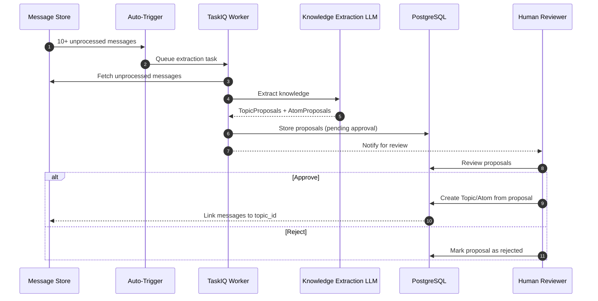
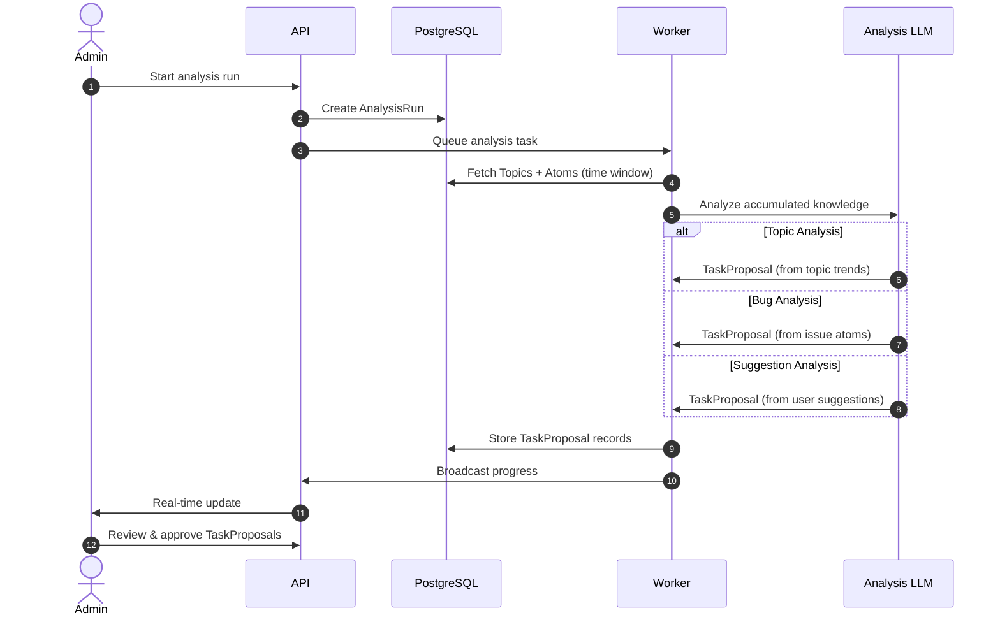
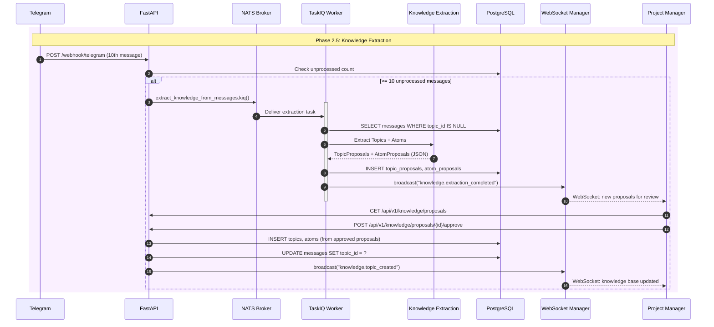
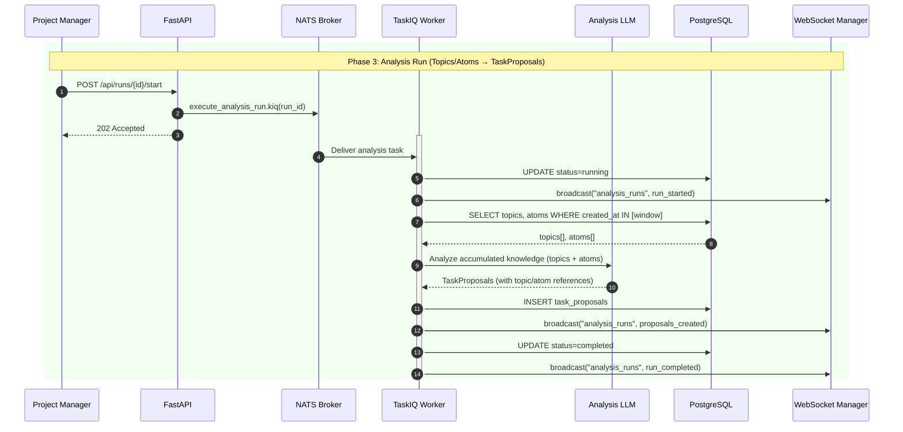

# Documentation Audit Report: TaskProposal Creation Flow

**Date:** October 24, 2025
**Auditor:** Claude Code
**Scope:** All documentation in `docs/content/en` and `docs/content/uk`
**Issue:** Incorrect TaskProposal creation flow documented in multiple files

---

## Executive Summary

**Critical Issue Found:** Multiple documentation files incorrectly describe TaskProposals as being created directly from Message → Analysis Run flow, when the correct architecture creates TaskProposals from accumulated knowledge (Topics/Atoms) after Knowledge Extraction.

**Impact:**
- Misleading architecture diagrams showing wrong data flow
- Incorrect understanding of system design for developers
- Potential implementation errors based on wrong documentation

**Files Affected:** 5 primary documentation files (English + Ukrainian versions)

**Severity:** HIGH - Core architectural misrepresentation

---

## Incorrect Flow vs. Correct Flow

### ❌ WRONG Flow (Currently in Docs)

```
Telegram Message → Message Storage → Analysis Run → TaskProposals
                                          ↓
                                    LLM processes messages directly
                                          ↓
                                    Generate proposals
```

**Problems:**
1. Skips knowledge extraction entirely
2. No Topics/Atoms intermediate layer
3. No approval workflow for extracted knowledge
4. Messages directly converted to proposals (no context accumulation)

### ✅ CORRECT Flow

```
Message Ingestion
    ↓
Knowledge Extraction (auto-triggered at 10+ messages)
    ↓
TopicProposals + AtomProposals (LLM structured output)
    ↓
Human Approval/Rejection
    ↓
Topics + Atoms (accumulated knowledge base)
    ↓
Analysis of Accumulated Knowledge
    ├─ Topics analysis (context patterns)
    ├─ Bug reports (identified issues)
    └─ User suggestions (improvement proposals)
    ↓
TaskProposals (action items from knowledge)
```

**Key Differences:**
1. **Intermediate Layer:** TopicProposals and AtomProposals are created FIRST
2. **Approval Gate:** Human reviews and approves/rejects proposals before they become Topics/Atoms
3. **Knowledge Accumulation:** Topics and Atoms build up over time
4. **Context-Aware:** TaskProposals come from analyzing accumulated knowledge, not individual messages
5. **Multiple Sources:** TaskProposals can originate from Topics, Bugs, or Suggestions - not just messages

---

## Detailed Findings

### File 1: `docs/content/en/architecture/analysis-system.md`

**Lines:** 23-54, 80-103, 125-146

**Issues Found:**

1. **Line 28-42:** High-level architecture diagram shows wrong flow
   ```
   Messages (raw, signal only)
       ↓
   Analysis Run (PENDING)
       ↓
   [RUNNING] Process Messages
       ↓
   [COMPLETED] Generate Proposals    ← WRONG
   ```

   **Should be:**
   ```
   Messages (raw)
       ↓
   Knowledge Extraction
       ↓
   TopicProposals/AtomProposals
       ↓
   Human Approval
       ↓
   Topics/Atoms (accumulated)
       ↓
   Analysis Run (analyze knowledge)
       ↓
   TaskProposals (from topics/bugs/suggestions)
   ```

2. **Line 80-103:** TaskProposal structure references direct messages
   ```python
   "source_message_ids": [101, 102, 103],  # ← Implies direct message→proposal
   ```

   **Should reference:**
   ```python
   "source_topic_ids": [5, 12],  # Topics that triggered this proposal
   "source_atom_ids": [45, 67],  # Atoms that informed this proposal
   "reasoning": "Based on accumulated context from 'iOS Authentication' topic"
   ```

3. **Line 136-143:** Process description is wrong
   ```
   2. Fetch messages in time window
   3. Apply noise filter (if enabled)
   4. Apply message deduplication
   5. Create batches
   6. Generate embeddings (if RAG)
   7. Build context from similar past proposals
   8. Call LLM for each batch
   9. Store proposals
   ```

   **Should be:**
   ```
   1. Identify relevant Topics and Atoms
   2. Analyze topic trends and patterns
   3. Extract actionable insights from accumulated knowledge
   4. Generate TaskProposals based on:
      - Topic analysis (context accumulation)
      - Bug reports (identified issues)
      - User suggestions (improvement proposals)
   5. Store proposals with knowledge references
   ```

**Recommendation:** Complete rewrite of sections 1-3 to reflect correct knowledge extraction → approval → analysis flow.

---

### File 2: `docs/content/en/architecture/diagrams.md`

**Lines:** 215-260

**Issues Found:**

1. **Line 215-260:** "Analysis System Workflow" diagram shows wrong sequence
   ```mermaid
   loop For each atom
       Worker→Agents: Dispatch to AI agents
       Agents→Providers: OpenAI request
       Worker→DB: Store AnalysisProposal records  ← WRONG ENTITY NAME
   ```

   **Problems:**
   - Uses "AnalysisProposal" instead of "TaskProposal"
   - Shows "For each atom" loop but then generates proposals directly
   - Missing the TopicProposal/AtomProposal approval step
   - No Topics/Atoms intermediate storage before analysis

**Recommendation:** Replace entire diagram with correct two-phase flow:
   - Phase 1: Knowledge Extraction (Messages → TopicProposals/AtomProposals → Topics/Atoms)
   - Phase 2: Analysis (Topics/Atoms → TaskProposals)

---

### File 3: `docs/content/en/event-flow.md`

**Lines:** 68-110

**Issues Found:**

1. **Line 68-110:** Phase 3 shows Analysis Run directly processing messages
   ```mermaid
   Worker->>DB: SELECT messages WHERE sent_at IN [window]
   Worker->>Worker: LLM Analysis (Pydantic-AI)
   Worker->>DB: INSERT task_proposals (batch)
   ```

   **Missing:**
   - Knowledge extraction phase (Messages → Topics/Atoms)
   - TopicProposal/AtomProposal creation
   - Human approval workflow
   - Analysis should query Topics/Atoms, not Messages

**Recommendation:** Add new "Phase 2.5: Knowledge Extraction & Approval" before current Phase 3, and update Phase 3 to query Topics/Atoms instead of Messages.

---

### File 4: `docs/content/en/architecture/overview.md`

**Lines:** 48-71, 327-338

**Issues Found:**

1. **Line 48-71:** Core Components section doesn't mention knowledge extraction layer
   ```
   1. Message Layer (Layer 1 - Raw Data)
   2. Signal/Noise Filtering (Layer 2)
   3. Structured Extracts (Layer 3 - Atoms)  ← Exists but not connected to analysis
   4. Aggregated Insights (Layer 4 - Dashboard)
   ```

   **Missing link:** How Layer 3 (Atoms) connects to TaskProposals

2. **Line 327-338:** Data Model Relationships diagram wrong
   ```
   Messages ─────► (importance_score, noise_status)
                   ├─► Signal Filter ─────► Embeddings
                   ├─► Analysis Runs ─────► Proposals  ← WRONG
   ```

   **Should be:**
   ```
   Messages → Knowledge Extraction → TopicProposals/AtomProposals
                                              ↓
                                         Human Approval
                                              ↓
                                        Topics/Atoms
                                              ↓
                                       Analysis Runs → TaskProposals
   ```

**Recommendation:** Add explicit section "Knowledge Extraction Pipeline" and update relationships diagram.

---

### File 5: `docs/content/en/knowledge-extraction.md`

**Lines:** N/A (This file is CORRECT)

**Status:** ✅ Correctly documents Knowledge Extraction flow

**Good Example:** Line 40-48 shows correct process:
```mermaid
A[Messages Arrive] --> B{10+ Unprocessed<br/>Messages?}
B -->|Yes| C[Queue Extraction Task]
C --> E[Analyze with AI]
E --> F[Create Topics & Atoms]
F --> G[Update Knowledge Graph]
```

**Note:** This file should be referenced from analysis-system.md as the prerequisite step.

---

## Ukrainian Documentation

**Status:** Ukrainian versions mirror English errors

**Files Affected:**
- `docs/content/uk/architecture/analysis-system.md` (same issues as EN)
- `docs/content/uk/event-flow.md` (same issues as EN)
- `docs/content/uk/architecture/overview.md` (same issues as EN)
- `docs/content/uk/architecture/diagrams.md` (same issues as EN)

**Recommendation:** Apply same corrections to Ukrainian files after English files are fixed.

---

## Root Cause Analysis

**Why This Happened:**

1. **Analysis System designed first:** TaskProposal entities and Analysis Run workflow were implemented before Knowledge Extraction
2. **Missing integration docs:** No document explicitly connecting Knowledge Extraction → Analysis System
3. **Terminology confusion:** "Proposals" used for both:
   - TopicProposals/AtomProposals (knowledge extraction output)
   - TaskProposals (analysis system output)
4. **No review after Knowledge Extraction addition:** Docs not updated when new system was added

---

## Correct Flow Definition (Canonical)

### Phase 1: Message Ingestion
```
Telegram → Webhook → Save Message (all data preserved)
```

**Entities:** `Message`

### Phase 2: Knowledge Extraction (Auto-Triggered)
```
10+ Unprocessed Messages
    ↓
KnowledgeExtractionService + LLM
    ↓
Generate Structured Output:
    ├─ TopicProposals (confidence: 0.0-1.0)
    └─ AtomProposals (confidence: 0.0-1.0)
```

**Entities:** `Message`, `TopicProposal` (not yet in DB schema), `AtomProposal` (not yet in DB schema)

**Storage:** Proposals stored as intermediate entities awaiting approval

### Phase 3: Human Approval
```
User Reviews TopicProposals & AtomProposals
    ├─ Approve → Create Topic/Atom entity
    ├─ Reject → Discard proposal
    └─ Edit → Modify before approving
```

**Entities:** `TopicProposal`, `AtomProposal`, `Topic`, `Atom`

**Outcome:** Approved proposals become permanent Topics and Atoms in knowledge base

### Phase 4: Knowledge Accumulation
```
Topics and Atoms accumulate over time
    ├─ Multiple messages → Single Topic
    ├─ Multiple messages → Multiple Atoms under Topic
    └─ Atoms linked via relationships (solves, supports, etc.)
```

**Entities:** `Topic`, `Atom`, `TopicAtom`, `AtomLink`, `Message` (with topic_id)

### Phase 5: Analysis Run (Action Items)
```
User Creates Analysis Run
    ↓
Analyze Accumulated Knowledge:
    ├─ Topic Trends (recurring patterns)
    ├─ Bug Reports (identified issues)
    └─ User Suggestions (improvement proposals)
    ↓
Generate TaskProposals (NOT from messages directly)
    ├─ Source: Topic analysis
    ├─ Source: Bug severity + frequency
    └─ Source: User suggestion + impact
    ↓
Human Review & Approve TaskProposals
```

**Entities:** `AnalysisRun`, `TaskProposal`

**Key Point:** TaskProposals are created from analyzing Topics/Atoms, NOT from analyzing Messages directly.

---

## Recommended Corrections

### Priority 1: Critical Architecture Files

**File:** `docs/content/en/architecture/analysis-system.md`

**Section 1:** High-Level Architecture (Lines 21-54)
```markdown
## Prerequisites

Before running an Analysis Run, the Knowledge Extraction System must have populated the knowledge base:

1. Messages are ingested from Telegram
2. Knowledge Extraction triggers (10+ unprocessed messages)
3. LLM generates TopicProposals and AtomProposals
4. Human reviews and approves proposals
5. Approved proposals become Topics and Atoms

**See:** [Knowledge Extraction Documentation](../knowledge-extraction.md) for details.

## Analysis Run Flow

TaskProposals are generated by analyzing accumulated knowledge:

```
Topics + Atoms (accumulated knowledge)
    ↓
Analysis Run (PENDING)
    ├─ Configure LLM provider
    ├─ Set analysis strategy (topics/bugs/suggestions)
    ├─ Define scope (time window, topics)
    ↓
[RUNNING] Analyze Knowledge
    ├─ Load relevant Topics and Atoms
    ├─ Identify patterns and trends
    ├─ Extract actionable insights
    ├─ Generate TaskProposals with reasoning
    ↓
[COMPLETED] Review Proposals
    ├─ Confidence scores
    ├─ Reasoning chains
    ├─ Source Topics/Atoms references
```
```

**Section 2:** TaskProposal Model (Lines 228-265)
```python
class TaskProposal(IDMixin, TimestampMixin, SQLModel, table=True):
    id: int = Field(primary_key=True)

    # Association
    analysis_run_id: UUID

    # Content
    task_type: str  # "bug", "feature", "question", "insight"
    title: str
    description: str

    # NEW: Knowledge Sources (not direct messages)
    source_topic_ids: list[int] | None  # Topics that informed this proposal
    source_atom_ids: list[int] | None   # Atoms that informed this proposal
    derived_from: str  # "topic_analysis", "bug_report", "user_suggestion"

    # AI Output
    confidence: float  # 0.0-1.0
    recommendation: str  # "APPROVE", "REVIEW", "REJECT"
    reasoning: str  # Must reference Topics/Atoms, not individual messages

    # LLM Metadata
    llm_metadata: dict | None

    # Human Feedback
    user_approved: bool = False
    approved_by: str | None
    approval_timestamp: datetime | None
```

---

**File:** `docs/content/en/architecture/diagrams.md`

**Section:** Analysis System Workflow (Lines 215-260)

Replace entire diagram with:

```markdown
## Knowledge Extraction & Analysis Flow

### Phase 1: Knowledge Extraction



### Phase 2: Analysis Run (Generate TaskProposals)


```

---

**File:** `docs/content/en/event-flow.md`

**Section:** Insert new phase before "Phase 3: Start Analysis Run"

```markdown
## Phase 2.5: Knowledge Extraction



**Update Phase 3:**

```markdown
## Phase 3: Start Analysis Run (Now operates on Topics/Atoms)


```

---

**File:** `docs/content/en/architecture/overview.md`

**Section:** Add new subsection after line 71

```markdown
### Layer 2.5: Knowledge Extraction (Topics & Atoms)

Between noise filtering and dashboard insights, the Knowledge Extraction System creates structured knowledge:

**Process:**
1. Auto-triggered at 10+ unprocessed messages
2. LLM extracts Topics (discussion themes) and Atoms (knowledge units)
3. System generates TopicProposals and AtomProposals
4. Human reviews and approves/rejects proposals
5. Approved proposals become Topics and Atoms in knowledge base

**Entities:**
- **Topics:** Discussion themes (e.g., "API Authentication", "iOS Crashes")
- **Atoms:** Knowledge units (problems, solutions, decisions, insights)
- **TopicAtom:** Many-to-many relationship linking
- **AtomLink:** Relationships between atoms (solves, supports, etc.)

**Integration:**
- Messages link to `topic_id` after approval
- Topics accumulate context over time
- Analysis Runs query Topics/Atoms, not raw Messages

**See:** [Knowledge Extraction Documentation](../knowledge-extraction.md)

---

### Layer 3: Analysis Runs → TaskProposals

**Important:** TaskProposals are generated from Topics/Atoms, NOT directly from Messages.

**Analysis Run Types:**
1. **Topic Analysis:** Patterns and trends from accumulated Topics
2. **Bug Analysis:** Severity and frequency from Problem-type Atoms
3. **Suggestion Analysis:** Impact assessment from user Suggestion Atoms

**Workflow:**
```
Topics + Atoms → Analysis LLM → TaskProposals
                                      ↓
                                Human Review
                                      ↓
                                 Approved Tasks
```

**Key Difference from Knowledge Extraction:**
- Knowledge Extraction: Messages → Topics/Atoms (what's being discussed)
- Analysis Runs: Topics/Atoms → TaskProposals (what action to take)
```

**Section:** Update Data Model Relationships (Line 327-338)

```markdown
## Data Model Relationships

```
Messages (raw ingestion)
    ↓
Noise Filtering (importance scoring)
    ├─► Signal Messages → Embeddings
    ├─► Knowledge Extraction Trigger (10+ messages)
    ↓
Knowledge Extraction LLM
    ├─► TopicProposals (pending approval)
    └─► AtomProposals (pending approval)
    ↓
Human Approval Gate
    ├─► Approve → Create Topics & Atoms
    ├─► Reject → Discard proposal
    └─► Edit → Modify then create
    ↓
Topics + Atoms (accumulated knowledge base)
    ├─► Messages link to topic_id
    ├─► Topics contain multiple Atoms
    └─► Atoms have relationships (solves, supports, etc.)
    ↓
Analysis Runs (query Topics/Atoms, NOT Messages)
    ├─► Topic Trend Analysis
    ├─► Bug Severity Analysis
    └─► User Suggestion Analysis
    ↓
TaskProposals (action items)
    ├─► source_topic_ids: [...]
    ├─► source_atom_ids: [...]
    └─► reasoning: references Topics/Atoms
    ↓
Human Review & Approval
    ↓
Actionable Tasks
```
```

---

### Priority 2: Ukrainian Translations

Apply same corrections to Ukrainian files:
- `docs/content/uk/architecture/analysis-system.md`
- `docs/content/uk/architecture/diagrams.md`
- `docs/content/uk/event-flow.md`
- `docs/content/uk/architecture/overview.md`

---

## Validation Checklist

After corrections, verify:

- [ ] All diagrams show Knowledge Extraction before Analysis Runs
- [ ] TaskProposal model references `source_topic_ids`/`source_atom_ids`, not `source_message_ids`
- [ ] Event flow shows TopicProposal/AtomProposal approval gate
- [ ] Overview clearly distinguishes:
  - Knowledge Extraction: Messages → Topics/Atoms
  - Analysis Runs: Topics/Atoms → TaskProposals
- [ ] No diagram shows Messages directly feeding Analysis Runs
- [ ] All references to "proposals" specify which type (TopicProposal, AtomProposal, or TaskProposal)

---

## Migration Strategy for Code

**Database Schema Changes Needed:**

```sql
-- Add new intermediate tables
CREATE TABLE topic_proposals (
    id SERIAL PRIMARY KEY,
    name VARCHAR(100) NOT NULL,
    description TEXT NOT NULL,
    confidence FLOAT CHECK (confidence >= 0.0 AND confidence <= 1.0),
    status VARCHAR(20) DEFAULT 'pending',  -- 'pending', 'approved', 'rejected'
    approved_at TIMESTAMP,
    approved_by VARCHAR(100),
    created_at TIMESTAMP DEFAULT NOW()
);

CREATE TABLE atom_proposals (
    id SERIAL PRIMARY KEY,
    type VARCHAR(50) NOT NULL,
    title VARCHAR(200) NOT NULL,
    content TEXT NOT NULL,
    confidence FLOAT CHECK (confidence >= 0.0 AND confidence <= 1.0),
    topic_proposal_id INTEGER REFERENCES topic_proposals(id),
    status VARCHAR(20) DEFAULT 'pending',
    approved_at TIMESTAMP,
    approved_by VARCHAR(100),
    created_at TIMESTAMP DEFAULT NOW()
);

-- Modify task_proposals table
ALTER TABLE task_proposals
    DROP COLUMN source_message_ids,
    ADD COLUMN source_topic_ids INTEGER[],
    ADD COLUMN source_atom_ids INTEGER[],
    ADD COLUMN derived_from VARCHAR(50);  -- 'topic_analysis', 'bug_report', 'user_suggestion'

CREATE INDEX idx_task_proposals_topics ON task_proposals USING GIN (source_topic_ids);
CREATE INDEX idx_task_proposals_atoms ON task_proposals USING GIN (source_atom_ids);
```

---

## Conclusion

**Summary:**
- 5 documentation files have critical architectural errors
- TaskProposal creation flow incorrectly documented as direct from Messages
- Correct flow requires Knowledge Extraction → Approval → Analysis Runs
- Intermediate entities (TopicProposal, AtomProposal) missing from docs and schema

**Urgency:** HIGH - Developers may implement features based on incorrect architecture

**Estimated Fix Time:**
- Documentation updates: 4-6 hours
- Schema migration: 2-3 hours
- Code alignment verification: 2-3 hours
- **Total: ~10 hours**

**Next Steps:**
1. Update English documentation (priority order listed above)
2. Verify code matches correct architecture (check if schema has proposal tables)
3. Update Ukrainian documentation
4. Add integration test covering full flow: Message → Knowledge Extraction → Approval → Analysis → TaskProposal
5. Update onboarding docs to explain two-phase system

---

**Report End**
