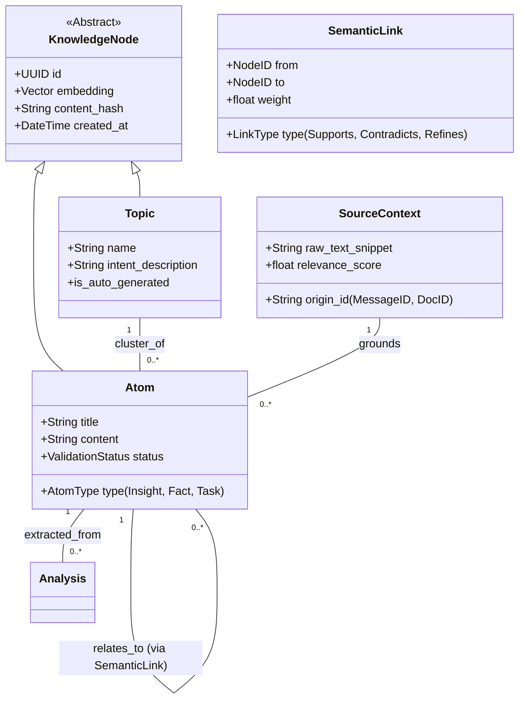

# Ідеальна Архітектура Знань: Концепція

Цей документ описує бачення переходу від поточної моделі ("Папки та Файли") до семантичного графу.

## 1. Проблема Поточної Архітектури
Поточна модель має фундаментальні обмеження для побудови "Другого Мозку":
1.  **Фрагментація Топіків**: Топіки створюються за точним збігом назви. "AI Types" та "AI Typology" стають різними сутностями.
2.  **Колізія Атомів**: Унікальність визначається заголовком. Нове знання з тим самим заголовком перезаписує старе.
3.  **Жорстка Ієрархія**: Атом прив'язується до топіка жорстким зв'язком під час створення. Втрачається багатовимірність (один атом може стосуватися багатьох тем).

## 2. Ключові зміни концепції

### А. Від "Папок" до "Хабів" (Hubs)
*   **Зараз**: Топік — це статичний контейнер.
*   **Ідеально**: Топік — це **"Вузол-Концентратор"** (Index Note). Це тип знання, який *об'єднує* інші знання через семантичну близькість.

### Б. Від "Заголовка" до "Семантичного Відбитка"
*   **Зараз**: Унікальність = `title`.
*   **Ідеально**: Унікальність = **Vector Embedding + Content Hash**.
    *   Якщо зміст схожий на 95%, система пропонує "Об'єднати" (Merge) або створити "Версію", а не дублікат.

### В. Життєвий Цикл Знання
*   **Зараз**: Миттєвий запис у базу (Final Write).
*   **Ідеально**: Стадія **"Inbox/Draft"**. Атоми спочатку потрапляють у "Inbox", де проходять дедублікацію та кластеризацію перед затвердженням.

## 3. Класова Діаграма (Ідеальний Стан)

## 4. Еволюційні Кроки

Необов'язково переписувати все одразу. Можна рухатись ітеративно:

1.  **Semantic Identity**: Додати перевірку векторів перед створенням Атома (`vector_search` -> `threshold > 0.9` -> `suggest merge`).
2.  **Soft Linking**: Зробити зв'язок `TopicAtom` неявним або автоматичним на основі семантичної близькості.
3.  **Decoupled Extraction**: Розділити процес на "Пошук Топіків" і "Створення Атомів".

---
*Згенеровано AI Assistant: 2026-01-07*
