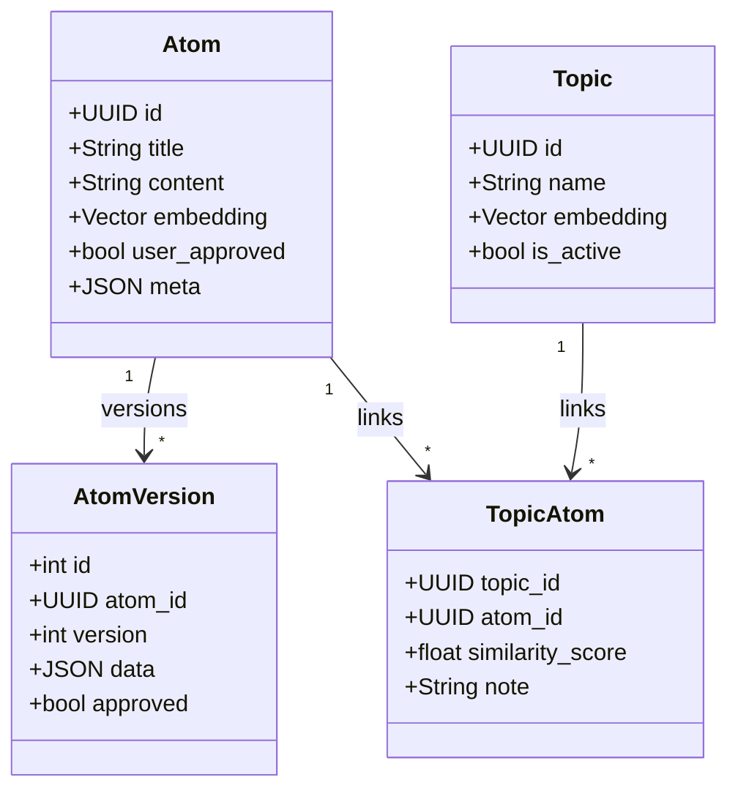

# Semantic Knowledge Architecture

> **Epic:** Перехід від "Папок та Файлів" до семантичного графу знань.
> **Status:** Planning
> **Created:** 2026-01-07

---

## 1. Проблема Поточної Архітектури

Поточна модель має фундаментальні обмеження для "Другого Мозку":

| Проблема | Опис | Приклад |
|----------|------|---------|
| **Фрагментація Топіків** | Точний збіг назви | "AI Types" ≠ "AI Typology" → 2 сутності |
| **Колізія Атомів** | Унікальність по title | Однаковий title → overwrite; схожий → дублікат |
| **Жорстка Ієрархія** | 1 Atom → 1 Topic | Втрачається багатовимірність |

---

## 2. Цільова Архітектура

### А. Semantic Identity (Розумна Дедублікація)

Замість `title == title`, використовуємо векторну відстань:

| Поріг | Дія | Деталі |
|-------|-----|--------|
| **> 0.95** | Create AtomVersion (pending) | Майже ідентичний. Користувач бачить "Нова версія від AI" |
| **0.85–0.95** | Create Atom + `meta.similar_to` | Схоже. В Inbox кнопка "Merge?" |
| **< 0.85** | Create New Atom | Унікальне знання |

> **Decision:** Version-Pending-Approval. При >0.95 НЕ оновлюємо Atom одразу — створюємо версію з `approved=false`. Безпека даних.

### Б. Topic Auto-Linking

Після створення Атома:
1. `SemanticSearchService.search_topics(atom_text, limit=5, threshold=0.80)`
2. Для кожного match → `TopicAtom(similarity_score=X, note="Auto-linked")`

> **Performance:** Використовуємо pgvector index + LIMIT 5, не full-scan.

### В. Topic Clustering

Перед створенням топіка:
1. `SemanticSearchService.search_topics(name, threshold=0.85)`
2. Якщо match → використовуємо existing ID

---

## 3. Архітектурні Рішення

| Питання | Рішення | Обґрунтування |
|---------|---------|---------------|
| Auto-Merge behavior | Version-Pending-Approval | AI може помилитись, безпека даних |
| Topic archive cascade | Keep links | Архівування = UI дія, не руйнує граф |
| Performance | LIMIT 5-10, pgvector index | SemanticSearchService вже так працює |

---

## 4. Schema Changes

### Topics Table
```sql
ALTER TABLE topics ADD COLUMN is_active BOOLEAN DEFAULT TRUE NOT NULL;
CREATE INDEX idx_topics_is_active ON topics(is_active);
```

### TopicAtoms Table
```sql
ALTER TABLE topic_atoms ADD COLUMN similarity_score FLOAT;
-- NULL = manual link, 0.0-1.0 = auto-linked
```

---

## 5. Implementation Checklist

### Phase 1: Foundation (Infrastructure)

**Database Migration:**
- [ ] Create migration `add_semantic_infrastructure`
- [ ] Add `topics.is_active` (bool, default=true, indexed)
- [ ] Add `topic_atoms.similarity_score` (float, nullable)
- [ ] Run migration, verify schema

**Backend API:**
- [ ] `GET /topics` — add `?is_active=true` filter (default)
- [ ] `PATCH /topics/{id}/archive` — set `is_active=false`
- [ ] `PATCH /topics/{id}/restore` — set `is_active=true`
- [ ] Update TopicCRUD with new filters
- [ ] Tests for archive/restore endpoints

**Frontend (TopicsPage):**
- [ ] Add Tabs component: `[Active] [Archived]`
- [ ] Active tab: `is_active=true` (default)
- [ ] Archived tab: `is_active=false` + "Restore" action
- [ ] Archive action in topic dropdown menu
- [ ] Visual styling for archived topics (muted)

### Phase 2: Semantic Backend

**Atom Deduplication:**
- [ ] `AtomService.create_with_dedup()` method
- [ ] Generate embedding before create
- [ ] Check `find_similar_atoms(threshold=0.85)`
- [ ] If >0.95 → create AtomVersion (pending), return existing atom
- [ ] If 0.85-0.95 → create atom with `meta.similar_to=[ids]`
- [ ] If <0.85 → create clean atom
- [ ] Integration tests for all 3 scenarios

**Topic Auto-Linking:**
- [ ] `TopicService.auto_link_atom()` method
- [ ] `search_topics(atom_text, limit=5, threshold=0.80)`
- [ ] Create TopicAtom with `similarity_score`, `note="Auto-linked"`
- [ ] Call from KnowledgeOrchestrator after atom creation
- [ ] Tests for auto-linking

**Topic Clustering:**
- [ ] `TopicService.find_or_create()` method
- [ ] Semantic search before create (threshold=0.85)
- [ ] If match → return existing topic
- [ ] If no match → create new
- [ ] Integration into extraction pipeline

### Phase 3: UX Intelligence

**Inbox Enhancements:**
- [ ] Show "Similar atoms" indicator on atom cards
- [ ] "Merge" action button when `meta.similar_to` exists
- [ ] Merge dialog: show diff, select which content to keep
- [ ] "New version available" indicator for atoms with pending versions
- [ ] Version review dialog: approve/reject new version

**Topics Visualization:**
- [ ] "Similar topics" section in topic detail
- [ ] Auto-linked atoms marked with icon/badge
- [ ] Similarity score tooltip on auto-linked atoms
- [ ] "Merge topics" action for similar topics

---

## 6. Verification Criteria

### Phase 1
```bash
# Database
psql -c "SELECT is_active FROM topics LIMIT 1"  # Column exists
psql -c "SELECT similarity_score FROM topic_atoms LIMIT 1"  # Column exists

# API
curl /api/v1/topics?is_active=true  # Returns only active
curl -X PATCH /api/v1/topics/{id}/archive  # 200 OK
curl /api/v1/topics?is_active=false  # Returns archived

# Frontend
# Manual: Open /topics, verify tabs work
```

### Phase 2
```bash
# Dedup test
# 1. Create atom "How to fix bug X"
# 2. Create atom "How to fix bug X" again (identical)
# Expected: AtomVersion created, not new atom

# Auto-link test
# 1. Create topic "Backend Development"
# 2. Create atom "FastAPI routing issue"
# Expected: TopicAtom created automatically
```

### Phase 3
```
# Manual UI verification
# 1. Inbox shows "Similar" indicator
# 2. Merge action works
# 3. Version review works
```

---

## 7. Mermaid Diagram



---

## 8. References

- `backend/app/services/semantic_search_service.py` — existing vector search
- `backend/app/models/atom_version.py` — versioning model
- `backend/app/models/atom.py` — TopicAtom M2M table

---
*Last updated: 2026-01-07*
