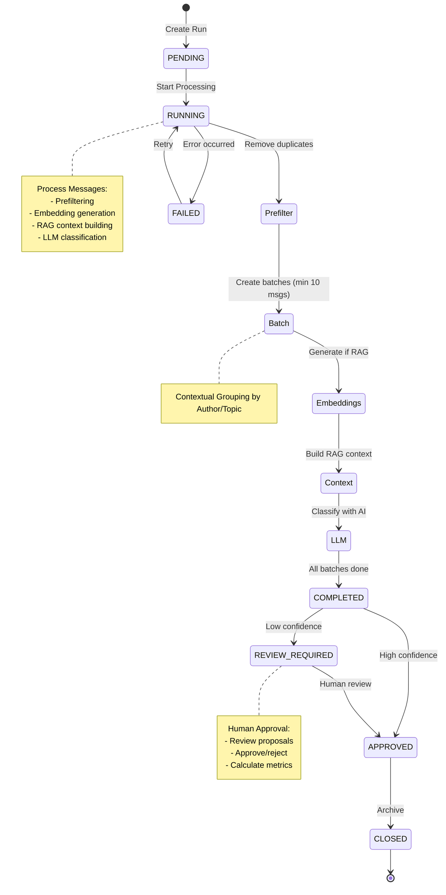
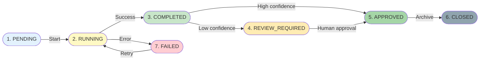
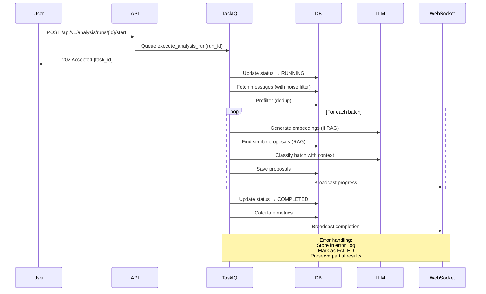
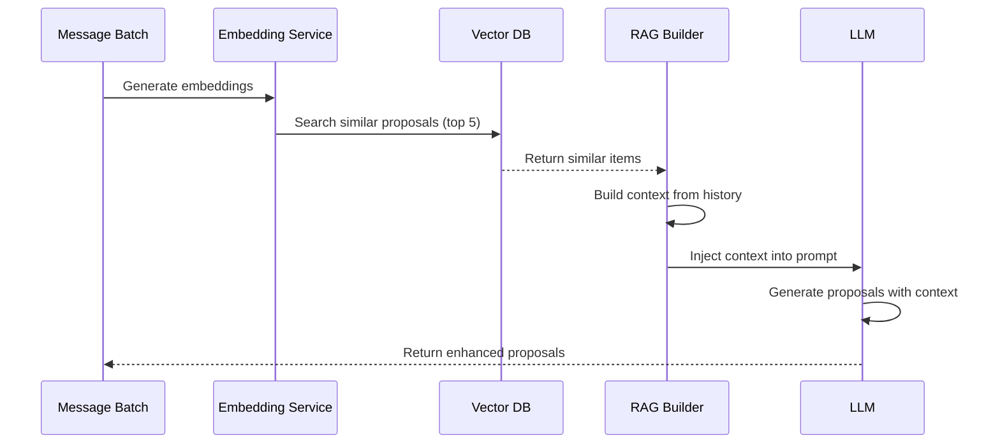

# AI-Powered Analysis System Architecture

**Last Updated:** October 18, 2025
**Status:** Phase 1 Complete (100%)
**Implementation:** Full production-ready system with 16+ API endpoints

---

## Table of Contents

1. [System Overview](#system-overview)
2. [Core Components](#core-components)
3. [Analysis Run Lifecycle](#analysis-run-lifecycle)
4. [Data Models](#data-models)
5. [API Endpoints](#api-endpoints)
6. [Background Processing](#background-processing)
7. [Implementation Status](#implementation-status)

---

## System Overview

!!! abstract "AI-Powered Task Classification"
    The Analysis System transforms unstructured messages into structured task proposals using LLMs and configurable classification schemes.

**Key Features:**

- 7-state lifecycle management
- Multi-provider LLM support
- RAG-enhanced context
- Automatic confidence scoring
- Human-in-the-loop approval

### High-Level Architecture



---

## Core Components

### 1. Analysis Run

Represents a single analysis cycle with lifecycle management.

**Lifecycle (7 States):**
```
pending → running → completed → review_required → approved → closed
                          ↓
                        failed
```

**Key Fields:**
- `status`: Current lifecycle state
- `time_window_start/end`: Messages to analyze
- `total_messages_in_window`: Count before filtering
- `messages_after_prefilter`: Count after dedup
- `config_snapshot`: JSONB copy of ProjectConfig (reproducibility)
- `accuracy_metrics`: Approval rate, rejection rate
- `error_log`: Failure details and recovery info

### 2. Task Proposal

AI-generated proposal from message analysis.

**Structure:**
```python
{
    "analysis_run_id": "uuid",
    "task_type": "bug|feature|question|insight",
    "title": "iOS crash on login",
    "description": "App crashes when user tries to log in",
    "source_message_ids": [101, 102, 103],
    "confidence": 0.95,
    "recommendation": "APPROVE",  # AI recommendation
    "reasoning": "Multiple reports of iOS login crash",
    "llm_metadata": {
        "model": "gpt-4",
        "tokens_used": 2000,
        "processing_time_ms": 1500
    },
    "user_approved": false,
    "approved_by": null
}
```

### 3. Project Configuration

Defines classification scheme and parameters.

**Example:**
```python
{
    "name": "Q4 2025 Analysis",
    "task_types": ["bug", "feature", "question"],
    "keywords": {
        "bug": ["crash", "error", "fail", "bug"],
        "feature": ["add", "implement", "feature", "new"],
        "question": ["?", "how", "why", "what"]
    },
    "classification_instructions": "...",
    "confidence_threshold": 0.75
}
```

---

## Analysis Run Lifecycle

!!! tip "7-State Lifecycle"
    Complete state machine with error handling and recovery.

### Lifecycle States



=== "State 1: PENDING"
    **Action:** User creates run with time window and configuration

    **Duration:** Instant

    **Transition:** → RUNNING (on start)

=== "State 2: RUNNING"
    **Action:** Background job processes messages

    **Process:**

    1. Fetch messages in time window
    2. Apply noise filter (if enabled)
    3. Apply message deduplication
    4. Create batches
    5. Generate embeddings (if RAG)
    6. Build context from similar past proposals
    7. Call LLM for each batch
    8. Store proposals

    **Duration:** Minutes to hours (depends on message count)

    **Transition:** → COMPLETED (on finish) or FAILED (on error)

=== "State 3: COMPLETED"
    **Action:** Processing finished, proposals ready

    **Automatic Actions:**

    - Calculate accuracy metrics
    - Auto-approve high-confidence proposals (>0.9)
    - Flag for review: low-confidence or edge cases

    **Transition:** → REVIEW_REQUIRED or APPROVED

=== "State 4: REVIEW_REQUIRED"
    **Action:** Proposals awaiting human review

    **User Actions:**

    - Review proposals one by one
    - Approve/reject with feedback
    - Batch approve similar items

    **Transition:** → APPROVED (after reviewing all)

=== "State 5: APPROVED"
    **Action:** All proposals reviewed and approved

    **Automatic Actions:**

    - Archive run for historical reference
    - Make proposals available for future RAG context
    - Store config snapshot for reproducibility

    **Transition:** → CLOSED

=== "State 6: CLOSED"
    **Action:** Run archived

    **Access:** Read-only (historical reference only)

=== "State 7: FAILED"
    **Error Path:** Any error during RUNNING state

    **Recovery Options:**

    - Retry from last checkpoint
    - Restart from beginning
    - Manual inspection and fix

---

## Data Models

### AnalysisRun Model

```python
class AnalysisRun(IDMixin, TimestampMixin, SQLModel, table=True):
    id: UUID = Field(primary_key=True, default_factory=uuid4)

    # Lifecycle
    status: str  # "pending", "running", "completed", "review_required",
                 # "approved", "closed", "failed"

    # Configuration
    project_config_id: int
    config_snapshot: dict | None  # JSONB - immutable copy
    time_window_start: datetime
    time_window_end: datetime

    # Message Processing
    total_messages_in_window: int = 0
    messages_after_prefilter: int = 0
    messages_processed: int = 0

    # Metrics
    proposals_generated: int = 0
    proposals_approved: int = 0
    proposals_rejected: int = 0
    accuracy_metrics: dict | None  # JSONB - approval rate, etc.

    # Error Handling
    error_log: str | None
    error_details: dict | None  # JSONB

    # Lifecycle Metadata
    started_at: datetime | None
    completed_at: datetime | None
    reviewed_at: datetime | None
    closed_at: datetime | None
```

### TaskProposal Model

```python
class TaskProposal(IDMixin, TimestampMixin, SQLModel, table=True):
    id: int = Field(primary_key=True)

    # Association
    analysis_run_id: UUID

    # Content
    task_type: str  # "bug", "feature", "question", "insight"
    title: str
    description: str

    # Source
    source_message_ids: list[int]  # PostgreSQL ARRAY

    # AI Output
    confidence: float  # 0.0-1.0
    recommendation: str  # "APPROVE", "REVIEW", "REJECT"
    reasoning: str

    # LLM Metadata
    llm_metadata: dict | None  # JSONB - model, tokens, latency

    # Human Feedback
    user_approved: bool = False
    approved_by: str | None
    approval_timestamp: datetime | None

    # Constraints
    __table_args__ = (
        CheckConstraint(
            "confidence >= 0.0 AND confidence <= 1.0",
            name="proposal_confidence_range"
        ),
    )
```

### ProjectConfig Model

```python
class ProjectConfig(IDMixin, TimestampMixin, SQLModel, table=True):
    id: int = Field(primary_key=True)

    # Identity
    name: str
    version: int = 1

    # Classification Scheme
    task_types: list[str]  # ["bug", "feature", "question"]
    keywords: dict[str, list[str]]  # Type → keyword list

    # LLM Configuration
    llm_provider_id: UUID
    classification_instructions: str
    confidence_threshold: float = 0.75

    # Processing
    max_batch_size: int = 50
    include_code_context: bool = True
    use_rag_context: bool = True
```

---

## API Endpoints

### Analysis Runs

**Create Run**
```
POST /api/v1/analysis/runs
{
    "project_config_id": 1,
    "time_window_start": "2025-10-01T00:00:00Z",
    "time_window_end": "2025-10-18T23:59:59Z"
}
Response: 201
{
    "id": "uuid",
    "status": "pending",
    "created_at": "2025-10-18T12:00:00Z"
}
```

**List Runs**
```
GET /api/v1/analysis/runs?status=completed&limit=20
Response: 200
[
    {"id": "uuid1", "status": "completed", ...},
    {"id": "uuid2", "status": "running", ...}
]
```

**Get Run Details**
```
GET /api/v1/analysis/runs/{run_id}
Response: 200
{
    "id": "uuid",
    "status": "running",
    "messages_processed": 45,
    "proposals_generated": 12,
    "accuracy_metrics": {...}
}
```

**Start Run**
```
POST /api/v1/analysis/runs/{run_id}/start?use_rag=true
Response: 202
{"status": "running", "task_id": "background-job-id"}
```

### Proposals

**List Proposals**
```
GET /api/v1/analysis/runs/{run_id}/proposals?status=needs_review
Response: 200
[
    {
        "id": 123,
        "task_type": "bug",
        "title": "iOS crash",
        "confidence": 0.92,
        "recommendation": "APPROVE"
    }
]
```

**Approve Proposal**
```
POST /api/v1/proposals/{proposal_id}/approve
{
    "comment": "Valid bug report"
}
Response: 200
{"status": "approved"}
```

**Reject Proposal**
```
POST /api/v1/proposals/{proposal_id}/reject
{
    "reason": "Duplicate of issue #1234"
}
Response: 200
{"status": "rejected"}
```

### Statistics

**Get Run Statistics**
```
GET /api/v1/analysis/stats/runs
Response: 200
{
    "total_runs": 42,
    "completed": 38,
    "running": 2,
    "failed": 2,
    "avg_duration_minutes": 15,
    "approval_rate": 0.87
}
```

---

## Background Processing

!!! note "Asynchronous Execution"
    Long-running analysis jobs execute in background via TaskIQ.

### Job: execute_analysis_run

**Trigger:** User calls `POST /api/v1/analysis/runs/{id}/start`



**Process:**

```python
async def execute_analysis_run(run_id: UUID, use_rag: bool = False):  # (1)!
    await executor.start_run(run_id)  # (2)!
    messages = await executor.fetch_messages(run_id)  # (3)!
    filtered = await executor.prefilter_messages(run_id, messages)  # (4)!
    batches = await executor.create_batches(filtered)  # (5)!

    for batch in batches:  # (6)!
        if use_rag:
            embeddings = await embedding_service.embed_batch(batch)
            context = await rag_builder.build_context(batch)

        proposals = await llm_service.generate_proposals(
            batch, project_config, rag_context=context if use_rag else None
        )

        await executor.save_proposals(run_id, proposals)
        await websocket_manager.broadcast({  # (7)!
            "type": "proposals_generated",
            "run_id": run_id,
            "count": len(proposals)
        })

    await executor.complete_run(run_id)  # (8)!
    await executor.calculate_metrics(run_id)
```

1. Main background task entry point
2. Transition status to RUNNING
3. Apply noise filter to exclude low-quality messages
4. Remove duplicate messages for efficiency
5. Split into batches for parallel processing
6. Process each batch with optional RAG context
7. Real-time progress updates via WebSocket
8. Calculate accuracy metrics and transition to COMPLETED

!!! warning "Error Handling"
    - Batch failures → Store error, mark FAILED
    - Provide recovery info in error_log
    - Preserve partial results for inspection

---

## Implementation Status

### ✅ FULLY IMPLEMENTED (October 2025)

**Database Models:**
- ✅ AnalysisRun (7-state lifecycle)
- ✅ TaskProposal (with LLM metadata)
- ✅ ProjectConfig (classification schemes)
- ✅ Message extensions (analysis tracking)
- ✅ Integration with Vector DB (embeddings)

**API Endpoints (16 endpoints):**
- ✅ Run management (CRUD, lifecycle)
- ✅ Proposal management (generate, review, approve/reject)
- ✅ Project configuration (versioning, management)
- ✅ Statistics and metrics
- ✅ WebSocket real-time updates (9 event types)

**Services:**
- ✅ AnalysisExecutor (lifecycle management)
- ✅ LLMProposalService (generation with RAG)
- ✅ MessagePrefilter (deduplication)
- ✅ MetricsCalculator (accuracy tracking)

**Background Jobs:**
- ✅ execute_analysis_run (main pipeline)
- ✅ Progress tracking and broadcasting
- ✅ Error handling and recovery

**Frontend:**
- ✅ Analysis Runs page (list, create, monitor)
- ✅ Proposals page (review, approve/reject, batch actions)
- ✅ Real-time WebSocket updates
- ✅ Progress indicators and metrics

**Testing:**
- ✅ 48+ tests covering all functionality
- ✅ 82-85% code coverage
- ✅ Integration tests for full pipeline
- ✅ Type safety with mypy strict mode

### 🎯 Key Features Delivered

✅ **Flexible Classification** - Define custom task types and keywords
✅ **RAG Integration** - Context-aware generation with historical proposals
✅ **Real-time Updates** - WebSocket progress broadcasting
✅ **Error Recovery** - Robust error handling with detailed logging
✅ **Approval Workflow** - Auto-approve high-confidence, flag for review
✅ **Metrics Tracking** - Approval rates, processing times, accuracy
✅ **Type-Safe** - Full mypy compliance, Pydantic validation

---

## Integration with Other Systems

!!! tip "System Integration"
    Seamless integration with noise filtering and vector database systems.

### Noise Filtering Integration

The Analysis System respects the noise filtering layer:

```python
# In fetch_messages()
messages = await db.execute(
    select(Message)
    .where(
        Message.sent_at >= start_time,  # (1)!
        Message.sent_at <= end_time,
        Message.exclude_from_analysis == False,  # (2)!
        Message.noise_classification.in_(["signal", "weak_signal"])  # (3)!
    )
)
```

1. Time window defined by analysis run
2. Respect noise filter exclusions
3. Only process signal and weak signal messages

**Benefits:**

| Benefit | Impact |
|---------|--------|
| Reduced processing | 80% fewer messages |
| Better quality | No noise in training data |
| Cost savings | Lower LLM API costs |

### Vector Database Integration

!!! example "RAG-Enhanced Generation"
    Historical context improves proposal quality and consistency.



**Implementation:**

```python
if use_rag:  # (1)!
    await embedding_service.embed_batch(batch)  # (2)!
    similar_proposals = await semantic_search.find_similar(  # (3)!
        embeddings, limit=5
    )
    context = await rag_builder.build_context(similar_proposals)  # (4)!
    proposals = await llm_service.generate_proposals(  # (5)!
        batch, config, rag_context=context
    )
```

1. RAG enabled via API parameter
2. Generate embeddings for batch
3. Find top 5 similar historical proposals
4. Build formatted context for LLM
5. Enhanced generation with historical context

**Result:** Context-aware proposals that reference similar past decisions

---

## Performance Characteristics

| Operation | Typical | Notes |
|-----------|---------|-------|
| Message fetching (1000 msgs) | <500ms | Noise filter applied |
| Prefiltering (duplicates) | <200ms | Efficient dedup algorithm |
| LLM call (50 messages) | 2-5s | Includes API latency |
| Batch processing (1000 msgs) | 10-20min | Depends on batch size |
| Metrics calculation | <1s | Aggregation only |

---

## Next Steps

### Short-term (Q4 2025)
- [ ] Implement Machine Learning model training on collected data
- [ ] Add per-project threshold tuning
- [ ] Implement user feedback learning loop

### Long-term (Q1 2026+)
- [ ] Advanced proposal deduplication
- [ ] Automatic task linking to external systems
- [ ] Custom LLM fine-tuning on project data

---

## Related Documentation

- **Noise Filtering:** See `NOISE_FILTERING.md`
- **Vector Database:** See `VECTOR_DATABASE.md`
- **System Overview:** See `OVERVIEW.md`

---

*This document consolidates the AI-powered analysis system architecture and implementation status.*
