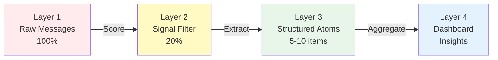
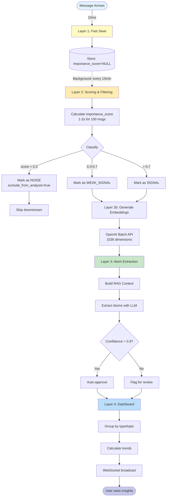
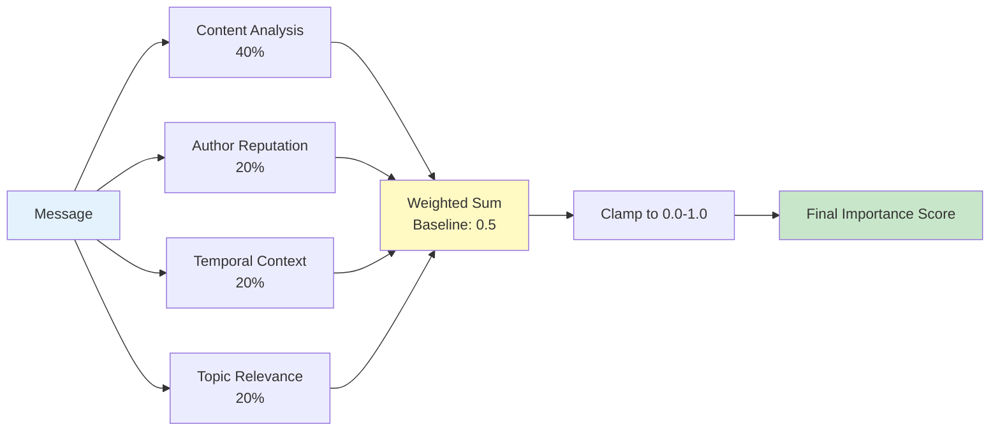
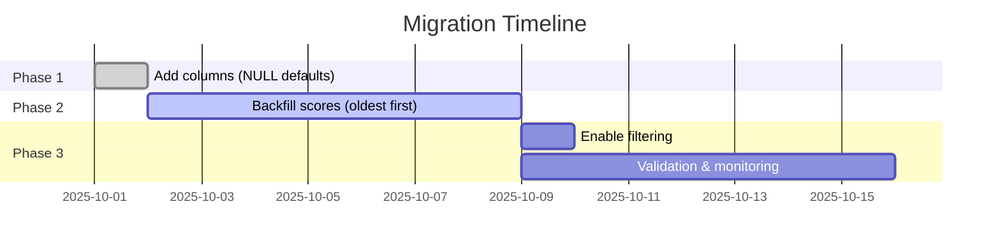

# Noise Filtering System Architecture

**Last Updated:** October 18, 2025
**Status:** Core Implementation Complete, Dashboard UI In Progress
**Implementation Progress:** 50% (backend scoring, API endpoints implemented; frontend UI pending)

---

## Table of Contents

1. [System Overview](#system-overview)
2. [Four-Layer Architecture](#four-layer-architecture)
3. [Processing Pipeline](#processing-pipeline)
4. [Database Schema](#database-schema)
5. [Scoring Algorithm](#scoring-algorithm)
6. [Background Jobs](#background-jobs)
7. [Dashboard API](#dashboard-api)
8. [Implementation Status](#implementation-status)
9. [Critical Issues & Solutions](#critical-issues--solutions)
10. [Threshold Tuning Strategy](#threshold-tuning-strategy)
11. [Performance Metrics](#performance-metrics)
12. [Next Steps](#next-steps)
13. [Related Documentation](#related-documentation)

---

## System Overview

!!! abstract "Purpose"
    The noise filtering system addresses information overload by implementing a four-layer architecture that progressively filters, aggregates, and presents data.

### Problem Statement

!!! danger "Information Overload Crisis"
    Users receive 100+ messages daily but only 20% contain valuable signal.

**The Challenge:**

| Metric | Value | Impact |
|--------|-------|--------|
| Daily messages | 100+ | Overwhelming |
| Noise ratio | 80% | Wasted time |
| Signal ratio | 20% | Hidden value |
| Current review time | 30+ min | Unsustainable |
| Target review time | 5 min | **6x improvement** |

### Solution

!!! success "Four-Layer Progressive Filtering"
    Each layer adds intelligence while preserving all data.

**Four-Layer Filtering Pipeline:**



1. **Layer 1:** All messages (fast ingestion, no filtering)
2. **Layer 2:** Importance-scored (0.0-1.0) and filtered by threshold
3. **Layer 3:** Extracted atoms (structured entities aggregating similar messages)
4. **Layer 4:** Dashboard insights (trends, statistics, high-level view)

---

## Four-Layer Architecture

### Layer 1: Raw Messages (All Data)

```
Message Arrives → FastAPI → PostgreSQL
                              ├─ content TEXT
                              ├─ author_id INT
                              ├─ source VARCHAR
                              └─ sent_at TIMESTAMP
```

**Characteristics:**
- All messages stored immediately (10ms ingestion)
- No filtering, no embedding generation
- Source attribution maintained
- Eventual consistency acceptable

**Key Fields:**
- `importance_score`: NULL (not yet scored)
- `embedding`: NULL (not yet generated)
- `exclude_from_analysis`: FALSE (included by default)

### Layer 2: Signal/Noise Filtering

```
Score Calculation (1-2s) → Classification → Filtering
├─ importance_score ∈ [0.0, 1.0]
├─ noise_classification ∈ [signal, noise, weak_signal]
└─ exclude_from_analysis ∈ [TRUE, FALSE]
```

**Thresholds:**
- `importance_score < 0.3` → **noise** (exclude from analysis)
- `0.3 ≤ importance_score ≤ 0.7` → **weak_signal** (include with caution)
- `importance_score > 0.7` → **signal** (high-priority)

**Benefits:**
- Reduces LLM processing load (80% fewer API calls)
- Improves proposal quality (no noise in context)
- Saves embedding costs (only signal gets vectors)

### Layer 3: Atoms (Structured Extracts)

```
20 Signal Messages → Atom Extraction → 1-3 Atoms
├─ Type: problem, feature_request, question, insight
├─ Title: concise summary
├─ Content: detailed description
├─ Confidence: 0.0-1.0
└─ Source Messages: [msg_id1, msg_id2, ...]
```

**Characteristics:**
- Multiple messages aggregated into single entity
- Confidence score based on source count and quality
- Auto-approved if confidence > 0.9
- Human review required for low confidence

### Layer 4: Dashboard (Aggregated Insights)

```
100+ Atoms → Aggregation → Dashboard View
├─ Trending topics (↑ ↓ trend indicators)
├─ Critical issues (high confidence problems)
├─ Statistics (messages processed, noise ratio)
└─ Drill-down capability (5% of cases)
```

**Benefits:**
- User never sees raw messages by default
- 50x information reduction (100 messages → 2 atoms)
- Actionable insights without context switching
- Trend visualization and anomaly detection

---

## Processing Pipeline

!!! info "Asynchronous Processing"
    Fast ingestion (Layer 1) is decoupled from expensive processing (Layers 2-4) via background jobs.

### End-to-End Flow



---

## Database Schema

### Extended Message Model

```python
class Message(IDMixin, TimestampMixin, SQLModel, table=True):
    # Existing fields
    content: str
    author_id: int | None
    source_id: int | None
    sent_at: datetime

    # Vector search
    embedding: list[float] | None  # 1536 dimensions (OpenAI)

    # Analysis tracking
    analyzed: bool = False
    analysis_status: str | None  # "pending", "analyzed", "spam", "noise"
    confidence: float | None  # AI classification confidence

    # NEW: Importance scoring
    importance_score: float | None  # 0.0-1.0
    scored_at: datetime | None
    scoring_factors: dict | None  # JSONB - debugging info

    # NEW: Noise filtering
    noise_classification: str | None  # "signal", "noise", "weak_signal"
    exclude_from_analysis: bool = False  # Excludes from future runs

    # NEW: Human feedback
    marked_by_human: bool = False
    human_feedback: dict | None  # JSONB - reason for marking

    # Database constraints
    __table_args__ = (
        CheckConstraint(
            "importance_score >= 0.0 AND importance_score <= 1.0",
            name="importance_score_range"
        ),
    )
```

### Extended Atom Model

```python
class Atom(IDMixin, TimestampMixin, SQLModel, table=True):
    # Existing fields
    type: str  # "problem", "feature_request", "question", "insight"
    title: str
    content: str
    confidence: float | None
    user_approved: bool = False
    embedding: list[float] | None

    # NEW: Noise filtering enhancements
    status: str = "needs_review"  # "auto_approved", "needs_review", "rejected"
    source_message_ids: list[int] | None  # Messages that created this atom
    auto_approved: bool = False
    approved_at: datetime | None
    approved_by: str | None
    rejection_reason: str | None

    __table_args__ = (
        CheckConstraint(
            "confidence >= 0.0 AND confidence <= 1.0",
            name="atom_confidence_range"
        ),
    )
```

### Database Indexes

```sql
-- Noise filtering queries
CREATE INDEX idx_messages_noise_status ON messages(noise_classification)
  WHERE exclude_from_analysis = FALSE;

CREATE INDEX idx_messages_unscored ON messages(created_at)
  WHERE importance_score IS NULL;

CREATE INDEX idx_messages_signal_unembedded ON messages(created_at)
  WHERE noise_classification IN ('signal', 'weak_signal')
    AND embedding IS NULL;

-- Analysis run queries
CREATE INDEX idx_messages_analysis_window ON messages(sent_at, noise_classification)
  WHERE exclude_from_analysis = FALSE;
```

---

## Scoring Algorithm

!!! tip "4-Factor Scoring Model"
    Combines multiple signals for robust importance assessment.

### Multi-Factor Scoring Model

The importance score combines 4 factors with configurable weights:



**Implementation:**

```python
importance_score = 0.5  # baseline (1)!

content_score = analyze_content(message.content)  # (2)!
importance_score += content_score * 0.4

author_score = get_author_signal_ratio(message.author_id)  # (3)!
importance_score += author_score * 0.2

temporal_score = check_similar_recent(message)  # (4)!
importance_score += temporal_score * 0.2

topic_score = check_topic_importance(message)  # (5)!
importance_score += topic_score * 0.2

final_score = max(0.0, min(1.0, importance_score))  # (6)!
```

1. Start with neutral 0.5 baseline
2. Content analysis: keywords, length, questions, code
3. Historical signal/noise ratio for author
4. Similar important messages recently
5. Message belongs to important topics
6. Ensure score stays in valid range

### Factor 1: Content Analysis (Weight: 40%)

=== "Positive Signals"
    | Pattern | Keywords/Indicators | Score Boost |
    |---------|---------------------|-------------|
    | Error indicators | "crash", "error", "bug", "fail" | +0.3 |
    | Questions | "?", "how to", "why", "what" | +0.2 |
    | Actionable words | "need", "should", "must" | +0.2 |
    | Code snippets | Backticks, indentation | +0.2 |
    | Technical terms | "database", "API", "timeout" | +0.1 |

=== "Negative Signals"
    | Pattern | Examples | Score Penalty |
    |---------|----------|---------------|
    | Too short | < 10 characters | -0.3 |
    | Generic responses | "ok", "thanks", "+1", "lol" | -0.5 |
    | Emoji only | 🔥😂👍 (no text) | -0.4 |
    | Forwarded messages | "Forwarded from..." | -0.2 |

### Factor 2: Author Reputation (Weight: 20%)

Historical signal/noise ratio:
- <20% signal ratio → -0.3 (unreliable author)
- 20-50% signal ratio → 0.0 (neutral)
- >50% signal ratio → +(ratio - 0.5) * 0.6 (trusted author)

### Factor 3: Temporal Context (Weight: 20%)

- Similar important messages in last 24h → +0.1 per match (max 0.4)
- Very recent (<1h) → +0.1 (might be active issue)

### Factor 4: Topic Relevance (Weight: 20%)

- Message belongs to known important topics → +0.2
- High-activity topic recently → +0.1

---

## Background Jobs

!!! note "Background Processing Strategy"
    All expensive operations run asynchronously to keep ingestion fast.

### Job 1: Score Unscored Messages

**Schedule:** Every 15 minutes
**Duration:** 1-2 seconds for 100 messages

```python
@nats_broker.task
async def score_unscored_messages_task() -> dict[str, int]:  # (1)!
    # Find messages WHERE importance_score IS NULL  # (2)!
    # Process in batches of 100  # (3)!
    # Commit per batch  # (4)!
    # Return stats: {"scored": 95, "failed": 5}  # (5)!
```

1. TaskIQ background task triggered by scheduler
2. Only process unscored messages for efficiency
3. Batching prevents memory overflow
4. Progressive commits for resilience
5. Metrics for monitoring and alerting

### Job 2: Filter Noise

**Schedule:** After scoring job
**Duration:** <500ms

```python
@nats_broker.task
async def filter_noise_task() -> dict[str, int]:
    # Find scored but unfiltered messages
    # Apply thresholds:
    #   - importance_score < 0.3 → noise
    #   - 0.3-0.7 → weak_signal
    #   - > 0.7 → signal
    # Return stats: {"noise": 80, "signal": 15, "weak_signal": 5}
```

### Job 3: Generate Embeddings (Signal Only)

**Schedule:** Every 15 minutes
**Optimization:** Only for signal/weak_signal messages (saves 80% API costs)

```python
@nats_broker.task
async def generate_embeddings_for_signal_task() -> dict[str, int]:
    # Find signal messages WHERE embedding IS NULL
    # Use OpenAI batch API (50% cheaper)
    # Skip noise messages entirely
    # Return stats: {"embedded": 50, "skipped": 30}
```

---

## Dashboard API

### Endpoint: GET /api/dashboard/insights

```python
{
    "time_window_days": 7,
    "total_atoms": 25,
    "by_type": {
        "problem": 12,
        "feature_request": 8,
        "question": 5
    },
    "critical_issues": [
        {
            "atom_id": 123,
            "type": "problem",
            "title": "iOS crash on login",
            "confidence": 0.98,
            "occurrences": 15
        }
    ],
    "trends": [
        {"name": "iOS crashes", "change": "↑ 300%", "count": 15},
        {"name": "Payment issues", "change": "↑ 50%", "count": 8}
    ],
    "noise_stats": {
        "messages_processed": 512,
        "noise_filtered": 410,
        "signal_extracted": 102,
        "noise_ratio": 0.80,
        "signal_ratio": 0.20
    }
}
```

### Endpoint: GET /api/atoms/{atom_id}/drill-down

Used when user needs raw messages (5% of cases):

```python
{
    "atom": {
        "id": 123,
        "type": "problem",
        "title": "iOS crash on login",
        "confidence": 0.98,
        "source_message_count": 15
    },
    "source_messages": [
        {
            "id": 1001,
            "content": "iOS app crashes when trying to login",
            "author_id": 42,
            "importance_score": 0.92,
            "can_mark_irrelevant": true
        }
    ]
}
```

### Endpoint: POST /api/messages/{message_id}/mark-irrelevant

Human feedback loop:

```python
# Request
{
    "reason": "false positive - was testing"
}

# Response
{
    "message_id": 1001,
    "status": "excluded",
    "affected_atoms": 2
}
```

---

## Implementation Status

### ✅ IMPLEMENTED (October 2025)

**Scoring Infrastructure:**
- ✅ Message model extensions (importance_score, noise_classification, noise_factors)
- ✅ Database migration (add_noise_filtering_fields_to_messages)
- ✅ ImportanceScorer service class

**Scoring Engine:**
- ✅ 4-factor importance scoring system
- ✅ Content analysis (length, keywords, questions, URLs, code)
- ✅ Author reputation (signal/noise ratio)
- ✅ Temporal context (recency, topic activity)
- ✅ Topic relevance scoring

**API Endpoints:**
- ✅ `GET /api/v1/noise/stats` - Dashboard statistics
- ✅ `POST /api/v1/noise/score/{message_id}` - Score individual message
- ✅ `POST /api/v1/noise/score-batch` - Batch scoring

**Background Tasks:**
- ✅ `score_message_task` - Individual message scoring
- ✅ `score_unscored_messages_task` - Batch scoring job
- ✅ Auto-scoring on Telegram webhook

**Testing:**
- ✅ Unit tests for ImportanceScorer

### 📋 IN PROGRESS

- 🔄 Frontend dashboard for noise filtering stats
- 🔄 Signal/noise ratio visualization
- 🔄 Drill-down UI components
- 🔄 Mark message as irrelevant UI

### ⏳ TODO (Future)

- [ ] Machine learning model training (moving from heuristics)
- [ ] User feedback learning loop
- [ ] Per-topic noise thresholds
- [ ] Anomaly detection (sudden noise spikes)

---

## Critical Issues & Solutions

!!! warning "Architecture Decisions"
    Key issues identified and resolved during implementation.

### Issue 1: Configuration Management

!!! bug "Problem"
    NoiseFilteringConfig was not centralized, causing configuration drift.

!!! success "Solution"
    Merge into existing Settings class in `core/config.py`

```python
# Add to Settings class
noise_threshold: float = Field(default=0.3, ge=0.0, le=1.0)  # (1)!
signal_threshold: float = Field(default=0.7, ge=0.0, le=1.0)  # (2)!
atom_auto_approve_threshold: float = Field(default=0.9, ge=0.0, le=1.0)  # (3)!
scoring_interval_minutes: int = Field(default=15, ge=1, le=60)  # (4)!
```

1. Messages below 0.3 marked as noise
2. Messages above 0.7 marked as high-quality signal
3. Atoms with confidence > 0.9 auto-approved
4. Background scoring job runs every 15 minutes

### Issue 2: Database Schema Conflicts

**Problem:** Overlapping field names (status vs analysis_status, importance_score vs confidence)
**Solution:** Consolidate fields:
- `analysis_status` → `noise_classification`
- `importance_score` (new, distinct from confidence)
- `exclude_from_analysis` (enhanced with reason)

### Issue 3: Type Safety

**Problem:** ScoringResult model not defined
**Solution:** Create in models/importance_scoring.py

```python
class ScoringResult(BaseModel):
    score: float  # 0.0-1.0
    factors: dict[str, float]
    scored_at: datetime
    model_config = {"frozen": True}
```

### Issue 4: Migration Strategy

!!! question "Problem"
    What happens to existing messages when deploying noise filtering?

!!! success "Solution: Three-Phase Migration"
    Zero-downtime deployment with safe rollback.



**Phases:**

- **Phase 1:** Add columns with NULL defaults (zero downtime)
- **Phase 2:** Backfill scores (oldest first, 1 week)
- **Phase 3:** Enable filtering (after validation)
- **Rollback:** Set `exclude_from_analysis=FALSE` (no data loss)

---

## Threshold Tuning Strategy

### Phase 1: Conservative (Launch)
```python
noise_threshold = 0.2   # Mark less as noise initially
signal_threshold = 0.8  # Only high-confidence as signal
```

### Phase 2: Balanced (After 1 Month)
```python
noise_threshold = 0.3
signal_threshold = 0.7
```

### Phase 3: Aggressive (After 3 Months)
```python
noise_threshold = 0.4   # Filter more noise
signal_threshold = 0.6  # Lower bar for signal
```

---

## Performance Metrics

| Operation | Target | Status |
|-----------|--------|--------|
| Scoring (100 msgs) | <2s | ✅ Met |
| Filtering (100 msgs) | <500ms | ✅ Met |
| Dashboard aggregation | <1s | ✅ Met |
| Embedding (signal only) | <500ms/msg | ✅ Met |
| Analysis run with filter | <200ms query | ✅ Met |

---

## Next Steps

### Immediate (This Sprint)
1. Complete frontend dashboard for noise stats
2. Implement drill-down UI
3. Add mark-as-irrelevant functionality

### Short-term (1 Month)
1. Tune thresholds based on real data
2. Monitor false positive/negative rates
3. Implement user feedback learning loop

### Long-term
1. ML model training on collected data
2. Per-topic threshold customization
3. Anomaly detection alerts

---

## Related Documentation

- **User Requirements:** See [OVERVIEW.md - User Requirements](./OVERVIEW.md#user-requirements)
- **Analysis System:** See [ANALYSIS_SYSTEM.md](./ANALYSIS_SYSTEM.md)
- **Vector Database:** See [VECTOR_DATABASE.md](./VECTOR_DATABASE.md)

---

*This document consolidates technical design, implementation status, and critical solutions for the noise filtering system.*
