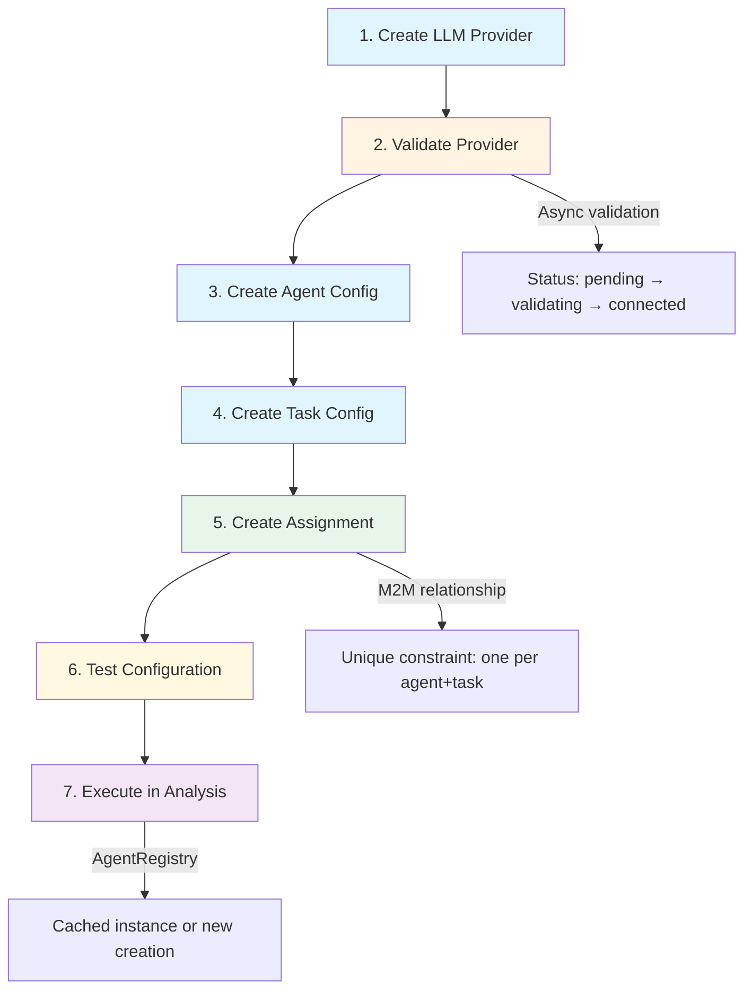
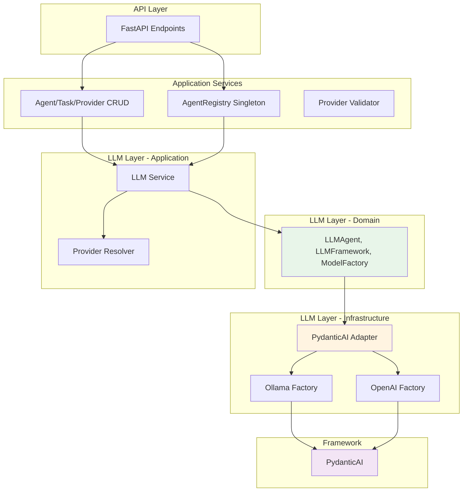
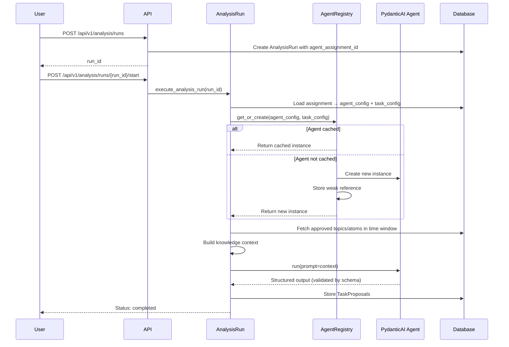

# Agent System

## Overview

The Agent System provides flexible configuration and management of AI-powered task execution within the hexagonal architecture. It enables organizations to:

- Configure multiple LLM providers (Ollama local deployment, OpenAI cloud API)
- Define reusable agent configurations with custom prompts and behavior settings
- Create structured task definitions with JSON Schema validation
- Assign agents to tasks via many-to-many relationships for flexible workflows
- Execute agents with automatic caching and validation

The system integrates with the analysis pipeline to generate task proposals from approved knowledge (topics and atoms), not raw messages.

---

## Configuration Workflow

Agent execution follows a 7-step configuration workflow from provider setup to task execution:



**Workflow Steps:**

1. **Create LLM Provider** - Configure Ollama or OpenAI connection with credentials
2. **Validate Provider** - Automatic background validation (async task updates status)
3. **Create Agent Config** - Define model, system prompt, temperature, max tokens
4. **Create Task Config** - Define response schema for structured outputs (JSON Schema)
5. **Create Assignment** - Link agent to task (M2M table with unique constraint)
6. **Test Configuration** - Validate agent behavior with custom prompts before deployment
7. **Execute in Analysis** - AgentRegistry creates/caches instance for analysis runs

---

## LLM Providers

LLM providers define connection settings and credentials for external model APIs. Each provider type has specific configuration requirements.

### Provider Types

| Provider Type | Deployment | Configuration | Authentication | Validation Method |
|---------------|------------|---------------|----------------|-------------------|
| **Ollama** | Local | `base_url` | None (local) | Test `/api/tags` or `/v1/models` endpoint |
| **OpenAI** | Cloud | None | Encrypted `api_key` | Test authentication with OpenAI API |

### Provider Lifecycle

| Status | Description | Next Action |
|--------|-------------|-------------|
| `pending` | Provider created, not yet validated | Background validation scheduled |
| `validating` | Validation in progress (async task) | Wait for completion |
| `connected` | Successfully validated and ready | Available for agent assignment |
| `error` | Validation failed | Fix configuration, retry validation |

**Validation Process:**
- Triggered automatically on provider creation or update
- Runs as background task (non-blocking)
- Broadcasts WebSocket events for real-time status updates
- Stores error messages for debugging

---

## Agent Configuration

Agent configurations define **how** agents execute tasks: model selection, prompts, and behavior settings.

### Agent Fields

| Field | Type | Required | Description |
|-------|------|----------|-------------|
| `name` | string | Yes | Unique agent identifier (indexed) |
| `description` | string | No | Human-readable purpose |
| `provider_id` | UUID | Yes | Foreign key to LLM provider |
| `model_name` | string | Yes | Model identifier (e.g., `llama3`, `gpt-4`) |
| `system_prompt` | string | Yes | Agent's system-level instructions |
| `temperature` | float | No | Randomness control (0.0-1.0, default: 0.7) |
| `max_tokens` | int | No | Response length limit |
| `is_active` | bool | Yes | Enable/disable agent |

**Configuration Validation:**
- Provider must exist and be active
- Agent name must be unique
- Model name format not validated (provider-specific)
- System prompt required but not constrained

---

## Task Configuration

Task configurations define **what** agents should output: structured response schemas using JSON Schema.

### Task Fields

| Field | Type | Required | Description |
|-------|------|----------|-------------|
| `name` | string | Yes | Unique task identifier (indexed) |
| `description` | string | No | Task purpose |
| `response_schema` | JSON | Yes | JSON Schema for output validation |
| `is_active` | bool | Yes | Enable/disable task |

**Response Schema:**
- Must be valid JSON Schema (draft-07)
- Defines structure, types, and constraints for agent outputs
- Used by PydanticAI to generate typed output models
- Enforces validation on agent responses

**Example Schema:**
```json
{
  "$schema": "http://json-schema.org/draft-07/schema#",
  "type": "object",
  "properties": {
    "category": {
      "type": "string",
      "enum": ["bug", "feature", "question", "discussion"]
    },
    "confidence": {
      "type": "number",
      "minimum": 0,
      "maximum": 1
    }
  },
  "required": ["category", "confidence"]
}
```

---

## Agent-Task Assignment

Assignments link agents to tasks via a many-to-many relationship, enabling flexible workflows and A/B testing.

### Assignment Table

| Field | Type | Constraint | Description |
|-------|------|------------|-------------|
| `id` | UUID | Primary key | Assignment identifier |
| `agent_id` | UUID | Foreign key | Reference to agent_configs |
| `task_id` | UUID | Foreign key | Reference to task_configs |
| `is_active` | bool | - | Enable/disable assignment |
| `assigned_at` | datetime | - | Assignment timestamp |

**Unique Constraint:** `UNIQUE(agent_id, task_id)` - prevents duplicate assignments

### Assignment Patterns

**One Agent, Multiple Tasks:**
```
Agent: "GPT-4 Classifier"
├─ Task: Message Classification
├─ Task: Bug Detection
└─ Task: Feature Extraction
```

**One Task, Multiple Agents (A/B Testing):**
```
Task: "Message Classification"
├─ Agent: GPT-4 Classifier (high accuracy)
├─ Agent: Llama3 Classifier (low cost)
└─ Agent: Claude Classifier (context-aware)
```

---

## Agent Registry

The AgentRegistry service prevents duplicate agent instantiation using a singleton pattern with weak references.

### Registry Features

| Feature | Implementation | Benefit |
|---------|----------------|---------|
| **Singleton Pattern** | Single registry instance across application | Consistent caching |
| **Weak References** | Automatic garbage collection when unused | No manual cleanup required |
| **Thread Safety** | Async locks per agent+task pair | Prevents race conditions |
| **Automatic Cleanup** | Callback removes stale entries | Memory efficient |

### Registry Operation

**Cache Key:** `(agent_id, task_id)` tuple

**Workflow:**
1. Analysis run requests agent for assignment
2. Registry checks cache with key `(agent_id, task_id)`
3. If cached and alive, return existing instance
4. If missing or garbage collected, create new instance
5. Store weak reference with cleanup callback
6. Return agent instance

**Weak Reference Benefits:**
- Agents automatically removed when no longer referenced
- No memory leaks from cached instances
- Cleanup callback maintains registry consistency

---

## API Endpoints

The system exposes 18 REST endpoints across 4 resource groups for complete agent lifecycle management.

### Provider Management (7 endpoints)

| Method | Endpoint | Description |
|--------|----------|-------------|
| POST | `/api/v1/providers` | Create LLM provider (triggers validation) |
| GET | `/api/v1/providers` | List all providers (pagination + filters) |
| GET | `/api/v1/providers/{id}` | Get provider by ID |
| PUT | `/api/v1/providers/{id}` | Update provider (re-validates) |
| DELETE | `/api/v1/providers/{id}` | Delete provider (fails if agents exist) |
| POST | `/api/v1/providers/{id}/validate` | Manually trigger validation |
| GET | `/api/v1/providers/ollama/models` | List available Ollama models |

### Agent Configuration (6 endpoints)

| Method | Endpoint | Description |
|--------|----------|-------------|
| POST | `/api/v1/agents` | Create agent configuration |
| GET | `/api/v1/agents` | List all agents (filters: active, provider) |
| GET | `/api/v1/agents/{id}` | Get agent by ID |
| PUT | `/api/v1/agents/{id}` | Update agent (doesn't affect running instances) |
| DELETE | `/api/v1/agents/{id}` | Delete agent (running instances continue) |
| POST | `/api/v1/agents/{id}/test` | Test agent with custom prompt |

### Task Configuration (5 endpoints)

| Method | Endpoint | Description |
|--------|----------|-------------|
| POST | `/api/v1/task-configs` | Create task configuration |
| GET | `/api/v1/task-configs` | List all tasks (pagination + active filter) |
| GET | `/api/v1/task-configs/{id}` | Get task by ID |
| PUT | `/api/v1/task-configs/{id}` | Update task configuration |
| DELETE | `/api/v1/task-configs/{id}` | Delete task (cascades to assignments) |

### Agent-Task Assignments (5 endpoints)

| Method | Endpoint | Description |
|--------|----------|-------------|
| POST | `/api/v1/agents/{agent_id}/tasks` | Assign task to agent |
| GET | `/api/v1/agents/{agent_id}/tasks` | List agent's assigned tasks |
| DELETE | `/api/v1/agents/{agent_id}/tasks/{task_id}` | Unassign task from agent |
| GET | `/api/v1/assignments` | List all assignments with JOIN details |
| GET | `/api/v1/tasks/{task_id}/agents` | List agents assigned to task |

**Total Endpoints:** 23 (7 + 6 + 5 + 5)

---

## Hexagonal Architecture Integration

The Agent System integrates with the LLM layer through hexagonal (ports and adapters) architecture for framework independence.

### Architecture Layers



**Layer Responsibilities:**

| Layer | Responsibility | Framework Dependency |
|-------|----------------|---------------------|
| **Domain** | Define interfaces (ports) | None - pure abstractions |
| **Application** | Orchestrate agent creation, provider resolution | None - uses ports |
| **Infrastructure** | Implement adapters for PydanticAI | PydanticAI-specific |
| **Framework** | Execute LLM operations | PydanticAI library |

**Benefits:**
- Swap PydanticAI for LangChain without changing domain logic
- Test domain logic with mock adapters
- Isolate framework-specific code to infrastructure layer

---

## Usage in Analysis Runs

Analysis runs execute agents to generate task proposals from approved knowledge (topics and atoms).

### Analysis Execution Flow



### Analysis Configuration

**Input Source:**
- Approved topics and atoms (not raw messages)
- Filtered by time window (configurable per run)

**Output:**
- TaskProposal records with structured data
- Validated against task_config.response_schema
- Linked to analysis_run_id for traceability

**Configuration Snapshot:**
- Full agent + task configuration stored in `config_snapshot` (JSONB)
- Enables reproducibility even if config changes later
- Audit trail for experiment tracking

---

## Testing Agents

Agent testing validates configuration before production deployment using the `/agents/{id}/test` endpoint.

### Test Endpoint

**Request:**
```json
POST /api/v1/agents/{agent_id}/test
{
  "prompt": "Classify this message: The app crashed when I logged in"
}
```

**Response:**
```json
{
  "agent_id": "123e4567-e89b-12d3-a456-426614174000",
  "agent_name": "Message Classifier",
  "prompt": "Classify this message: The app crashed when I logged in",
  "response": "{\"category\": \"bug\", \"confidence\": 0.95}",
  "elapsed_time": 2.34,
  "model_name": "llama3",
  "provider_name": "Ollama Local",
  "provider_type": "ollama"
}
```

### Test Validation

**Requirements:**
- Agent must exist and be active
- Provider must be validated (`status=connected`)
- Provider must be active (`is_active=true`)

**Use Cases:**
- Validate system prompt effectiveness
- Test temperature and max_tokens settings
- Compare model performance (GPT-4 vs Llama3)
- Debug provider connectivity issues

---

## Key Design Decisions

### Why M2M Agent-Task Assignments?

**Problem:** Hard-coded agent-task pairs limit flexibility

**Solution:** Many-to-many relationship enables:
- One agent handling multiple tasks (efficiency)
- Multiple agents for same task (A/B testing)
- Independent agent and task lifecycle management

### Why Separate Agent and Task Configs?

**Separation of Concerns:**

| AgentConfig | TaskConfig |
|-------------|------------|
| **HOW** to execute | **WHAT** to output |
| Model, prompts, settings | Response schema, validation |
| LLM behavior | Output structure |

**Benefits:**
- Reuse tasks with different agents
- Update prompts without changing schemas
- Independent versioning

### Why Agent Registry with Weak References?

**Problem:** Creating new agent instance per request is expensive (model loading, initialization)

**Solution:** Cache with weak references provides:
- Performance: Reuse existing agent instances
- Memory efficiency: Automatic garbage collection
- Thread safety: Async locks prevent race conditions
- No manual cleanup: Weak references self-manage

### Why Configuration Snapshots in AnalysisRun?

**Problem:** Config changes break reproducibility and auditability

**Solution:** Store full config in JSONB enables:
- Reproducibility: Recreate exact analysis conditions
- Auditability: See what config was used for specific run
- Versioning: Track config evolution over time
- Recovery: Restore from snapshot if needed

---

## See Also

- **[Analysis System](./analysis-system.md)** - How agents integrate with analysis runs
- **[Noise Filtering](./noise-filtering.md)** - Message processing before analysis
- **[Knowledge Extraction](./knowledge-extraction.md)** - Topic and atom generation

---

**Last Updated:** 2025-10-26
