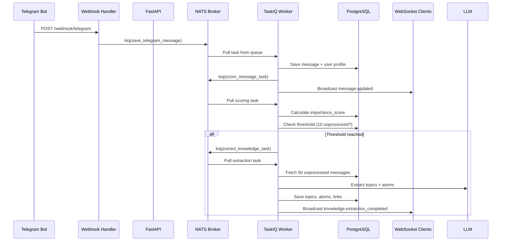
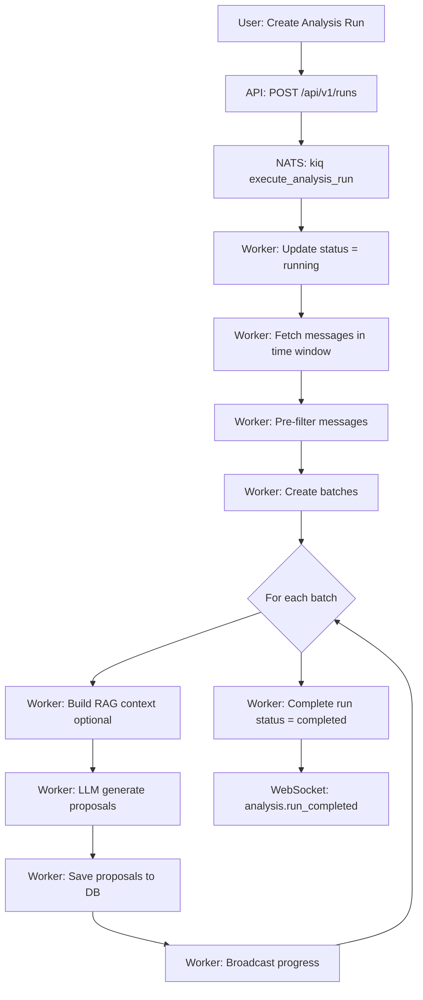

# Background Tasks System

## Overview

The Task Tracker uses **TaskIQ** with **NATS** broker for distributed background task processing. This enables asynchronous execution of long-running operations like message ingestion, AI analysis, embeddings generation, and knowledge extraction without blocking API responses.

**Key Features**:
- Async task execution with TaskIQ
- NATS message broker for distributed processing
- WebSocket broadcasting for real-time progress updates
- Automatic retries with endless reconnection attempts
- Object store result backend for task result persistence

---

## Architecture

### TaskIQ + NATS Setup

```
┌─────────────┐         ┌──────────────┐         ┌─────────────┐
│  FastAPI    │──kiq()─>│  NATS Broker │──pull─>│   Worker    │
│  Endpoints  │         │   (Queue)    │         │  Container  │
└─────────────┘         └──────────────┘         └─────────────┘
       │                                                 │
       │                                                 │
       v                                                 v
┌─────────────┐                                 ┌─────────────┐
│  WebSocket  │<──────broadcast─────────────────│  Task Exec  │
│   Clients   │                                 │   + Result  │
└─────────────┘                                 └─────────────┘
```

**Configuration** (`core/taskiq_config.py`):
- **Queue**: `taskiq_tasks` (configurable)
- **Servers**: NATS server URLs from settings
- **Result Backend**: NATS Object Store for result persistence
- **Reconnection**: Unlimited retry attempts (`max_reconnect_attempts=-1`)
- **Timeouts**: 10s connect, 30s drain

---

## Task Catalog

### Message Processing Tasks (3)

| Task | Purpose | Trigger | Auto-Chains |
|------|---------|---------|-------------|
| `save_telegram_message` | Save Telegram webhook message to database | Telegram webhook event | → `score_message_task` → (threshold) → `extract_knowledge_from_messages_task` |
| `ingest_telegram_messages_task` | Batch import chat history from Telegram API | User-initiated via dashboard | None |
| `process_message` | Example task for testing TaskIQ setup | Manual test only | None |

**Key Features**:
- User profile creation/linking (Telegram → User)
- Avatar fetching and caching
- Duplicate detection for ingestion
- Progress tracking via `MessageIngestionJob`
- Real-time updates via WebSocket (`ingestion.started`, `ingestion.progress`, `ingestion.completed`)

---

### AI Processing Tasks (3)

| Task | Purpose | Trigger | Dependencies |
|------|---------|---------|--------------|
| `execute_analysis_run` | Main analysis orchestration: fetch messages → filter → batch → generate proposals | User-initiated via dashboard | `AnalysisExecutor`, `LLMProposalService`, RAG context (optional) |
| `execute_classification_experiment` | Topic classification experiment with accuracy metrics | User-initiated via experiments page | `TopicClassificationService`, confusion matrix calculation |
| `extract_knowledge_from_messages_task` | LLM-based topic/atom extraction from message batches | Auto-triggered at 10 unprocessed messages OR manual | `KnowledgeExtractionService`, `AgentConfig` |

**Analysis Run Workflow**:
```
1. Start run (status: running)
2. Fetch messages in time window
3. Pre-filter (keywords, length, @mentions)
4. Create batches (configurable size)
5. Process each batch with LLM + RAG context
6. Save proposals with confidence scores
7. Complete run (status: completed/failed)
```

**Auto-Trigger Logic** (Knowledge Extraction):
- Threshold: 10+ unprocessed messages (no `topic_id`)
- Lookback window: 24 hours
- Batch size: Up to 50 messages
- Requires active `knowledge_extractor` agent config

---

### Embedding Tasks (2)

| Task | Purpose | Input | Output |
|------|---------|-------|--------|
| `embed_messages_batch_task` | Generate vector embeddings for messages (pgvector) | `message_ids: list[int]`, `provider_id: str` | `{success: int, failed: int, skipped: int}` |
| `embed_atoms_batch_task` | Generate vector embeddings for atoms (knowledge units) | `atom_ids: list[int]`, `provider_id: str` | `{success: int, failed: int, skipped: int}` |

**Features**:
- Batch processing (100 items per batch)
- Provider-specific embedding models (OpenAI, Ollama)
- Skip already-embedded items
- Error tracking per item
- Powers semantic search and RAG context retrieval

---

### Scoring Tasks (2)

| Task | Purpose | Trigger | Factors |
|------|---------|---------|---------|
| `score_message_task` | Score single message importance (0.0-1.0) | Auto-triggered on message save | Content, author, temporal, topic relevance |
| `score_unscored_messages_task` | Batch score messages with `NULL` importance_score | Manual or scheduled | Same as single scoring |

**Noise Classification**:
- **noise**: `importance_score < 0.3` (low value)
- **weak_signal**: `0.3 ≤ score < 0.7` (moderate value)
- **signal**: `score ≥ 0.7` (high value)

**Scoring Factors** (stored in `noise_factors` JSONB):
- Content quality (length, uniqueness)
- Author activity patterns
- Temporal relevance (recency decay)
- Topic association strength

---

## Task Flow Diagrams

### Auto-Triggered Chain (Telegram → Knowledge)



### Manual Analysis Run



---

## Error Handling & Retry Logic

### TaskIQ Retry Mechanisms

**Built-in Features**:
- **Unlimited reconnection**: `max_reconnect_attempts=-1` ensures worker never gives up on NATS connection
- **Graceful shutdown**: 30s drain timeout allows in-flight tasks to complete
- **Result persistence**: NATS Object Store backend survives worker restarts

**Application-Level Error Handling**:

1. **Task Failure Tracking**:
   - Analysis runs: Update `status = failed`, store `error_log` JSONB
   - Ingestion jobs: Update `status = failed`, store `error_message`
   - Experiments: Update `status = failed`, broadcast `experiment_failed` event

2. **Partial Failure Tolerance**:
   - Embedding tasks: Track `{success, failed, skipped}` counts per batch
   - Scoring tasks: Continue batch processing on individual item failures
   - Ingestion: Record per-message errors without aborting job

3. **WebSocket Error Broadcasting**:
   - All long-running tasks broadcast failure events (`ingestion.failed`, `experiment_failed`)
   - Frontend displays real-time error notifications

**No Dead Letter Queue** (DLQ):
- TaskIQ doesn't implement DLQ by default
- Failed tasks remain in worker logs
- Application stores error state in database entities (AnalysisRun, MessageIngestionJob, ClassificationExperiment)

---

## Task Invocation Patterns

### Queueing Tasks (`kiq()`)

**From API Endpoints**:
```python
await execute_analysis_run.kiq(run_id=str(run.id), use_rag=True)
```

**From Other Tasks** (chaining):
```python
await score_message_task.kiq(message_id)
await extract_knowledge_from_messages_task.kiq(message_ids, agent_config_id)
```

**From Services** (business logic):
```python
await embed_messages_batch_task.kiq(message_ids=[1, 2, 3], provider_id=str(provider.id))
```

### Result Retrieval

**Wait for Result**:
```python
task = await embed_messages_batch_task.kiq([1, 2, 3], str(provider_id))
result = await task.wait_result()
stats = result.return_value  # {"success": 3, "failed": 0, "skipped": 0}
```

**Fire-and-Forget**:
```python
await save_telegram_message.kiq(telegram_data)  # No await on result
```

---

## Performance Considerations

**Batch Sizes**:
- Embeddings: 100 items per batch (service-level batching)
- Telegram ingestion: 100 messages per API call (Telegram limit)
- Knowledge extraction: 10-50 messages optimal (LLM context window)
- Analysis runs: Configurable batch size (default: project-specific)

**Concurrency**:
- Worker container processes tasks sequentially by default
- Scale horizontally: Run multiple worker containers
- NATS queue ensures fair distribution across workers

**Database Sessions**:
- Each task creates isolated async session (`AsyncSessionLocal()`)
- Auto-commit after processing
- Transaction rollback on exception

**WebSocket Throttling**:
- Progress updates: Every 10 items or at completion
- Prevents flooding clients during large batch operations
- Connection count checks before broadcasting

---

## Monitoring & Observability

**Structured Logging** (Loguru):
- All tasks log start/completion/failure events
- Correlation IDs: `run_id`, `experiment_id`, `job_id`
- Execution time tracking for performance analysis

**WebSocket Events** (Real-Time Updates):
- `ingestion.started`, `ingestion.progress`, `ingestion.completed`, `ingestion.failed`
- `analysis.run_started`, `analysis.batch_completed`, `analysis.run_completed`, `analysis.run_failed`
- `experiment_started`, `experiment_progress`, `experiment_completed`, `experiment_failed`
- `knowledge.extraction_started`, `knowledge.extraction_completed`, `knowledge.extraction_failed`
- `message_scored`, `batch_scored`

**Task Result Metrics**:
- Stored in database entities (AnalysisRun, ClassificationExperiment, MessageIngestionJob)
- Includes counts, accuracy, execution times, error logs
- Queryable via API endpoints for dashboard analytics

---

## Deployment Notes

**Docker Compose Services**:
```
postgres  → Database for task state persistence
nats      → NATS broker for task queue
worker    → TaskIQ worker container (processes tasks)
api       → FastAPI container (queues tasks)
```

**Worker Startup**:
- Defined in `docker-compose.yml` as separate service
- Imports `nats_broker` from `core.taskiq_config`
- Auto-discovers tasks decorated with `@nats_broker.task`
- Connects to NATS on startup (with unlimited retries)

**Environment Variables**:
- `TASKIQ_NATS_SERVERS`: NATS server URL (e.g., `nats://nats:4222`)
- `TASKIQ_NATS_QUEUE`: Queue name (e.g., `taskiq_tasks`)

---

## Best Practices

1. **Idempotency**: Design tasks to handle duplicate executions safely (check existing state before creating)
2. **Timeout Management**: Set reasonable LLM timeouts for analysis tasks (avoid indefinite hangs)
3. **Error Context**: Always store error details in database entities for debugging
4. **Progress Updates**: Broadcast WebSocket events every 10 items minimum (avoid spam)
5. **Batch Optimization**: Balance batch size vs. memory usage (100 items tested optimal)
6. **Database Sessions**: Use `get_db_session_context()` for proper session lifecycle
7. **Result Handling**: Check task result status before using `return_value`
8. **Graceful Degradation**: Continue processing on partial failures (track failed items)

---

## Related Documentation

- [LLM Architecture](./llm-architecture.md) - AI model integration
- [Database Models](./models.md) - Task-related entities
- [API Reference](../api/knowledge.md) - Knowledge extraction API
- [WebSocket Events](../event-flow.md) - Real-time update system
