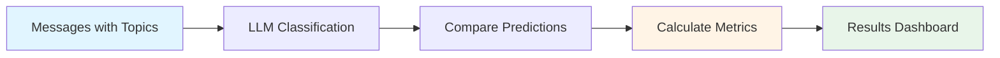
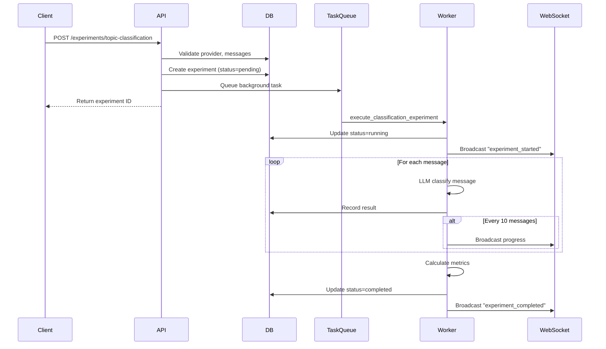
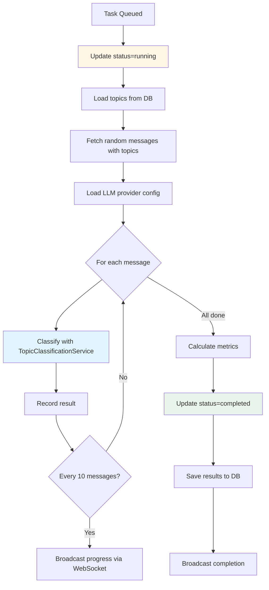

# Topic Classification Experiments

**Last Updated:** October 26, 2025
**Status:** Active - Core Implementation Complete
**Implementation Progress:** 100% (Backend + API + Background Jobs)

---

## Table of Contents

1. [System Overview](#system-overview)
2. [Experiment Workflow](#experiment-workflow)
3. [Configuration Options](#configuration-options)
4. [Metrics Tracked](#metrics-tracked)
5. [API Endpoints](#api-endpoints)
6. [Background Execution](#background-execution)
7. [Results Interpretation](#results-interpretation)
8. [Services](#services)

---

## System Overview

Classification experiments systematically evaluate LLM topic classification accuracy by comparing predicted topics against known-correct topic assignments in historical messages.

### Purpose

!!! tip "Why Use Experiments"
    - **Model Comparison:** Test different LLM providers (Ollama vs OpenAI) and models
    - **Accuracy Tracking:** Quantify classification quality with metrics
    - **Confidence Analysis:** Identify uncertain predictions requiring human review
    - **Performance Benchmarking:** Measure execution time across providers

### How It Works



The system:

1. Selects messages with pre-assigned topics from the database
2. Classifies each message using the specified LLM model
3. Compares predicted topics with actual topics
4. Calculates accuracy, confidence, and timing metrics
5. Generates confusion matrix for error pattern analysis

### Use Cases

<div class="grid cards" markdown>

- :material-compare: **Model Evaluation**

    Compare llama3.2:3b vs gpt-4 performance on your specific dataset

- :material-chart-line: **Accuracy Tracking**

    Monitor classification quality over time as topics evolve

- :material-brain: **Confidence Tuning**

    Identify low-confidence predictions requiring human review thresholds

- :material-speedometer: **Performance Testing**

    Benchmark execution time to choose cost-effective models

</div>

---

## Experiment Workflow

### Lifecycle Diagram



### Status Lifecycle

| Status | Description | Duration |
|--------|-------------|----------|
| **pending** | Created, waiting in task queue | <1 second |
| **running** | Processing messages with LLM | 1-5 minutes |
| **completed** | Finished with results | Permanent |
| **failed** | Error occurred (see error_message) | Permanent |

!!! warning "Running Experiments"
    Experiments in **running** status cannot be deleted. Wait for completion or failure before cleanup.

---

## Configuration Options

### Required Parameters

| Parameter | Type | Description | Constraints |
|-----------|------|-------------|-------------|
| **provider_id** | UUID | LLM provider for classification | Must exist, `is_active=true` |
| **model_name** | string | Model identifier | e.g., "llama3.2:3b", "gpt-4" |
| **message_count** | integer | Messages to classify | Range: 1-1000 |

### Provider Types

=== "Ollama (Local)"
    **Configuration:**

    - Base URL: `http://localhost:11434` (or custom)
    - API Key: Not required
    - Cost: Free

    **Common Models:**

    - `llama3.2:3b` - Fast, moderate accuracy
    - `llama3.1:8b` - Slower, higher accuracy
    - `mistral:7b` - Balanced performance

=== "OpenAI (Cloud)"
    **Configuration:**

    - Base URL: Default OpenAI endpoint
    - API Key: Encrypted in database
    - Cost: Per-token pricing

    **Common Models:**

    - `gpt-4` - Highest accuracy, expensive
    - `gpt-3.5-turbo` - Balanced cost/performance
    - `gpt-4-turbo` - Fast, cost-effective

### Topics Snapshot

!!! info "Consistency Guarantee"
    Topics are captured at experiment creation time as a JSONB snapshot. This prevents inconsistencies if topics are modified or deleted during long-running experiments.

**Snapshot Format:**

| Field | Description |
|-------|-------------|
| `topic_id` | Integer topic ID (key) |
| `name` | Topic name at snapshot time |
| `description` | Topic description for LLM context |

**Purpose:** Ensures classification uses the same topic definitions throughout the experiment, even if topics are updated in the database.

---

## Metrics Tracked

### Accuracy

**Formula:** `correct_predictions / total_messages`

**Interpretation:**

| Score Range | Quality | Recommendation |
|-------------|---------|----------------|
| 0.95-1.0 | Excellent | Production-ready |
| 0.80-0.94 | Good | Minor tuning recommended |
| 0.70-0.79 | Fair | Review topic definitions |
| <0.70 | Poor | Revise prompts or model |

**Example:**

- 100 messages classified
- 87 predicted topics matched actual topics
- Accuracy = 0.87 (87%)

---

### Average Confidence

**Formula:** `sum(confidence_scores) / total_messages`

**Interpretation:**

| Score Range | Certainty Level | Action Required |
|-------------|-----------------|-----------------|
| >0.90 | High certainty | Trust predictions |
| 0.70-0.90 | Moderate certainty | Review low-confidence cases |
| <0.70 | Low certainty | Manual review required |

**Confidence vs Accuracy Patterns:**

<div class="grid" markdown>

| Pattern | Accuracy | Confidence | Diagnosis |
|---------|----------|------------|-----------|
| 🎯 **Ideal** | High | High | Excellent model performance |
| ⚠️ **Overconfident** | Low | High | Model misunderstands topics |
| 🤔 **Cautious** | High | Low | Model needs clearer definitions |
| 🚨 **Struggling** | Low | Low | Topic overlap or poor prompts |

</div>

---

### Average Execution Time

**Formula:** `sum(execution_times_ms) / total_messages`

**Benchmarks:**

| Time Range | Speed Class | Typical Providers |
|------------|-------------|-------------------|
| <500ms | Fast | Ollama small models (3b) |
| 500-2000ms | Moderate | Ollama medium (8b), OpenAI |
| >2000ms | Slow | Large models (70b+), complex prompts |

**Cost Implications:**

- **Ollama:** Free, unlimited usage
- **OpenAI:** ~$0.001-0.01 per message (depending on model)

---

### Confusion Matrix

**Structure:** `{actual_topic: {predicted_topic: count}}`

**Example Matrix:**

| Actual ↓ / Predicted → | Work | Personal | Projects | Total |
|------------------------|------|----------|----------|-------|
| **Work** | 45 | 5 | 0 | 50 |
| **Personal** | 2 | 38 | 0 | 40 |
| **Projects** | 1 | 0 | 9 | 10 |

**Interpretation:**

- **Diagonal values** (45, 38, 9): Correct predictions
- **Off-diagonal values** (5, 2, 1): Misclassifications
- **Pattern:** Work is sometimes confused with Personal (5 cases)

??? note "Derived Metrics from Confusion Matrix"
    **Precision** (per topic): `true_positives / (true_positives + false_positives)`

    - Work precision: 45 / (45 + 2 + 1) = 0.9375 (93.75%)

    **Recall** (per topic): `true_positives / (true_positives + false_negatives)`

    - Work recall: 45 / (45 + 5 + 0) = 0.90 (90%)

    **F1 Score**: `2 * (precision * recall) / (precision + recall)`

    - Work F1: 2 * (0.9375 * 0.90) / (0.9375 + 0.90) = 0.9184

---

### Per-Message Results

Each classification result includes:

| Field | Type | Description |
|-------|------|-------------|
| `message_id` | integer | Message database ID |
| `message_content` | string | First 200 characters |
| `actual_topic_id` | integer | Correct topic (ground truth) |
| `actual_topic_name` | string | Correct topic name |
| `predicted_topic_id` | integer | LLM predicted topic |
| `predicted_topic_name` | string | LLM predicted topic name |
| `confidence` | float | LLM confidence score (0.0-1.0) |
| `execution_time_ms` | float | Classification duration |
| `reasoning` | string | LLM explanation (1-2 sentences) |
| `alternatives` | array | Alternative topic suggestions |

**Usage:**

- **Pattern Detection:** Identify systematic errors (e.g., always confusing two topics)
- **Quality Review:** Examine low-confidence predictions for improvement
- **Prompt Tuning:** Analyze reasoning to refine classification prompts
- **Topic Definition:** Discover ambiguous topic boundaries

---

## API Endpoints

### Create Experiment

**Endpoint:** `POST /api/v1/experiments/topic-classification`

**Request Body:**

| Field | Type | Required | Description |
|-------|------|----------|-------------|
| `provider_id` | UUID | Yes | Active LLM provider UUID |
| `model_name` | string | Yes | Model identifier |
| `message_count` | integer | Yes | Messages to classify (1-1000) |

**Response:** `201 Created`

| Field | Description |
|-------|-------------|
| `id` | Experiment ID for tracking |
| `status` | "pending" (queued for processing) |
| `created_at` | Timestamp |

**Validation Errors:**

!!! warning "Common Errors"
    - `404 Not Found` - Provider does not exist
    - `400 Bad Request` - Provider is inactive (`is_active=false`)
    - `400 Bad Request` - Insufficient messages with topics in database

**Side Effects:**

- Creates experiment record in database
- Queues background task via TaskIQ
- Returns immediately without waiting for completion

---

### List Experiments

**Endpoint:** `GET /api/v1/experiments/topic-classification`

**Query Parameters:**

| Parameter | Type | Default | Description |
|-----------|------|---------|-------------|
| `skip` | integer | 0 | Pagination offset |
| `limit` | integer | 50 | Page size (max 100) |
| `status` | string | all | Filter by status |

**Response:** `200 OK`

Returns paginated list of experiments ordered by creation date (newest first).

**Example Response:**

| Field | Description |
|-------|-------------|
| `items` | Array of experiment summaries |
| `total` | Total experiment count |
| `page` | Current page number |
| `page_size` | Items per page |

---

### Get Experiment Details

**Endpoint:** `GET /api/v1/experiments/topic-classification/{experiment_id}`

**Response:** `200 OK`

Returns full experiment details including:

- Experiment configuration
- Summary metrics (accuracy, confidence, execution time)
- Confusion matrix
- Per-message classification results

**Errors:**

- `404 Not Found` - Experiment does not exist

**Use Cases:**

<div class="grid cards" markdown>

- :material-file-chart: **Analysis**

    Download results for visualization in external tools

- :material-bug: **Debugging**

    Review individual misclassifications to improve prompts

- :material-compare: **Comparison**

    Compare metrics across different models side-by-side

- :material-chart-box: **Reporting**

    Generate classification quality reports for stakeholders

</div>

---

### Delete Experiment

**Endpoint:** `DELETE /api/v1/experiments/topic-classification/{experiment_id}`

**Response:** `204 No Content`

**Validation:**

!!! danger "Deletion Rules"
    - Cannot delete experiments with `status=running`
    - Permanently removes experiment and all results
    - No undo available

**Side Effects:**

- Removes experiment record from database
- Deletes confusion matrix and classification results
- Does not affect original messages or topics

---

## Background Execution

### TaskIQ Integration

**Task Name:** `execute_classification_experiment`
**Broker:** NATS with JetStream
**Execution:** Asynchronous, non-blocking

### Processing Flow



### Message Selection

**Query:** Random sampling of messages with `topic_id IS NOT NULL`

```
SELECT * FROM messages
WHERE topic_id IS NOT NULL
ORDER BY random()
LIMIT {message_count}
```

**Characteristics:**

- Random distribution ensures unbiased evaluation
- Only messages with pre-assigned topics included
- Topic assignment made before experiment creation

---

### WebSocket Events

**Topic:** `"experiments"`

**Event Types:**

=== "experiment_started"
    **Payload:**

    | Field | Description |
    |-------|-------------|
    | `type` | "experiment_started" |
    | `experiment_id` | Experiment ID |
    | `message_count` | Total messages to process |

=== "experiment_progress"
    **Payload:**

    | Field | Description |
    |-------|-------------|
    | `type` | "experiment_progress" |
    | `experiment_id` | Experiment ID |
    | `current` | Messages processed so far |
    | `total` | Total messages |
    | `percentage` | Progress percentage (0-100) |

    **Frequency:** Broadcast every 10 messages

=== "experiment_completed"
    **Payload:**

    | Field | Description |
    |-------|-------------|
    | `type` | "experiment_completed" |
    | `experiment_id` | Experiment ID |
    | `accuracy` | Final accuracy score |

=== "experiment_failed"
    **Payload:**

    | Field | Description |
    |-------|-------------|
    | `type` | "experiment_failed" |
    | `experiment_id` | Experiment ID |
    | `error` | Error message |

### Error Handling

**Individual Message Failures:**

- Classification errors recorded as ERROR result
- Confidence set to 0.0
- Experiment continues processing remaining messages

**Critical Failures:**

- Update `status=failed`
- Set `error_message` field
- Broadcast `experiment_failed` event
- No partial results saved

---

## Results Interpretation

### Accuracy Analysis

**High Accuracy (>0.85):**

✅ Model understands topic definitions
✅ Topics are well-separated conceptually
✅ Training prompt is effective

**Low Accuracy (<0.70):**

❌ Topics may overlap or conflict
❌ Descriptions are ambiguous
❌ Model lacks domain context

**Improvement Actions:**

1. Review misclassified messages for patterns
2. Refine topic descriptions for clarity
3. Add examples to topic definitions
4. Test different models or prompts

---

### Confidence Analysis

**High Confidence + High Accuracy:**

🎯 Ideal state - deploy to production

**High Confidence + Low Accuracy:**

⚠️ Overconfident model - investigate systematic biases

**Low Confidence + High Accuracy:**

🤔 Cautious model - may need threshold adjustment

**Low Confidence + Low Accuracy:**

🚨 Model struggling - requires prompt/topic redesign

---

### Confusion Matrix Patterns

**Diagonal Concentration:**

✅ Good separation between topics
✅ Clear topic boundaries

**Off-Diagonal Clusters:**

❌ Specific topic pairs frequently confused
❌ Topic definitions overlap

**Analysis Strategy:**

1. Identify frequently confused topic pairs
2. Review messages in those confusion cells
3. Compare topic descriptions for overlap
4. Refine descriptions or merge similar topics

---

### Execution Time Considerations

**Fast Models (<500ms):**

- ✅ Suitable for real-time classification
- ✅ Cost-effective for high-volume processing
- ⚠️ May sacrifice accuracy for speed

**Slow Models (>2000ms):**

- ✅ Higher accuracy potential
- ❌ Not suitable for real-time use
- ❌ Higher costs (if using paid APIs)

**Optimization:**

- Use fast models for bulk processing
- Reserve slow models for critical/uncertain cases
- Implement confidence-based routing (fast first, slow if low confidence)

---

## Services

### TopicClassificationService

**Location:** `backend/app/services/topic_classification_service.py`

**Responsibilities:**

<div class="grid cards" markdown>

- :material-cog: **Experiment Creation**

    Validates provider, messages, captures topic snapshot

- :material-brain: **Message Classification**

    Executes LLM classification with structured output

- :material-calculator: **Metrics Calculation**

    Computes accuracy, confidence, confusion matrix

</div>

**Key Methods:**

| Method | Description | Returns |
|--------|-------------|---------|
| `run_experiment()` | Creates experiment record | Experiment with status=pending |
| `classify_message()` | Classifies single message | TopicClassificationResult + execution time |
| `calculate_metrics()` | Computes accuracy and confusion matrix | Metrics dictionary |

**Dependencies:**

- `pydantic-ai` for structured LLM outputs
- `CredentialEncryption` for API key decryption
- `OllamaProvider` / `OpenAIProvider` for model configuration

---

### WebSocketManager

**Location:** `backend/app/services/websocket_manager.py`

**Integration:**

The service broadcasts experiment progress to connected clients in real-time.

**Events Broadcast:**

- Experiment lifecycle changes (started, completed, failed)
- Progress updates every 10 messages
- Final results with accuracy score

**Usage Pattern:**

Clients subscribe to `"experiments"` topic to receive live updates during classification processing.

---

### CredentialEncryption

**Location:** `backend/app/services/credential_encryption.py`

**Purpose:**

Securely decrypts OpenAI API keys stored encrypted in the `llm_providers` table.

**Security:**

- Uses Fernet symmetric encryption
- Encryption key stored in environment variables
- API keys never logged or exposed in responses

---

## Related Documentation

- **Analysis System:** See [analysis-system.md](./analysis-system.md)
- **Noise Filtering:** See [noise-filtering.md](./noise-filtering.md)
- **Vector Database:** See [vector-database.md](./vector-database.md)

---

*This document provides comprehensive coverage of the topic classification experiments feature for evaluating LLM topic classification quality.*
