# System Architecture Diagrams

This document provides comprehensive visual documentation of the Task Tracker system architecture at different levels of detail.

## High-Level System Architecture

The Task Tracker is an event-driven microservices system with the following key components:

**Key Characteristics:**

- **Event-Driven**: Asynchronous communication via NATS message broker
- **Real-Time**: WebSocket connections for live dashboard updates
- **AI-Powered**: Automated task classification and analysis using local LLM
- **Scalable**: Microservices architecture with independent components

## Component Architecture

### Service Boundaries

## Task Classification Flow

This sequence diagram shows how a task message flows through the system from user input to AI classification:

```mermaid
sequenceDiagram
    autonumber
    actor User
    participant TG as Telegram Bot
    participant API as FastAPI Backend
    participant NATS as NATS Broker
    participant Worker as TaskIQ Worker
    participant AI as Pydantic-AI
    participant Ollama as Ollama LLM
    participant DB as PostgreSQL
    participant WS as WebSocket Clients

    User->>TG: Send message
    TG->>DB: Create task (pending)
    TG->>NATS: Publish classify_task job
    TG->>User: ✅ Task received

    NATS->>Worker: Deliver job
    Worker->>DB: Get task details
    Worker->>AI: Request classification
    AI->>Ollama: LLM inference
    Ollama-->>AI: Classification result
    AI-->>Worker: Structured response

    Worker->>DB: Update task classification
    Worker->>DB: Calculate embeddings
    Worker->>DB: Store vector
    Worker->>NATS: Publish task_classified event

    NATS->>API: Deliver event
    API->>WS: Broadcast update
    WS->>User: 🔄 Real-time UI update
```

**Flow Steps:**

1. User sends a message via Telegram
2. Bot creates task with `pending` status
3. Job queued to NATS for async processing
4. Worker picks up classification job
5. Pydantic-AI structures the LLM request
6. Ollama performs inference
7. Task updated with classification + embedding
8. WebSocket broadcast to all connected clients

## Real-Time Updates Flow

Shows how WebSocket connections keep the dashboard synchronized:

```mermaid
sequenceDiagram
    autonumber
    actor User1 as User (Telegram)
    actor User2 as User (Dashboard)
    participant TG as Telegram Bot
    participant API as FastAPI
    participant WS as WebSocket Manager
    participant DB as PostgreSQL
    participant NATS as NATS Broker
    participant Worker as TaskIQ Worker

    User2->>API: Connect WebSocket
    API->>WS: Register connection
    WS-->>User2: Connected

    User1->>TG: Create task
    TG->>DB: Insert task
    TG->>NATS: Queue classify_task

    NATS->>Worker: Process task
    Worker->>DB: Update task
    Worker->>NATS: Publish task_updated event

    NATS->>API: Event delivery
    API->>WS: Broadcast task_updated
    WS->>User2: 🔄 Live update
    User2->>User2: UI re-renders

    User2->>API: Update task status
    API->>DB: Update task
    API->>WS: Broadcast task_updated
    WS->>User2: 🔄 Live update
    WS->>User1: 🔔 Telegram notification (if enabled)
```

## Analysis System Workflow

The Analysis System is a two-stage pipeline: Knowledge Extraction creates Topics/Atoms, then Analysis Run generates TaskProposals from that knowledge:

**Key Points:**

- Stage 1: Messages → TopicProposals/AtomProposals → Approved Topics/Atoms
- Stage 2: Approved Topics/Atoms → Analysis Run → TaskProposals
- TaskProposals are derived from accumulated knowledge, not directly from messages
- Human review and approval at each stage

## Data Flow Architecture

How data moves through the system:

## Component Interaction Matrix

Key interactions between system components:

## Technology Stack

## Deployment Architecture

## Database Schema Overview

## Development Workflow

## Key Design Patterns

### Event-Driven Architecture

### Dependency Injection (FastAPI)

### Repository Pattern

## Monitoring & Observability

## Summary

The Task Tracker system is built on modern architectural principles:

- **Event-Driven**: Loose coupling via NATS messaging
- **Real-Time**: WebSocket for live updates
- **AI-Powered**: Local LLM integration with Ollama
- **Type-Safe**: Strict mypy typing across Python codebase
- **Containerized**: Full Docker Compose orchestration
- **Scalable**: Independent service scaling
- **Observable**: Comprehensive logging and metrics

For more details on specific components, see the related architecture documentation.
