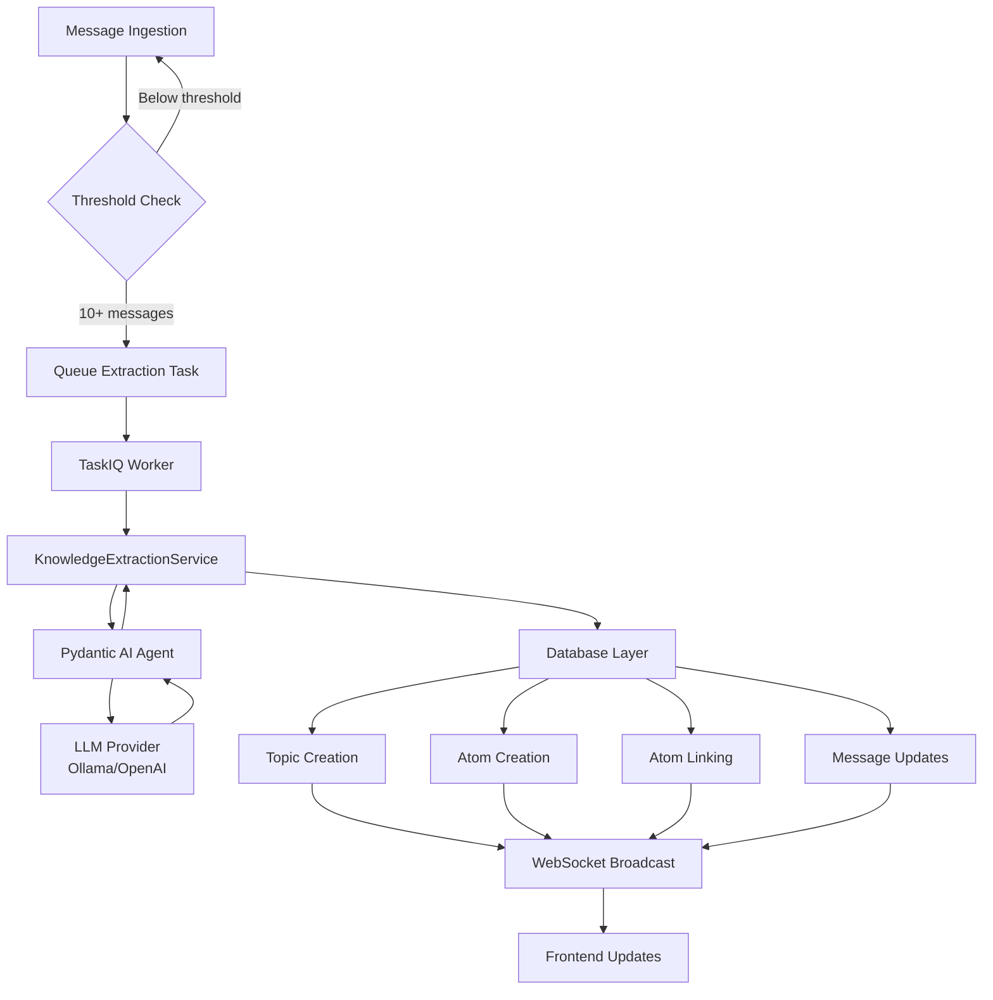
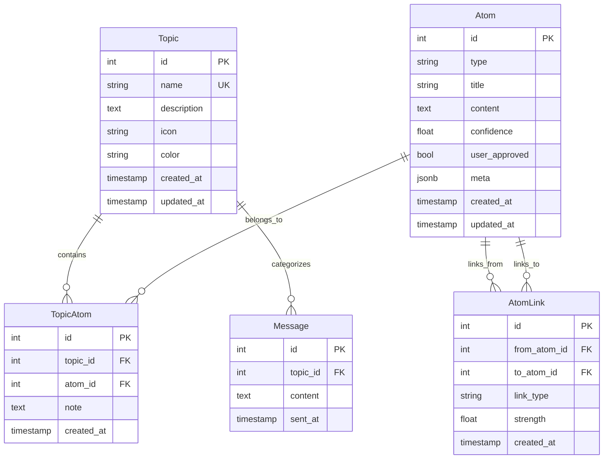

# Knowledge Extraction System

!!! info "Developer Guide"
    This document covers the technical architecture, implementation details, and integration patterns for the Knowledge Extraction System.

---

## Architecture Overview

The Knowledge Extraction System is a background processing pipeline that transforms unstructured message data into structured knowledge entities using LLM-powered analysis.

### System Components



### Key Services

| Component | Responsibility | Location |
|-----------|---------------|----------|
| **KnowledgeExtractionService** | Core extraction logic | `app/services/knowledge_extraction_service.py` |
| **extract_knowledge_from_messages_task** | Background task orchestration | `app/tasks.py` |
| **Knowledge API** | HTTP endpoints for manual triggering | `app/api/v1/knowledge.py` |
| **WebSocket Manager** | Real-time event broadcasting | `app/services/websocket_manager.py` |

---

## Data Models

### Database Schema



### Model Classes

**Topic** (`app/models/topic.py`)

```python
class Topic(IDMixin, TimestampMixin, SQLModel, table=True):
    name: str = Field(unique=True, index=True, max_length=100)
    description: str = Field(sa_type=Text)
    icon: str | None = Field(default=None, max_length=50)
    color: str | None = Field(default=None, max_length=7)
```

**Atom** (`app/models/atom.py`)

```python
class Atom(IDMixin, TimestampMixin, SQLModel, table=True):
    type: str = Field(max_length=50)  # (1)!
    title: str = Field(max_length=200)
    content: str = Field(sa_type=Text)
    confidence: float = Field(ge=0.0, le=1.0)
    user_approved: bool = Field(default=False)
    meta: dict[str, Any] = Field(default_factory=dict, sa_type=JSON)  # (2)!
```

1. Type must be one of: `problem`, `solution`, `decision`, `insight`, `question`, `pattern`, `requirement`
2. Meta stores source message IDs and extraction metadata

**TopicAtom** - Many-to-many relationship

```python
class TopicAtom(IDMixin, TimestampMixin, SQLModel, table=True):
    topic_id: int = Field(foreign_key="topics.id")
    atom_id: int = Field(foreign_key="atoms.id")
    note: str | None = Field(default=None, sa_type=Text)
```

**AtomLink** - Bidirectional atom relationships

```python
class AtomLink(IDMixin, TimestampMixin, SQLModel, table=True):
    from_atom_id: int = Field(foreign_key="atoms.id")
    to_atom_id: int = Field(foreign_key="atoms.id")
    link_type: str = Field(max_length=50)  # (1)!
    strength: float | None = Field(default=None, ge=0.0, le=1.0)
```

1. Link types: `solves`, `supports`, `contradicts`, `continues`, `refines`, `relates_to`, `depends_on`

---

## Extraction Pipeline

### Workflow Phases

#### Phase 1: Trigger Detection

```python
# In app/tasks.py
async def queue_knowledge_extraction_if_needed(message_id: int, db: Any) -> None:
    cutoff_time = datetime.now(UTC) - timedelta(hours=KNOWLEDGE_EXTRACTION_LOOKBACK_HOURS)

    count_stmt = (
        select(func.count())
        .select_from(Message)
        .where(Message.topic_id.is_(None), Message.sent_at >= cutoff_time)
    )
    result = await db.execute(count_stmt)
    unprocessed_count = result.scalar() or 0

    if unprocessed_count >= KNOWLEDGE_EXTRACTION_THRESHOLD:  # (1)!
        await extract_knowledge_from_messages_task.kiq(
            message_ids=message_ids,
            provider_id=str(provider.id)
        )
```

1. Default threshold: 10 messages in 24 hours

#### Phase 2: Background Task Execution

```python
# In app/tasks.py
@nats_broker.task
async def extract_knowledge_from_messages_task(
    message_ids: list[int],
    provider_id: str
) -> dict[str, int]:
    provider = await db.get(LLMProvider, UUID(provider_id))
    messages = await db.execute(select(Message).where(Message.id.in_(message_ids)))

    service = KnowledgeExtractionService(provider=provider)

    extraction_output = await service.extract_knowledge(messages)  # (1)!

    topic_map = await service.save_topics(extraction_output.topics, db)
    saved_atoms = await service.save_atoms(extraction_output.atoms, topic_map, db)
    links_created = await service.link_atoms(extraction_output.atoms, saved_atoms, db)
    messages_updated = await service.update_messages(messages, topic_map, extraction_output.topics, db)

    return {
        "topics_created": len(topic_map),
        "atoms_created": len(saved_atoms),
        "links_created": links_created,
        "messages_updated": messages_updated,
    }
```

1. This calls the LLM via Pydantic AI with structured output

#### Phase 3: LLM Analysis

```python
# In app/services/knowledge_extraction_service.py
async def extract_knowledge(
    self,
    messages: Sequence[Message],
    temperature: float = 0.3,
    max_tokens: int | None = 4096,
) -> KnowledgeExtractionOutput:
    prompt = self._build_prompt(messages)  # (1)!
    model = self._build_model_instance(api_key)  # (2)!

    agent = PydanticAgent(
        model=model,
        system_prompt=KNOWLEDGE_EXTRACTION_SYSTEM_PROMPT,
        output_type=KnowledgeExtractionOutput,  # (3)!
    )

    result = await agent.run(prompt, model_settings=model_settings_obj)
    return result.output
```

1. Formats messages with context for LLM analysis
2. Configures Ollama or OpenAI provider based on configuration
3. Enforces structured JSON output matching Pydantic schema

#### Phase 4: Entity Creation

```python
async def save_topics(
    self,
    extracted_topics: list[ExtractedTopic],
    session: AsyncSession,
    confidence_threshold: float = 0.7
) -> dict[str, Topic]:
    topic_map: dict[str, Topic] = {}

    for extracted_topic in extracted_topics:
        if extracted_topic.confidence < confidence_threshold:  # (1)!
            logger.warning(f"Topic '{extracted_topic.name}' below threshold, skipping")
            continue

        existing_topic = await session.execute(
            select(Topic).where(Topic.name == extracted_topic.name)
        )

        if existing_topic:
            topic_map[extracted_topic.name] = existing_topic
        else:
            new_topic = Topic(
                name=extracted_topic.name,
                description=extracted_topic.description,
                icon=auto_select_icon(extracted_topic.name, extracted_topic.description),
                color=auto_select_color(icon),
            )
            session.add(new_topic)
            topic_map[extracted_topic.name] = new_topic

    await session.commit()
    return topic_map
```

1. Only creates topics with confidence >= 0.7 by default

#### Phase 5: Relationship Linking

```python
async def link_atoms(
    self,
    extracted_atoms: list[ExtractedAtom],
    saved_atoms: list[Atom],
    session: AsyncSession
) -> int:
    atom_title_to_id = {atom.title: atom.id for atom in saved_atoms}
    links_created = 0

    for extracted_atom in extracted_atoms:
        from_atom_id = atom_title_to_id[extracted_atom.title]

        for target_title, link_type in zip(
            extracted_atom.links_to_atom_titles,
            extracted_atom.link_types
        ):
            to_atom_id = atom_title_to_id.get(target_title)
            if not to_atom_id:
                continue

            new_link = AtomLink(
                from_atom_id=from_atom_id,
                to_atom_id=to_atom_id,
                link_type=link_type,
            )
            session.add(new_link)
            links_created += 1

    await session.commit()
    return links_created
```

---

## LLM Integration

### Pydantic AI Configuration

The system uses **Pydantic AI** for structured LLM output:

```python
from pydantic import BaseModel, Field
from pydantic_ai import Agent as PydanticAgent

class ExtractedTopic(BaseModel):
    name: str = Field(max_length=100, description="Concise topic name (2-4 words max)")
    description: str = Field(description="Clear description of the discussion theme")
    confidence: float = Field(ge=0.0, le=1.0)
    keywords: list[str] = Field(description="Key terms associated with this topic")
    related_message_ids: list[int] = Field(description="Source message IDs")

class ExtractedAtom(BaseModel):
    type: str = Field(description="Atom type: problem/solution/decision/insight/...")
    title: str = Field(max_length=200, description="Brief title")
    content: str = Field(description="Full self-contained content")
    confidence: float = Field(ge=0.0, le=1.0)
    topic_name: str = Field(description="Parent topic name")
    related_message_ids: list[int]
    links_to_atom_titles: list[str] = Field(default_factory=list)
    link_types: list[str] = Field(default_factory=list)

class KnowledgeExtractionOutput(BaseModel):
    topics: list[ExtractedTopic]
    atoms: list[ExtractedAtom]
```

### System Prompt

The extraction quality depends heavily on the system prompt:

```python
KNOWLEDGE_EXTRACTION_SYSTEM_PROMPT = """You are a knowledge extraction expert analyzing conversation messages.

Your task is to identify:
1. TOPICS - Discussion themes, problem domains, or contexts (e.g., "API Design", "Database Migration")
2. ATOMS - Specific atomic knowledge units: problems, solutions, decisions, insights, questions, patterns, requirements

Guidelines for Topics:
- Keep names concise: 2-4 words maximum
- Each topic should represent a coherent discussion theme
- Confidence 0.7+ for auto-creation, lower for review flagging
- Extract 2-5 keywords that characterize the topic

Guidelines for Atoms:
- Each atom must be self-contained and actionable
- Title: Brief but descriptive (under 200 chars)
- Content: Complete thought that stands alone
- Type classification: problem/solution/decision/insight/question/pattern/requirement
- Confidence 0.7+ for auto-creation
- Link atoms that have relationships: solves/supports/contradicts/continues/refines/relates_to/depends_on

Quality standards:
- Avoid duplicating existing knowledge
- Only extract clear, meaningful knowledge units
- Ensure atoms are genuinely atomic (single complete thought)
- Link related atoms to build knowledge graph
- If confidence is low (<0.7), still extract but flag with lower score

Return structured output with topics and atoms."""
```

### Provider Support

**Ollama** (Local LLM)

```python
if self.provider.type == ProviderType.ollama:
    ollama_provider = OllamaProvider(base_url=self.provider.base_url)
    return OpenAIChatModel(
        model_name=self.model_name,  # e.g., "qwen2.5:14b"
        provider=ollama_provider,
    )
```

**OpenAI** (Cloud LLM)

```python
elif self.provider.type == ProviderType.openai:
    openai_provider = OpenAIProvider(api_key=api_key)
    return OpenAIChatModel(
        model_name=self.model_name,  # e.g., "gpt-4o"
        provider=openai_provider,
    )
```

---

## API Integration

### Manual Trigger Endpoint

**POST /api/v1/knowledge/extract**

```python
@router.post("/extract", response_model=KnowledgeExtractionResponse, status_code=status.HTTP_202_ACCEPTED)
async def trigger_knowledge_extraction(
    request: KnowledgeExtractionRequest,
    db: DatabaseDep
) -> KnowledgeExtractionResponse:
    provider = await db.get(LLMProvider, request.provider_id)
    if not provider or not provider.is_active:
        raise HTTPException(status_code=400, detail="Invalid or inactive provider")

    await extract_knowledge_from_messages_task.kiq(
        message_ids=request.message_ids,
        provider_id=str(request.provider_id)
    )

    return KnowledgeExtractionResponse(
        message=f"Knowledge extraction queued for {len(request.message_ids)} messages",
        message_count=len(request.message_ids),
        provider_id=str(request.provider_id),
    )
```

**Request Schema**

```typescript
{
  "message_ids": number[],  // 1-100 message IDs
  "provider_id": string     // UUID of active LLM provider
}
```

**Response Schema**

```typescript
{
  "message": string,
  "message_count": number,
  "provider_id": string
}
```

---

## WebSocket Events

The system broadcasts real-time updates to connected clients:

### Event Types

**extraction_started**

```json
{
  "type": "knowledge.extraction_started",
  "data": {
    "message_count": 15,
    "provider_id": "uuid"
  }
}
```

**topic_created**

```json
{
  "type": "knowledge.topic_created",
  "data": {
    "topic_id": 42,
    "topic_name": "API Design"
  }
}
```

**atom_created**

```json
{
  "type": "knowledge.atom_created",
  "data": {
    "atom_id": 123,
    "atom_title": "Implement OAuth2 flow",
    "atom_type": "solution"
  }
}
```

**extraction_completed**

```json
{
  "type": "knowledge.extraction_completed",
  "data": {
    "message_count": 15,
    "topics_created": 2,
    "atoms_created": 8,
    "links_created": 5,
    "messages_updated": 15
  }
}
```

**extraction_failed**

```json
{
  "type": "knowledge.extraction_failed",
  "data": {
    "error": "Provider connection timeout"
  }
}
```

---

## Configuration Reference

### Environment Variables

```bash
# Not directly configurable via env, modify constants in code:
# KNOWLEDGE_EXTRACTION_THRESHOLD = 10
# KNOWLEDGE_EXTRACTION_LOOKBACK_HOURS = 24
```

### Service Parameters

```python
# In KnowledgeExtractionService.__init__
model_name: str = "qwen2.5:14b"  # Default model for Ollama

# In extract_knowledge method
temperature: float = 0.3  # LLM sampling (lower = more focused)
max_tokens: int = 4096    # Maximum response tokens

# In save_topics/save_atoms methods
confidence_threshold: float = 0.7  # Minimum confidence for auto-creation
```

### Tuning Guidelines

| Parameter | Low Value | Default | High Value |
|-----------|-----------|---------|------------|
| **Temperature** | 0.1 (very focused) | 0.3 | 0.7 (creative) |
| **Max Tokens** | 2048 (short) | 4096 | 8192 (detailed) |
| **Confidence** | 0.5 (permissive) | 0.7 | 0.9 (strict) |
| **Threshold** | 5 msgs (frequent) | 10 | 20 (infrequent) |

---

## Testing

### Test Coverage

**42 tests, 96% coverage** across:

- Service layer (`test_knowledge_extraction_service.py`)
- API endpoints (`test_knowledge_api.py`)
- Background tasks (`test_knowledge_extraction_task.py`)

### Mock Strategy

LLM calls are mocked for deterministic testing:

```python
@pytest.fixture
def mock_llm_response():
    return KnowledgeExtractionOutput(
        topics=[
            ExtractedTopic(
                name="Test Topic",
                description="A test topic",
                confidence=0.85,
                keywords=["test", "topic"],
                related_message_ids=[1, 2, 3]
            )
        ],
        atoms=[
            ExtractedAtom(
                type="problem",
                title="Test problem",
                content="This is a test problem",
                confidence=0.82,
                topic_name="Test Topic",
                related_message_ids=[1, 2],
                links_to_atom_titles=[],
                link_types=[]
            )
        ]
    )

async def test_extract_knowledge(mock_llm_response, mocker):
    mocker.patch.object(
        KnowledgeExtractionService,
        'extract_knowledge',
        return_value=mock_llm_response
    )
    # Test logic...
```

### Running Tests

```bash
# Run all knowledge extraction tests
uv run pytest tests/ -k knowledge -v

# Run with coverage
uv run pytest tests/ -k knowledge --cov=app/services/knowledge_extraction_service --cov-report=term-missing
```

---

## Troubleshooting

### Common Issues

#### Provider Not Found

**Error:** `Provider {uuid} not found`

**Cause:** Invalid provider_id or provider deleted

**Solution:** Verify provider exists and is active before triggering

#### Low Extraction Quality

**Error:** Vague or incorrect topics/atoms

**Causes:**
- Poor message quality (too short, no context)
- Wrong model (too small or not instruction-tuned)
- System prompt mismatch with model capabilities

**Solutions:**
- Use larger models (14B+ parameters recommended)
- Adjust temperature (try 0.5-0.6 for more creativity)
- Review and tune system prompt for your use case

#### LLM Timeout

**Error:** `Knowledge extraction failed: timeout`

**Causes:**
- Ollama server not responding
- Network latency to OpenAI
- Large batch size overwhelming model

**Solutions:**
- Check Ollama server health: `curl http://localhost:11434/api/tags`
- Reduce batch size (process 10-20 messages instead of 50)
- Increase timeout in TaskIQ worker configuration

#### Duplicate Topics

**Error:** Topics created with similar but different names

**Cause:** LLM inconsistency in naming

**Solution:** Implement fuzzy matching in `save_topics`:

```python
# Future improvement: fuzzy topic matching
from difflib import SequenceMatcher

def find_similar_topic(name: str, existing_topics: list[Topic], threshold: float = 0.8) -> Topic | None:
    for topic in existing_topics:
        similarity = SequenceMatcher(None, name.lower(), topic.name.lower()).ratio()
        if similarity >= threshold:
            return topic
    return None
```

---

## Performance Optimization

### Database Queries

**Use eager loading for relationships:**

```python
from sqlalchemy.orm import selectinload

stmt = (
    select(Topic)
    .options(selectinload(Topic.atoms))
    .where(Topic.id == topic_id)
)
```

**Batch inserts for atoms:**

```python
session.add_all(saved_atoms)  # Faster than individual adds
await session.flush()  # Get IDs before commit
```

### LLM Calls

**Optimize batch size:**

- **Small batches (5-10):** Fast but more API calls
- **Medium batches (10-20):** Balanced quality/speed
- **Large batches (30-50):** Slower but fewer calls

**Use caching for repeated messages:**

```python
# Future improvement: cache message embeddings
message_hash = hashlib.sha256(message.content.encode()).hexdigest()
if cached_result := cache.get(message_hash):
    return cached_result
```

---

## Future Enhancements

### Planned Features

1. **Incremental Extraction** - Process only new messages since last extraction
2. **Atom Merging** - Detect and merge duplicate atoms automatically
3. **Confidence Calibration** - Learn optimal threshold per project
4. **Multi-Language Support** - Extract knowledge from non-English messages
5. **Custom Extraction Rules** - User-defined extraction patterns
6. **Atom Versioning** - Track edits and improvements over time

### Extension Points

**Custom Atom Types:**

```python
# Extend atom types in app/models/atom.py
CUSTOM_ATOM_TYPES = ["bug", "feature_request", "documentation", "test_case"]
```

**Custom Link Types:**

```python
# Add new relationship types in app/models/atom.py
CUSTOM_LINK_TYPES = ["implements", "tests", "documents", "deprecates"]
```

**Post-Processing Hooks:**

```python
# Add custom logic after extraction
async def post_extraction_hook(
    extraction_output: KnowledgeExtractionOutput,
    session: AsyncSession
) -> None:
    # Custom business logic
    pass
```

---

## References

- **Pydantic AI Documentation:** https://ai.pydantic.dev
- **TaskIQ Documentation:** https://taskiq-python.github.io
- **SQLModel Documentation:** https://sqlmodel.tiangolo.com

---

!!! tip "Contributing"
    If you improve the extraction system, update this documentation and add tests for new features.
