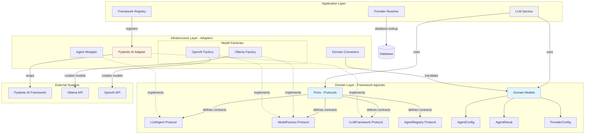

# LLM Hexagonal Architecture

## Overview

Task Tracker's LLM subsystem implements **Hexagonal Architecture** (Ports and Adapters pattern) to achieve framework independence, testability, and maintainability. This architectural pattern separates domain logic from external dependencies, allowing seamless framework swapping without business logic changes.

**Core Principle:** Business logic defines contracts (ports), external frameworks implement them (adapters).

## Why Hexagonal Architecture for LLM Integration?

**Traditional Problem:** Tight coupling between business logic and LLM frameworks creates:

- Framework lock-in (difficult to switch from Pydantic AI to LangChain)
- Untestable code (hard to mock external API calls)
- Fragile architecture (framework API changes break business logic)

**Hexagonal Solution:**

- Domain layer defines **what** operations are needed (protocols)
- Infrastructure layer defines **how** to execute them (adapters)
- Application layer orchestrates business workflows using domain contracts

**Benefits:**

1. **Framework Independence** - Swap Pydantic AI for LangChain without changing domain logic
2. **Testability** - Mock any protocol for isolated unit testing
3. **Flexibility** - Add new providers (Anthropic, Gemini) without modifying core system
4. **Type Safety** - Protocol-based structural typing catches errors at compile time
5. **Maintainability** - Clear boundaries prevent changes from rippling across layers

## Architecture Diagram

## Three-Layer Architecture

### Domain Layer: Framework-Agnostic Core

**Purpose:** Define business contracts and data structures independent of any LLM framework.

**Location:** `backend/app/llm/domain/`

**Key Components:**

#### Protocols (Contracts)

Framework-agnostic interfaces using Python's Protocol for structural subtyping:

- **LLMAgent[T]** - Agent execution contract
  - Execute prompts and return results
  - Stream progressive output for real-time responses
  - Check streaming capability
  - Retrieve agent configuration

- **ModelFactory** - Provider-specific model creation contract
  - Instantiate framework models from provider config
  - Verify provider connectivity
  - Retrieve model metadata
  - Check provider compatibility

- **LLMFramework** - Top-level framework adapter contract
  - Build agents from configuration
  - Report framework capabilities (streaming, tools)
  - Provide framework identifier
  - Access provider-specific factories

- **AgentRegistry** - Agent lifecycle management contract
  - Store runtime agent instances
  - Retrieve existing agents by name
  - Clean up agent resources
  - Inventory active agents

#### Domain Models

Pure data structures with zero framework dependencies:

- **AgentConfig** - Agent creation parameters (name, model, temperature, max_tokens, system_prompt)
- **AgentResult[T]** - Agent execution output (data, usage, metadata)
- **ProviderConfig** - Provider connection settings (type, base_url, api_key, timeout)
- **UsageInfo** - Token consumption tracking (prompt_tokens, completion_tokens, total_tokens)
- **StreamEvent** - Progressive output events during streaming
- **ToolDefinition** - Agent tool/function specifications
- **ModelInfo** - Model metadata (name, capabilities, limits)

**Design Principles:**

- Zero imports from infrastructure layer
- No framework-specific types (Pydantic AI, LangChain, etc.)
- Protocol-based contracts enable duck typing with type safety
- Generic types (T) for flexible output schemas

### Infrastructure Layer: Framework Adapters

**Purpose:** Implement domain protocols using concrete LLM frameworks (currently Pydantic AI).

**Location:** `backend/app/llm/infrastructure/adapters/`

**Current Implementation: Pydantic AI Adapter**

#### Adapter Components

- **PydanticAIAdapter** - Implements `LLMFramework` protocol
  - Translates domain `AgentConfig` to Pydantic AI `Agent` instances
  - Manages framework lifecycle and initialization
  - Routes requests to appropriate model factories

- **AgentWrapper** - Implements `LLMAgent[T]` protocol
  - Wraps Pydantic AI `Agent` to match domain contract
  - Converts Pydantic AI responses to domain `AgentResult[T]`
  - Handles streaming with domain `StreamEvent` types

- **Domain Converters** - Bidirectional translation utilities
  - Convert domain models ↔ Pydantic AI models
  - Normalize provider configurations
  - Map framework-specific metadata to domain structures

#### Model Factories

Provider-specific model instantiation implementing `ModelFactory` protocol:

- **OllamaFactory** - Creates Pydantic AI models for Ollama provider
  - Constructs Ollama model instances
  - Validates Ollama endpoint connectivity
  - Retrieves available models from Ollama API
  - Docker-aware URL resolution (localhost vs container names)

- **OpenAIFactory** - Creates Pydantic AI models for OpenAI provider
  - Constructs OpenAI model instances
  - Validates API key and quota
  - Supports GPT-3.5, GPT-4, custom endpoints
  - Configurable timeouts and retries

**Extensibility:**

New frameworks (LangChain, LlamaIndex) can be added by:

1. Creating new adapter directory (`infrastructure/adapters/langchain/`)
2. Implementing domain protocols (`LLMFramework`, `LLMAgent[T]`, `ModelFactory`)
3. Registering adapter in `FrameworkRegistry`
4. **No domain layer changes required**

### Application Layer: Business Orchestration

**Purpose:** Coordinate domain logic and infrastructure adapters to implement business workflows.

**Location:** `backend/app/llm/application/`

**Key Services:**

#### LLMService

High-level orchestrator for LLM operations:

**Responsibilities:**
- Framework selection via `FrameworkRegistry`
- Provider resolution via `ProviderResolver`
- Agent creation from domain `AgentConfig`
- Execution coordination with dependency injection

**Workflow:**
1. Resolve provider from database or defaults
2. Select framework adapter from registry
3. Create agent using framework's create_agent method
4. Execute prompts via agent's run or stream methods
5. Return domain `AgentResult[T]` to caller

#### ProviderResolver

Provider lookup strategy with fallback chain:

**Resolution Order:**
1. Database provider by name/UUID (encrypted API keys)
2. Application settings defaults
3. Fallback to first active provider

**Features:**
- Database integration for dynamic provider management
- Credential decryption for secure API key handling
- Provider validation before agent creation

#### FrameworkRegistry

Framework registration and selection system:

**Capabilities:**
- Register multiple framework adapters
- Default framework configuration
- Runtime framework switching by name
- Framework metadata inspection

**Current Registration:**
- `pydantic_ai`: Pydantic AI adapter (default)
- Future: `langchain`, `llamaindex`, custom adapters

## Design Principles and Benefits

### Dependency Inversion Principle

**Traditional Flow:** Business Logic → Concrete Framework → External API

**Hexagonal Flow:** Business Logic → Domain Protocol ← Framework Adapter → External API

Domain defines contracts, infrastructure implements them. Business logic never imports concrete implementations.

### Separation of Concerns

Each layer has single responsibility:

- **Domain** - Define business contracts and models
- **Application** - Orchestrate workflows
- **Infrastructure** - Implement external integrations

### Testability

**Unit Testing:** Mock any protocol with test doubles for isolated testing without real LLM calls

**Integration Testing:** Swap production adapters for test adapters to verify framework integration

**Benefits:**
- Fast test execution (no API calls)
- Deterministic results (no external dependencies)
- Cost-effective (no API usage during tests)
- Comprehensive coverage (96% test coverage, 169 tests)

### Framework Flexibility

**Scenario:** Migrate from Pydantic AI to LangChain

**Steps:**
1. Create `infrastructure/adapters/langchain/` with `LangChainAdapter`
2. Implement `LLMFramework`, `LLMAgent[T]`, `ModelFactory` protocols
3. Register in `FrameworkRegistry`: `registry.register("langchain", LangChainAdapter())`
4. Update application configuration: `framework_name="langchain"`

**Domain and Application layers:** Zero changes required.

**Estimated Migration Time:** 2-3 days (vs 2-3 weeks with traditional coupling)

### Type Safety

Protocol-based structural typing provides:

- **Compile-time validation** - MyPy catches protocol violations before deployment
- **IDE support** - Autocomplete and type hints for protocol methods
- **Runtime safety** - Type checking at boundaries prevents errors
- **Self-documentation** - Type hints serve as living documentation

### Maintainability

**Benefits:**
- Clear layer boundaries prevent coupling
- Changes isolated to specific layers
- New features added without modifying existing code (Open/Closed Principle)
- Protocol contracts serve as living documentation

## Real-World Usage Patterns

### Agent Creation Workflow

1. **Application** requests agent from `LLMService`
2. **ProviderResolver** fetches provider config from database
3. **FrameworkRegistry** retrieves registered framework adapter
4. **Framework Adapter** creates model via `ModelFactory`
5. **Agent Wrapper** wraps framework agent to match `LLMAgent[T]` protocol
6. **Application** executes prompts via domain protocol methods

### Provider Management

- Database stores encrypted API keys, endpoints, validation status
- `ProviderResolver` decrypts credentials at runtime
- `ModelFactory` validates provider connectivity before agent creation
- Failed providers skip to fallback in resolution chain

**Resolution Priority:**
1. Database provider by name/UUID (highest priority)
2. Application settings defaults
3. Fallback to first active provider
4. Error if no provider available

### Streaming Execution

1. Check agent streaming capability before attempting stream
2. Call agent stream method with prompt and dependencies
3. Iterate domain stream event objects (text chunks, metadata)
4. Framework-specific streaming details abstracted by adapter

### Multi-Provider Support

Single agent can use different providers based on configuration:

- **Development:** Ollama local models (privacy-friendly, no API costs)
- **Production:** OpenAI GPT-4 (advanced capabilities, cloud-based)
- **Experimentation:** Anthropic Claude (future adapter)

**Switching Method:** Change database provider configuration without code changes.

## SOLID Principles Compliance

The hexagonal architecture achieves A-grade SOLID compliance:

| Principle | Implementation | Benefit |
|-----------|----------------|---------|
| **Single Responsibility** | Each layer has one purpose | Easy to understand and modify |
| **Open/Closed** | Extend via new adapters | Add frameworks without changing existing code |
| **Liskov Substitution** | All adapters match protocols | Any framework works transparently |
| **Interface Segregation** | Small, focused protocols | Implement only what you need |
| **Dependency Inversion** | Depend on abstractions | Business logic independent of frameworks |

## Summary

Task Tracker's LLM hexagonal architecture achieves:

- **Framework Independence** - Domain logic isolated from LLM framework specifics
- **Testability** - Protocol-based mocking for comprehensive testing (96% coverage, 169 tests)
- **Extensibility** - Add providers and frameworks without domain changes
- **Type Safety** - Structural typing catches errors at compile time
- **Maintainability** - Clear layer boundaries and single responsibilities

**Trade-off:** Increased abstraction complexity for long-term architectural flexibility.

**Result:** Production-ready LLM integration that adapts to evolving AI ecosystem without rewrites.

## Related Documentation

- [Analysis System](analysis-system.md) - How LLM agents analyze messages
- [Background Tasks](background-tasks.md) - Async task processing with LLM
- [Architecture Overview](overview.md) - System-wide architectural patterns
