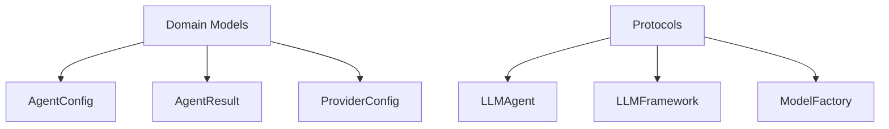
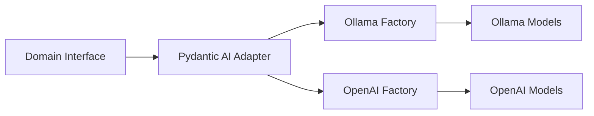
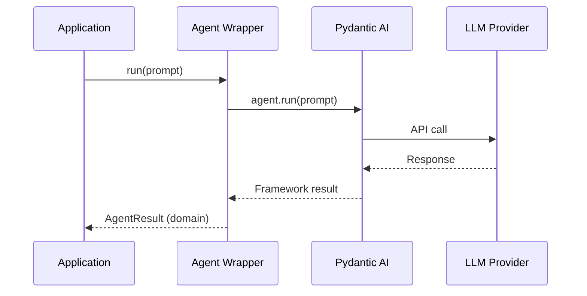
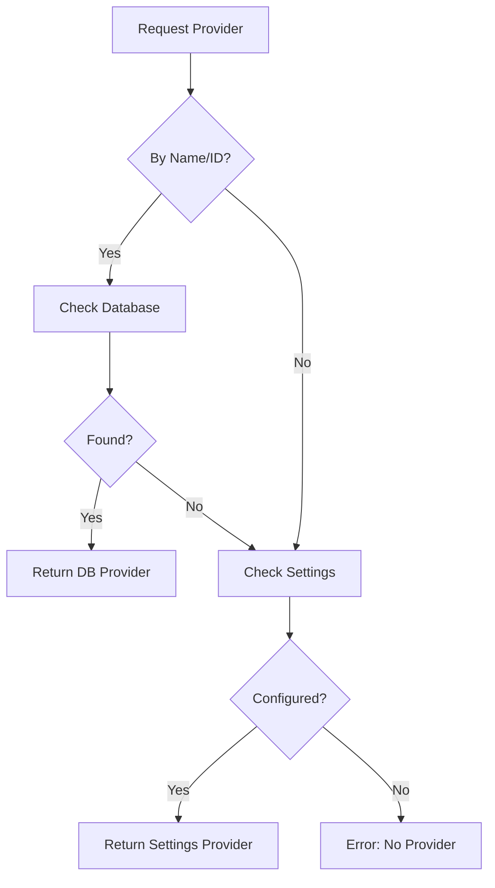
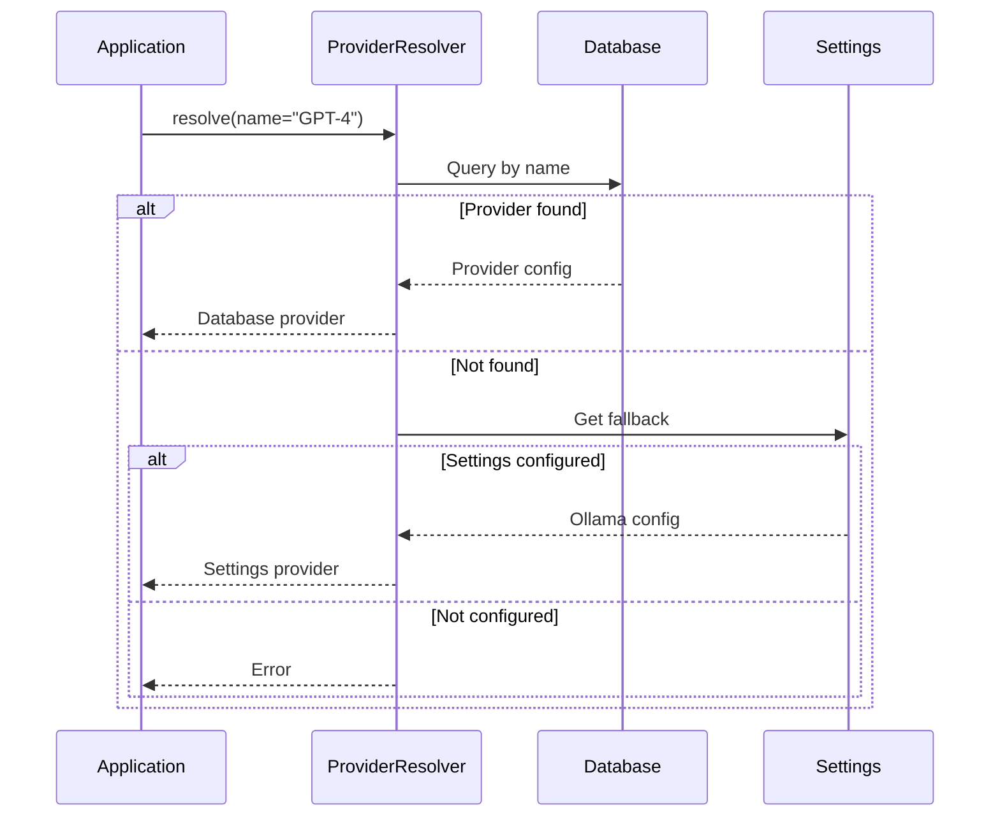

# LLM Hexagonal Architecture

**Last Updated:** October 21, 2025
**Status:** Production Ready
**Implementation Progress:** 100% (169 tests, 96% coverage)

---

## Table of Contents

1. [System Overview](#system-overview)
2. [Architecture Layers](#architecture-layers)
3. [Key Features](#key-features)
4. [Provider Configuration](#provider-configuration)
5. [Framework Independence](#framework-independence)
6. [Migration Path](#migration-path)
7. [Benefits](#benefits)

---

## System Overview

The LLM Hexagonal Architecture (also known as Ports & Adapters) provides a framework-independent approach to AI integration. This design allows Task Tracker to swap LLM frameworks without rewriting business logic.

!!! info "What is Hexagonal Architecture?"
    Hexagonal Architecture separates core business logic from external dependencies (like AI frameworks). This creates clear boundaries that make the system testable, maintainable, and adaptable to changing technology.

### Problem Statement

Traditional AI integration tightly couples your application to a specific framework:

- Direct Pydantic AI usage throughout the codebase
- Difficult to migrate to LangChain or other frameworks
- Hard to test without real LLM calls
- Framework changes require massive refactoring

### Solution

**Three-Layer Architecture:**

<div class="grid cards" markdown>

- :material-cube-outline: **Domain Layer**

    Framework-agnostic protocols and models. Zero dependencies on any LLM framework.

- :material-cog: **Infrastructure Layer**

    Framework-specific adapters (Pydantic AI, LangChain). Translates between domain and framework.

- :material-application: **Application Layer**

    Orchestration and provider resolution. Manages agent lifecycle and configuration.

</div>

---

## Architecture Layers

### Layer 1: Domain (Framework-Agnostic Core)

The domain layer defines what AI operations look like without specifying how they work.

**Key Components:**



**Domain Models:**

| Model | Purpose | Example |
|-------|---------|---------|
| `AgentConfig` | Configuration for creating agents | Model name, system prompt, temperature |
| `AgentResult` | Output from agent execution | Generated text, token usage, metadata |
| `ProviderConfig` | Provider connection settings | API URL, authentication, timeouts |
| `StreamEvent` | Real-time streaming events | Text deltas, tool calls, completion |

**Protocols (Contracts):**

| Protocol | Purpose | Key Methods |
|----------|---------|-------------|
| `LLMAgent` | Agent execution interface | `run()`, `stream()`, `supports_streaming()` |
| `LLMFramework` | Framework adapter interface | `create_agent()`, `supports_tools()` |
| `ModelFactory` | Model creation interface | `create_model()`, `validate_provider()` |

!!! tip "Why Protocols?"
    Python Protocols enable structural subtyping (duck typing with type safety). Any class that implements the required methods automatically satisfies the protocol without explicit inheritance.

### Layer 2: Infrastructure (Framework Adapters)

The infrastructure layer provides concrete implementations for specific LLM frameworks.

**Current Implementation: Pydantic AI Adapter**



**Factory System:**

=== "Ollama"
    Supports local LLM deployment with Docker-aware URL resolution.

    **Features:**
    - Local inference (no API costs)
    - Privacy-friendly (data never leaves your infrastructure)
    - Docker service discovery
    - Model validation and health checks

=== "OpenAI"
    Supports OpenAI API and compatible endpoints.

    **Features:**
    - GPT-3.5, GPT-4, and newer models
    - Streaming support
    - Function calling (tools)
    - Configurable timeouts and retries

**Agent Wrapper:**

The adapter wraps framework-specific agents to match the domain protocol:



### Layer 3: Application (Orchestration)

The application layer coordinates agent creation and manages provider resolution.

**Key Components:**

<div class="grid cards" markdown>

- :material-server: **LLMService**

    Main orchestrator for all LLM operations. Creates agents, executes prompts, manages lifecycle.

- :material-database-search: **ProviderResolver**

    Resolves providers from database or settings with fallback chain.

- :material-list-box: **FrameworkRegistry**

    Manages available frameworks and enables runtime framework selection.

</div>

**Provider Resolution Chain:**



---

## Key Features

### 1. Framework Independence

The architecture completely decouples business logic from LLM frameworks.

**Current State:**

```
Business Logic → Domain Protocol → Pydantic AI Adapter
```

**Future Migration:**

```
Business Logic → Domain Protocol → LangChain Adapter
                                 → LlamaIndex Adapter
                                 → Custom Adapter
```

!!! success "Migration Estimate"
    Switching from Pydantic AI to LangChain would take 2-3 days, compared to 2-3 weeks with traditional tight coupling.

### 2. Multi-Provider Support

Configure and switch between LLM providers without code changes.

**Supported Providers:**

| Provider | Type | Use Case |
|----------|------|----------|
| Ollama | Local | Development, privacy-sensitive data |
| OpenAI | Cloud | Production, advanced models |
| Custom | Any | Self-hosted, enterprise APIs |

### 3. Docker-Aware Configuration

Automatically uses correct URLs based on deployment environment.

=== "Docker Deployment"
    ```
    Base URL: http://ollama:11434
    ```
    Uses Docker service names for container-to-container communication.

=== "Local Development"
    ```
    Base URL: http://localhost:11434
    ```
    Uses localhost for development outside Docker.

### 4. Type Safety

Full type coverage with strict mypy compliance ensures compile-time error detection.

**Benefits:**

- Catch errors before runtime
- Better IDE autocomplete and refactoring
- Self-documenting code through type hints
- Reduced integration bugs

### 5. Testability

The architecture achieves 96% test coverage with 169 tests.

**Testing Strategy:**

| Layer | Testing Approach | Example |
|-------|------------------|---------|
| Domain | Protocol mocks | Mock `LLMAgent` for unit tests |
| Infrastructure | Integration tests | Test real Ollama/OpenAI calls |
| Application | End-to-end tests | Full workflow from request to result |

---

## Provider Configuration

### Database Configuration (Production)

Configure providers through the UI or API for production use.

**Provider Settings:**

| Field | Description | Example |
|-------|-------------|---------|
| Name | Human-readable identifier | "Production GPT-4" |
| Type | Provider type | `ollama`, `openai` |
| Base URL | API endpoint | `https://api.openai.com/v1` |
| API Key | Authentication token | Encrypted in database |
| Active | Enable/disable provider | `true` |

!!! warning "API Key Security"
    API keys are encrypted at rest using database-level encryption. Never commit keys to version control.

### Settings Fallback (Development)

When no database provider exists, the system falls back to settings configuration.

**Configuration Sources:**

1. **Database** - User-configured providers (highest priority)
2. **Settings** - Default Ollama from `settings.llm.ollama_base_url`
3. **Error** - No provider available

**Example Settings:**

```yaml
llm:
  running_in_docker: true
  ollama_base_url: http://localhost:11434
  ollama_base_url_docker: http://ollama:11434
```

### Provider Resolution Flow



---

## Framework Independence

### How It Works

The architecture uses **dependency inversion**: business logic depends on abstractions (protocols), not concrete implementations.

**Traditional Approach:**

```python
from pydantic_ai import Agent  # Direct dependency

async def classify_message(text: str):
    agent = Agent(model="gpt-4")  # Tightly coupled
    result = await agent.run(text)
    return result.data
```

**Problems:**
- Can't swap frameworks without rewriting code
- Hard to test (requires real API calls)
- Framework changes break everything

**Hexagonal Approach:**

```python
from app.llm.domain.ports import LLMAgent  # Protocol, not implementation

async def classify_message(text: str, agent: LLMAgent):
    result = await agent.run(text)  # Framework-agnostic
    return result.output
```

**Benefits:**
- `agent` can be Pydantic AI, LangChain, or mock for testing
- Business logic unchanged regardless of framework
- Test with mocks, run with real framework

### SOLID Principles

The architecture scores **A grade** in SOLID compliance:

| Principle | Implementation | Benefit |
|-----------|----------------|---------|
| **S**ingle Responsibility | Each layer has one purpose | Easy to understand and modify |
| **O**pen/Closed | Extend via new adapters | Add frameworks without changing existing code |
| **L**iskov Substitution | All adapters match protocols | Any framework works transparently |
| **I**nterface Segregation | Small, focused protocols | Implement only what you need |
| **D**ependency Inversion | Depend on abstractions | Business logic independent of frameworks |

---

## Migration Path

### Legacy Code (Before)

```python
# Direct Pydantic AI usage
from pydantic_ai import Agent

agent = Agent(
    model="openai:gpt-4",
    system_prompt="Classify this message..."
)

result = await agent.run(user_message)
classification = result.data
```

**Problems:**
- Pydantic AI imported throughout codebase
- Hard to change to LangChain
- Difficult to test

### Modern Code (After)

```python
# Use factory functions
from app.llm.factories import create_classification_agent

agent = await create_classification_agent(
    session=db_session,
    provider_name="Production GPT-4"
)

result = await agent.run(user_message)
classification = result.output
```

**Benefits:**
- No framework imports in business logic
- Provider configured in database
- Easy to swap frameworks or mock for testing

### Adding New Frameworks

To add LangChain support:

1. **Create adapter** (`app/llm/infrastructure/adapters/langchain/`)
2. **Implement protocols** (`LLMFramework`, `ModelFactory`)
3. **Register framework** (`FrameworkRegistry.register("langchain", adapter)`)
4. **Done** - No changes to business logic

**Estimated Effort:** 2-3 days for experienced developer

---

## Benefits

### For Developers

<div class="grid cards" markdown>

- :material-test-tube: **Testability**

    Mock LLM agents for fast, reliable unit tests without API calls or costs.

- :material-shield-check: **Type Safety**

    Strict mypy compliance catches errors at development time, not production.

- :material-book-open: **Clear Contracts**

    Protocols document exactly what methods each component must implement.

- :material-puzzle: **Modularity**

    Change one layer without affecting others. Swap frameworks in days, not weeks.

</div>

### For Operations

<div class="grid cards" markdown>

- :material-swap-horizontal: **Provider Flexibility**

    Switch between Ollama, OpenAI, or custom providers via configuration.

- :material-currency-usd-off: **Cost Control**

    Use local Ollama for development, OpenAI only for production.

- :material-docker: **Docker-Aware**

    Automatically uses correct URLs for containerized vs local deployment.

- :material-shield: **Security**

    Encrypted API keys, provider validation, configurable timeouts.

</div>

### For Business

<div class="grid cards" markdown>

- :material-clock-fast: **Fast Migration**

    Framework changes take 2-3 days instead of 2-3 weeks.

- :material-shield-lock: **Vendor Independence**

    Not locked into any single LLM provider or framework.

- :material-cash-multiple: **Cost Optimization**

    Easy to compare providers and optimize based on performance/cost.

- :material-star: **Quality Assurance**

    96% test coverage ensures reliability and correctness.

</div>

---

## Production Readiness

### Quality Metrics

| Metric | Value | Target |
|--------|-------|--------|
| Test Coverage | 96% | >90% |
| Tests Passing | 169/169 | 100% |
| SOLID Score | A grade | A or B |
| Type Safety | Strict mypy | 100% |
| Documentation | Complete | 100% |

### Performance Characteristics

| Operation | Typical | Notes |
|-----------|---------|-------|
| Agent Creation | <100ms | Includes provider resolution |
| LLM Call (Ollama) | 2-5s | Depends on model size |
| LLM Call (OpenAI) | 1-3s | Includes API latency |
| Provider Validation | <500ms | Health check + connectivity |

---

## Related Documentation

- **Analysis System:** See [Analysis System](analysis-system.md)
- **Provider Configuration:** See [System Diagrams](diagrams.md)
- **Architecture Overview:** See [Overview](overview.md)

---

*This architecture provides a future-proof foundation for AI integration, enabling Task Tracker to adapt to evolving LLM technology without costly rewrites.*

*[LLM]: Large Language Model
*[API]: Application Programming Interface
*[SOLID]: Single Responsibility, Open/Closed, Liskov Substitution, Interface Segregation, Dependency Inversion
*[RAG]: Retrieval-Augmented Generation
