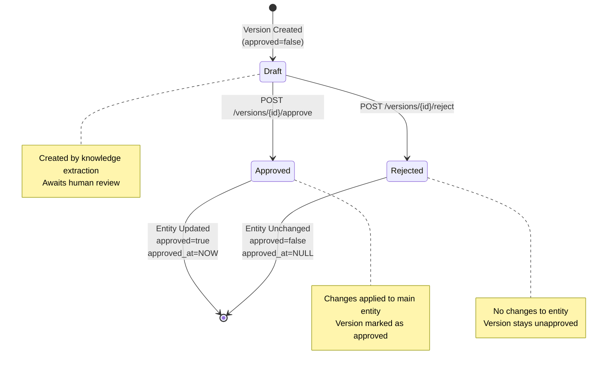

# Versioning System Architecture

**Last Updated:** October 26, 2025
**Status:** Core Implementation Complete
**Implementation Progress:** 100% (backend versioning, approval workflow, API endpoints implemented)

---

## Table of Contents

1. [System Overview](#system-overview)
2. [Approval Workflow](#approval-workflow)
3. [Version States](#version-states)
4. [API Endpoints](#api-endpoints)
5. [Services Architecture](#services-architecture)
6. [Usage Patterns](#usage-patterns)
7. [Version Comparison](#version-comparison)
8. [System Gaps](#system-gaps)

---

## System Overview

The versioning system provides audit trail and approval workflow for AI-generated updates to Topics and Atoms. When the knowledge extraction service detects changes to existing entities, it creates unapproved version snapshots that require human review before being applied.

### Purpose

**Change Control:** Prevent automatic AI updates from overwriting curated knowledge:
- Knowledge extraction runs continuously on incoming messages
- Updates to existing Topics/Atoms are captured as versions
- Human reviewers approve or reject proposed changes
- Only approved versions modify the main entities

**Audit Trail:** Complete history of all proposed and approved changes:
- Each version stores a complete snapshot of entity data
- Version creation tracked with timestamp and creator
- Approval tracked with timestamp (approved_by field pending)
- Rejection leaves version in draft state

### When Versions Are Created

**Automatic Triggers:**
1. Knowledge extraction detects update to existing Topic (name/description/icon/color)
2. Knowledge extraction detects update to existing Atom (type/content/title/confidence/meta)
3. Version created with `created_by="knowledge_extraction"` and `approved=false`

**Manual Triggers:**
- Not currently supported (no API endpoints for manual version creation)

### Version Numbering

**Sequential Integer System:**
- Versions start at 1 for each entity
- Each new version increments: `latest_version.version + 1`
- Version numbers are entity-specific (Topic #5 can have v1-v10, Atom #7 can have v1-v3)
- Gaps in sequence indicate deleted versions (not currently implemented)

---

## Approval Workflow

### State Diagram

### Workflow Steps

**Draft → Approve:**
1. Reviewer fetches version diff to compare changes
2. Reviewer approves version via API
3. System applies version data to main entity (Topic or Atom)
4. System sets `version.approved = true`
5. System sets `version.approved_at = <current timestamp>`
6. Entity changes are immediately visible to all users

**Draft → Reject:**
1. Reviewer fetches version diff to understand changes
2. Reviewer rejects version via API
3. **No changes applied to main entity**
4. Version remains in database with `approved=false`
5. Version can be re-reviewed or deleted later

---

## Version States

### State Fields

| Field | Type | Description | Draft Value | Approved Value | Rejected Value |
|-------|------|-------------|-------------|----------------|----------------|
| `approved` | Boolean | Approval status | `false` | `true` | `false` |
| `approved_at` | DateTime(TZ) | Approval timestamp | `NULL` | `<timestamp>` | `NULL` |

### Entity Update Behavior

**Approval Applies Changes:**

When a version is approved, the system updates the main entity (Topic or Atom) by applying all fields from `version.data`:

| Entity Type | Updated Fields |
|-------------|----------------|
| **Topic** | `name`, `description`, `icon`, `color` |
| **Atom** | `type`, `content`, `title`, `confidence`, `meta` |

**Rejection Preserves Entity:**

When a version is rejected:
- Main entity remains unchanged
- Version stays in database with `approved=false`
- No distinction between "rejected" and "awaiting review" (identified gap)

---

## API Endpoints

### Topic Versioning Endpoints

| Method | Endpoint | Purpose | Response |
|--------|----------|---------|----------|
| GET | `/api/v1/topics/{topic_id}/versions` | List all versions (newest first) | Array of TopicVersionResponse |
| GET | `/api/v1/topics/{topic_id}/versions/{version}/diff?compare_to={v}` | Compare two versions (shows changed fields) | VersionDiffResponse |
| POST | `/api/v1/topics/{topic_id}/versions/{version}/approve` | Approve version and apply to entity | TopicVersionResponse |
| POST | `/api/v1/topics/{topic_id}/versions/{version}/reject` | Reject version (no entity changes) | TopicVersionResponse |

### Atom Versioning Endpoints

| Method | Endpoint | Purpose | Response |
|--------|----------|---------|----------|
| GET | `/api/v1/atoms/{atom_id}/versions` | List all versions (newest first) | Array of AtomVersionResponse |
| GET | `/api/v1/atoms/{atom_id}/versions/{version}/diff?compare_to={v}` | Compare two versions (shows changed fields) | VersionDiffResponse |
| POST | `/api/v1/atoms/{atom_id}/versions/{version}/approve` | Approve version and apply to entity | AtomVersionResponse |
| POST | `/api/v1/atoms/{atom_id}/versions/{version}/reject` | Reject version (no entity changes) | AtomVersionResponse |

### Request/Response Formats

**ApproveVersionRequest / RejectVersionRequest:**
- Empty request body (placeholder for future fields like `reason`, `approved_by`)

**VersionDiffResponse:**

| Field | Type | Description |
|-------|------|-------------|
| `from_version` | Integer | Source version number |
| `to_version` | Integer | Target version number |
| `changes` | Array | List of detected changes |
| `summary` | String | Human-readable summary (e.g., "2 values changed") |

**VersionChange:**

| Field | Type | Description |
|-------|------|-------------|
| `type` | String | Change type (`values_changed`, `type_changes`, `dictionary_item_added`, `dictionary_item_removed`) |
| `path` | String | JSON path to changed field (e.g., `['description']`) |
| `old_value` | Any | Previous value |
| `new_value` | Any | New value |

---

## Services Architecture

### VersioningService

**Purpose:** Core versioning logic for create, approve, reject, diff operations

**Key Responsibilities:**

| Method | Purpose |
|--------|---------|
| `create_topic_version(db, topic_id, data, created_by)` | Create new topic version snapshot |
| `create_atom_version(db, atom_id, data, created_by)` | Create new atom version snapshot |
| `get_versions(db, entity_type, entity_id)` | Retrieve all versions for entity (newest first) |
| `get_version_diff(db, entity_type, entity_id, v1, v2)` | Generate diff between two versions using DeepDiff |
| `approve_version(db, entity_type, entity_id, version)` | Approve version and apply changes to entity |
| `reject_version(db, entity_type, entity_id, version)` | Reject version (no-op, returns unchanged version) |

**Version Creation Logic:**
1. Fetch latest version for entity (or default to v0 if none exist)
2. Increment version number: `latest_version.version + 1`
3. Create new version record with provided data snapshot
4. Set `approved=false`, `created_by=<creator>`, `created_at=NOW`
5. Commit to database

**Approval Logic:**
1. Fetch version by entity_id and version_number
2. Validate version exists and is not already approved
3. Fetch main entity (Topic or Atom)
4. Apply version data to entity using `setattr(entity, key, value)`
5. Set `version.approved = true`, `version.approved_at = NOW`
6. Commit transaction

**Diff Comparison:**
- Uses `DeepDiff` library to compare JSON snapshots
- Detects field changes, type changes, additions, removals
- Returns structured list of changes with old/new values

### KnowledgeExtractionService

**Purpose:** AI-powered entity extraction that auto-creates versions for updates

**Auto-Creation Triggers:**

| Scenario | Action |
|----------|--------|
| New Topic extracted from messages | Create Topic directly (no version) |
| Existing Topic detected with changes | Create TopicVersion with `approved=false` |
| New Atom extracted from messages | Create Atom directly (no version) |
| Existing Atom detected with changes | Create AtomVersion with `approved=false` |

**Version Data Snapshots:**

For Topics:
- `name`, `description`, `icon`, `color`

For Atoms:
- `type`, `content`, `title`, `confidence`, `meta`

**Creator Attribution:**
- All auto-generated versions have `created_by="knowledge_extraction"`
- Distinguishes AI-generated versions from future manual versions

---

## Usage Patterns

### Who Creates Versions

**Current:**
- Knowledge extraction service (automatic AI updates)

**Future Potential:**
- Manual API for user-initiated updates
- Batch import tools
- External integrations

### Who Approves Versions

**Current:**
- Any API client with access to endpoints (no role-based permissions)

**Identified Gap:**
- No authentication/authorization checks
- No `approved_by` field to track approver identity
- No audit trail for approval decisions

**Workaround:**
- Frontend implements access control
- Trust-based system for small teams
- Review logs via `approved_at` timestamp

### How Versions Are Used

**Audit Trail:**
- Complete history of all proposed changes
- Reviewable via API (list versions, compare diffs)
- Retained indefinitely (no expiration policy)

**Change Control:**
- Prevents automatic overwrites of curated knowledge
- Human-in-the-loop workflow for AI updates
- Reject capability for incorrect AI suggestions

**Not Used For:**
- Filtering queries (system does not enforce "approved only" mode)
- Source of truth (main entities are used directly, not versions)
- Rollback (no direct rollback mechanism, see workaround below)

---

## Version Comparison

### Diff Engine

**Technology:** DeepDiff library for JSON comparison

**Supported Change Types:**

| Type | Description | Example |
|------|-------------|---------|
| `values_changed` | Field value modified | `description: "Old" → "New"` |
| `type_changes` | Field type changed | `confidence: 0.8 → "high"` |
| `dictionary_item_added` | New field added | `meta: null → {"tags": [...]}` |
| `dictionary_item_removed` | Field removed | `icon: "📝" → null` |

### Diff API Usage

**Compare version 2 to version 1:**

Endpoint: `GET /topics/{id}/versions/2/diff?compare_to=1`

Response shows changes from v1 → v2

**Compare current entity to version:**

Endpoint: `GET /topics/{id}/versions/0/diff?compare_to=3`

Version 0 represents current entity state

---

## System Gaps

### Identified Limitations

| Gap | Impact | Workaround |
|-----|--------|------------|
| **No role-based permissions** | Any API client can approve/reject | Frontend access control, trust-based system |
| **No `approved_by` field** | Cannot track who approved versions | Review `approved_at` timestamp, correlate with logs |
| **No rejection tracking** | Rejected versions indistinguishable from pending | Check `approved=false` and manually track decisions |
| **No rollback mechanism** | Cannot directly revert to previous version | Manually approve older version (creates new version number) |
| **No bulk operations** | Must approve/reject versions one-by-one | Iterate via API client |
| **No expiration policy** | Unapproved versions retained indefinitely | Manual cleanup via database |
| **No notification system** | No alerts for pending versions | Poll API for unapproved versions |

### Rollback Workaround

**Problem:** No direct rollback API endpoint

**Solution:** Manually approve older version

**Process:**
1. Identify target version to revert to (e.g., v3)
2. Approve that version: `POST /topics/{id}/versions/3/approve`
3. System applies v3 data to main entity
4. Version history shows v3 as latest approved version

**Caveat:** This creates a "revert" effect but does not remove newer versions from history

---

## Summary

### Version Lifecycle

**Creation → Draft → Review → Approval/Rejection**

1. Knowledge extraction detects change to existing entity
2. System creates version with `approved=false`
3. Dashboard displays pending versions
4. Reviewer compares diff
5. Reviewer approves (applies changes) or rejects (no changes)
6. Version marked with approval status and timestamp

### Current Capabilities

✅ Automatic version creation for AI updates
✅ Approval workflow with API endpoints
✅ Diff comparison between versions
✅ Complete audit trail of changes
✅ Sequential version numbering

❌ Role-based access control
❌ Approval/rejection tracking (`approved_by`, `rejected_by`)
❌ Direct rollback mechanism
❌ Bulk operations
❌ Expiration policies

---

## See Also

- [Knowledge Extraction](./knowledge-extraction.md) - How versions are auto-created
- [Background Tasks](./background-tasks.md) - Knowledge extraction scheduling
