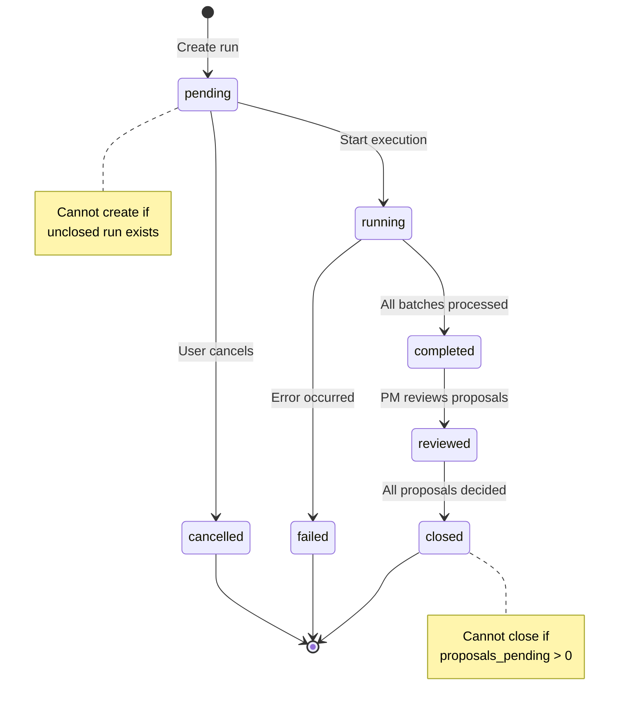
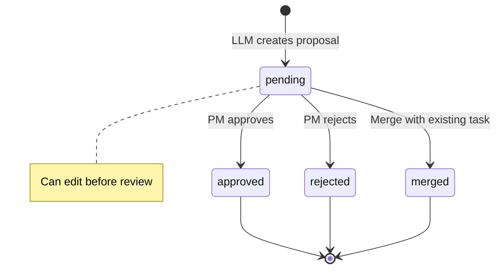

# Event Flow & Topic Sequencing

!!! info "Overview"
    This document describes the sequential flow of events through WebSocket topics and background jobs in the Task Tracker system.

---

## Architecture Overview

The system uses **event-driven architecture** with:

- **WebSocket Topics** - Real-time communication channels for frontend updates
- **TaskIQ + NATS** - Background job processing with message broker
- **PostgreSQL** - Persistent state storage with transactional guarantees

### Core Topics

| Topic | Purpose | Events |
|-------|---------|--------|
| `messages` | Telegram message updates | `message.updated`, `ingestion.*` |
| `analysis_runs` | Analysis run lifecycle | `run_started`, `progress_updated`, `proposals_created`, `run_completed`, `run_failed` |
| `proposals` | Task proposal reviews | `approved`, `rejected`, `merged` |

---

## Complete Event Flow

```mermaid
sequenceDiagram
    autonumber

    participant TG as Telegram
    participant API as FastAPI
    participant NATS as NATS Broker
    participant Worker as TaskIQ Worker
    participant DB as PostgreSQL
    participant WS as WebSocket Manager
    participant Client as Frontend Client

    %% Phase 1: Message Ingestion
    rect rgb(240, 248, 255)
        Note over TG,Client: Phase 1: Message Ingestion
        TG->>API: POST /webhook/telegram (message)
        API->>NATS: save_telegram_message.kiq()
        API-->>TG: 200 OK (instant response)

        activate Worker
        NATS->>Worker: Deliver task
        Worker->>DB: INSERT message, user, profile
        Worker->>DB: COMMIT transaction
        Worker->>WS: broadcast("messages", message.updated)
        WS-->>Client: WebSocket: message.updated
        deactivate Worker
    end

    %% Phase 2: Knowledge Extraction
    rect rgb(255, 250, 240)
        Note over TG,Client: Phase 2: Knowledge Extraction (Topics/Atoms)
        Client->>API: POST /api/knowledge/extract (from messages)
        API->>NATS: knowledge_extraction.kiq()
        API-->>Client: 202 Accepted (extraction_id)

        activate Worker
        NATS->>Worker: Deliver extraction task
        Worker->>DB: SELECT messages in time window
        Worker->>Worker: LLM Extract Topics/Atoms (Pydantic-AI)
        Worker->>DB: INSERT topic_proposals, atom_proposals (status=pending)
        Worker->>WS: broadcast("knowledge_extraction", proposals_created)
        WS-->>Client: WebSocket: proposals_created
        deactivate Worker
    end

    %% Phase 3: Approve Topics/Atoms
    rect rgb(240, 255, 200)
        Note over TG,Client: Phase 3: Human Review of TopicProposals
        Client->>API: GET /api/knowledge/proposals (review)
        Client->>API: POST /api/knowledge/proposals/{id}/approve
        API->>DB: INSERT topic/atom (from approved proposal)
        API->>WS: broadcast("topics", topic_created)
        WS-->>Client: WebSocket: topic_created
    end

    %% Phase 4: Analysis Run Creation
    rect rgb(255, 250, 240)
        Note over TG,Client: Phase 4: Analysis Run Creation
        Client->>API: POST /api/runs (create analysis run)
        API->>DB: Check for unclosed runs
        alt Unclosed run exists
            API-->>Client: 409 Conflict
        else No conflicts
            API->>DB: INSERT analysis_run (status=pending)
            API-->>Client: 201 Created (run_id)
        end
    end

    %% Phase 5: Start Analysis Run
    rect rgb(240, 255, 240)
        Note over TG,Client: Phase 5: Background Task Proposal Analysis
        Client->>API: POST /api/runs/{id}/start
        API->>NATS: execute_analysis_run.kiq(run_id)
        API-->>Client: 202 Accepted

        activate Worker
        NATS->>Worker: Deliver analysis task

        %% Step 1: Start run
        Worker->>DB: UPDATE status=running, started_at=now()
        Worker->>WS: broadcast("analysis_runs", run_started)
        WS-->>Client: WebSocket: run_started

        %% Step 2: Fetch approved topics/atoms
        Worker->>DB: SELECT topics, atoms WHERE approved=true
        DB-->>Worker: topics[], atoms[]

        %% Step 3: Prepare knowledge context
        Note over Worker: Prepare accumulated knowledge from topics/atoms

        %% Step 4: Create batches
        Note over Worker: Group into 10min windows, max 50 items

        %% Step 5: Process each batch
        loop For each batch
            Worker->>Worker: LLM Analyze Knowledge (Pydantic-AI)
            Worker->>DB: INSERT task_proposals (batch)
            Worker->>DB: UPDATE run progress
            Worker->>WS: broadcast("analysis_runs", proposals_created)
            WS-->>Client: WebSocket: proposals_created
            Worker->>WS: broadcast("analysis_runs", progress_updated)
            WS-->>Client: WebSocket: progress_updated
        end

        %% Step 6: Complete run
        Worker->>DB: UPDATE status=completed, proposals_total=X
        Worker->>WS: broadcast("analysis_runs", run_completed)
        WS-->>Client: WebSocket: run_completed
        deactivate Worker
    end

    %% Phase 6: Proposal Review
    rect rgb(255, 240, 255)
        Note over TG,Client: Phase 6: PM Review TaskProposals

        %% Approve proposal
        Client->>API: PUT /api/proposals/{id}/approve
        API->>DB: UPDATE proposal status=approved
        API->>DB: DECREMENT run.proposals_pending
        API->>DB: INCREMENT run.proposals_approved
        API->>DB: COMMIT transaction
        API->>WS: broadcast("proposals", approved)
        WS-->>Client: WebSocket: approved
        API-->>Client: 200 OK

        Note over Client: Repeat for reject/merge actions
    end

    %% Phase 7: Close Analysis Run
    rect rgb(255, 255, 240)
        Note over TG,Client: Phase 7: Close Analysis Run
        Client->>API: PUT /api/runs/{id}/close
        API->>DB: SELECT run WHERE proposals_pending > 0
        alt Pending proposals exist
            API-->>Client: 400 Bad Request
        else All proposals reviewed
            API->>DB: UPDATE status=closed, accuracy_metrics={...}
            API->>WS: broadcast("analysis_runs", run_closed)
            WS-->>Client: WebSocket: run_closed
            API-->>Client: 200 OK
        end
    end
```



---

## Event Ordering Guarantees

### ✅ Strong Guarantees

1. **Database Transactions**
   - All state changes within a single request are atomic
   - WebSocket broadcasts happen AFTER successful DB commit
   - If broadcast fails, it's logged but doesn't rollback transaction

2. **Analysis Run Lifecycle**
   - Cannot create new run if unclosed run exists (409 Conflict)
   - Cannot close run with pending proposals (400 Bad Request)
   - Status transitions enforced: `pending → running → completed → reviewed → closed → failed → cancelled`
   - Only terminal states: `closed`, `failed`, `cancelled`

3. **Proposal Review**
   - Each approve/reject atomically updates proposal AND run counters
   - Race conditions prevented by database constraints and transactions

### ⚠️ Eventual Consistency

1. **WebSocket Delivery**
   - Best-effort delivery (not guaranteed if client disconnected)
   - Clients should poll API on reconnect to catch up

2. **Cross-Topic Events**
   - Events on different topics may arrive out-of-order
   - Frontend should handle reordering using timestamps

---

## State Machines

### Analysis Run States



### Proposal States



---

## Performance Considerations

### Batching Strategy

**Current Settings:**
- Time window: 10 minutes
- Max messages per batch: 50
- Parallel batch processing: No (sequential)

**Why Sequential?**
- Prevents LLM rate limiting
- Maintains context continuity
- Easier error recovery

### WebSocket Optimization

1. **Topic Isolation** - Clients subscribe only to needed topics
2. **Connection Pooling** - Reuse connections across requests
3. **Selective Broadcasting** - Only send to subscribed clients

---

## Future Improvements

### 1. Space-Context Topics

**Current:** Flat topic structure (`messages`, `analysis_runs`, `proposals`)

**Proposed:** Hierarchical topics with project scope

```
space:{project_id}:messages
space:{project_id}:analysis_runs
space:{project_id}:proposals
```

**Benefits:**
- Isolate events per project
- Reduce bandwidth (clients subscribe to their projects only)
- Enable multi-tenancy

### 2. Event Sourcing

Store all events in append-only log for:
- Audit trail
- Time-travel debugging
- Event replay for analytics

### 3. Dead Letter Queue

Handle failed background tasks:
- Retry with exponential backoff
- Manual review of failed jobs
- Alerting on repeated failures

---

!!! question "Questions?"
    If you have questions about event flow, check the architecture docs or reach out to the team.