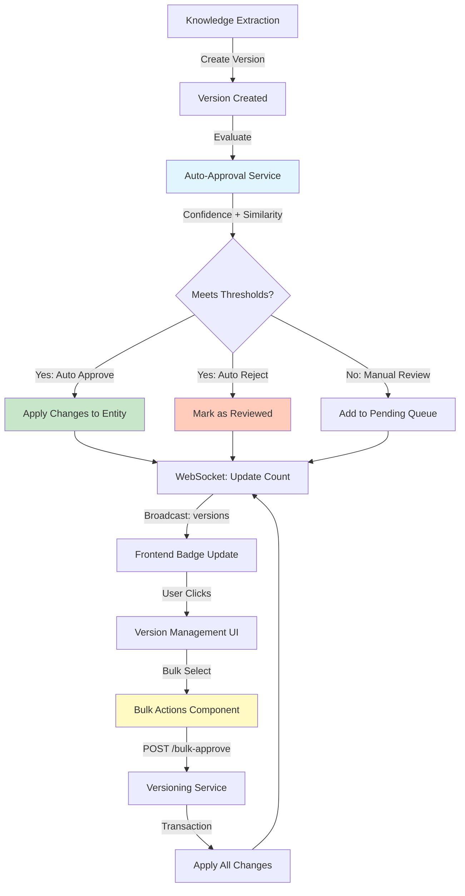
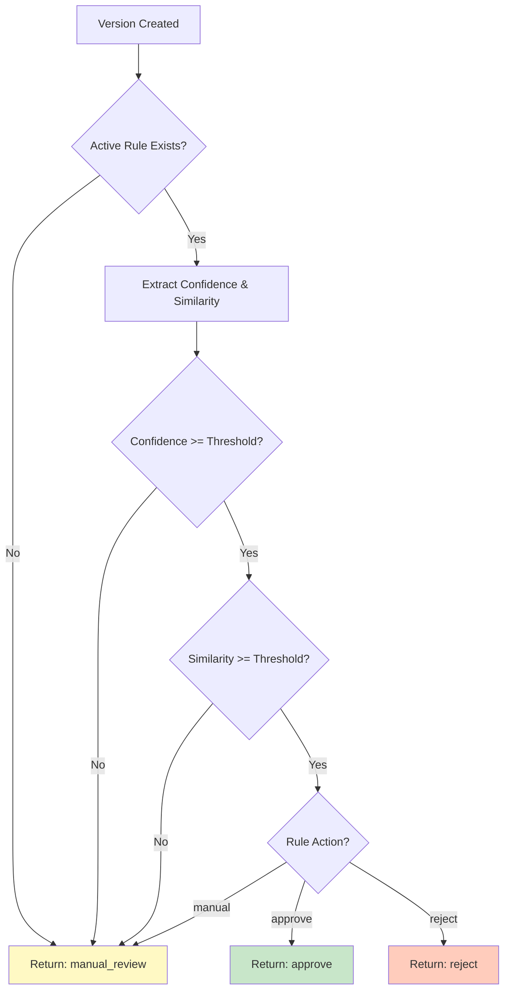

# Automation-First Version Management

**Last Updated:** October 26, 2025
**Status:** Production Ready
**Implementation:** Backend + Frontend + WebSocket Integration

---

## Overview

The Automation-First Version Management feature extends the core [versioning system](../architecture/versioning-system.md) with intelligent automation capabilities designed to reduce manual review overhead while maintaining quality control. Instead of requiring human review for every AI-generated version, the system automatically evaluates and processes versions based on configurable quality thresholds.

This feature addresses a critical bottleneck in knowledge management workflows: as the system processes thousands of messages daily, manual review of every proposed change becomes impractical. By combining confidence scoring, similarity analysis, and rule-based automation, the system enables teams to focus human attention on edge cases while high-confidence changes flow through automatically.

**Key Capabilities:**

- **Automatic Quality Evaluation**: Every version is scored on confidence (LLM certainty) and similarity (vector distance to existing content) at creation time
- **Rule-Based Automation**: Configurable thresholds trigger automatic approval/rejection without human intervention
- **Bulk Operations**: Process dozens of pending versions in a single transaction with comprehensive error handling
- **Real-Time Notifications**: WebSocket-based badge system alerts users to pending versions requiring manual review
- **Transparent Workflow**: All automated decisions are logged with full audit trail and can be overridden manually

---

## Problem Statement

### Manual Review Bottleneck

**Before Automation:**

The knowledge extraction system generates 50-200 version proposals daily from Telegram message analysis. Each proposal requires:

1. Human opens dashboard
2. Reviews version diff (name, description, metadata changes)
3. Evaluates accuracy against message context
4. Clicks approve or reject
5. Repeats for next version

**Cost:** 30-60 seconds per version × 100 versions/day = **50-100 minutes of manual work daily**

### Automation Challenges

**Not all versions are equal:**

- High-confidence exact matches (95%+ similarity) are nearly always correct
- Low-confidence proposals (60% similarity) require careful review
- Middle-range versions need case-by-case judgment

**Solution:** Configure automation rules to handle the obvious cases, route edge cases to humans.

---

## Architecture

### System Components



### Backend Components

| Component | Location | Responsibility |
|-----------|----------|----------------|
| **ApprovalRule Model** | `app/models/approval_rule.py` | Stores threshold configuration (confidence, similarity, action) |
| **AutoApprovalService** | `app/services/auto_approval_service.py` | Evaluates versions against active rule |
| **VersioningService** | `app/services/versioning_service.py` | Handles bulk approve/reject with transaction safety |
| **Versions API** | `app/api/v1/versions.py` | Exposes bulk operation endpoints |
| **WebSocket Manager** | `app/services/websocket_manager.py` | Broadcasts pending count updates |

### Frontend Components

| Component | Location | Purpose |
|-----------|----------|---------|
| **BulkVersionActions** | `features/knowledge/components/` | Bulk selection UI with confirmation dialog |
| **AutoApprovalSettingsPage** | `pages/AutoApprovalSettingsPage/` | Rule configuration interface with preview |
| **PendingVersionsBadge** | `features/knowledge/components/` | Real-time notification badge with WebSocket sync |

### Data Flow

**Version Creation → Auto-Evaluation → Approval/Manual**

1. **Knowledge Extraction** creates version with confidence/similarity scores in `version.data`
2. **Auto-Approval Service** fetches active rule and evaluates thresholds
3. **Decision Logic**:
   - If `confidence >= threshold AND similarity >= threshold`: Execute configured action (approve/reject/manual)
   - If thresholds not met: Default to manual review
4. **Version State Update**: Set `approved=true` (auto-approved) or `approved=false` (pending)
5. **WebSocket Broadcast**: Send `pending_count_updated` event with new count
6. **Frontend Badge Update**: Display pending count for manual review queue

**Bulk Operations → Transaction → WebSocket → UI Update**

1. User selects 5-50 versions in dashboard
2. Frontend sends `POST /bulk-approve` with version IDs
3. Backend processes in single transaction:
   - Fetch all versions (validates existence)
   - Apply changes to entities (skips already-approved)
   - Mark versions as approved
   - Commit transaction (all-or-nothing)
4. Broadcast updated pending count via WebSocket
5. Frontend refetches version list and updates badge

---

## API Reference

### Bulk Operations Endpoints

#### `POST /api/v1/versions/bulk-approve`

Approve multiple versions in a single transaction-safe operation.

**Request Schema (BulkVersionRequest):**

```typescript
{
  version_ids: number[];      // Array of version IDs (min 1, max unlimited)
  entity_type: "topic" | "atom";  // Entity type for all versions
  reason?: string;            // Optional reason (not currently used)
}
```

**Response Schema (BulkVersionResponse):**

```typescript
{
  success_count: number;      // Number of successfully approved versions
  failed_ids: number[];       // IDs that failed to process
  errors: Record<number, string>;  // Error messages keyed by version ID
}
```

**Example Request:**

```bash
curl -X POST http://localhost/api/v1/versions/bulk-approve \
  -H "Content-Type: application/json" \
  -d '{
    "version_ids": [12, 15, 18, 22, 25],
    "entity_type": "topic"
  }'
```

**Example Response:**

```json
{
  "success_count": 4,
  "failed_ids": [18],
  "errors": {
    "18": "Version already approved"
  }
}
```

**Error Scenarios:**

| Error | Condition | Handling |
|-------|-----------|----------|
| `Version not found` | ID doesn't exist in database | Added to `failed_ids`, other versions proceed |
| `Version already approved` | Version previously approved | Added to `failed_ids`, other versions proceed |
| `Entity not found` | Parent Topic/Atom deleted | Added to `failed_ids`, other versions proceed |

**Transaction Safety:**

- All successful approvals committed in single transaction
- Failed versions do not rollback successful ones
- Partial success returns accurate counts

---

#### `POST /api/v1/versions/bulk-reject`

Reject multiple versions (mark as reviewed but not applied).

**Request Schema:** Same as bulk-approve (BulkVersionRequest)

**Response Schema:** Same as bulk-approve (BulkVersionResponse)

**Behavior Differences:**

- No changes applied to main entities (Topics/Atoms remain unchanged)
- Versions stay in database with `approved=false`
- Success count reflects versions successfully marked as reviewed

---

### Auto-Approval Rules Endpoint

#### `GET /api/v1/approval-rules`

Fetch active approval rule configuration.

**Response Schema (ApprovalRulePublic):**

```typescript
{
  id: number;
  confidence_threshold: number;   // 0-100 (percentage)
  similarity_threshold: number;   // 0-100 (percentage)
  auto_action: "approve" | "reject" | "manual";
  is_active: boolean;
  created_at: string;             // ISO 8601 timestamp
  updated_at: string;             // ISO 8601 timestamp
}
```

**Example Response:**

```json
{
  "id": 1,
  "confidence_threshold": 80,
  "similarity_threshold": 70,
  "auto_action": "approve",
  "is_active": true,
  "created_at": "2025-10-20T10:30:00Z",
  "updated_at": "2025-10-25T14:22:00Z"
}
```

---

#### `PUT /api/v1/approval-rules/{rule_id}`

Update approval rule configuration.

**Request Schema (ApprovalRuleUpdate):**

```typescript
{
  confidence_threshold?: number;   // 0-100 (optional)
  similarity_threshold?: number;   // 0-100 (optional)
  auto_action?: "approve" | "reject" | "manual";
  is_active?: boolean;
}
```

**Response Schema:** Same as GET endpoint (ApprovalRulePublic)

**Validation Rules:**

- `confidence_threshold >= similarity_threshold` (enforced by frontend, recommended for backend)
- Only one active rule allowed system-wide (future: per-project rules)

---

### WebSocket Events

#### Topic: `versions`

Subscribe by connecting to WebSocket with topic parameter:

```typescript
const ws = new WebSocket('ws://localhost/ws?topics=versions');
```

#### Event: `pending_count_updated`

Broadcast when pending version count changes (after approve/reject/create operations).

**Payload Schema:**

```typescript
{
  event: "pending_count_updated";
  count: number;                  // Total pending versions (topics + atoms)
  topics?: number;                // Pending topic versions (optional)
  atoms?: number;                 // Pending atom versions (optional)
  last_updated: string;           // ISO 8601 timestamp
}
```

**Example Payload:**

```json
{
  "event": "pending_count_updated",
  "count": 23,
  "topics": 15,
  "atoms": 8,
  "last_updated": "2025-10-26T08:45:12Z"
}
```

**Triggers:**

- Version created by knowledge extraction
- Single version approved/rejected via API
- Bulk approve/reject operation completed

---

## User Guide

### Configuring Auto-Approval Rules

**1. Navigate to Settings**

Open the Auto-Approval Settings page from the dashboard navigation (Settings → Auto-Approval).


**2. Enable Automation**

Toggle the "Enable Auto-Approval" switch to activate the rule engine.

**3. Configure Thresholds**

- **Confidence Threshold (0-100%)**: Minimum LLM confidence score required for auto-action
  - Example: 80% = Only auto-process versions where LLM is 80%+ confident in changes
- **Similarity Threshold (0-100%)**: Minimum vector similarity to existing content
  - Example: 70% = Only auto-process versions with 70%+ similarity to current entity

**Best Practice:** Start with conservative thresholds (confidence: 85%, similarity: 75%) and lower gradually after reviewing results.

**4. Select Action**

Choose what happens when thresholds are met:

- **Approve**: Automatically apply changes to main entity (recommended for high-quality data)
- **Reject**: Automatically discard low-quality proposals (use with caution)
- **Manual**: Send to human review queue (default fallback)

**5. Preview Impact**

Click "Preview" to see how many pending versions would be affected by current settings without applying changes.

**6. Save Configuration**

Click "Save Settings" to activate the rule. New versions will be evaluated immediately upon creation.

---

### Using Bulk Actions

**1. Navigate to Versions Page**

Open the pending versions queue from the dashboard notification badge or navigation menu.


**2. Select Versions**

Use checkboxes to select multiple versions for bulk processing. A sticky action bar appears when 1+ versions are selected.


**3. Preview Changes**

Click individual version cards to review diffs before bulk processing (recommended for first-time use).

**4. Execute Bulk Action**

- **Approve Selected**: Apply all selected versions to their entities
- **Reject Selected**: Discard all selected versions (no entity changes)

**5. Confirm Action**

A confirmation dialog displays:
- Total selected count
- First 10 version IDs (with overflow indicator)
- Action summary

Click "Confirm" to execute.

**6. Review Results**

Toast notifications display:
- Success count (e.g., "Successfully approved 12 versions")
- Failed count (e.g., "Failed to process 2 versions")

Failed versions remain selected for retry or individual review.

---

### Understanding the Notification Badge

**Real-Time Count Display**

The pending versions badge appears in the dashboard navigation with a red indicator showing total pending review count.

**Badge States:**

| State | Display | Meaning |
|-------|---------|---------|
| **Hidden** | No badge | Zero pending versions (all auto-processed or manually reviewed) |
| **Visible** | Red badge with number | Pending versions require manual review |
| **Animated** | Fade-in animation | New versions just added to queue |

**Interaction:**

- **Click Badge**: Navigate to `/versions?status=pending` (filtered pending view)
- **Hover Badge**: Tooltip shows breakdown (e.g., "12 topics, 8 atoms")

**WebSocket Sync:**

Badge updates in real-time via WebSocket without page refresh:
- Another user approves versions → badge count decreases
- Knowledge extraction creates versions → badge count increases
- Auto-approval processes versions → badge updates reflect automation results

---

## Configuration

### ApprovalRule Settings

**Database Model:** `approval_rules` table

| Field | Type | Range | Description |
|-------|------|-------|-------------|
| `confidence_threshold` | Float | 0-100 | Minimum LLM confidence score (%) |
| `similarity_threshold` | Float | 0-100 | Minimum vector similarity score (%) |
| `auto_action` | Enum | approve/reject/manual | Action to take when thresholds met |
| `is_active` | Boolean | true/false | Whether rule is currently applied |

**Recommended Configurations:**

| Use Case | Confidence | Similarity | Action | Rationale |
|----------|------------|------------|--------|-----------|
| **Conservative** | 90% | 85% | approve | High-quality data, low false positives |
| **Balanced** | 80% | 70% | approve | Moderate automation, reasonable accuracy |
| **Aggressive** | 70% | 60% | approve | Maximum automation, higher error risk |
| **Quality Filter** | 50% | 40% | reject | Auto-reject low-quality proposals |

**Multi-Rule Strategy (Future):**

Current system supports one active rule. Future enhancement: tiered rules (e.g., approve 90%+, reject 40%-, manual 40-90%).

---

### Default Behavior (No Active Rule)

When `is_active=false` or no rule exists:

- All versions default to `approved=false` (manual review required)
- Auto-approval service returns `"manual_review"` for all evaluations
- Badge shows all created versions as pending
- Bulk operations remain available

**Transition Strategy:**

1. Deploy system without active rule (test bulk operations)
2. Monitor manual review workload (identify threshold candidates)
3. Activate conservative rule (monitor false positive rate)
4. Adjust thresholds based on accuracy metrics

---

## Technical Details

### Transaction Safety in Bulk Operations

**Problem:** Bulk approving 50 versions must handle partial failures gracefully without corrupting database state.

**Solution:** Per-version try-catch within single transaction

**Implementation Pattern:**

```python
async def _bulk_approve_topic_versions(
    db: AsyncSession, version_ids: list[int]
) -> tuple[int, list[int], dict[int, str]]:
    success_count = 0
    failed_ids = []
    errors = {}

    # Fetch all versions in single query (optimization)
    versions = await db.execute(
        select(TopicVersion).where(TopicVersion.id.in_(version_ids))
    )
    version_map = {v.id: v for v in versions.scalars().all()}

    # Process each version with error isolation
    for version_id in version_ids:
        version = version_map.get(version_id)

        if not version:
            failed_ids.append(version_id)
            errors[version_id] = "Version not found"
            continue

        if version.approved:
            failed_ids.append(version_id)
            errors[version_id] = "Already approved"
            continue

        try:
            # Apply changes to main entity
            entity = await db.get(Topic, version.topic_id)
            if entity:
                for key, value in version.data.items():
                    setattr(entity, key, value)

            # Mark version as approved
            version.approved = True
            version.approved_at = datetime.now(UTC)
            success_count += 1

        except Exception as e:
            failed_ids.append(version_id)
            errors[version_id] = str(e)

    # Single commit for all successful operations
    await db.commit()

    return success_count, failed_ids, errors
```

**Key Properties:**

- **Atomicity**: All successful approvals committed together (prevents partial state)
- **Error Isolation**: One failed version doesn't block others
- **Detailed Feedback**: Client receives per-version error messages
- **Idempotency**: Re-running with same IDs safely skips already-approved versions

---

### Auto-Approval Decision Logic

**Service:** `AutoApprovalService.evaluate_version()`

**Decision Tree:**



**Implementation:**

```python
async def evaluate_version(
    self,
    session: AsyncSession,
    version_data: dict,
) -> Literal["approve", "reject", "manual_review"]:
    # Fetch active rule (cached for performance)
    active_rule = await self._get_active_rule(session)
    if not active_rule:
        return "manual_review"

    # Extract scores from version data
    confidence = version_data.get("confidence", 0.0)
    similarity = version_data.get("similarity", 0.0)

    # Evaluate thresholds (AND logic)
    if (
        confidence >= active_rule.confidence_threshold
        and similarity >= active_rule.similarity_threshold
    ):
        # Both thresholds met: execute configured action
        if active_rule.auto_action == AutoAction.approve:
            return "approve"
        elif active_rule.auto_action == AutoAction.reject:
            return "reject"

    # Default to manual review
    return "manual_review"
```

**Threshold Logic:**

- **AND Condition**: Both confidence AND similarity must meet thresholds (prevents low-quality approvals)
- **Conservative Default**: If either threshold fails, route to manual review (prefer false negatives over false positives)
- **No Partial Scores**: Partial matches (e.g., high confidence but low similarity) always go to manual review

**Integration Point:**

Knowledge extraction service calls `auto_approval_service.evaluate_version()` during version creation:

```python
# After creating version
decision = await auto_approval_service.evaluate_version(db, version_data)

if decision == "approve":
    await versioning_service.approve_version(db, "topic", topic_id, version.version)
elif decision == "reject":
    await versioning_service.reject_version(db, "topic", topic_id, version.version)
# else: manual_review (no action, version stays pending)
```

---

### WebSocket Event Broadcasting

**Service:** `VersioningService._broadcast_pending_count_update()`

**Trigger Points:**

1. After single version approval: `approve_version()`
2. After single version rejection: `reject_version()`
3. After bulk approve: `bulk_approve_versions()`
4. After bulk reject: `bulk_reject_versions()`
5. After version creation with auto-approval evaluation

**Implementation:**

```python
async def _broadcast_pending_count_update(self, db: AsyncSession) -> None:
    # Query current pending count (topics + atoms)
    pending_count = await self.get_pending_versions_count(db)

    # Broadcast to all clients subscribed to "versions" topic
    await websocket_manager.broadcast(
        "versions",
        {
            "event": "pending_count_updated",
            "count": pending_count,
            "last_updated": datetime.now(UTC).isoformat(),
        },
    )
```

**Frontend Handler:**

```typescript
useWebSocket({
  topics: ['versions'],
  onMessage: (data: WebSocketMessage) => {
    if (data.event === 'pending_count_updated') {
      setPendingCount({
        count: data.count ?? 0,
        topics: data.topics ?? 0,
        atoms: data.atoms ?? 0,
      });

      // Trigger badge animation for new versions
      if (data.count > previousCount) {
        setIsVisible(true);
      }
    }
  },
});
```

**Performance Considerations:**

- **Count Query Overhead**: Each broadcast queries database for pending count (acceptable for low-frequency events)
- **Broadcast Scope**: All connected clients receive update (efficient for small teams, consider filtering for large deployments)
- **Event Deduplication**: Multiple rapid changes trigger multiple broadcasts (acceptable, badge updates are idempotent)

---

## Screenshots to Capture

### Required Screenshots

1. **`auto-approval-settings.png`**
   - Auto-Approval Settings page showing threshold sliders and action selector
   - Highlight: Confidence threshold at 80%, Similarity at 70%, Action set to "Approve"
   - Show preview button and "affected versions" badge

2. **`pending-versions-badge.png`**
   - Dashboard navigation with red notification badge displaying "23"
   - Highlight: Badge position in sidebar/header
   - Show hover tooltip with breakdown: "15 topics, 8 atoms"

3. **`bulk-version-selection.png`**
   - Versions page with 5-10 versions selected via checkboxes
   - Highlight: Sticky action bar at top with "Approve Selected" and "Reject Selected" buttons
   - Show selected count: "Selected: 8 versions"

4. **`bulk-confirmation-dialog.png`**
   - Confirmation dialog before bulk approve
   - Highlight: Version list preview (first 10 IDs)
   - Show "Confirm" and "Cancel" buttons

5. **`version-diff-viewer.png`** (context reference)
   - Single version diff showing old/new values for fields
   - Highlight: Name change, description change, confidence score

### Screenshot Placeholders

All screenshots referenced in this document use placeholder paths. Capture screenshots and save to:

```
docs/content/en/features/screenshots/
├── auto-approval-settings.png
├── pending-versions-badge.png
├── bulk-version-selection.png
├── bulk-confirmation-dialog.png
└── version-diff-viewer.png
```

---

## See Also

- [Versioning System Architecture](../architecture/versioning-system.md) - Core versioning concepts and approval workflow
- [Knowledge Extraction](../architecture/knowledge-extraction.md) - How versions are auto-created from messages
- [WebSocket Architecture](../architecture/websocket.md) - Real-time communication patterns (future doc)
- [API Reference](/api/knowledge.md) - Full API endpoint documentation
