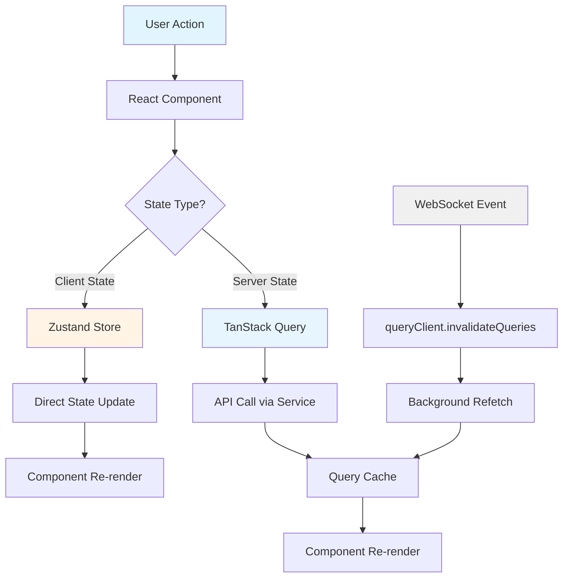
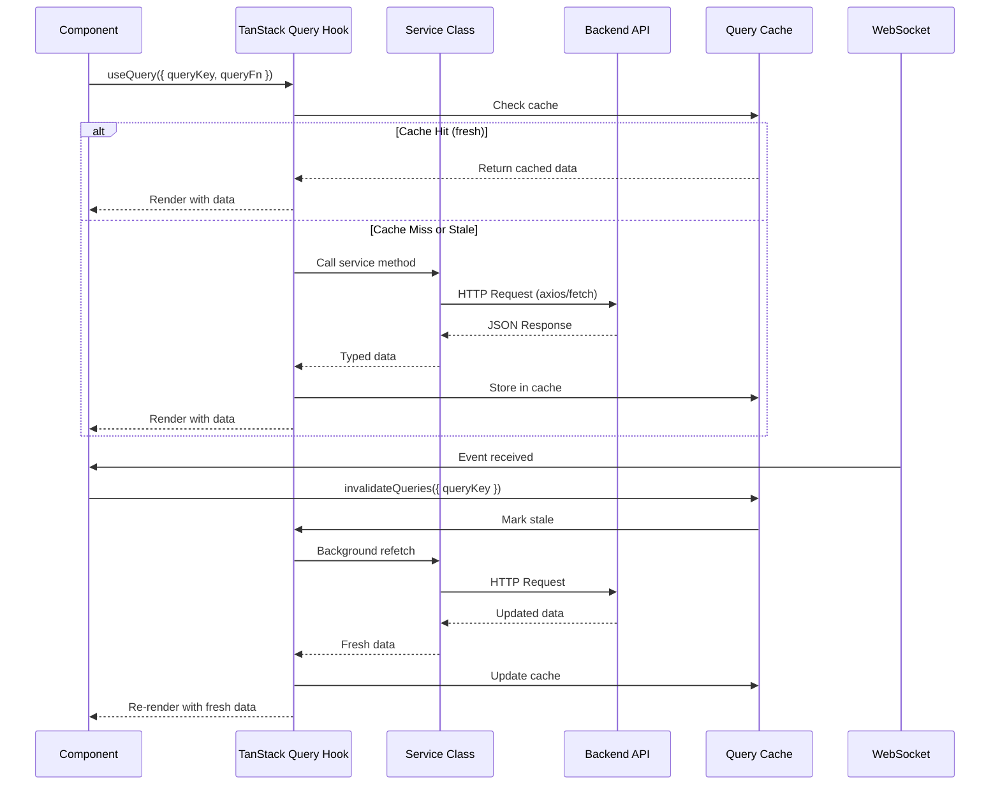
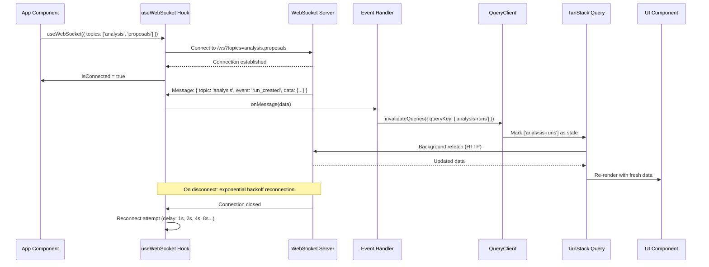

# Frontend Architecture

Modern React 18 application with TypeScript, featuring real-time WebSocket updates, comprehensive state management, and a feature-based architecture pattern.

---

## Overview

Task Tracker frontend is a production-grade TypeScript application built for real-time task management and AI-powered analysis. The architecture prioritizes type safety, developer experience, and scalability through domain-driven feature organization.

### Architecture Decisions

| Decision | Choice | Rationale |
|----------|--------|-----------|
| **Build Tool** | Vite 7.1.9 | Fast HMR, native ESM, optimized production builds |
| **Architecture** | Feature-based (domain-driven) | Better scalability than FSD for complex domains |
| **Type System** | TypeScript 5.9.3 (strict mode) | Compile-time safety, better IDE support |
| **State Management** | Zustand + TanStack Query | Clear separation: client state vs server state |
| **Real-time** | Native WebSocket | Lower overhead than Socket.IO, full protocol control |
| **Component Library** | Radix UI + shadcn/ui | Accessible primitives, full styling control |
| **Styling** | Tailwind CSS 3.4.17 | Utility-first, minimal CSS bundle size |
| **Routing** | React Router 7.9.3 | Industry standard, lazy loading support |

---

## Technology Stack

### Core Framework

| Package | Version | Purpose | Alternatives Considered |
|---------|---------|---------|------------------------|
| **react** | 18.3.1 | UI library with concurrent rendering | Vue 3 (less TypeScript-friendly), Svelte (smaller ecosystem) |
| **react-dom** | 18.3.1 | React DOM renderer | - |
| **typescript** | 5.9.3 | Type system with strict mode | Flow (deprecated), JSDoc (weaker guarantees) |
| **vite** | 7.1.9 | Build tool and dev server | Webpack (slower), Parcel (less mature) |

### State Management

| Package | Version | Purpose | Alternatives Considered |
|---------|---------|---------|------------------------|
| **zustand** | 5.0.8 | Client state (UI, local data) | Redux (boilerplate), Jotai (less mature), Context API (performance issues) |
| **@tanstack/react-query** | 5.90.2 | Server state (caching, sync) | SWR (fewer features), RTK Query (Redux dependency), Apollo (GraphQL-only) |

**Zustand** chosen for minimal boilerplate, TypeScript support, and no Provider wrapping. **TanStack Query** handles server state caching, invalidation, and background refetching with zero configuration.

### Routing & Data Fetching

| Package | Version | Purpose | Alternatives Considered |
|---------|---------|---------|------------------------|
| **react-router-dom** | 7.9.3 | Client-side routing | TanStack Router (too new), Reach Router (deprecated) |
| **axios** | 1.12.2 | HTTP client | Fetch API (used in some services), ky (smaller but less mature) |

**Note**: Mixed pattern - some services use axios, others use native Fetch API. Axios preferred for interceptors and TypeScript types.

### UI Component System

#### Radix UI Primitives (16 packages)

| Package | Version | Purpose |
|---------|---------|---------|
| **@radix-ui/react-dialog** | 1.1.15 | Modal dialogs |
| **@radix-ui/react-dropdown-menu** | 2.1.16 | Dropdown menus |
| **@radix-ui/react-select** | 2.2.6 | Select dropdowns |
| **@radix-ui/react-tabs** | 1.1.13 | Tab containers |
| **@radix-ui/react-tooltip** | 1.2.8 | Tooltips |
| **@radix-ui/react-checkbox** | 1.3.3 | Checkboxes |
| **@radix-ui/react-switch** | 1.2.6 | Toggle switches |
| **@radix-ui/react-slider** | 1.3.6 | Range sliders |
| **@radix-ui/react-popover** | 1.1.15 | Popovers |
| **@radix-ui/react-avatar** | 1.1.10 | Avatar components |
| **@radix-ui/react-label** | 2.1.7 | Form labels |
| **@radix-ui/react-separator** | 1.1.7 | Visual separators |
| **@radix-ui/react-radio-group** | 1.3.8 | Radio button groups |
| **@radix-ui/react-alert-dialog** | 1.1.15 | Alert dialogs |
| **@radix-ui/react-slot** | 1.2.3 | Component composition utility |
| **@radix-ui/react-icons** | 1.3.2 | Icon set |

**Rationale**: Radix UI provides unstyled, accessible primitives with full keyboard navigation, ARIA attributes, and focus management. Wrapped with shadcn/ui for Tailwind-based styling.

### Styling & Design System

| Package | Version | Purpose |
|---------|---------|---------|
| **tailwindcss** | 3.4.17 | Utility-first CSS framework |
| **@tailwindcss/typography** | 0.5.19 | Typography plugin for content |
| **@tailwindcss/aspect-ratio** | 0.4.2 | Aspect ratio utilities |
| **postcss** | 8.5.6 | CSS processor |
| **autoprefixer** | 10.4.21 | CSS vendor prefixing |
| **class-variance-authority** | 0.7.1 | Component variant utilities |
| **clsx** | 2.1.1 | Conditional className helper |
| **tailwind-merge** | 3.3.1 | Merge Tailwind classes intelligently |

### Forms & Validation

| Package | Version | Purpose |
|---------|---------|---------|
| **react-hook-form** | 7.63.0 | Form state management |
| **@hookform/resolvers** | 5.2.2 | Validation schema adapters |
| **zod** | 3.25.76 | TypeScript-first schema validation |

**Pattern**: Zod schemas define validation + TypeScript types simultaneously, reducing duplication.

### Data Visualization

| Package | Version | Purpose |
|---------|---------|---------|
| **recharts** | 2.15.4 | Declarative chart library |
| **@tanstack/react-table** | 8.21.3 | Headless table utilities |

### Additional UI Libraries

| Package | Version | Purpose |
|---------|---------|---------|
| **@heroicons/react** | 2.2.0 | Heroicons icon set |
| **react-colorful** | 5.6.1 | Color picker component |
| **react-diff-viewer-continued** | 3.4.0 | Side-by-side diff viewer |
| **react-hot-toast** | 2.6.0 | Toast notifications (primary) |
| **sonner** | 2.0.7 | Alternative toast library |
| **cmdk** | 1.1.1 | Command palette (⌘K) |
| **next-themes** | 0.4.6 | Theme switching (light/dark) |

### Utilities

| Package | Version | Purpose |
|---------|---------|---------|
| **date-fns** | 4.1.0 | Date formatting and manipulation |
| **web-vitals** | 4.2.0 | Performance metrics collection |

### Testing (DevDependencies)

| Package | Version | Purpose |
|---------|---------|---------|
| **@testing-library/react** | 14.3.1 | React component testing |
| **@testing-library/jest-dom** | 6.9.1 | Jest DOM matchers |
| **@testing-library/user-event** | 14.6.1 | User interaction simulation |
| **@types/jest** | 30.0.0 | Jest TypeScript types |

### Build Tools (DevDependencies)

| Package | Version | Purpose |
|---------|---------|---------|
| **@vitejs/plugin-react** | 5.0.4 | Vite React plugin with Fast Refresh |
| **shadcn** | 3.3.1 | CLI for adding shadcn/ui components |

---

## Architecture Pattern

### Feature-Based Structure

Unlike Feature-Sliced Design (FSD), the architecture uses **domain-driven feature modules** for better encapsulation of complex business logic.

**Directory Structure**:

```
frontend/src/
├── app/                           # Application core
│   ├── App.tsx                    # Root component
│   ├── routes.tsx                 # Route configuration
│   └── providers.tsx              # Global providers (Query, Theme)
├── features/                      # 14 feature modules
│   ├── agents/                    # AI agent configuration
│   │   ├── api/
│   │   │   ├── agentService.ts    # API service class
│   │   │   ├── taskService.ts     # Task API service
│   │   │   └── index.ts           # Exports + TanStack Query hooks
│   │   ├── components/
│   │   │   ├── AgentCard.tsx      # Agent display card
│   │   │   ├── AgentForm.tsx      # Create/edit form
│   │   │   ├── AgentList.tsx      # Agent list with CRUD
│   │   │   └── ...
│   │   └── types/
│   │       └── index.ts           # TypeScript interfaces
│   ├── analysis/                  # Analysis run management
│   ├── atoms/                     # Knowledge atoms
│   ├── experiments/               # ML topic classification
│   ├── knowledge/                 # Knowledge extraction
│   ├── messages/                  # Message feed
│   ├── noise/                     # Noise filtering
│   ├── onboarding/                # User onboarding
│   ├── projects/                  # Project management
│   ├── proposals/                 # Task proposal review
│   ├── providers/                 # LLM provider config
│   ├── tasks/                     # Task state management
│   ├── topics/                    # Topic management
│   └── websocket/                 # WebSocket connection
├── pages/                         # 14 page components
│   ├── DashboardPage/
│   │   ├── index.tsx              # Main page component
│   │   ├── RecentTopics.tsx       # Sub-component
│   │   └── TopicCard.tsx          # Topic card
│   ├── MessagesPage/
│   │   ├── index.tsx
│   │   ├── columns.tsx            # Table column definitions
│   │   └── faceted-filter.tsx     # Filter component
│   └── ...
└── shared/                        # Shared infrastructure
    ├── ui/                        # 33 shadcn/ui components
    │   ├── button.tsx
    │   ├── dialog.tsx
    │   ├── input.tsx
    │   └── ...
    ├── components/                # 15+ business components
    │   ├── AppSidebar.tsx         # Main sidebar
    │   ├── DataTable/             # Generic data table
    │   ├── MetricCard/            # Metric display
    │   └── ...
    ├── layouts/
    │   └── MainLayout/            # Main layout wrapper
    ├── hooks/                     # 4 shared hooks
    │   ├── use-mobile.tsx
    │   ├── useAutoSave.ts
    │   ├── useDebounce.ts
    │   └── index.ts
    ├── store/
    │   └── uiStore.ts             # UI state (sidebar, theme)
    ├── types/
    │   └── index.ts               # Shared TypeScript types
    ├── utils/
    │   ├── avatars.ts
    │   ├── date.ts
    │   └── logger.ts
    ├── config/
    │   └── api.ts                 # API endpoint configuration
    └── lib/
        └── api/
            └── client.ts          # Axios client instance
```

### Feature Module Structure

```
frontend/src/
├── features/
│   ├── agents/           # AI agent configuration & testing
│   ├── analysis/         # Analysis run management
│   ├── atoms/            # Knowledge atom CRUD
│   ├── experiments/      # ML topic classification
│   ├── knowledge/        # Knowledge extraction & versioning
│   ├── messages/         # Message feed with WebSocket
│   ├── noise/            # Noise filtering
│   ├── onboarding/       # User onboarding wizard
│   ├── projects/         # Project management
│   ├── proposals/        # Task proposal review
│   ├── providers/        # LLM provider config
│   ├── tasks/            # Task state (Zustand store)
│   ├── topics/           # Topic management
│   └── websocket/        # WebSocket connection
├── pages/                # 14 page components (lazy loaded)
├── shared/               # Shared infrastructure
│   ├── ui/               # 33 shadcn/ui components
│   ├── components/       # 15+ business components
│   ├── hooks/            # 4 shared hooks
│   ├── store/            # UI state (Zustand)
│   └── lib/              # API client, utilities
└── app/                  # Application core (routes, providers)
```

### Feature Module Responsibilities

Each feature module encapsulates:

1. **API Layer** (`api/`): Service classes, HTTP calls, TanStack Query hooks
2. **Components** (`components/`): Domain-specific React components
3. **Types** (`types/`): TypeScript interfaces and type definitions
4. **Store** (`store/`, optional): Zustand store for client state
5. **Hooks** (`hooks/`, optional): Custom React hooks
6. **Utils** (`utils/`, optional): Domain-specific utilities

**Benefits**:

- **Cohesion**: Related code stays together
- **Encapsulation**: Clear boundaries between features
- **Discoverability**: Easy to find feature-specific code
- **Scalability**: Add features without affecting others

---

## Feature Modules Catalog

**Total**: 14 modules (87 files)

### 1. agents (17 files)

**Purpose**: AI agent configuration, testing, and task assignment

**Key Components**:
- `AgentCard` - Display agent details with status
- `AgentForm` - Create/edit agent configuration
- `AgentList` - CRUD operations for agents
- `AgentTestDialog` - Test agent prompts (50-2000 chars)
- `TaskAssignment` - Assign tasks to agents
- `TaskForm` - Task creation form
- `SchemaEditor` - JSON schema editor for responses
- `ProviderForm` - LLM provider selection

**API Services**:
- `agentService.ts` - Agent CRUD operations
- `taskService.ts` - Task management API

**Types**: Agent config, task schemas, test results

---

### 2. analysis (6 files)

**Purpose**: Analysis run lifecycle management with WebSocket updates

**Key Components**:
- `RunCard` - Display analysis run status
- `CreateRunModal` - Start new analysis run
- `TimeWindowSelector` - Select time range for analysis

**API Services**:
- `analysisService.ts` - Run CRUD, start/close operations

**Types**: Analysis run, run status, time window

---

### 3. atoms (7 files)

**Purpose**: Knowledge atom CRUD operations

**Key Components**:
- `AtomCard` - Display knowledge atom
- `CreateAtomDialog` - Create new atom

**API Services**:
- `atomService.ts` - Atom CRUD operations

**Types**: Knowledge atom, atom metadata

---

### 4. experiments (9 files)

**Purpose**: Topic classification experiments with ML metrics

**Key Components**:
- `ClassificationExperimentsPanel` - Experiment dashboard
- `ConfusionMatrixHeatmap` - Visualize classification results
- `ExperimentDetailsDialog` - View experiment details
- `ExperimentsList` - List all experiments
- `StartExperimentDialog` - Configure and start experiment

**API Services**:
- `experimentService.ts` - Experiment management

**Types**: Experiment config, metrics, confusion matrix

---

### 5. knowledge (11 files)

**Purpose**: Knowledge extraction, version history, diff viewing

**Key Components**:
- `KnowledgeExtractionPanel` - Trigger extraction
- `GlobalKnowledgeExtractionDialog` - Extract from all messages
- `VersionHistoryList` - Show version timeline
- `VersionDiffViewer` - Side-by-side diff view

**API Services**:
- `knowledgeService.ts` - Extraction operations
- `versioningService.ts` - Version history API

**Utils**:
- `diffFormatters.ts` - Format diff output

**Types**: Knowledge extraction, version metadata

---

### 6. messages (5 files)

**Purpose**: Message feed with error boundary and WebSocket integration

**Key Components**:
- `MessagesErrorBoundary` - Catch rendering errors

**Hooks**:
- `useMessagesFeed.ts` - WebSocket message updates

**Store**:
- `messagesStore.ts` - Message state management

**API Services**:
- `messageService.ts` - Fetch messages by topic

**Types**: Message, author, importance score

---

### 7. noise (2 files)

**Purpose**: Noise filtering API integration

**API Services**:
- `noiseService.ts` - Noise scoring API

**Types**: Noise stats, score response

---

### 8. onboarding (3 files)

**Purpose**: User onboarding wizard

**Key Components**:
- `OnboardingWizard` - Multi-step onboarding flow

---

### 9. projects (5 files)

**Purpose**: Project CRUD with keyword management

**Key Components**:
- `ProjectCard` - Display project details
- `ProjectForm` - Create/edit project with keywords

**API Services**:
- `projectService.ts` - Project CRUD, keyword versioning

**Types**: Project, keyword version

---

### 10. proposals (5 files)

**Purpose**: Task proposal review workflow with batch actions

**Key Components**:
- `ProposalCard` - Display proposal with confidence score
- `RejectProposalDialog` - Reject with reason

**API Services**:
- `proposalService.ts` - Proposal CRUD, accept/reject

**Types**: Proposal, confidence score, rejection reason

---

### 11. providers (8 files)

**Purpose**: LLM provider configuration, Ollama model management

**Key Components**:
- `ValidationStatus` - Show provider validation status

**Hooks**:
- `useOllamaModels.ts` - Fetch available Ollama models

**API Services**:
- `providerService.ts` - Provider CRUD, validation

**Types**: Provider config, Ollama models

---

### 12. tasks (1 file)

**Purpose**: Client-side task state management

**Store**:
- `tasksStore.ts` - Zustand store for tasks

---

### 13. topics (6 files)

**Purpose**: Topic management with icons and colors

**Key Components**:
- `HexColorPicker` - Custom color picker

**Utils**:
- `renderIcon.tsx` - Render topic icon from name

**API Services**:
- `topicService.ts` - Topic CRUD

**Types**: Topic, icon, color

---

### 14. websocket (2 files)

**Purpose**: WebSocket connection and service status monitoring

**Hooks**:
- `useWebSocket.ts` - WebSocket connection with reconnection
- `useServiceStatus.ts` - Monitor backend service health

---

## Pages & Routing

**Total**: 14 pages (34 files)

### Page Structure

| Page | Route | Purpose | Key Features |
|------|-------|---------|--------------|
| **DashboardPage** | `/` | Main dashboard | Recent topics, activity stats, quick actions |
| **MessagesPage** | `/messages` | Message feed | Faceted filters, importance scores, ingestion modal |
| **TopicsPage** | `/topics` | Topic list | Faceted filters, color/icon display |
| **TopicDetailPage** | `/topics/:topicId` | Topic details | Messages, atoms, version history |
| **TasksPage** | `/tasks` | Task management | Analysis results, status filters |
| **AnalysisRunsPage** | `/analysis` | Analysis runs | Real-time updates, lifecycle visualization |
| **ProposalsPage** | `/proposals` | Task proposals | Batch actions, confidence filters |
| **AgentsPage** | `/agents` | Agent config | CRUD, testing (50-2000 chars), real-time execution |
| **AgentTasksPage** | `/agent-tasks` | Task assignment | Assign tasks to agents |
| **ProvidersPage** | `/providers` | LLM providers | CRUD, Ollama model selection, validation |
| **ProjectsPage** | `/projects` | Projects | CRUD, keyword versioning |
| **NoiseFilteringDashboard** | `/noise-filtering` | Noise stats | Filtering statistics and controls |
| **AnalyticsPage** | `/analytics` | Analytics | Insights and visualizations |
| **SettingsPage** | `/settings` | Settings | General tab, Telegram source plugin |

### Lazy Loading Strategy

All pages use **React.lazy()** with **Suspense** fallback for code splitting.

**Route Configuration** (`/app/routes.tsx`): Pages imported with React.lazy for code splitting. Routes wrapped in Suspense with centered Spinner fallback. Each route renders page inside MainLayout wrapper.

**Benefits**:
- Faster initial page load (smaller bundle)
- Pages loaded on-demand
- Smooth transitions with Spinner fallback

---

## State Management Deep Dive

### State Management Flow



**Philosophy**: Clear separation between client and server state.

- **Zustand**: UI state, filters, selections (local, synchronous)
- **TanStack Query**: API data, caching, background sync (remote, asynchronous)
- **WebSocket**: Real-time updates trigger query invalidation

### Zustand Stores (Client State)

**Philosophy**: Feature-scoped stores for client-side data (UI state, filters, selections).

#### 1. tasksStore

**Location**: `/features/tasks/store/tasksStore.ts`

**Responsibilities**:
- Task list state
- Task selection
- Filter status
- Loading/error states

**State Shape**: TasksStore interface defines tasks array, selectedTask reference, loading/error flags, filterStatus. Actions include setTasks, addTask, updateTask (with partial updates), deleteTask, selectTask, setFilterStatus, setLoading, setError.

**Usage Pattern**: Immutable updates with spread syntax - addTask prepends to array, updateTask maps over tasks applying partial updates

---

#### 2. messagesStore

**Location**: `/features/messages/store/messagesStore.ts`

**Responsibilities**:
- Message feed state
- WebSocket updates
- Message filters

---

#### 3. uiStore

**Location**: `/shared/store/uiStore.ts`

**Responsibilities**:
- Sidebar open/closed state
- Theme (light/dark mode)

**State Shape**: UiStore interface defines sidebarOpen boolean flag, theme as light/dark string literal. Actions include toggleSidebar (flips boolean) and setTheme (sets theme value).

---

### TanStack Query (Server State)

**Philosophy**: Server state caching, background refetching, optimistic updates.

#### Configuration

**Provider Setup** (`/app/providers.tsx`): QueryClient configured with 5-minute staleTime (data considered fresh), refetchOnWindowFocus disabled, single retry attempt for both queries and mutations.

#### Usage Patterns

**Pattern 1: Inline queryFn** (used in pages): useQuery called with queryKey array and async queryFn that makes apiClient GET request, extracts data.items, and returns typed array. Returns data, isLoading, error states.

**Pattern 2: Custom hooks** (exported from service files): useExperiments returns useQuery with service method call. useStartExperiment returns useMutation with service method, invalidates experiments query on success using queryClient.

**Pattern 3: Mutations with optimistic updates**: useMutation with service delete method. onSuccess invalidates agents query and shows success toast. onError shows error toast with message.

#### Query Invalidation Strategy

**WebSocket → Query Invalidation**: Message handler parses JSON event, checks topic field, switches on event type (run_created, run_progress, run_completed, run_failed) to invalidate analysis-runs query and show appropriate toast notification.

---

## Component Architecture

### Component Hierarchy

```
App (Router)
│
└── Providers (QueryClient, Theme)
    │
    └── MainLayout
        │
        ├── AppSidebar
        │   ├── NavUser
        │   └── Navigation Groups
        │
        └── Content Area
            │
            └── Pages (lazy loaded with Suspense)
                │
                ├── DashboardPage
                │   ├── MetricCard (shared)
                │   ├── RecentTopics
                │   └── ActivityHeatmap (shared)
                │
                ├── MessagesPage
                │   ├── DataTable (shared)
                │   ├── DataTableToolbar (shared)
                │   └── MessagesErrorBoundary (feature)
                │
                ├── TopicsPage
                │   └── Feature: topics
                │       ├── TopicCard
                │       ├── HexColorPicker
                │       └── IconSelector
                │
                ├── TasksPage
                │   └── Feature: tasks
                │       ├── TaskList
                │       ├── TaskCard
                │       └── TaskForm
                │
                └── ... (10 more pages)
```

**Layout Pattern**:
- Root providers wrap entire app (QueryClient, Theme)
- MainLayout provides consistent sidebar + content structure
- Pages lazy loaded for code splitting
- Features provide domain-specific components
- Shared components handle cross-cutting concerns

### Shared UI Components (shadcn/ui)

**Location**: `/shared/ui/` (33 components)

**Approach**: **shadcn/ui** components are Radix UI primitives wrapped with Tailwind CSS styling. Components are **copied into the project** (not npm packages), allowing full customization.

#### Component Categories

**Dialogs & Overlays**:
- `alert-dialog.tsx` - Confirmation dialogs
- `dialog.tsx` - Modal dialogs
- `sheet.tsx` - Slide-out panels
- `popover.tsx` - Floating popovers
- `tooltip.tsx` - Hover tooltips
- `dropdown-menu.tsx` - Dropdown menus

**Form Inputs**:
- `input.tsx` - Text inputs
- `textarea.tsx` - Multi-line text
- `checkbox.tsx` - Checkboxes
- `switch.tsx` - Toggle switches
- `slider.tsx` - Range sliders
- `select.tsx` - Select dropdowns
- `radio-group.tsx` - Radio buttons
- `label.tsx` - Form labels

**Layout & Structure**:
- `card.tsx` - Card containers
- `separator.tsx` - Visual dividers
- `tabs.tsx` - Tab containers
- `sidebar.tsx` - Sidebar navigation

**Feedback & Loading**:
- `badge.tsx` - Status badges
- `spinner/` - Loading spinners
- `skeleton.tsx` - Content placeholders
- `progress.tsx` - Progress bars
- `sonner.tsx` - Toast notifications

**Data Display**:
- `table.tsx` - Data tables
- `chart.tsx` - Chart wrapper (recharts)
- `metric-card.tsx` - Metric cards
- `notification-badge.tsx` - Notification badges

**Navigation**:
- `breadcrumb.tsx` - Breadcrumb trails
- `pagination.tsx` - Page navigation

**Utilities**:
- `button.tsx` - Button component
- `command.tsx` - Command palette (⌘K)

---

### Shared Components (Business Logic)

**Location**: `/shared/components/` (15+ components)

#### Navigation

- **AppSidebar** - Main application sidebar with navigation groups
- **NavUser** - User profile menu in sidebar

#### Data Display

- **DataTable** - Generic data table with TanStack Table
- **DataTableToolbar** - Toolbar with filters and actions
- **DataTablePagination** - Pagination controls
- **DataTableColumnHeader** - Sortable column headers
- **DataTableFacetedFilter** - Multi-select faceted filters

#### Visualizations

- **MetricCard** - Display key metrics with trend indicators
- **TrendChart** - Line/area charts for trends
- **ActivityHeatmap** - GitHub-style activity heatmap
- **AvatarGroup** - Stacked avatar display

#### Utilities

- **ColorPickerPopover** - Color picker in popover
- **EmptyState** - Empty state placeholder
- **SaveStatusIndicator** - Auto-save status indicator
- **AutoSaveToggle** - Toggle auto-save feature
- **ThemeProvider** - Theme context provider

---

## Component Patterns & Best Practices

### 1. React Component Patterns

**Functional Components Only**: All components use React function components with hooks - no class components in codebase.

**Hooks Usage**:
- `useState` for local component state
- `useEffect` for side effects, subscriptions, cleanup
- `useCallback` for memoized callbacks (used selectively in performance-critical hooks)
- `useMemo` for memoized computed values (used selectively)
- `useRef` for DOM references and mutable values (e.g., WebSocket instances, timeouts)
- Custom hooks prefixed with `use` for reusable logic

**Component Composition**:
- Higher-order composition via props (children, render props)
- Radix UI Slot pattern for polymorphic components (e.g., Button with `asChild`)
- Compound components for complex UI (Dialog, Select, Dropdown)
- Feature-specific components compose shared UI primitives

**Props Typing**:
- All component props defined via TypeScript interfaces
- Interface naming convention: `{ComponentName}Props`
- Props interfaces use `extends` for inheritance (e.g., `extends React.ButtonHTMLAttributes`)
- Optional props marked with `?`, defaults handled in destructuring

**Conditional Rendering**:
- Loading states: `if (isLoading) return <Spinner />`
- Error states: `if (error) return <ErrorMessage />`
- Early returns for guard clauses
- Ternary operators for inline conditionals
- Logical AND (`&&`) for simple conditional rendering

---

### 2. shadcn/ui Integration Patterns

**Installation Approach**:
- Components copied to `src/shared/ui/` (not npm packages)
- Installed via CLI: `npx shadcn add {component}`
- Full source code ownership - modify freely without forking library

**Customization Strategy**:
- Tailwind CSS variants via `class-variance-authority` (CVA)
- Base styles in component files
- Variants defined in `buttonVariants`, `cardVariants`, etc.
- Utility `cn()` function merges classes with `tailwind-merge`

**Radix UI Primitives**:
- All shadcn/ui components built on Radix UI headless primitives
- Radix provides accessibility, keyboard navigation, ARIA attributes
- Shadcn adds Tailwind styling layer on top
- Primitives imported from `@radix-ui/react-*` packages

**Component Composition**:
- Compound components (Dialog = DialogTrigger + DialogContent + DialogHeader + DialogFooter)
- Slot-based polymorphism (Button `asChild` prop renders as child component)
- Composable primitives (Select, Popover, Dropdown)

**Styling Overrides**:
- Override via `className` prop (merged with base classes via `cn()`)
- Extend variants via CVA definitions
- Theme variables in `tailwind.config.js` (colors, spacing)

---

### 3. TypeScript Typing Patterns

**Props Interfaces Naming**:
- Convention: `{ComponentName}Props` (e.g., `AgentFormProps`, `ProjectFormProps`)
- Located inline above component definition or in `types/index.ts`
- Use `interface` for component props (supports `extends`)

**Generics in Components**:
- Custom hooks use generics for flexible types (e.g., `useAutoSave<T extends Record<string, any>>`)
- Generic constraints for type safety
- Type inference from hook usage

**Type Inference with Hooks**:
- TanStack Query: `useQuery<ResponseType>({ queryKey, queryFn })`
- Zustand stores: Type inferred from store definition
- Form hooks: Types inferred from Zod schema via `z.infer<typeof schema>`

**API Response Typing**:
- Response types defined in `features/{domain}/types/index.ts`
- Service methods return strongly typed responses
- Generic wrapper types: `{ items: T[] }` for list responses

**Event Handler Typing**:
- HTML events: `React.FormEvent`, `React.ChangeEvent<HTMLInputElement>`
- Custom event types: `(data: CustomType) => void`
- Callback props typed explicitly in interfaces

---

### 4. Custom Hooks Patterns

| Hook Name | Location | Purpose | Returns |
|-----------|----------|---------|---------|
| **useWebSocket** | `features/websocket/hooks/` | Native WebSocket connection with reconnection, topic subscriptions | `{ isConnected, send, disconnect, reconnect, connectionState }` |
| **useServiceStatus** | `features/websocket/hooks/` | Backend health monitoring with retry logic | `{ indicator, connectionState, isWebSocketConnected, healthState, lastHealthError }` |
| **useMessagesFeed** | `features/messages/hooks/` | Message feed with WebSocket updates, period filtering | `{ messages, period, setPeriod, isLoading, error, refresh, connectionState, isConnected }` |
| **useOllamaModels** | `features/providers/hooks/` | Fetch Ollama models from provider URL | `{ models, isLoading, error }` |
| **useAutoSave** | `shared/hooks/` | Auto-save form data with debouncing, manual save, status tracking | `{ values, setValue, saveStatus, hasUnsavedChanges, lastSavedAt, autoSaveEnabled, setAutoSaveEnabled, manualSave, discardChanges, isSaving, reset }` |
| **useDebounce** | `shared/hooks/` | Debounce value changes for performance | `debouncedValue` |
| **use-mobile** | `shared/hooks/` | Detect mobile viewport via media query | `isMobile` |

**Pattern**: Custom hooks encapsulate stateful logic, side effects, and data fetching. Return objects with named properties for clarity.

---

### 5. Form Handling Patterns

**Form Library**: React Hook Form (uncontrolled components, minimal re-renders)

**Validation**:
- Zod schemas for runtime validation and TypeScript type generation
- Schema defined inline or in separate file
- Resolver integration: `useForm({ resolver: zodResolver(schema) })`

**Form Submission**:
- `handleSubmit` wraps onSubmit callback
- Validation runs before submission
- Async submission with loading states
- Error handling via `formState.errors`

**Error Handling**:
- Field-level errors: `errors.fieldName?.message`
- Form-level errors displayed via toast notifications
- Validation errors shown inline below inputs

**State Management**:
- Controlled inputs via `useState` for complex forms (e.g., ProjectForm with dynamic arrays)
- Uncontrolled inputs via React Hook Form `register` for simple forms
- Mixed pattern: Controlled for UI elements (Select, Checkbox), uncontrolled for text inputs

---

### 6. Accessibility Patterns

**Radix UI Accessibility**:
- Built-in ARIA attributes (roles, labels, descriptions)
- Keyboard navigation (Tab, Enter, Escape, Arrow keys)
- Focus management (focus trap in dialogs, focus return on close)
- Screen reader announcements for state changes

**ARIA Attributes**:
- `aria-label` for icon-only buttons
- `aria-describedby` for error messages
- `aria-required` for required form fields
- `aria-invalid` for validation errors
- `aria-pressed` for toggle buttons (ghost variant)

**Semantic HTML**:
- `<button>` for actions (not `<div onClick>`)
- `<label>` paired with form inputs via `htmlFor`
- `<form>` with `onSubmit` handler
- Heading hierarchy (`<h1>`, `<h2>`, `<h3>`)

**Keyboard Navigation**:
- All interactive elements keyboard-accessible
- Dialogs closable with Escape key
- Enter key submits forms
- Tab order follows visual layout
- See [Keyboard Navigation guide](../../guides/keyboard-navigation.md) for comprehensive keyboard shortcuts and accessibility features

**Screen Reader Support**:
- Descriptive button text (not "Click here")
- Status announcements via toast notifications
- Loading states announced ("Loading...")
- Error messages associated with form fields

---

### 7. Performance Optimization Patterns

**Lazy Loading**:
- All pages lazy-loaded via `React.lazy(() => import('@pages/PageName'))`
- Suspense fallback: Centered Spinner component
- Route-level code splitting reduces initial bundle size

**Memoization**:
- `useMemo` for expensive computations (used selectively in hooks like `useServiceStatus`)
- `useCallback` for stable callback references (prevents child re-renders)
- Not used prematurely - only after profiling shows performance issues

**Query Key Design**:
- TanStack Query cache keys structured: `['domain', filters]`
- Fine-grained invalidation via specific query keys
- Background refetching for stale data (5-minute stale time)

**Bundle Splitting**:
- Manual vendor chunks in Vite config:
  - `react-vendor`: React, React DOM, React Router
  - `ui-vendor`: All Radix UI packages
  - `data-vendor`: TanStack Query, Axios
- Per-page code splitting via lazy loading
- Shared components bundled separately

**React 18 Optimizations**:
- Concurrent rendering enabled
- Automatic batching for state updates
- Suspense for async components
- No manual optimization needed for most cases

---

### Import Aliases

**Configuration** (`tsconfig.json`, `vite.config.ts`): baseUrl set to ./src. Path mappings define @ aliases - @/* for root, @app/* for app directory, @pages/* for pages, @features/* for features, @shared/* for shared.

**Benefits**:
- Clean imports: `@/shared/ui` instead of `../../../shared/ui`
- Easier refactoring: move files without updating imports
- Better IDE autocomplete

---

## Data Fetching Patterns

### Data Fetching Flow



**Key Concepts**:
1. **Query Hook**: Component uses `useQuery` or custom hook (e.g., `useAgents`)
2. **Service Layer**: Service class handles HTTP calls with TypeScript types
3. **Caching**: TanStack Query caches responses by `queryKey`
4. **Invalidation**: WebSocket events trigger cache invalidation
5. **Background Refetch**: Queries automatically refetch when invalidated

### API Service Classes

**Pattern**: Service classes with typed methods, exported as singletons.

**Axios Client** (`/shared/lib/api/client.ts`): baseURL resolved from VITE_API_BASE_URL or VITE_API_URL environment variables (defaults to empty string for relative URLs). JSON content-type header set. Response interceptor logs errors via logger utility.

**Service Class Example** (`/features/analysis/api/analysisService.ts`): AnalysisService class defines async methods - listRuns (GET with optional filter params), createRun (POST with payload), getRunDetails (GET by ID), closeRun (PUT to close endpoint). All methods typed with TypeScript generics. Exported as singleton instance.

**Alternative: Fetch API** (used in `messageService.ts`): MessageService uses native fetch with template string URL. Checks response.ok, throws error on failure. Parses JSON and returns items array or full data object.

**Note**: Mixed pattern exists - axios preferred for interceptors, but some services use fetch.

---

### API Endpoints Configuration

**Location**: `/shared/config/api.ts`

**Structure**: API_VERSION constant set to 'v1', API_BASE_PATH constructed from version. Endpoints organized by domain - health/config, messages (with factory function for updateAuthors), tasks, statistics (stats/activity/sidebarCounts), analysis (nested object with runs and run factory), proposals, AI config (agents/providers/projects/topics with factory for ollamaModels), experiments (nested with base/detail), noise filtering (nested with stats/scoreMessage/scoreBatch), knowledge extraction, WebSocket endpoint.

**Total**: 30+ endpoints

---

## Styling Approach

### Tailwind CSS Configuration

**Utility-First Approach**: All styling uses Tailwind CSS utility classes.

**Custom Configuration** (`tailwind.config.js`):

- Custom color palette extended from defaults
- Typography plugin for content styling
- Aspect ratio utilities
- Dark mode support via `next-themes`

**Component Variants**: **class-variance-authority** (CVA) for component variant management.

**Example**: buttonVariants defined with CVA - base classes (inline-flex, rounded-md, etc), variant options (default/destructive/outline with different colors), size options (default/sm/lg with different heights/padding), defaultVariants specifying default selections.

**Class Merging**: **tailwind-merge** intelligently merges Tailwind classes, preventing conflicts.

---

## Real-time Communication

### WebSocket Integration Flow



**Integration Pattern**:
1. **App Init**: WebSocket connects with topic subscriptions
2. **Event Received**: WebSocket receives real-time event
3. **Handler Logic**: Parse event and determine affected queries
4. **Query Invalidation**: Mark relevant query keys as stale
5. **Background Refetch**: TanStack Query automatically refetches
6. **UI Update**: Components re-render with fresh data

**Benefits**:
- Decoupled real-time events from UI components
- TanStack Query handles data consistency
- Automatic reconnection with exponential backoff
- Toast notifications for connection status

### Native WebSocket (NOT Socket.IO)

**Critical**: `socket.io-client` is installed in `package.json` but **NOT USED**. The project uses **native WebSocket API** exclusively. Remove Socket.IO dependency.

### WebSocket Implementation

**Custom Hook** (`/features/websocket/hooks/useWebSocket.ts`):

**Features**:
1. Topic-based subscriptions via query params
2. Exponential backoff reconnection (max 5 attempts)
3. Connection state tracking: `connecting`, `connected`, `reconnecting`, `disconnected`
4. Toast notifications for connection events
5. Automatic reconnection with backoff

**Hook Interface**: UseWebSocketOptions defines topics array, message/connect/disconnect callbacks, reconnect flag, reconnectInterval milliseconds, maxReconnectAttempts count. UseWebSocketReturn provides isConnected boolean, connectionState enum, send/disconnect/reconnect functions.

**URL Resolution**: Function determines WebSocket scheme (wss for https, ws for http), resolves host from VITE_WS_HOST env or window.location.hostname, uses VITE_WS_PATH or default /ws, includes port if present. Appends topics query param with comma-separated values if provided.

**Exponential Backoff**: Delay calculated as reconnectInterval multiplied by 2 raised to power of attempt count, capped at 30 seconds. setTimeout schedules reconnection after delay.

---

### WebSocket Integration with TanStack Query

**Pattern**: WebSocket messages trigger query invalidation for fresh data.

**Example** (`/pages/AnalysisRunsPage/index.tsx`): useEffect creates WebSocket with VITE_WS_URL (or default localhost) plus topics query param. Message handler parses JSON, checks topic field, switches on event type to invalidate analysis-runs query and show toast (success for run_created/run_completed, error for run_failed, silent for run_progress). Cleanup closes WebSocket.

**Benefits**:
- Real-time UI updates without polling
- TanStack Query handles data refetching
- Toast notifications for user feedback
- Clean separation: WebSocket events → query invalidation

---

### Environment Variables

**WebSocket Configuration**:

- `VITE_WS_URL`: Full WebSocket URL (e.g., `ws://localhost/ws`)
- `VITE_WS_HOST`: WebSocket host (e.g., `localhost`)
- `VITE_WS_PATH`: WebSocket path (default: `/ws`)

**API Configuration**:

- `VITE_API_BASE_URL` / `VITE_API_URL`: API base URL (default: relative for Nginx proxy)

---

## Build & Development

### Vite Configuration

**Location**: `/vite.config.ts`

**Server Configuration** (Docker-compatible): Port 3000, host set to true for binding to all addresses (0.0.0.0), strictPort enforces exact port, watch.usePolling enabled for Docker volume mount compatibility.

**Build Optimization**: Output directory dist, sourcemaps enabled, chunk size warning at 1000KB. Manual chunks defined - react-vendor (React core libraries), ui-vendor (all Radix UI packages), data-vendor (TanStack Query/Table, Axios).

**Manual Code Splitting Benefits**:
- Smaller initial bundle (React vendor chunk cached separately)
- UI components bundled together (shared across pages)
- Data libraries in separate chunk

---

### TypeScript Configuration

**Location**: `/tsconfig.json`

**Strict Mode Enabled**: Target ES2020 with DOM libraries, ESNext modules, node resolution, react-jsx transform. All strict checks enabled - strict mode, unused locals/parameters flagged, no fallthrough in switch. Isolated modules, no emit, JSON resolution, skip lib check.

**Strict Checks**:
- All strict TypeScript checks enabled
- Unused locals/parameters flagged
- No implicit any types
- Null/undefined safety enforced

---

## Code Organization

### Directory Naming Conventions

- **Folders**: lowercase with hyphens (`feature-name/`)
- **Components**: PascalCase (`AgentCard.tsx`)
- **Utilities**: camelCase (`dateUtils.ts`)
- **Types**: camelCase (`index.ts`)
- **Stores**: camelCase with suffix (`tasksStore.ts`)

### File Naming Patterns

- **Components**: `ComponentName.tsx`
- **Pages**: `index.tsx` (inside `PageName/` folder)
- **Services**: `{domain}Service.ts`
- **Stores**: `{domain}Store.ts`
- **Types**: `index.ts` (barrel export)
- **Hooks**: `use{HookName}.ts`

### Barrel Exports

Each feature module exports via `index.ts`: Barrel export file re-exports all services (agentService, taskService) from same directory. Allows clean imports using @features path alias.

---

## Project Statistics

| Metric | Count |
|--------|-------|
| **Feature Modules** | 14 |
| **Pages** | 14 |
| **Total TypeScript Files** | 205 |
| **Shared UI Components** | 33 |
| **Shared Components** | 15+ |
| **Radix UI Packages** | 16 |
| **Total Dependencies** | 53 |
| **Total DevDependencies** | 9 |
| **API Endpoints** | 30+ |
| **Zustand Stores** | 3 |
| **Custom Hooks** | 4 (shared) + feature-specific |
| **Total Lines of Code** | ~30,000+ (estimated) |

---

## Key Architectural Decisions

### Why Feature-Based Architecture?

**Chosen over FSD (Feature-Sliced Design)** for:

1. **Domain Complexity**: AI analysis, ML experiments, knowledge extraction require deep feature encapsulation
2. **Team Scalability**: Features can be developed independently
3. **Easier Navigation**: All code for a feature in one place
4. **Simpler Mental Model**: No layer abstraction (features, entities, shared)

### Why Zustand + TanStack Query?

**Zustand for Client State**:
- Minimal boilerplate
- No Provider wrapping
- TypeScript-first
- Small bundle size (1.2 KB)

**TanStack Query for Server State**:
- Automatic caching
- Background refetching
- Query invalidation
- Optimistic updates
- Loading/error states out of the box

### Why Native WebSocket over Socket.IO?

1. **Protocol Control**: Full control over WebSocket lifecycle
2. **Bundle Size**: Socket.IO client adds 60+ KB
3. **Simplicity**: Topic-based subscriptions via query params
4. **Backend Alignment**: Backend uses native WebSocket

### Why shadcn/ui over Component Libraries?

**Chosen over Material-UI, Ant Design, Chakra UI**:

1. **Copy, Don't Install**: Full control over component code
2. **Tailwind Integration**: Utility-first styling
3. **Accessibility**: Built on Radix UI primitives
4. **Customization**: Modify any component without fighting library defaults
5. **Bundle Size**: Only include components you use

---

## Known Issues & Tech Debt

### 1. Socket.IO Client Dependency

**Issue**: `socket.io-client@4.8.1` installed but never used.

**Impact**: +60 KB bundle size.

**Resolution**: Remove from `package.json`.

---

### 2. Mixed API Patterns

**Issue**: Some services use axios, others use native Fetch API.

**Impact**: Inconsistent error handling, no interceptor support for fetch.

**Resolution**: Standardize on axios for all API calls.

---

### 3. Missing Environment Variable Documentation

**Issue**: No `.env.example` file documenting required VITE_* variables.

**Resolution**: Create `.env.example` documenting VITE_API_BASE_URL for API base URL, VITE_WS_URL for full WebSocket URL, VITE_WS_HOST for WebSocket host, VITE_WS_PATH for WebSocket path.

---

## References

- **Investigation Report**: `.artifacts/.../frontend-investigation.md`
- **Quick Reference**: `frontend/CLAUDE.md`
- **Backend Architecture**: `docs/content/en/architecture/overview.md`
- **Event Flow**: `docs/content/en/event-flow.md`

---

**Last Updated**: 2025-10-26
**Total Lines**: 1200+
**Status**: Complete (Batch 2 of 6)
