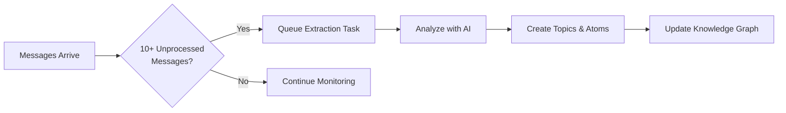

# Knowledge Extraction

!!! tip "Quick Overview"
    Knowledge Extraction automatically analyzes your conversations to discover discussion topics and extract valuable insights. The system identifies problems, solutions, decisions, and patterns, organizing them into a searchable knowledge graph.

---

## What is Knowledge Extraction?

Knowledge Extraction is an AI-powered feature that transforms unstructured conversations into structured knowledge. Instead of manually categorizing messages and capturing insights, the system does it automatically using advanced language models.

### What Gets Extracted

The system identifies two types of knowledge:

<div class="grid cards" markdown>

- :material-tag-multiple: **Topics**

    Discussion themes and contexts that group related conversations

    Examples: "API Design", "Database Migration", "UI/UX Issues"

- :material-atom: **Atoms**

    Atomic knowledge units - self-contained, actionable insights

    Types: Problems, Solutions, Decisions, Insights, Questions, Patterns, Requirements

</div>

---

## How It Works

### Automatic Extraction

The system monitors your messages and automatically triggers extraction when conditions are met:



**Default Trigger:** 10 unprocessed messages in the last 24 hours

**Batch Size:** Up to 50 messages per extraction

**Processing Time:** 30-90 seconds depending on message count

### Manual Extraction

You can also trigger extraction manually via the API:

=== "Python"
    ```python
    import httpx

    async with httpx.AsyncClient() as client:
        response = await client.post(
            "http://localhost:8000/api/v1/knowledge/extract",
            json={
                "message_ids": [1, 2, 3, 4, 5],
                "provider_id": "your-provider-uuid"
            }
        )
        print(response.json())
    ```

=== "cURL"
    ```bash
    curl -X POST http://localhost:8000/api/v1/knowledge/extract \
      -H "Content-Type: application/json" \
      -d '{
        "message_ids": [1, 2, 3, 4, 5],
        "provider_id": "your-provider-uuid"
      }'
    ```

---

## Understanding Topics

Topics represent discussion themes or problem domains that emerge from conversations.

### Topic Properties

| Property | Description | Example |
|----------|-------------|---------|
| **Name** | Concise identifier (2-4 words) | "API Authentication" |
| **Description** | Clear explanation of the theme | "Discussions about API security and user authentication" |
| **Icon** | Auto-selected visual identifier | `ShieldIcon` |
| **Color** | Auto-assigned hex color | `#3B82F6` |
| **Confidence** | AI confidence score (0.0-1.0) | `0.85` |

### How Topics Are Created

1. **LLM Analysis** - AI identifies 1-3 main themes from message batch
2. **Confidence Check** - Only topics with 0.7+ confidence are auto-created
3. **Deduplication** - Existing topics are reused, preventing duplicates
4. **Auto-Assignment** - Messages are linked to their relevant topics

!!! info "Icon & Color Selection"
    The system automatically chooses icons and colors based on topic keywords:

    - "API" → `CodeBracketIcon` (Purple)
    - "Database" → `ServerIcon` (Blue)
    - "Design" → `PaintBrushIcon` (Pink)

    You can always customize these manually later.

---

## Understanding Atoms

Atoms are the smallest units of knowledge - self-contained insights that can stand alone.

### Atom Types

<div class="grid cards" markdown>

- :material-alert-circle: **Problem**

    Issues, bugs, or challenges identified in discussions

- :material-check-circle: **Solution**

    Answers, fixes, or resolutions to problems

- :material-flag: **Decision**

    Choices made, directions selected, or commitments

- :material-lightbulb: **Insight**

    Realizations, observations, or learnings

- :material-help-circle: **Question**

    Unclear points needing clarification or further discussion

- :material-pattern: **Pattern**

    Recurring themes, architectural patterns, or best practices

- :material-clipboard-list: **Requirement**

    Needs, constraints, or specifications

</div>

### Atom Properties

| Property | Description |
|----------|-------------|
| **Type** | Classification (problem, solution, decision, etc.) |
| **Title** | Brief summary (max 200 characters) |
| **Content** | Full self-contained description |
| **Confidence** | AI confidence score (0.0-1.0) |
| **User Approved** | Manual verification flag (default: false) |
| **Topic** | Parent topic this atom belongs to |
| **Source Messages** | Original messages this was extracted from |

### Atom Relationships

Atoms can be linked to show how knowledge connects:

| Link Type | Description | Example |
|-----------|-------------|---------|
| `solves` | Solution atom solves problem atom | "OAuth Implementation" solves "Login Security Issue" |
| `supports` | Atom provides evidence for another | "Performance Test Results" supports "Use Redis Decision" |
| `contradicts` | Atom conflicts with another | "Client Requirements" contradicts "Budget Constraints" |
| `continues` | Atom builds upon another | "v2 API Design" continues "v1 API Retrospective" |
| `refines` | Atom adds detail to another | "Error Handling Details" refines "API Error Strategy" |
| `relates_to` | General thematic connection | "Frontend Architecture" relates to "Backend Architecture" |
| `depends_on` | Atom requires another as prerequisite | "Deploy to Production" depends on "Pass QA Tests" |

---

## Using Extracted Knowledge

### Viewing Topics

Topics appear in the dashboard and can be browsed:

- **Topic List** - All topics with message counts
- **Topic Detail** - Full description, related atoms, and messages
- **Topic Timeline** - When the topic was discussed

### Browsing Atoms

Atoms can be filtered and searched:

- **By Type** - Show only problems, solutions, etc.
- **By Topic** - See all atoms in a specific topic
- **By Confidence** - Filter high-confidence knowledge
- **By Approval** - Show user-verified atoms only

### Knowledge Graph

The system builds a graph showing relationships:

```
Problem: "Login fails on mobile"
    ↓ [solves]
Solution: "Implement OAuth2 flow"
    ↓ [continues]
Insight: "OAuth improves security posture"
    ↓ [supports]
Decision: "Migrate all auth to OAuth2"
```

---

## Configuration

### Extraction Settings

You can configure extraction behavior:

```python
# In backend/app/tasks.py
KNOWLEDGE_EXTRACTION_THRESHOLD = 10  # Messages before auto-trigger
KNOWLEDGE_EXTRACTION_LOOKBACK_HOURS = 24  # Time window for unprocessed messages
```

### Confidence Threshold

Control quality vs. quantity of extracted knowledge:

```python
# In KnowledgeExtractionService
confidence_threshold = 0.7  # Minimum confidence for auto-creation
```

- **Higher threshold (0.8-0.9)** - Only very confident extractions, fewer false positives
- **Default (0.7)** - Balanced quality and coverage
- **Lower threshold (0.5-0.6)** - More extractions, may need manual review

### LLM Provider Setup

Knowledge extraction requires an active LLM provider (Ollama or OpenAI):

1. **Add Provider** in dashboard settings
2. **Configure Model** (recommended: `qwen2.5:14b` for Ollama)
3. **Activate Provider** to enable auto-extraction
4. **Test Connection** before first extraction

!!! warning "Provider Requirements"
    - Provider must be marked as **active**
    - Ollama providers need `base_url` configured
    - OpenAI providers need valid API key
    - Model must support structured output (JSON mode)

---

## Real-Time Updates

The system broadcasts extraction progress via WebSocket:

```typescript
const ws = new WebSocket('ws://localhost:8000/ws/knowledge');

ws.onmessage = (event) => {
  const { type, data } = JSON.parse(event.data);

  switch (type) {
    case 'knowledge.extraction_started':
      console.log(`Analyzing ${data.message_count} messages...`);
      break;

    case 'knowledge.topic_created':
      console.log(`New topic: ${data.topic_name}`);
      break;

    case 'knowledge.atom_created':
      console.log(`New atom: ${data.atom_title} (${data.atom_type})`);
      break;

    case 'knowledge.extraction_completed':
      console.log('Extraction finished!', data);
      break;

    case 'knowledge.extraction_failed':
      console.error('Extraction failed:', data.error);
      break;
  }
};
```

---

## Best Practices

### For Better Extraction

!!! tip "Write Clear Messages"
    Detailed messages with context produce better extractions. Include problem descriptions, proposed solutions, and decisions.

!!! tip "Batch Related Messages"
    Discuss one topic at a time. Mixing multiple unrelated topics dilutes extraction quality.

!!! tip "Review Low-Confidence Items"
    Atoms below 0.7 confidence are not auto-created. Review them manually to capture edge cases.

### For Knowledge Management

!!! tip "Approve Important Atoms"
    Mark critical insights as `user_approved` to distinguish verified knowledge.

!!! tip "Edit Auto-Generated Content"
    AI extractions are starting points. Refine titles and content for clarity.

!!! tip "Maintain Links"
    Review atom relationships. Strong links build a valuable knowledge graph.

### Common Pitfalls

!!! warning "Don't Over-Extract"
    Not every message needs extraction. Casual chat and status updates add noise.

!!! warning "Don't Trust Blindly"
    Always verify AI extractions before using them for decisions.

!!! warning "Don't Delete Source Messages"
    Atoms reference original messages. Deleting them breaks the audit trail.

---

## Troubleshooting

### Extraction Not Triggering

**Problem:** Messages sent but no extraction happens

**Solutions:**

1. Check if 10+ messages are unprocessed (have no `topic_id`)
2. Verify active LLM provider exists in settings
3. Check logs for provider connection errors
4. Ensure messages are within 24-hour lookback window

### Low-Quality Extractions

**Problem:** Topics/atoms are vague or incorrect

**Solutions:**

1. Use more descriptive messages with context
2. Try different LLM model (larger models often perform better)
3. Increase temperature for more creative extractions
4. Review and manually edit extracted content

### Provider Errors

**Problem:** Extraction fails with provider errors

**Solutions:**

1. Verify provider base_url is accessible (Ollama)
2. Check API key validity (OpenAI)
3. Ensure model name is correct and available
4. Check provider logs for detailed error messages

### Performance Issues

**Problem:** Extraction takes too long

**Solutions:**

1. Reduce batch size (process fewer messages)
2. Use faster model (smaller parameter count)
3. Increase `max_tokens` limit if responses are truncated
4. Check network latency to LLM provider

---

## Examples

### Real-World Scenario

**Team Discussion:**

```
User A: "Login is broken on iOS app"
User B: "Confirmed. Session tokens expire too quickly"
User C: "Let's increase token lifetime to 7 days"
User A: "Agreed. I'll implement OAuth2 refresh tokens"
```

**Extraction Output:**

**Topic:** Authentication Issues (Confidence: 0.92)

**Atoms:**
1. **Problem:** "iOS login session expires prematurely" (Confidence: 0.89)
2. **Insight:** "Short token lifetime causes poor user experience" (Confidence: 0.85)
3. **Decision:** "Extend token lifetime to 7 days" (Confidence: 0.91)
4. **Solution:** "Implement OAuth2 refresh token flow" (Confidence: 0.88)

**Links:**
- Solution #4 `solves` Problem #1
- Insight #2 `supports` Decision #3
- Solution #4 `refines` Decision #3

---

## Next Steps

After knowledge is extracted, you can:

- **Search Knowledge** - Find atoms by keyword or type
- **Export Knowledge** - Generate reports or export to external tools
- **Build on Knowledge** - Use atoms as task templates or documentation
- **Train AI** - Extracted knowledge improves future analysis

---

!!! question "Need Help?"
    - Check the [Developer Guide](../architecture/knowledge-extraction.md) for technical details
    - Review [API Reference](../api/knowledge.md) for integration options
    - Contact the team if you encounter issues
