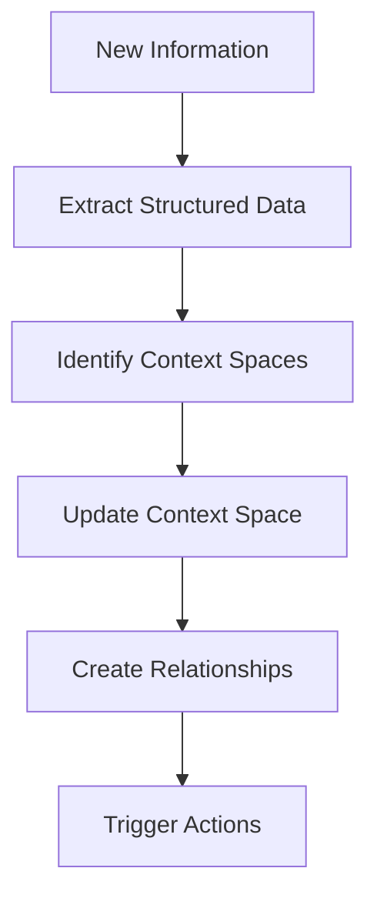

# Context Spaces (Topics)

!!! tip "Quick Overview"
    Context Spaces are smart containers that organize all your project information in one place. Think of them as living folders that understand their contents and grow with your project.

---

## What are Context Spaces?

**Context Spaces** (also referred to as Topics) are the central organizing concept in Task Tracker. They represent contextual domains that aggregate and structure all project-related information in one place.

!!! info "Key Difference"
    Unlike traditional task management systems where tasks are the primary entity, in Task Tracker, **Context Spaces serve as the central hub** for organizing knowledge, activities, and artifacts.

---

## Core Concept

A Context Space is not just a category or label - it's a **living knowledge container** that:

✓ **Accumulates information** from various sources
✓ **Maintains context** and relationships
✓ **Evolves automatically** as new information arrives
✓ **Powers AI analysis** and automation

!!! example "Think of it this way"
    Context Spaces are like smart folders that understand their contents and can be enriched automatically by AI.

---

## What Can Belong to a Context Space?

A Context Space can contain heterogeneous entities:

| Entity Type | Description | Examples |
|------------|-------------|----------|
| **Tasks** | Actionable items that need completion | Bug fixes, features, improvements |
| **Messages** | Conversations and discussions | Team chat, decisions, questions |
| **Analysis Results** | Structured data extracted by AI | Classifications, insights, summaries |
| **Reports** | Generated summaries and insights | Progress reports, analytics |
| **External References** | Links to external systems | Jira tickets, GitHub issues, Redmine tasks |
| **Documentation** | Project knowledge | Notes, specs, decision records |
| **Code References** | Links to code locations | File paths, commits, PRs |

---

## Hierarchical Structure

Context Spaces can be organized hierarchically to match your project structure:

```
Project: Mobile App Redesign
  ├─ Component: Authentication
  │   ├─ Feature: OAuth Integration
  │   └─ Feature: Password Reset
  └─ Component: UI/UX
      ├─ Feature: Dark Mode
      └─ Feature: Responsive Layout
```

### Benefits of Hierarchy

- **Granular organization** - Break down complex projects
- **Property inheritance** - Settings flow down the tree
- **Contextual scoping** - Keep related work together
- **Flexible navigation** - Find information easily

!!! warning "Don't Over-Nest"
    Keep hierarchies simple. 2-3 levels is usually enough for most projects.

---

## AI-Powered Knowledge Enrichment

When new information enters the system (message, task, event), the AI pipeline automatically processes it:

### The Enrichment Process



1. **Extracts structured data** from raw content
2. **Identifies relevant Context Space(s)** using semantic analysis
3. **Updates the Context Space** with new information
4. **Creates relationships** between related spaces
5. **Triggers actions** based on context changes

### Real-World Example

???+ example "From Message to Action"
    **User sends message:**

    ```
    "We need to fix the login bug on iOS"
    ```

    **AI Analysis extracts:**

    - Type: Bug
    - Component: Authentication
    - Platform: iOS
    - Action: Fix required

    **AI finds Context Space:**

    ```
    Mobile App → Authentication
    ```

    **System updates:**

    - ✓ Adds bug to issues list
    - ✓ Links to related messages
    - ✓ Updates status metrics
    - ✓ Triggers notification to responsible team

---

## Use Cases

### 1. 📋 Project Management

Track entire project lifecycle within its Context Space:

- Planning documents and roadmaps
- Tasks and milestones
- Team discussions and decisions
- Progress reports and metrics

### 2. 📚 Knowledge Base

Build living documentation that grows with your team:

- Decisions made over time
- Technical discussions and debates
- Solutions to problems
- Best practices discovered

### 3. 🔗 Integration Hub

Synchronize with external systems seamlessly:

- Create Jira issues from Context Space tasks
- Import GitHub issues into relevant spaces
- Export reports to project management tools
- Link to external documentation

### 4. 📊 Analytics Engine

Generate insights based on Context Space data:

- Time spent per component
- Bottlenecks identification
- Team productivity metrics
- Trend analysis and predictions

---

## Context Space Lifecycle

Context Spaces evolve through different states:

### 🟢 Active
Currently being worked on, accumulating information, AI actively processing new data.

!!! success "Best for"
    Current projects, ongoing work, active development

### 📦 Archived
Historical record, searchable but not actively updated.

!!! info "Best for"
    Completed projects, reference material, historical data

### 🔗 Connected
Linked to other spaces, information can flow between them.

!!! tip "Best for"
    Related projects, shared dependencies, cross-functional work

---

## Benefits

!!! success "Why Use Context Spaces?"

    **1. Unified View**
    All related information in one place - no more hunting across tools

    **2. Smart Organization**
    AI maintains structure automatically - focus on work, not organization

    **3. Knowledge Retention**
    History and context preserved forever - never lose important decisions

    **4. Flexible Integration**
    Connect any external tools - Jira, GitHub, Slack, and more

    **5. Contextual Intelligence**
    AI understands your project context - get smarter suggestions

---

## Best Practices

### ✓ Do's

!!! tip "Start Broad, Refine Later"
    Create general spaces first. Split into sub-spaces when they grow too large.

!!! tip "Let AI Help"
    Allow the system to suggest space assignments. It learns from your patterns.

!!! tip "Review Relationships"
    Periodically check that spaces are properly connected for better insights.

!!! tip "Archive Completed Work"
    Keep active spaces focused on current work for better performance.

### ✗ Don'ts

!!! warning "Don't Over-Nest"
    Avoid deep hierarchies. 2-3 levels is usually enough.

!!! warning "Don't Create Too Many Spaces"
    Start with fewer spaces and split as needed. Too many spaces dilute context.

!!! warning "Don't Ignore Suggestions"
    When AI suggests moving content, consider it. The system learns patterns.

---

## Technical Implementation

??? note "For Developers: Technical Details"
    Context Spaces are implemented as:

    - **Database entities** with flexible JSONB schema for metadata
    - **Graph of relationships** between spaces using PostgreSQL
    - **Event-driven updates** via TaskIQ workers and NATS
    - **WebSocket real-time notifications** for live updates
    - **AI analysis pipeline** using Pydantic-AI for enrichment

---

## Future Directions

Upcoming features we're working on:

- 🤖 **Automatic space creation** based on detected patterns
- 🔍 **Cross-space search** and analytics
- 📝 **Space templates** for common project types
- 📄 **AI-generated summaries** of space contents
- 👥 **Collaborative space editing** with real-time sync

---

!!! question "Need Help?"
    If you have questions about Context Spaces, check the FAQ or reach out to the team.