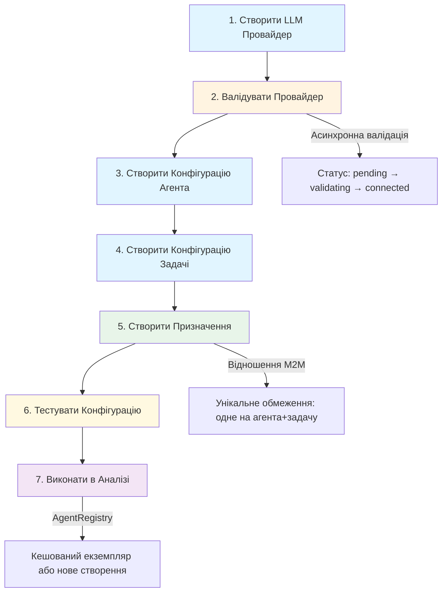
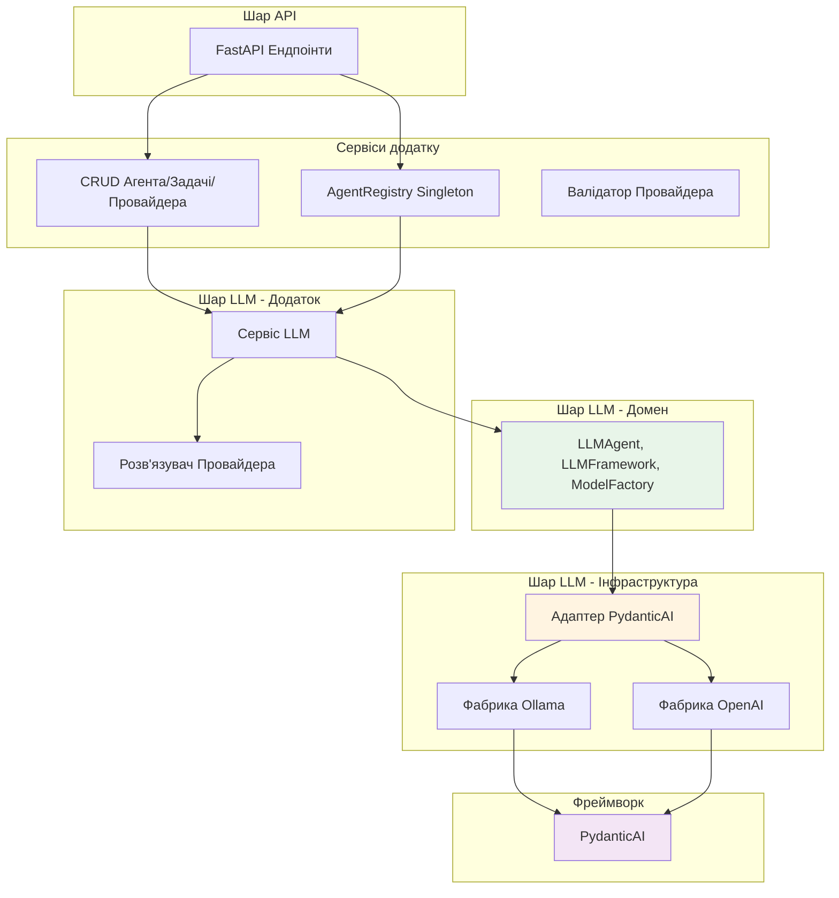
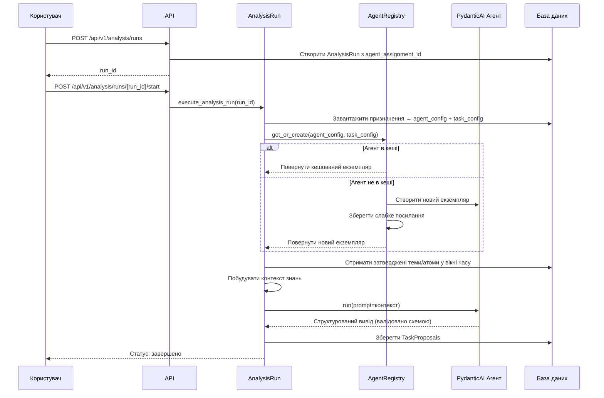

# Система Агентів

## Огляд

Система Агентів забезпечує гнучку конфігурацію та управління AI-керованим виконанням задач в рамках гексагональної архітектури. Вона дозволяє організаціям:

- Конфігурувати кілька провайдерів LLM (локальне розгортання Ollama, хмарний API OpenAI)
- Визначати повторно використовувані конфігурації агентів з налаштованими промптами та налаштуваннями поведінки
- Створювати структуровані визначення задач з валідацією JSON Schema
- Призначати агентів до задач через відношення many-to-many для гнучких робочих процесів
- Виконувати агентів з автоматичним кешуванням та валідацією

Система інтегрується з конвеєром аналізу для генерації пропозицій задач із затверджених знань (тем та атомів), а не сирих повідомлень.

---

## Робочий процес конфігурації

Виконання агента слідує 7-кроковому робочому процесу конфігурації від налаштування провайдера до виконання задачі:



**Кроки робочого процесу:**

1. **Створити LLM Провайдер** - Налаштувати підключення Ollama або OpenAI з обліковими даними
2. **Валідувати Провайдер** - Автоматична фонова валідація (асинхронна задача оновлює статус)
3. **Створити Конфігурацію Агента** - Визначити модель, системний промпт, температуру, макс токенів
4. **Створити Конфігурацію Задачі** - Визначити схему відповіді для структурованих виводів (JSON Schema)
5. **Створити Призначення** - Пов'язати агента з задачею (M2M таблиця з унікальним обмеженням)
6. **Тестувати Конфігурацію** - Валідувати поведінку агента з налаштованими промптами перед розгортанням
7. **Виконати в Аналізі** - AgentRegistry створює/кешує екземпляр для аналітичних запусків

---

## LLM Провайдери

LLM провайдери визначають налаштування підключення та облікові дані для зовнішніх API моделей. Кожен тип провайдера має специфічні вимоги до конфігурації.

### Типи провайдерів

| Тип провайдера | Розгортання | Конфігурація | Автентифікація | Метод валідації |
|---------------|------------|---------------|----------------|-------------------|
| **Ollama** | Локальний | `base_url` | Немає (локальний) | Тестування ендпоінту `/api/tags` або `/v1/models` |
| **OpenAI** | Хмарний | Немає | Зашифрований `api_key` | Тестування автентифікації з OpenAI API |

### Життєвий цикл провайдера

| Статус | Опис | Наступна дія |
|--------|-------------|-------------|
| `pending` | Провайдер створено, ще не валідовано | Фонова валідація заплановано |
| `validating` | Валідація в процесі (асинхронна задача) | Очікування завершення |
| `connected` | Успішно валідовано та готово | Доступно для призначення агенту |
| `error` | Валідація не вдалась | Виправити конфігурацію, повторити валідацію |

**Процес валідації:**
- Запускається автоматично при створенні або оновленні провайдера
- Працює як фонова задача (неблокуюча)
- Транслює WebSocket події для оновлень в реальному часі
- Зберігає повідомлення про помилки для налагодження

---

## Конфігурація агента

Конфігурації агентів визначають **як** агенти виконують задачі: вибір моделі, промпти та налаштування поведінки.

### Поля агента

| Поле | Тип | Обов'язкове | Опис |
|-------|------|----------|-------------|
| `name` | string | Так | Унікальний ідентифікатор агента (індексований) |
| `description` | string | Ні | Зрозуміле призначення |
| `provider_id` | UUID | Так | Зовнішній ключ до LLM провайдера |
| `model_name` | string | Так | Ідентифікатор моделі (наприклад, `llama3`, `gpt-4`) |
| `system_prompt` | string | Так | Системні інструкції агента |
| `temperature` | float | Ні | Контроль випадковості (0.0-1.0, за замовчуванням: 0.7) |
| `max_tokens` | int | Ні | Обмеження довжини відповіді |
| `is_active` | bool | Так | Увімкнути/вимкнути агента |

**Валідація конфігурації:**
- Провайдер повинен існувати та бути активним
- Ім'я агента повинно бути унікальним
- Формат імені моделі не валідується (специфічний для провайдера)
- Системний промпт обов'язковий але не обмежений

---

## Конфігурація задачі

Конфігурації задач визначають **що** агенти повинні виводити: структуровані схеми відповідей використовуючи JSON Schema.

### Поля задачі

| Поле | Тип | Обов'язкове | Опис |
|-------|------|----------|-------------|
| `name` | string | Так | Унікальний ідентифікатор задачі (індексований) |
| `description` | string | Ні | Призначення задачі |
| `response_schema` | JSON | Так | JSON Schema для валідації виводу |
| `is_active` | bool | Так | Увімкнути/вимкнути задачу |

**Схема відповіді:**
- Повинна бути валідною JSON Schema (draft-07)
- Визначає структуру, типи та обмеження для виводів агента
- Використовується PydanticAI для генерації типізованих моделей виводу
- Застосовує валідацію відповідей агента

**Приклад схеми:**
```json
{
  "$schema": "http://json-schema.org/draft-07/schema#",
  "type": "object",
  "properties": {
    "category": {
      "type": "string",
      "enum": ["bug", "feature", "question", "discussion"]
    },
    "confidence": {
      "type": "number",
      "minimum": 0,
      "maximum": 1
    }
  },
  "required": ["category", "confidence"]
}
```

---

## Призначення Агент-Задача

Призначення пов'язують агентів з задачами через відношення many-to-many, забезпечуючи гнучкі робочі процеси та A/B тестування.

### Таблиця призначень

| Поле | Тип | Обмеження | Опис |
|-------|------|------------|-------------|
| `id` | UUID | Первинний ключ | Ідентифікатор призначення |
| `agent_id` | UUID | Зовнішній ключ | Посилання на agent_configs |
| `task_id` | UUID | Зовнішній ключ | Посилання на task_configs |
| `is_active` | bool | - | Увімкнути/вимкнути призначення |
| `assigned_at` | datetime | - | Мітка часу призначення |

**Унікальне обмеження:** `UNIQUE(agent_id, task_id)` - запобігає дублюванню призначень

### Патерни призначень

**Один агент, кілька задач:**
```
Агент: "GPT-4 Класифікатор"
├─ Задача: Класифікація повідомлень
├─ Задача: Виявлення багів
└─ Задача: Вилучення функціональності
```

**Одна задача, кілька агентів (A/B тестування):**
```
Задача: "Класифікація повідомлень"
├─ Агент: GPT-4 Класифікатор (висока точність)
├─ Агент: Llama3 Класифікатор (низька вартість)
└─ Агент: Claude Класифікатор (контекстно-обізнаний)
```

---

## Реєстр Агентів

Сервіс AgentRegistry запобігає дублюванню створення екземплярів агентів використовуючи патерн singleton зі слабкими посиланнями.

### Функції реєстру

| Функція | Реалізація | Переваги |
|---------|----------------|---------|
| **Патерн Singleton** | Єдиний екземпляр реєстру в додатку | Послідовне кешування |
| **Слабкі посилання** | Автоматичне збирання сміття коли не використовується | Не потребує ручного очищення |
| **Потокобезпека** | Асинхронні замки на пару агент+задача | Запобігає умовам гонки |
| **Автоматичне очищення** | Callback видаляє застарілі записи | Ефективна пам'ять |

### Операція реєстру

**Ключ кешу:** Кортеж `(agent_id, task_id)`

**Робочий процес:**
1. Аналітичний запуск запитує агента для призначення
2. Реєстр перевіряє кеш з ключем `(agent_id, task_id)`
3. Якщо в кеші та живий, повертає існуючий екземпляр
4. Якщо відсутній або зібраний сміттям, створює новий екземпляр
5. Зберігає слабке посилання з callback очищення
6. Повертає екземпляр агента

**Переваги слабких посилань:**
- Агенти автоматично видаляються коли більше не посилаються
- Немає витоків пам'яті від кешованих екземплярів
- Callback очищення підтримує консистентність реєстру

---

## API Ендпоінти

Система надає 18 REST ендпоінтів у 4 групах ресурсів для повного управління життєвим циклом агента.

### Управління провайдерами (7 ендпоінтів)

| Метод | Ендпоінт | Опис |
|--------|----------|-------------|
| POST | `/api/v1/providers` | Створити LLM провайдер (запускає валідацію) |
| GET | `/api/v1/providers` | Список всіх провайдерів (пагінація + фільтри) |
| GET | `/api/v1/providers/{id}` | Отримати провайдер за ID |
| PUT | `/api/v1/providers/{id}` | Оновити провайдер (ре-валідує) |
| DELETE | `/api/v1/providers/{id}` | Видалити провайдер (помилка якщо існують агенти) |
| POST | `/api/v1/providers/{id}/validate` | Вручну запустити валідацію |
| GET | `/api/v1/providers/ollama/models` | Список доступних моделей Ollama |

### Конфігурація агента (6 ендпоінтів)

| Метод | Ендпоінт | Опис |
|--------|----------|-------------|
| POST | `/api/v1/agents` | Створити конфігурацію агента |
| GET | `/api/v1/agents` | Список всіх агентів (фільтри: active, provider) |
| GET | `/api/v1/agents/{id}` | Отримати агента за ID |
| PUT | `/api/v1/agents/{id}` | Оновити агента (не впливає на запущені екземпляри) |
| DELETE | `/api/v1/agents/{id}` | Видалити агента (запущені екземпляри продовжують) |
| POST | `/api/v1/agents/{id}/test` | Тестувати агента з налаштованим промптом |

### Конфігурація задачі (5 ендпоінтів)

| Метод | Ендпоінт | Опис |
|--------|----------|-------------|
| POST | `/api/v1/task-configs` | Створити конфігурацію задачі |
| GET | `/api/v1/task-configs` | Список всіх задач (пагінація + фільтр active) |
| GET | `/api/v1/task-configs/{id}` | Отримати задачу за ID |
| PUT | `/api/v1/task-configs/{id}` | Оновити конфігурацію задачі |
| DELETE | `/api/v1/task-configs/{id}` | Видалити задачу (каскадно до призначень) |

### Призначення Агент-Задача (5 ендпоінтів)

| Метод | Ендпоінт | Опис |
|--------|----------|-------------|
| POST | `/api/v1/agents/{agent_id}/tasks` | Призначити задачу агенту |
| GET | `/api/v1/agents/{agent_id}/tasks` | Список призначених задач агента |
| DELETE | `/api/v1/agents/{agent_id}/tasks/{task_id}` | Скасувати призначення задачі від агента |
| GET | `/api/v1/assignments` | Список всіх призначень з деталями JOIN |
| GET | `/api/v1/tasks/{task_id}/agents` | Список агентів призначених до задачі |

**Всього ендпоінтів:** 23 (7 + 6 + 5 + 5)

---

## Інтеграція гексагональної архітектури

Система Агентів інтегрується з шаром LLM через гексагональну (порти та адаптери) архітектуру для незалежності від фреймворку.

### Шари архітектури



**Відповідальності шарів:**

| Шар | Відповідальність | Залежність від фреймворку |
|-------|----------------|---------------------|
| **Домен** | Визначити інтерфейси (порти) | Немає - чисті абстракції |
| **Додаток** | Оркеструвати створення агента, розв'язання провайдера | Немає - використовує порти |
| **Інфраструктура** | Реалізувати адаптери для PydanticAI | Специфічний для PydanticAI |
| **Фреймворк** | Виконувати LLM операції | Бібліотека PydanticAI |

**Переваги:**
- Замінити PydanticAI на LangChain без зміни логіки домену
- Тестувати логіку домену з макет адаптерами
- Ізолювати код специфічний для фреймворку до шару інфраструктури

---

## Використання в аналітичних запусках

Аналітичні запуски виконують агентів для генерації пропозицій задач із затверджених знань (тем та атомів).

### Потік виконання аналізу



### Конфігурація аналізу

**Джерело вводу:**
- Затверджені теми та атоми (не сирі повідомлення)
- Відфільтровано за вікном часу (налаштовується на запуск)

**Вивід:**
- Записи TaskProposal зі структурованими даними
- Валідовано проти task_config.response_schema
- Пов'язано з analysis_run_id для відстежуваності

**Знімок конфігурації:**
- Повна конфігурація агента + задачі збережена в `config_snapshot` (JSONB)
- Забезпечує відтворюваність навіть якщо конфігурація змінюється пізніше
- Аудит-трейл для відстеження експериментів

---

## Тестування агентів

Тестування агентів валідує конфігурацію перед продакшн розгортанням використовуючи ендпоінт `/agents/{id}/test`.

### Тестовий ендпоінт

**Запит:**
```json
POST /api/v1/agents/{agent_id}/test
{
  "prompt": "Classify this message: The app crashed when I logged in"
}
```

**Відповідь:**
```json
{
  "agent_id": "123e4567-e89b-12d3-a456-426614174000",
  "agent_name": "Message Classifier",
  "prompt": "Classify this message: The app crashed when I logged in",
  "response": "{\"category\": \"bug\", \"confidence\": 0.95}",
  "elapsed_time": 2.34,
  "model_name": "llama3",
  "provider_name": "Ollama Local",
  "provider_type": "ollama"
}
```

### Валідація тестування

**Вимоги:**
- Агент повинен існувати та бути активним
- Провайдер повинен бути валідований (`status=connected`)
- Провайдер повинен бути активним (`is_active=true`)

**Випадки використання:**
- Валідувати ефективність системного промпту
- Тестувати налаштування temperature та max_tokens
- Порівнювати продуктивність моделей (GPT-4 проти Llama3)
- Налагоджувати проблеми підключення провайдера

---

## Ключові рішення дизайну

### Чому M2M призначення Агент-Задача?

**Проблема:** Жорстко закодовані пари агент-задача обмежують гнучкість

**Рішення:** Відношення many-to-many дозволяє:
- Один агент обробляє кілька задач (ефективність)
- Кілька агентів для однієї задачі (A/B тестування)
- Незалежне управління життєвим циклом агента та задачі

### Чому окремі конфігурації агента та задачі?

**Розділення обов'язків:**

| AgentConfig | TaskConfig |
|-------------|------------|
| **ЯК** виконувати | **ЩО** виводити |
| Модель, промпти, налаштування | Схема відповіді, валідація |
| Поведінка LLM | Структура виводу |

**Переваги:**
- Повторне використання задач з різними агентами
- Оновлення промптів без зміни схем
- Незалежне версіювання

### Чому Реєстр Агентів зі слабкими посиланнями?

**Проблема:** Створення нового екземпляру агента на запит дороге (завантаження моделі, ініціалізація)

**Рішення:** Кеш зі слабкими посиланнями забезпечує:
- Продуктивність: Повторне використання існуючих екземплярів агентів
- Ефективність пам'яті: Автоматичне збирання сміття
- Потокобезпека: Асинхронні замки запобігають умовам гонки
- Без ручного очищення: Слабкі посилання самоуправляються

### Чому знімки конфігурації в AnalysisRun?

**Проблема:** Зміни конфігурації порушують відтворюваність та аудитованість

**Рішення:** Збереження повної конфігурації в JSONB дозволяє:
- Відтворюваність: Відтворити точні умови аналізу
- Аудитованість: Побачити яка конфігурація використовувалася для конкретного запуску
- Версіювання: Відстежувати еволюцію конфігурації з часом
- Відновлення: Відновити зі знімку якщо потрібно

---

## Дивіться також

- **[Система аналізу](./analysis-system.md)** - Як агенти інтегруються з аналітичними запусками
- **[Фільтрація шуму](./noise-filtering.md)** - Обробка повідомлень перед аналізом
- **[Вилучення знань](./knowledge-extraction.md)** - Генерація тем та атомів

---

**Останнє оновлення:** 2025-10-26
