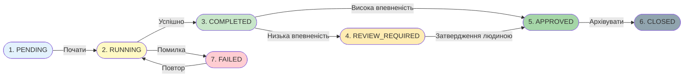
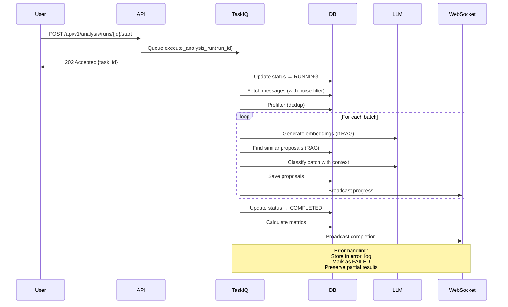
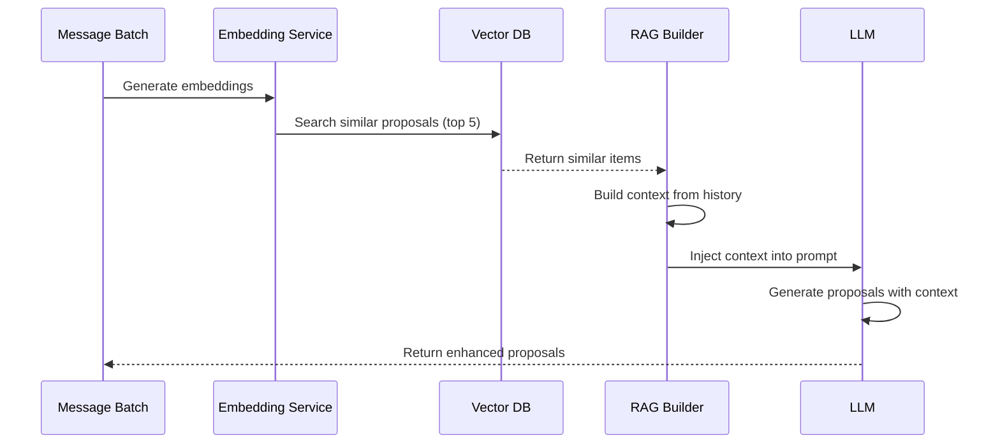

# Архітектура системи аналізу на базі AI

**Остання оновлення:** 18 жовтня 2025
**Статус:** Фаза 1 завершена (100%)
**Реалізація:** Повна продакшн-готова система з 16+ API endpoints

---

## Зміст

1. [Огляд системи](#огляд-системи)
2. [Основні компоненти](#основні-компоненти)
3. [Життєвий цикл запуску аналізу](#життєвий-цикл-запуску-аналізу)
4. [Моделі даних](#моделі-даних)
5. [API Endpoints](#api-endpoints)
6. [Фонова обробка](#фонова-обробка)
7. [Статус реалізації](#статус-реалізації)
8. [Інтеграція з іншими системами](#інтеграція-з-іншими-системами)
9. [Характеристики продуктивності](#характеристики-продуктивності)
10. [Наступні кроки](#наступні-кроки)

---

## Огляд системи

Система аналізу - це двостадійний конвеєр від знань до задач:

1. **Стадія видобування знань** - Перетворює необроблені повідомлення на структуровані Теми та Атоми (затверджені користувачами)
2. **Стадія генерування пропозицій задач** - Аналізує накопичені знання для генерування пропозицій задач для помилок, функцій та поліпшень

Це розділення забезпечує, що рішення базуються на консолідованих, перевірених знаннях, а не на необроблених повідомленнях.

### Архітектура високого рівня

```
Повідомлення (необроблені, всі джерела)
    ↓
Сервіс видобування знань
    ├─ Видобути сутності та закономірності
    ├─ Генерувати вкладення
    ↓
Пропозиції тем/атомів (ОЧІКУЮТЬСЯ)
    ├─ Запропоновані теми
    ├─ Запропоновані атоми
    ├─ Оцінки впевненості
    ↓
[ПЕРЕГЛЯД] Затвердження людиною
    ├─ Затвердити/відхилити пропозиції
    ├─ Позначити затверджені елементи
    ↓
Теми/Атоми (СТВОРЕНІ)
    ├─ Затверджені теми
    ├─ Агреговані атоми
    ├─ Структуровані знання
    ↓
Запуск аналізу (ОЧІКУЄТЬСЯ)
    ├─ Налаштувати LLM провайдер
    ├─ Вибрати теми/атоми для аналізу
    ├─ Визначити часовий період
    ↓
[ЗАПУЩЕНО] Аналіз накопичених знань
    ├─ Обробити затверджені теми/атоми
    ├─ Генерувати вкладення (якщо RAG)
    ├─ Побудувати контекст з тем
    ├─ Викликати LLM для пропозицій задач
    ↓
[ЗАВЕРШЕНО] Генерування пропозицій задач
    ├─ Пропозиції задач з тем/атомів
    ├─ Пропозиції помилок з виявлених проблем
    ├─ Пропозиції функцій з пропозицій
    ├─ Оцінки впевненості
    ├─ Ланцюжки міркувань
    ↓
[ПЕРЕГЛЯД] Затвердження людиною
    ├─ Затвердити/відхилити пропозиції
    ├─ Розрахувати метрики
    ├─ Позначити запуск як переглянутий
    ↓
[ЗАКРИТО] Архівування результатів
    └─ Зберегти для майбутнього посилання/RAG
```

---

## Основні компоненти

### 1. Запуск аналізу (Analysis Run)

Представляє один цикл аналізу з управлінням життєвим циклом.

**Життєвий цикл (7 станів):**
```
pending → running → completed → review_required → approved → closed
                          ↓
                        failed
```

**Ключові поля:**
- `status`: Поточний стан життєвого циклу
- `time_window_start/end`: Повідомлення для аналізу
- `total_messages_in_window`: Кількість до фільтрації
- `messages_after_prefilter`: Кількість після дедуплікації
- `config_snapshot`: JSONB копія ProjectConfig (відтворюваність)
- `accuracy_metrics`: Рівень затвердження, рівень відхилення
- `error_log`: Деталі збою та інформація про відновлення

### 2. Пропозиція задачі (Task Proposal)

AI-згенерована пропозиція, видобута з затверджених Тем та Атомів (НЕ безпосередньо з повідомлень).

**Джерела пропозицій задач:**
- Теми (аналіз накопичених знань)
- Атоми (виявлені проблеми та пропозиції)
- Зворотний зв'язок користувача (пропозиції поліпшення)

**Структура:**
```python
{
    "analysis_run_id": "uuid",
    "task_type": "bug|feature|question|insight",
    "title": "iOS crash на login",
    "description": "Додаток вилітає при спробі входу",
    "source_topic_ids": [1, 2],         # ← З тем/атомів
    "source_atom_ids": [101, 102, 103], # ← З атомів, не з повідомлень
    "confidence": 0.95,
    "recommendation": "APPROVE",  # Рекомендація AI
    "reasoning": "Тема вказує на кілька проблем входу iOS",
    "llm_metadata": {
        "model": "gpt-4",
        "tokens_used": 2000,
        "processing_time_ms": 1500
    },
    "user_approved": false,
    "approved_by": null
}
```

### 3. Конфігурація проекту (Project Configuration)

Визначає схему класифікації та параметри.

**Приклад:**
```python
{
    "name": "Q4 2025 Analysis",
    "task_types": ["bug", "feature", "question"],
    "keywords": {
        "bug": ["crash", "error", "fail", "bug"],
        "feature": ["add", "implement", "feature", "new"],
        "question": ["?", "how", "why", "what"]
    },
    "classification_instructions": "...",
    "confidence_threshold": 0.75
}
```

---

## Життєвий цикл запуску аналізу

!!! tip "7-станний життєвий цикл"
    Повна машина стану з обробкою помилок та відновленням.

### Стани життєвого циклу



=== "Стан 1: PENDING"
    **Дія:** Користувач створює запуск з часовим вікном та конфігурацією

    **Тривалість:** Миттєво

    **Перехід:** → RUNNING (при запуску)

=== "Стан 2: RUNNING"
    **Дія:** Фонове завдання обробляє повідомлення

    **Процес:**

    1. Завантажити повідомлення в часовому вікні
    2. Застосувати фільтр шуму (якщо увімкнено)
    3. Застосувати дедуплікацію повідомлень
    4. Створити пакети
    5. Генерувати вкладення (якщо RAG)
    6. Побудувати контекст з подібних минулих пропозицій
    7. Викликати LLM для кожного пакету
    8. Зберегти пропозиції

    **Тривалість:** Хвилини до годин (залежить від кількості повідомлень)

    **Перехід:** → COMPLETED (при завершенні) або FAILED (при помилці)

=== "Стан 3: COMPLETED"
    **Дія:** Обробка завершена, пропозиції готові

    **Автоматичні дії:**

    - Розрахувати метрики точності
    - Автоматично затвердити пропозиції з високою впевненістю (>0.9)
    - Позначити для перегляду: низька впевненість або граничні випадки

    **Перехід:** → REVIEW_REQUIRED або APPROVED

=== "Стан 4: REVIEW_REQUIRED"
    **Дія:** Пропозиції очікують людського перегляду

    **Дії користувача:**

    - Переглянути пропозиції одну за одною
    - Затвердити/відхилити з коментарем
    - Пакетне затвердження подібних елементів

    **Перехід:** → APPROVED (після перегляду всіх)

=== "Стан 5: APPROVED"
    **Дія:** Усі пропозиції переглянуті та затверджені

    **Автоматичні дії:**

    - Архівувати запуск для історичної довідки
    - Зробити пропозиції доступними для майбутнього контексту RAG
    - Зберегти снімок конфігурації для відтворюваності

    **Перехід:** → CLOSED

=== "Стан 6: CLOSED"
    **Дія:** Запуск архівовано

    **Доступ:** Тільки для читання (лише історична довідка)

=== "Стан 7: FAILED"
    **Шляхом помилки:** Будь-яка помилка під час стану RUNNING

    **Варіанти відновлення:**

    - Повтор з останньої контрольної точки
    - Перезапуск з початку
    - Ручна перевірка та виправлення

---

## Моделі даних

### Модель AnalysisRun

```python
class AnalysisRun(IDMixin, TimestampMixin, SQLModel, table=True):
    id: UUID = Field(primary_key=True, default_factory=uuid4)

    # Життєвий цикл
    status: str  # "pending", "running", "completed", "review_required",
                 # "approved", "closed", "failed"

    # Конфігурація
    project_config_id: int
    config_snapshot: dict | None  # JSONB - незмінна копія
    time_window_start: datetime
    time_window_end: datetime

    # Обробка повідомлень
    total_messages_in_window: int = 0
    messages_after_prefilter: int = 0
    messages_processed: int = 0

    # Метрики
    proposals_generated: int = 0
    proposals_approved: int = 0
    proposals_rejected: int = 0
    accuracy_metrics: dict | None  # JSONB - рівень затвердження тощо

    # Обробка помилок
    error_log: str | None
    error_details: dict | None  # JSONB

    # Метадані життєвого циклу
    started_at: datetime | None
    completed_at: datetime | None
    reviewed_at: datetime | None
    closed_at: datetime | None
```

### Модель TaskProposal

```python
class TaskProposal(IDMixin, TimestampMixin, SQLModel, table=True):
    id: int = Field(primary_key=True)

    # Асоціація
    analysis_run_id: UUID

    # Вміст
    task_type: str  # "bug", "feature", "question", "insight"
    title: str
    description: str

    # Джерело
    source_message_ids: list[int]  # PostgreSQL ARRAY

    # Вихід AI
    confidence: float  # 0.0-1.0
    recommendation: str  # "APPROVE", "REVIEW", "REJECT"
    reasoning: str

    # Метадані LLM
    llm_metadata: dict | None  # JSONB - модель, токени, затримка

    # Зворотний зв'язок від користувача
    user_approved: bool = False
    approved_by: str | None
    approval_timestamp: datetime | None

    # Обмеження
    __table_args__ = (
        CheckConstraint(
            "confidence >= 0.0 AND confidence <= 1.0",
            name="proposal_confidence_range"
        ),
    )
```

### Модель ProjectConfig

```python
class ProjectConfig(IDMixin, TimestampMixin, SQLModel, table=True):
    id: int = Field(primary_key=True)

    # Ідентифікація
    name: str
    version: int = 1

    # Схема класифікації
    task_types: list[str]  # ["bug", "feature", "question"]
    keywords: dict[str, list[str]]  # Тип → список ключових слів

    # Конфігурація LLM
    llm_provider_id: UUID
    classification_instructions: str
    confidence_threshold: float = 0.75

    # Обробка
    max_batch_size: int = 50
    include_code_context: bool = True
    use_rag_context: bool = True
```

---

## API Endpoints

### Запуски аналізу

**Створити запуск**
```
POST /api/v1/analysis/runs
{
    "project_config_id": 1,
    "time_window_start": "2025-10-01T00:00:00Z",
    "time_window_end": "2025-10-18T23:59:59Z"
}
Відповідь: 201
{
    "id": "uuid",
    "status": "pending",
    "created_at": "2025-10-18T12:00:00Z"
}
```

**Список запусків**
```
GET /api/v1/analysis/runs?status=completed&limit=20
Відповідь: 200
[
    {"id": "uuid1", "status": "completed", ...},
    {"id": "uuid2", "status": "running", ...}
]
```

**Отримати деталі запуску**
```
GET /api/v1/analysis/runs/{run_id}
Відповідь: 200
{
    "id": "uuid",
    "status": "running",
    "messages_processed": 45,
    "proposals_generated": 12,
    "accuracy_metrics": {...}
}
```

**Розпочати запуск**
```
POST /api/v1/analysis/runs/{run_id}/start?use_rag=true
Відповідь: 202
{"status": "running", "task_id": "background-job-id"}
```

### Пропозиції

**Список пропозицій**
```
GET /api/v1/analysis/runs/{run_id}/proposals?status=needs_review
Відповідь: 200
[
    {
        "id": 123,
        "task_type": "bug",
        "title": "iOS crash",
        "confidence": 0.92,
        "recommendation": "APPROVE"
    }
]
```

**Затвердити пропозицію**
```
POST /api/v1/proposals/{proposal_id}/approve
{
    "comment": "Valid bug report"
}
Відповідь: 200
{"status": "approved"}
```

**Відхилити пропозицію**
```
POST /api/v1/proposals/{proposal_id}/reject
{
    "reason": "Duplicate of issue #1234"
}
Відповідь: 200
{"status": "rejected"}
```

### Статистика

**Отримати статистику запусків**
```
GET /api/v1/analysis/stats/runs
Відповідь: 200
{
    "total_runs": 42,
    "completed": 38,
    "running": 2,
    "failed": 2,
    "avg_duration_minutes": 15,
    "approval_rate": 0.87
}
```

---

## Фонова обробка

!!! note "Асинхронне виконання"
    Довгі завдання аналізу виконуються у фоні через TaskIQ.

### Завдання: execute_analysis_run

**Запуск:** Користувач викликає `POST /api/v1/analysis/runs/{id}/start`



**Процес:**

```python
async def execute_analysis_run(run_id: UUID, use_rag: bool = False):  # (1)!
    await executor.start_run(run_id)  # (2)!
    messages = await executor.fetch_messages(run_id)  # (3)!
    filtered = await executor.prefilter_messages(run_id, messages)  # (4)!
    batches = await executor.create_batches(filtered)  # (5)!

    for batch in batches:  # (6)!
        if use_rag:
            embeddings = await embedding_service.embed_batch(batch)
            context = await rag_builder.build_context(batch)

        proposals = await llm_service.generate_proposals(
            batch, project_config, rag_context=context if use_rag else None
        )

        await executor.save_proposals(run_id, proposals)
        await websocket_manager.broadcast({  # (7)!
            "type": "proposals_generated",
            "run_id": run_id,
            "count": len(proposals)
        })

    await executor.complete_run(run_id)  # (8)!
    await executor.calculate_metrics(run_id)
```

1. Головна точка входу фонового завдання
2. Перейти до стану RUNNING
3. Застосувати фільтр шуму для виключення низькоякісних повідомлень
4. Видалити дублікатні повідомлення для ефективності
5. Розділити на пакети для паралельної обробки
6. Обробити кожен пакет з додатковим контекстом RAG
7. Оновлення прогресу в реальному часі через WebSocket
8. Розрахувати метрики точності та перейти до COMPLETED

!!! warning "Обробка помилок"
    - Збої пакетів → Зберегти помилку, позначити FAILED
    - Надати інформацію про відновлення в error_log
    - Зберегти часткові результати для перевірки

---

## Статус реалізації

### ✅ ПОВНІСТЮ РЕАЛІЗОВАНО (Жовтень 2025)

**Моделі бази даних:**
- ✅ AnalysisRun (7-станний життєвий цикл)
- ✅ TaskProposal (з метаданими LLM)
- ✅ ProjectConfig (схеми класифікації)
- ✅ Розширення повідомлень (відстеження аналізу)
- ✅ Інтеграція з Vector DB (вкладення)

**API Endpoints (16 endpoints):**
- ✅ Управління запусками (CRUD, життєвий цикл)
- ✅ Управління пропозиціями (генерування, перегляд, затвердження/відхилення)
- ✅ Конфігурація проекту (версіонування, управління)
- ✅ Статистика та метрики
- ✅ Оновлення WebSocket у реальному часі (9 типів подій)

**Сервіси:**
- ✅ AnalysisExecutor (управління життєвим циклом)
- ✅ LLMProposalService (генерування з RAG)
- ✅ MessagePrefilter (дедуплікація)
- ✅ MetricsCalculator (відстеження точності)

**Фонові завдання:**
- ✅ execute_analysis_run (основний конвеєр)
- ✅ Відстеження прогресу та трансляція
- ✅ Обробка помилок та відновлення

**Frontend:**
- ✅ Сторінка запусків аналізу (список, створення, моніторинг)
- ✅ Сторінка пропозицій (перегляд, затвердження/відхилення, пакетні дії)
- ✅ Оновлення WebSocket у реальному часі
- ✅ Індикатори прогресу та метрики

**Тестування:**
- ✅ 48+ тестів, які охоплюють всю функціональність
- ✅ Покриття коду 82-85%
- ✅ Інтеграційні тести для повного конвеєру
- ✅ Безпека типів з режимом mypy strict

### 🎯 Поставлені ключові функції

✅ **Гнучка класифікація** - Визначте власні типи задач та ключові слова
✅ **Інтеграція RAG** - Контекстне генерування з історичними пропозиціями
✅ **Оновлення у реальному часі** - WebSocket трансляція прогресу
✅ **Відновлення при помилках** - Надійна обробка помилок з детальним логуванням
✅ **Робочий процес затвердження** - Автоматичне затвердження високої впевненості, позначення для перегляду
✅ **Відстеження метрик** - Рівні затвердження, час обробки, точність
✅ **Безпека типів** - Повна відповідність mypy, валідація Pydantic

---

## Інтеграція з іншими системами

!!! tip "Інтеграція системи"
    Безперервна інтеграція з системами фільтрування шуму та векторної бази даних.

### Інтеграція фільтрування шуму

Система аналізу поважає рівень фільтрування шуму:

```python
# In fetch_messages()
messages = await db.execute(
    select(Message)
    .where(
        Message.sent_at >= start_time,  # (1)!
        Message.sent_at <= end_time,
        Message.exclude_from_analysis == False,  # (2)!
        Message.noise_classification.in_(["signal", "weak_signal"])  # (3)!
    )
)
```

1. Часове вікно визначено запуском аналізу
2. Поважайте виключення фільтру шуму
3. Обробляйте лише сигнальні та слабкі сигнальні повідомлення

**Переваги:**

| Перевага | Вплив |
|---------|-------|
| Зменшена обробка | На 80% менше повідомлень |
| Краща якість | Немає шуму в навчальних даних |
| Економія витрат | Нижчі витрати на LLM API |

### Інтеграція векторної бази даних

!!! example "Генерування, розширене за допомогою RAG"
    Історичний контекст покращує якість та послідовність пропозицій.



**Реалізація:**

```python
if use_rag:  # (1)!
    await embedding_service.embed_batch(batch)  # (2)!
    similar_proposals = await semantic_search.find_similar(  # (3)!
        embeddings, limit=5
    )
    context = await rag_builder.build_context(similar_proposals)  # (4)!
    proposals = await llm_service.generate_proposals(  # (5)!
        batch, config, rag_context=context
    )
```

1. RAG увімкнено через параметр API
2. Генерувати вкладення для пакету
3. Знайти топ-5 подібних історичних пропозицій
4. Побудувати відформатований контекст для LLM
5. Розширене генерування з історичним контекстом

**Результат:** Контекстні пропозиції, які посилаються на подібні минулі рішення

---

## Характеристики продуктивності

| Операція | Типова | Примітки |
|----------|--------|---------|
| Завантаження повідомлень (1000 повідомлень) | <500ms | Застосовується фільтр шуму |
| Попередня фільтрація (дублікати) | <200ms | Ефективний алгоритм дедуплікації |
| Виклик LLM (50 повідомлень) | 2-5s | Включає затримку API |
| Обробка пакету (1000 повідомлень) | 10-20хв | Залежить від розміру пакету |
| Розрахунок метрик | <1s | Тільки агрегація |

---

## Наступні кроки

### Коротко- та середньостроковий період (Q4 2025)
- [ ] Реалізувати навчання моделі машинного навчання на зібраних даних
- [ ] Додати налаштування порогу для кожного проекту
- [ ] Реалізувати цикл навчання на основі зворотного зв'язку користувача

### Довгостроковий період (Q1 2026+)
- [ ] Розширена дедуплікація пропозицій
- [ ] Автоматичне пов'язування задач з зовнішніми системами
- [ ] Спеціалізоване навчання LLM на даних проекту

---

## Пов'язана документація

- **Фільтрування шуму:** Див. `NOISE_FILTERING.md`
- **Векторна база даних:** Див. `VECTOR_DATABASE.md`
- **Огляд системи:** Див. `OVERVIEW.md`

---

*Цей документ консолідує архітектуру та статус реалізації системи аналізу на базі AI.*
