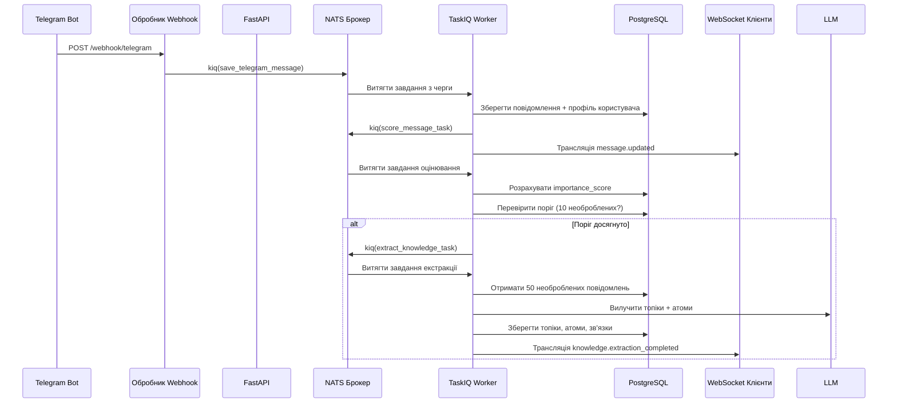
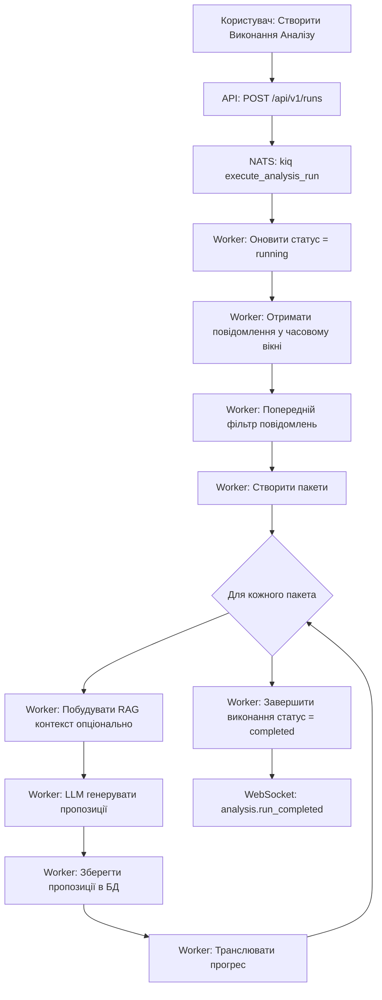

# Система Фонових Завдань

## Огляд

Task Tracker використовує **TaskIQ** з брокером **NATS** для розподіленої обробки фонових завдань. Це дозволяє асинхронне виконання довготривалих операцій, таких як інгестія повідомлень, AI аналіз, генерація ембедінгів та вилучення знань без блокування API відповідей.

**Ключові Функції**:
- Асинхронне виконання завдань з TaskIQ
- Брокер повідомлень NATS для розподіленої обробки
- Трансляція WebSocket для оновлень прогресу в реальному часі
- Автоматичні повторні спроби з безкінечними спробами повторного підключення
- Object store backend результатів для персистентності результатів завдань

---

## Архітектура

### Налаштування TaskIQ + NATS

```
┌─────────────┐         ┌──────────────┐         ┌─────────────┐
│  FastAPI    │──kiq()─>│  NATS Брокер │──pull─>│   Worker    │
│  Endpoints  │         │   (Черга)    │         │  Контейнер  │
└─────────────┘         └──────────────┘         └─────────────┘
       │                                                 │
       │                                                 │
       v                                                 v
┌─────────────┐                                 ┌─────────────┐
│  WebSocket  │<──────трансляція─────────────────│  Виконання  │
│   Клієнти   │                                 │  Завдання   │
└─────────────┘                                 └─────────────┘
```

**Конфігурація** (`core/taskiq_config.py`):
- **Черга**: `taskiq_tasks` (налаштовується)
- **Сервери**: URL серверів NATS з налаштувань
- **Backend Результатів**: NATS Object Store для персистентності результатів
- **Повторне Підключення**: Необмежені спроби повтору (`max_reconnect_attempts=-1`)
- **Таймаути**: 10с підключення, 30с drain

---

## Каталог Завдань

### Завдання Обробки Повідомлень (3)

| Завдання | Призначення | Тригер | Автоланцюжки |
|------|---------|---------|-------------|
| `save_telegram_message` | Зберегти Telegram webhook повідомлення в базу даних | Telegram webhook подія | → `score_message_task` → (поріг) → `extract_knowledge_from_messages_task` |
| `ingest_telegram_messages_task` | Пакетний імпорт історії чату з Telegram API | Ініційовано користувачем через dashboard | Немає |
| `process_message` | Приклад завдання для тестування налаштування TaskIQ | Лише ручний тест | Немає |

**Ключові Функції**:
- Створення/зв'язування профілю користувача (Telegram → User)
- Отримання та кешування аватара
- Виявлення дублікатів для інгестії
- Відстеження прогресу через `MessageIngestionJob`
- Оновлення в реальному часі через WebSocket (`ingestion.started`, `ingestion.progress`, `ingestion.completed`)

---

### AI Завдання Обробки (3)

| Завдання | Призначення | Тригер | Залежності |
|------|---------|---------|--------------|
| `execute_analysis_run` | Головна оркестрація аналізу: отримання повідомлень → фільтр → пакети → генерація пропозицій | Ініційовано користувачем через dashboard | `AnalysisExecutor`, `LLMProposalService`, RAG контекст (опціонально) |
| `execute_classification_experiment` | Експеримент класифікації топіків з метриками точності | Ініційовано користувачем через сторінку експериментів | `TopicClassificationService`, розрахунок матриці плутанини |
| `extract_knowledge_from_messages_task` | LLM-базована екстракція топік/атом з пакетів повідомлень | Авто-тригер на 10 необроблених повідомлень АБО ручне | `KnowledgeExtractionService`, `AgentConfig` |

**Робочий Процес Виконання Аналізу**:
```
1. Початок виконання (статус: running)
2. Отримання повідомлень у часовому вікні
3. Попередній фільтр (ключові слова, довжина, @згадки)
4. Створення пакетів (налаштовуваний розмір)
5. Обробка кожного пакета з LLM + RAG контекстом
6. Збереження пропозицій з оцінками впевненості
7. Завершення виконання (статус: completed/failed)
```

**Логіка Авто-Тригера** (Вилучення Знань):
- Поріг: 10+ необроблених повідомлень (без `topic_id`)
- Вікно перегляду: 24 години
- Розмір пакета: До 50 повідомлень
- Потребує активний конфіг агента `knowledge_extractor`

---

### Завдання Ембедінгів (2)

| Завдання | Призначення | Ввід | Вивід |
|------|---------|-------|--------|
| `embed_messages_batch_task` | Генерація векторних ембедінгів для повідомлень (pgvector) | `message_ids: list[int]`, `provider_id: str` | `{success: int, failed: int, skipped: int}` |
| `embed_atoms_batch_task` | Генерація векторних ембедінгів для атомів (одиниці знань) | `atom_ids: list[int]`, `provider_id: str` | `{success: int, failed: int, skipped: int}` |

**Функції**:
- Пакетна обробка (100 елементів на пакет)
- Моделі ембедінгів специфічні для провайдера (OpenAI, Ollama)
- Пропуск вже заембеджених елементів
- Відстеження помилок на елемент
- Живлення семантичного пошуку та отримання RAG контексту

---

### Завдання Оцінювання (2)

| Завдання | Призначення | Тригер | Фактори |
|------|---------|---------|---------|
| `score_message_task` | Оцінка важливості одиночного повідомлення (0.0-1.0) | Авто-тригер при збереженні повідомлення | Вміст, автор, темпоральні, релевантність топіка |
| `score_unscored_messages_task` | Пакетна оцінка повідомлень з `NULL` importance_score | Ручне або заплановане | Те саме що й одиночне оцінювання |

**Класифікація Шуму**:
- **noise**: `importance_score < 0.3` (низька цінність)
- **weak_signal**: `0.3 ≤ score < 0.7` (помірна цінність)
- **signal**: `score ≥ 0.7` (висока цінність)

**Фактори Оцінювання** (зберігаються в `noise_factors` JSONB):
- Якість вмісту (довжина, унікальність)
- Патерни активності автора
- Темпоральна релевантність (розпад свіжості)
- Сила асоціації з топіком

---

## Діаграми Потоку Завдань

### Авто-Тригерний Ланцюжок (Telegram → Знання)



### Ручне Виконання Аналізу



---

## Обробка Помилок і Логіка Повторів

### Механізми Повторів TaskIQ

**Вбудовані Функції**:
- **Необмежене повторне підключення**: `max_reconnect_attempts=-1` гарантує, що worker ніколи не відмовляється від підключення NATS
- **Graceful shutdown**: 30с таймаут drain дозволяє завдань в процесі завершитися
- **Персистентність результатів**: NATS Object Store backend переживає перезавантаження worker

**Обробка Помилок на Рівні Додатку**:

1. **Відстеження Невдач Завдань**:
   - Виконання аналізу: Оновити `status = failed`, зберегти `error_log` JSONB
   - Завдання інгестії: Оновити `status = failed`, зберегти `error_message`
   - Експерименти: Оновити `status = failed`, транслювати подію `experiment_failed`

2. **Толерантність до Часткових Невдач**:
   - Завдання ембедінгів: Відстежувати лічильники `{success, failed, skipped}` на пакет
   - Завдання оцінювання: Продовжити пакетну обробку при невдачах окремих елементів
   - Інгестія: Записувати помилки на повідомлення без переривання завдання

3. **Трансляція Помилок WebSocket**:
   - Усі довготривалі завдання транслюють події невдач (`ingestion.failed`, `experiment_failed`)
   - Frontend відображає сповіщення про помилки в реальному часі

**Без Черги Мертвих Листів** (DLQ):
- TaskIQ не реалізує DLQ за замовчуванням
- Невдалі завдання залишаються в логах worker
- Додаток зберігає стан помилки в сутностях бази даних (AnalysisRun, MessageIngestionJob, ClassificationExperiment)

---

## Патерни Виклику Завдань

### Постановка Завдань у Чергу (`kiq()`)

**З API Endpoints**:
```python
await execute_analysis_run.kiq(run_id=str(run.id), use_rag=True)
```

**З Інших Завдань** (ланцюжки):
```python
await score_message_task.kiq(message_id)
await extract_knowledge_from_messages_task.kiq(message_ids, agent_config_id)
```

**З Сервісів** (бізнес-логіка):
```python
await embed_messages_batch_task.kiq(message_ids=[1, 2, 3], provider_id=str(provider.id))
```

### Отримання Результату

**Очікування Результату**:
```python
task = await embed_messages_batch_task.kiq([1, 2, 3], str(provider_id))
result = await task.wait_result()
stats = result.return_value  # {"success": 3, "failed": 0, "skipped": 0}
```

**Fire-and-Forget**:
```python
await save_telegram_message.kiq(telegram_data)  # Без await на результаті
```

---

## Міркування щодо Продуктивності

**Розміри Пакетів**:
- Ембедінги: 100 елементів на пакет (пакетування на рівні сервісу)
- Інгестія Telegram: 100 повідомлень на API виклик (ліміт Telegram)
- Вилучення знань: 10-50 повідомлень оптимально (вікно контексту LLM)
- Виконання аналізу: Налаштовуваний розмір пакета (за замовчуванням: специфічний для проєкту)

**Конкурентність**:
- Контейнер worker обробляє завдання послідовно за замовчуванням
- Масштабування горизонтально: Запустити кілька контейнерів worker
- Черга NATS забезпечує справедливий розподіл між workers

**Сесії Бази Даних**:
- Кожне завдання створює ізольовану async сесію (`AsyncSessionLocal()`)
- Авто-коміт після обробки
- Відкат транзакції при винятку

**Throttling WebSocket**:
- Оновлення прогресу: Кожні 10 елементів або при завершенні
- Запобігає затопленню клієнтів під час великих пакетних операцій
- Перевірка кількості підключень перед трансляцією

---

## Моніторинг і Спостережливість

**Структуроване Логування** (Loguru):
- Усі завдання логують події початку/завершення/невдачі
- ID кореляції: `run_id`, `experiment_id`, `job_id`
- Відстеження часу виконання для аналізу продуктивності

**Події WebSocket** (Оновлення в Реальному Часі):
- `ingestion.started`, `ingestion.progress`, `ingestion.completed`, `ingestion.failed`
- `analysis.run_started`, `analysis.batch_completed`, `analysis.run_completed`, `analysis.run_failed`
- `experiment_started`, `experiment_progress`, `experiment_completed`, `experiment_failed`
- `knowledge.extraction_started`, `knowledge.extraction_completed`, `knowledge.extraction_failed`
- `message_scored`, `batch_scored`

**Метрики Результатів Завдань**:
- Зберігаються в сутностях бази даних (AnalysisRun, ClassificationExperiment, MessageIngestionJob)
- Включає лічильники, точність, час виконання, логи помилок
- Запитуються через API endpoints для аналітики dashboard

---

## Примітки щодо Розгортання

**Сервіси Docker Compose**:
```
postgres  → База даних для персистентності стану завдань
nats      → Брокер NATS для черги завдань
worker    → Контейнер TaskIQ worker (обробляє завдання)
api       → Контейнер FastAPI (ставить завдання в чергу)
```

**Запуск Worker**:
- Визначено в `docker-compose.yml` як окремий сервіс
- Імпортує `nats_broker` з `core.taskiq_config`
- Авто-виявлення завдань декорованих з `@nats_broker.task`
- Підключається до NATS при запуску (з необмеженими повторами)

**Змінні Оточення**:
- `TASKIQ_NATS_SERVERS`: URL сервера NATS (наприклад, `nats://nats:4222`)
- `TASKIQ_NATS_QUEUE`: Назва черги (наприклад, `taskiq_tasks`)

---

## Найкращі Практики

1. **Ідемпотентність**: Проектувати завдання для безпечної обробки дублікатів виконань (перевіряти існуючий стан перед створенням)
2. **Управління Таймаутами**: Встановлювати розумні таймаути LLM для завдань аналізу (уникати безкінечних зависань)
3. **Контекст Помилок**: Завжди зберігати деталі помилок у сутностях бази даних для налагодження
4. **Оновлення Прогресу**: Транслювати WebSocket події кожні 10 елементів мінімум (уникати спаму)
5. **Оптимізація Пакетів**: Балансувати розмір пакета проти використання пам'яті (100 елементів протестовано оптимально)
6. **Сесії Бази Даних**: Використовувати `get_db_session_context()` для правильного життєвого циклу сесії
7. **Обробка Результатів**: Перевіряти статус результату завдання перед використанням `return_value`
8. **Graceful Degradation**: Продовжувати обробку при часткових невдачах (відстежувати елементи з невдачами)

---

## Пов'язана Документація

- [Архітектура LLM](./llm-architecture.md) - Інтеграція AI моделі
- [Моделі Бази Даних](./models.md) - Сутності пов'язані з завданнями
- [Події WebSocket](../event-flow.md) - Система оновлень в реальному часі
