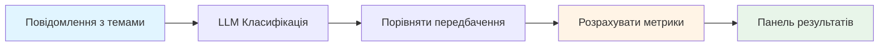
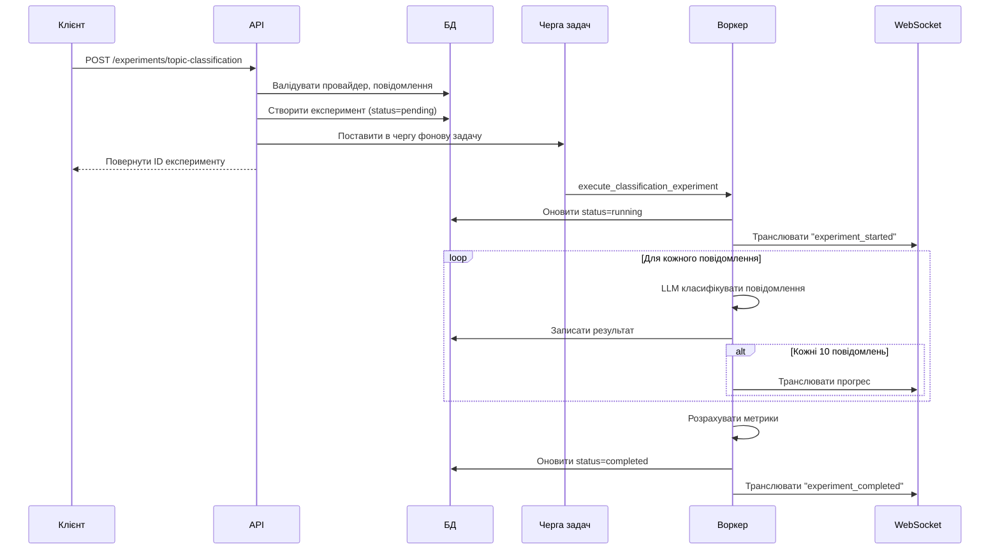
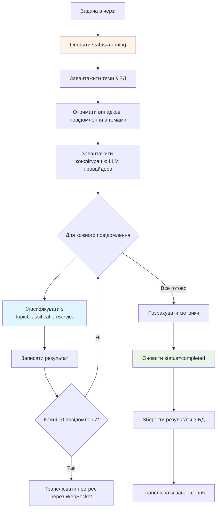

# Експерименти класифікації тем

**Останнє оновлення:** 26 жовтня 2025
**Статус:** Активний - Основна реалізація завершена
**Прогрес реалізації:** 100% (Бекенд + API + Фонові задачі)

---

## Зміст

1. [Огляд системи](#огляд-системи)
2. [Робочий процес експерименту](#робочий-процес-експерименту)
3. [Опції конфігурації](#опції-конфігурації)
4. [Відстежувані метрики](#відстежувані-метрики)
5. [API Ендпоінти](#api-ендпоінти)
6. [Фонове виконання](#фонове-виконання)
7. [Інтерпретація результатів](#інтерпретація-результатів)
8. [Сервіси](#сервіси)

---

## Огляд системи

Експерименти класифікації систематично оцінюють точність LLM класифікації тем порівнюючи передбачені теми з відомо-коректними призначеннями тем у історичних повідомленнях.

### Призначення

!!! tip "Чому використовувати експерименти"
    - **Порівняння моделей:** Тестувати різні LLM провайдери (Ollama проти OpenAI) та моделі
    - **Відстеження точності:** Кількісно визначити якість класифікації з метриками
    - **Аналіз впевненості:** Виявити невпевнені передбачення що потребують людського огляду
    - **Бенчмаркінг продуктивності:** Вимірювати час виконання між провайдерами

### Як це працює



Система:

1. Вибирає повідомлення з попередньо призначеними темами з бази даних
2. Класифікує кожне повідомлення використовуючи вказану LLM модель
3. Порівнює передбачені теми з фактичними темами
4. Розраховує точність, впевненість та метрики часу
5. Генерує матрицю помилок для аналізу патернів помилок

### Випадки використання

<div class="grid cards" markdown>

- :material-compare: **Оцінка моделі**

    Порівняти продуктивність llama3.2:3b проти gpt-4 на вашому специфічному наборі даних

- :material-chart-line: **Відстеження точності**

    Моніторити якість класифікації з часом у міру еволюції тем

- :material-brain: **Налаштування впевненості**

    Виявити передбачення з низькою впевненістю що потребують порогів людського огляду

- :material-speedometer: **Тестування продуктивності**

    Бенчмаркінг часу виконання для вибору економічно ефективних моделей

</div>

---

## Робочий процес експерименту

### Діаграма життєвого циклу



### Життєвий цикл статусів

| Статус | Опис | Тривалість |
|--------|-------------|----------|
| **pending** | Створено, очікує в черзі задач | <1 секунда |
| **running** | Обробка повідомлень з LLM | 1-5 хвилин |
| **completed** | Завершено з результатами | Постійно |
| **failed** | Сталася помилка (див. error_message) | Постійно |

!!! warning "Запущені експерименти"
    Експерименти зі статусом **running** не можуть бути видалені. Дочекайтеся завершення або помилки перед очищенням.

---

## Опції конфігурації

### Обов'язкові параметри

| Параметр | Тип | Опис | Обмеження |
|-----------|------|-------------|-------------|
| **provider_id** | UUID | LLM провайдер для класифікації | Повинен існувати, `is_active=true` |
| **model_name** | string | Ідентифікатор моделі | наприклад, "llama3.2:3b", "gpt-4" |
| **message_count** | integer | Повідомлення для класифікації | Діапазон: 1-1000 |

### Типи провайдерів

=== "Ollama (Локальний)"
    **Конфігурація:**

    - Base URL: `http://localhost:11434` (або налаштований)
    - API ключ: Не потрібен
    - Вартість: Безкоштовно

    **Поширені моделі:**

    - `llama3.2:3b` - Швидка, помірна точність
    - `llama3.1:8b` - Повільніша, вища точність
    - `mistral:7b` - Збалансована продуктивність

=== "OpenAI (Хмарний)"
    **Конфігурація:**

    - Base URL: Стандартний ендпоінт OpenAI
    - API ключ: Зашифрований в базі даних
    - Вартість: Ціноутворення за токен

    **Поширені моделі:**

    - `gpt-4` - Найвища точність, дорого
    - `gpt-3.5-turbo` - Збалансована вартість/продуктивність
    - `gpt-4-turbo` - Швидка, економічно ефективна

### Знімок тем

!!! info "Гарантія консистентності"
    Теми фіксуються на момент створення експерименту як JSONB знімок. Це запобігає невідповідностям якщо теми модифіковані або видалені під час тривалих експериментів.

**Формат знімку:**

| Поле | Опис |
|-------|-------------|
| `topic_id` | Цілочисельний ID теми (ключ) |
| `name` | Назва теми на момент знімку |
| `description` | Опис теми для LLM контексту |

**Призначення:** Забезпечує використання однакових визначень тем протягом експерименту, навіть якщо теми оновлені в базі даних.

---

## Відстежувані метрики

### Точність

**Формула:** `correct_predictions / total_messages`

**Інтерпретація:**

| Діапазон балів | Якість | Рекомендація |
|-------------|---------|----------------|
| 0.95-1.0 | Відмінна | Готово до продакшн |
| 0.80-0.94 | Добра | Рекомендується незначне налаштування |
| 0.70-0.79 | Задовільна | Переглянути визначення тем |
| <0.70 | Погана | Переглянути промпти або модель |

**Приклад:**

- 100 повідомлень класифіковано
- 87 передбачених тем співпали з фактичними темами
- Точність = 0.87 (87%)

---

### Середня впевненість

**Формула:** `sum(confidence_scores) / total_messages`

**Інтерпретація:**

| Діапазон балів | Рівень впевненості | Потрібна дія |
|-------------|-----------------|-----------------|
| >0.90 | Висока впевненість | Довіряти передбаченням |
| 0.70-0.90 | Помірна впевненість | Переглянути випадки з низькою впевненістю |
| <0.70 | Низька впевненість | Потрібен ручний огляд |

**Патерни впевненість проти точність:**

<div class="grid" markdown>

| Патерн | Точність | Впевненість | Діагноз |
|---------|----------|------------|-----------|
| 🎯 **Ідеальний** | Висока | Висока | Відмінна продуктивність моделі |
| ⚠️ **Надмірна впевненість** | Низька | Висока | Модель неправильно розуміє теми |
| 🤔 **Обережний** | Висока | Низька | Моделі потрібні чіткіші визначення |
| 🚨 **Бореться** | Низька | Низька | Перекриття тем або погані промпти |

</div>

---

### Середній час виконання

**Формула:** `sum(execution_times_ms) / total_messages`

**Бенчмарки:**

| Діапазон часу | Клас швидкості | Типові провайдери |
|------------|-------------|-------------------|
| <500мс | Швидка | Ollama малі моделі (3b) |
| 500-2000мс | Помірна | Ollama середні (8b), OpenAI |
| >2000мс | Повільна | Великі моделі (70b+), складні промпти |

**Вплив на вартість:**

- **Ollama:** Безкоштовно, необмежене використання
- **OpenAI:** ~$0.001-0.01 за повідомлення (залежно від моделі)

---

### Матриця помилок

**Структура:** `{actual_topic: {predicted_topic: count}}`

**Приклад матриці:**

| Фактична ↓ / Передбачена → | Робота | Особисте | Проєкти | Всього |
|------------------------|------|----------|----------|-------|
| **Робота** | 45 | 5 | 0 | 50 |
| **Особисте** | 2 | 38 | 0 | 40 |
| **Проєкти** | 1 | 0 | 9 | 10 |

**Інтерпретація:**

- **Діагональні значення** (45, 38, 9): Коректні передбачення
- **Позадіагональні значення** (5, 2, 1): Помилкові класифікації
- **Патерн:** Робота іноді плутається з Особистим (5 випадків)

??? note "Похідні метрики з матриці помилок"
    **Точність** (на тему): `true_positives / (true_positives + false_positives)`

    - Точність Робота: 45 / (45 + 2 + 1) = 0.9375 (93.75%)

    **Повнота** (на тему): `true_positives / (true_positives + false_negatives)`

    - Повнота Робота: 45 / (45 + 5 + 0) = 0.90 (90%)

    **F1 Оцінка**: `2 * (precision * recall) / (precision + recall)`

    - F1 Робота: 2 * (0.9375 * 0.90) / (0.9375 + 0.90) = 0.9184

---

### Результати на повідомлення

Кожен результат класифікації включає:

| Поле | Тип | Опис |
|-------|------|-------------|
| `message_id` | integer | ID повідомлення в базі даних |
| `message_content` | string | Перші 200 символів |
| `actual_topic_id` | integer | Коректна тема (еталонне значення) |
| `actual_topic_name` | string | Назва коректної теми |
| `predicted_topic_id` | integer | LLM передбачена тема |
| `predicted_topic_name` | string | Назва LLM передбаченої теми |
| `confidence` | float | Оцінка впевненості LLM (0.0-1.0) |
| `execution_time_ms` | float | Тривалість класифікації |
| `reasoning` | string | Пояснення LLM (1-2 речення) |
| `alternatives` | array | Альтернативні пропозиції тем |

**Використання:**

- **Виявлення патернів:** Ідентифікувати систематичні помилки (наприклад, завжди плутає дві теми)
- **Огляд якості:** Вивчити передбачення з низькою впевненістю для покращення
- **Налаштування промптів:** Аналізувати міркування для уточнення промптів класифікації
- **Визначення тем:** Виявити неоднозначні межі тем

---

## API Ендпоінти

### Створити експеримент

**Ендпоінт:** `POST /api/v1/experiments/topic-classification`

**Тіло запиту:**

| Поле | Тип | Обов'язкове | Опис |
|-------|------|----------|-------------|
| `provider_id` | UUID | Так | UUID активного LLM провайдера |
| `model_name` | string | Так | Ідентифікатор моделі |
| `message_count` | integer | Так | Повідомлення для класифікації (1-1000) |

**Відповідь:** `201 Created`

| Поле | Опис |
|-------|-------------|
| `id` | ID експерименту для відстеження |
| `status` | "pending" (в черзі на обробку) |
| `created_at` | Мітка часу |

**Помилки валідації:**

!!! warning "Поширені помилки"
    - `404 Not Found` - Провайдер не існує
    - `400 Bad Request` - Провайдер неактивний (`is_active=false`)
    - `400 Bad Request` - Недостатньо повідомлень з темами в базі даних

**Побічні ефекти:**

- Створює запис експерименту в базі даних
- Ставить в чергу фонову задачу через TaskIQ
- Повертає негайно без очікування завершення

---

### Список експериментів

**Ендпоінт:** `GET /api/v1/experiments/topic-classification`

**Параметри запиту:**

| Параметр | Тип | За замовчуванням | Опис |
|-----------|------|---------|-------------|
| `skip` | integer | 0 | Зміщення пагінації |
| `limit` | integer | 50 | Розмір сторінки (макс 100) |
| `status` | string | все | Фільтр за статусом |

**Відповідь:** `200 OK`

Повертає пагінований список експериментів впорядкований за датою створення (найновіші першими).

**Приклад відповіді:**

| Поле | Опис |
|-------|-------------|
| `items` | Масив підсумків експериментів |
| `total` | Загальна кількість експериментів |
| `page` | Поточний номер сторінки |
| `page_size` | Елементів на сторінку |

---

### Отримати деталі експерименту

**Ендпоінт:** `GET /api/v1/experiments/topic-classification/{experiment_id}`

**Відповідь:** `200 OK`

Повертає повні деталі експерименту включаючи:

- Конфігурація експерименту
- Підсумкові метрики (точність, впевненість, час виконання)
- Матриця помилок
- Результати класифікації на повідомлення

**Помилки:**

- `404 Not Found` - Експеримент не існує

**Випадки використання:**

<div class="grid cards" markdown>

- :material-file-chart: **Аналіз**

    Завантажити результати для візуалізації в зовнішніх інструментах

- :material-bug: **Налагодження**

    Переглянути окремі помилкові класифікації для покращення промптів

- :material-compare: **Порівняння**

    Порівняти метрики між різними моделями поруч

- :material-chart-box: **Звітність**

    Генерувати звіти якості класифікації для зацікавлених сторін

</div>

---

### Видалити експеримент

**Ендпоінт:** `DELETE /api/v1/experiments/topic-classification/{experiment_id}`

**Відповідь:** `204 No Content`

**Валідація:**

!!! danger "Правила видалення"
    - Неможливо видалити експерименти зі `status=running`
    - Назавжди видаляє експеримент та всі результати
    - Відкат недоступний

**Побічні ефекти:**

- Видаляє запис експерименту з бази даних
- Видаляє матрицю помилок та результати класифікації
- Не впливає на оригінальні повідомлення або теми

---

## Фонове виконання

### Інтеграція TaskIQ

**Назва задачі:** `execute_classification_experiment`
**Брокер:** NATS з JetStream
**Виконання:** Асинхронне, неблокуюче

### Потік обробки



### Вибірка повідомлень

**Запит:** Випадкова вибірка повідомлень з `topic_id IS NOT NULL`

```
SELECT * FROM messages
WHERE topic_id IS NOT NULL
ORDER BY random()
LIMIT {message_count}
```

**Характеристики:**

- Випадковий розподіл забезпечує неупереджену оцінку
- Включені лише повідомлення з попередньо призначеними темами
- Призначення теми зроблене перед створенням експерименту

---

### WebSocket події

**Тема:** `"experiments"`

**Типи подій:**

=== "experiment_started"
    **Корисне навантаження:**

    | Поле | Опис |
    |-------|-------------|
    | `type` | "experiment_started" |
    | `experiment_id` | ID експерименту |
    | `message_count` | Всього повідомлень до обробки |

=== "experiment_progress"
    **Корисне навантаження:**

    | Поле | Опис |
    |-------|-------------|
    | `type` | "experiment_progress" |
    | `experiment_id` | ID експерименту |
    | `current` | Повідомлень оброблено досі |
    | `total` | Всього повідомлень |
    | `percentage` | Відсоток прогресу (0-100) |

    **Частота:** Транслювати кожні 10 повідомлень

=== "experiment_completed"
    **Корисне навантаження:**

    | Поле | Опис |
    |-------|-------------|
    | `type` | "experiment_completed" |
    | `experiment_id` | ID експерименту |
    | `accuracy` | Фінальна оцінка точності |

=== "experiment_failed"
    **Корисне навантаження:**

    | Поле | Опис |
    |-------|-------------|
    | `type` | "experiment_failed" |
    | `experiment_id` | ID експерименту |
    | `error` | Повідомлення про помилку |

### Обробка помилок

**Помилки окремих повідомлень:**

- Помилки класифікації записані як ERROR результат
- Впевненість встановлена в 0.0
- Експеримент продовжує обробку решти повідомлень

**Критичні помилки:**

- Оновити `status=failed`
- Встановити поле `error_message`
- Транслювати подію `experiment_failed`
- Часткові результати не збережені

---

## Інтерпретація результатів

### Аналіз точності

**Висока точність (>0.85):**

✅ Модель розуміє визначення тем
✅ Теми добре розділені концептуально
✅ Тренувальний промпт ефективний

**Низька точність (<0.70):**

❌ Теми можуть перекриватися або конфліктувати
❌ Описи неоднозначні
❌ Моделі бракує доменного контексту

**Дії для покращення:**

1. Переглянути помилково класифіковані повідомлення на патерни
2. Уточнити описи тем для ясності
3. Додати приклади до визначень тем
4. Тестувати різні моделі або промпти

---

### Аналіз впевненості

**Висока впевненість + Висока точність:**

🎯 Ідеальний стан - розгортати в продакшн

**Висока впевненість + Низька точність:**

⚠️ Надмірно впевнена модель - дослідити систематичні упередження

**Низька впевненість + Висока точність:**

🤔 Обережна модель - може потребувати налаштування порогу

**Низька впевненість + Низька точність:**

🚨 Модель бореться - потребує редизайну промпту/теми

---

### Патерни матриці помилок

**Концентрація на діагоналі:**

✅ Хороше розділення між темами
✅ Чіткі межі тем

**Позадіагональні кластери:**

❌ Конкретні пари тем часто плутаються
❌ Визначення тем перекриваються

**Стратегія аналізу:**

1. Ідентифікувати часто плутані пари тем
2. Переглянути повідомлення в цих комірках помилок
3. Порівняти описи тем на перекриття
4. Уточнити описи або об'єднати подібні теми

---

### Міркування щодо часу виконання

**Швидкі моделі (<500мс):**

- ✅ Підходять для класифікації в реальному часі
- ✅ Економічно ефективні для обробки великих обсягів
- ⚠️ Можуть жертвувати точністю заради швидкості

**Повільні моделі (>2000мс):**

- ✅ Потенціал вищої точності
- ❌ Не підходять для використання в реальному часі
- ❌ Вищі витрати (якщо використовуються платні API)

**Оптимізація:**

- Використовувати швидкі моделі для масової обробки
- Зарезервувати повільні моделі для критичних/невпевнених випадків
- Реалізувати маршрутизацію на основі впевненості (спершу швидка, повільна якщо низька впевненість)

---

## Сервіси

### TopicClassificationService

**Розташування:** `backend/app/services/topic_classification_service.py`

**Відповідальності:**

<div class="grid cards" markdown>

- :material-cog: **Створення експерименту**

    Валідує провайдер, повідомлення, фіксує знімок тем

- :material-brain: **Класифікація повідомлень**

    Виконує LLM класифікацію зі структурованим виводом

- :material-calculator: **Розрахунок метрик**

    Обчислює точність, впевненість, матрицю помилок

</div>

**Ключові методи:**

| Метод | Опис | Повертає |
|--------|-------------|---------|
| `run_experiment()` | Створює запис експерименту | Експеримент зі status=pending |
| `classify_message()` | Класифікує одне повідомлення | TopicClassificationResult + час виконання |
| `calculate_metrics()` | Обчислює точність та матрицю помилок | Словник метрик |

**Залежності:**

- `pydantic-ai` для структурованих LLM виводів
- `CredentialEncryption` для розшифровки API ключів
- `OllamaProvider` / `OpenAIProvider` для конфігурації моделей

---

### WebSocketManager

**Розташування:** `backend/app/services/websocket_manager.py`

**Інтеграція:**

Сервіс транслює прогрес експерименту підключеним клієнтам в реальному часі.

**Трансльовані події:**

- Зміни життєвого циклу експерименту (запущено, завершено, помилка)
- Оновлення прогресу кожні 10 повідомлень
- Фінальні результати з оцінкою точності

**Патерн використання:**

Клієнти підписуються на тему `"experiments"` для отримання оновлень в реальному часі під час обробки класифікації.

---

### CredentialEncryption

**Розташування:** `backend/app/services/credential_encryption.py`

**Призначення:**

Безпечно розшифровує API ключі OpenAI збережені зашифрованими в таблиці `llm_providers`.

**Безпека:**

- Використовує симетричне шифрування Fernet
- Ключ шифрування збережений в змінних оточення
- API ключі ніколи не логуються або не відкриваються у відповідях

---

## Пов'язана документація

- **Система аналізу:** Дивіться [analysis-system.md](./analysis-system.md)
- **Фільтрація шуму:** Дивіться [noise-filtering.md](./noise-filtering.md)
- **Векторна база даних:** Дивіться [vector-database.md](./vector-database.md)

---

*Цей документ надає вичерпне висвітлення функції експериментів класифікації тем для оцінки якості LLM класифікації тем.*
