# Діаграми архітектури системи

Цей документ надає комплексну візуальну документацію архітектури системи Task Tracker на різних рівнях деталізації.

## Високорівнева архітектура системи

Task Tracker — це подієво-орієнтована мікросервісна система з наступними ключовими компонентами:

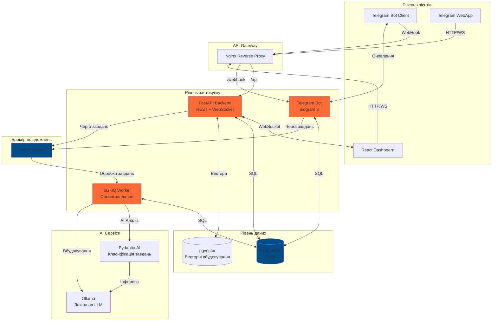

**Ключові характеристики:**

- **Подієво-орієнтована**: Асинхронна комунікація через брокер повідомлень NATS
- **Реального часу**: WebSocket з'єднання для оновлень дашборду
- **AI-керована**: Автоматична класифікація та аналіз завдань за допомогою локальної LLM
- **Масштабована**: Мікросервісна архітектура з незалежними компонентами

## Архітектура компонентів

### Межі сервісів

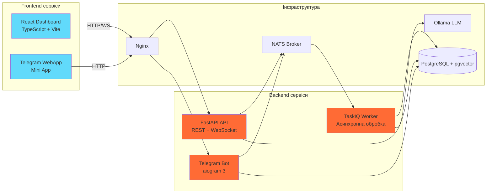

## Потік класифікації завдань

Ця діаграма послідовності показує, як повідомлення завдання проходить через систему від введення користувача до AI класифікації:

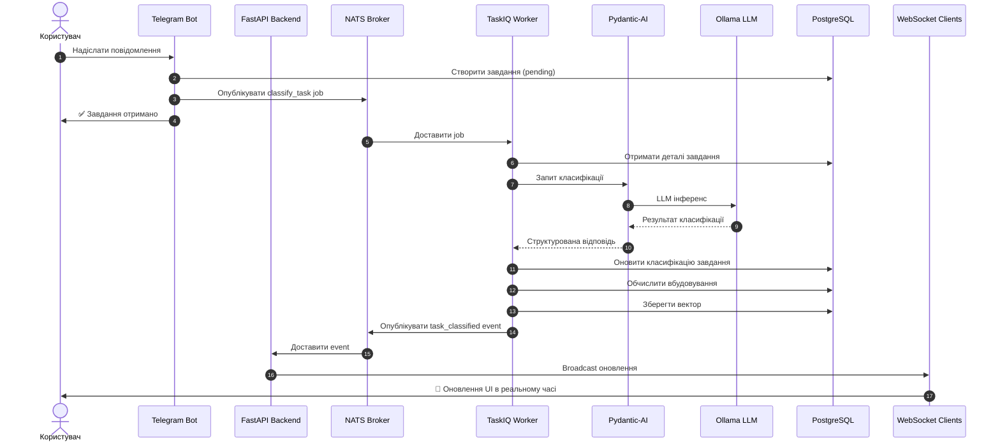

**Кроки потоку:**

1. Користувач надсилає повідомлення через Telegram
2. Бот створює завдання зі статусом `pending`
3. Завдання ставиться в чергу NATS для асинхронної обробки
4. Worker забирає завдання класифікації
5. Pydantic-AI структурує запит до LLM
6. Ollama виконує інференс
7. Завдання оновлюється з класифікацією + вбудовуванням
8. WebSocket broadcast для всіх підключених клієнтів

## Потік оновлень в реальному часі

Показує, як WebSocket з'єднання синхронізують дашборд:

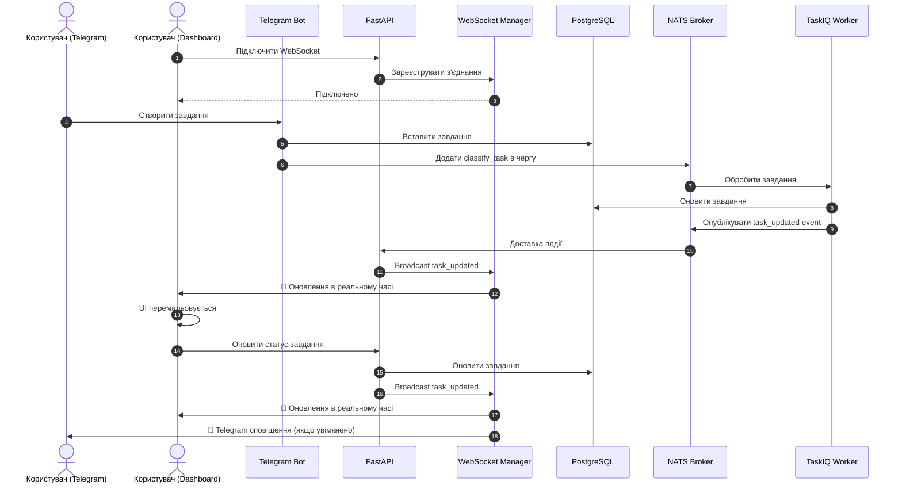

## Робочий процес системи аналізу

Система аналізу обробляє атоми через кілька AI провайдерів для генерації пропозицій:

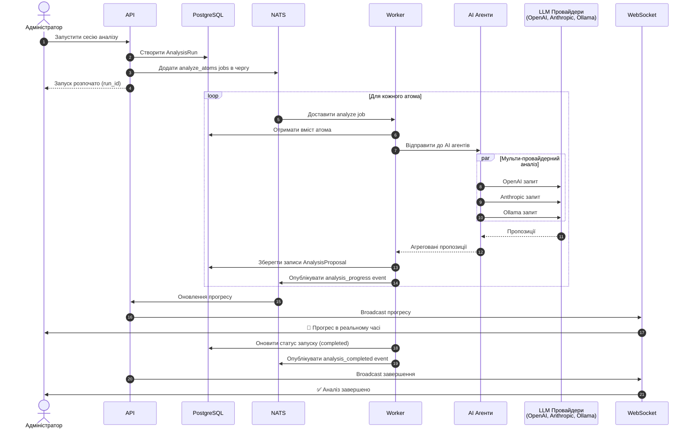

**Можливості аналізу:**

- Паралельне виконання з кількома провайдерами
- Відстеження прогресу через WebSocket
- Налаштовувані стратегії агентів
- Валідація провайдерів перед виконанням

## Архітектура потоку даних

Як дані рухаються через систему:

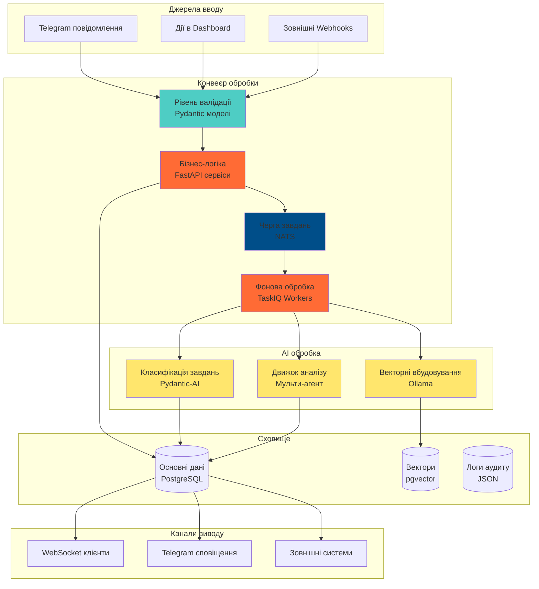

## Матриця взаємодії компонентів

Ключові взаємодії між компонентами системи:

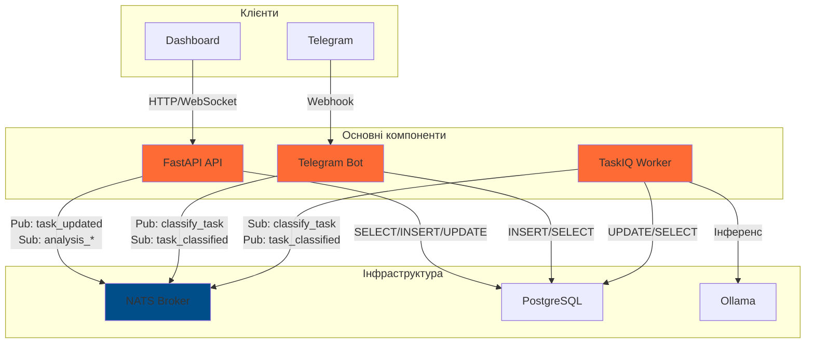

## Технологічний стек

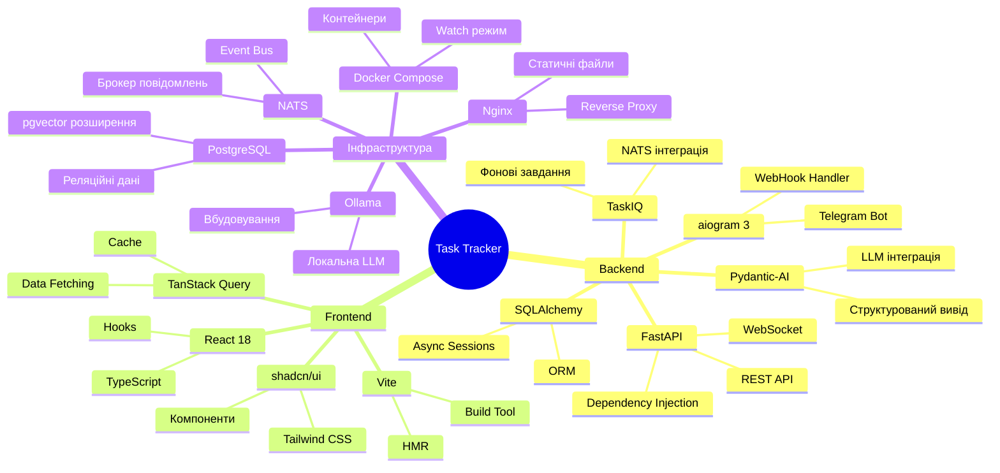

## Архітектура розгортання

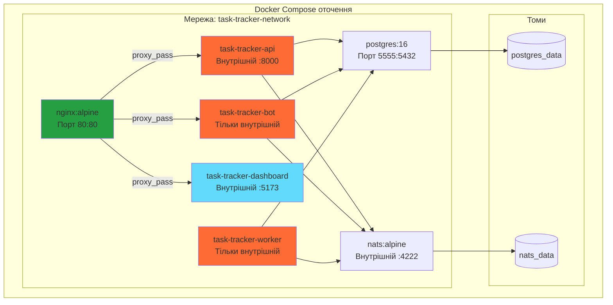

## Огляд схеми бази даних

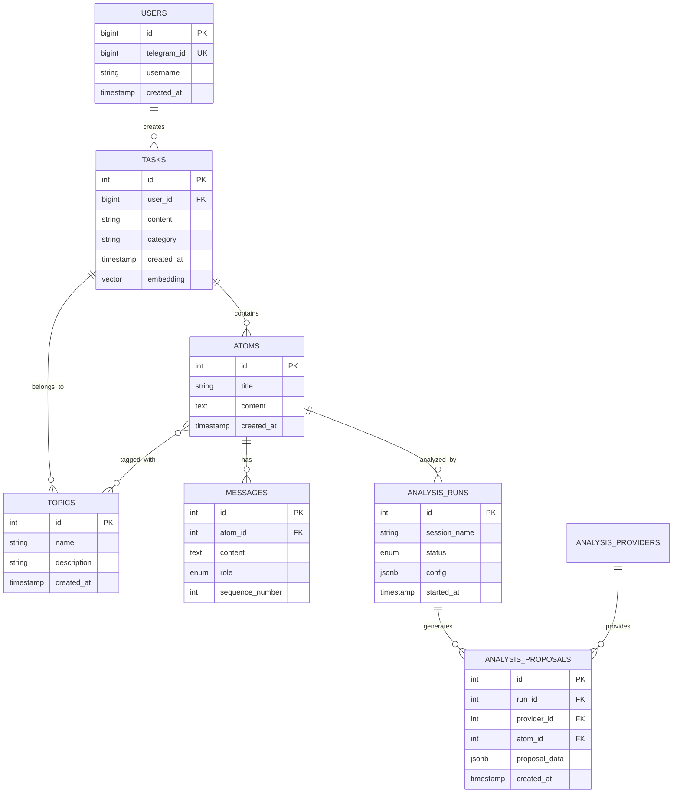

## Робочий процес розробки

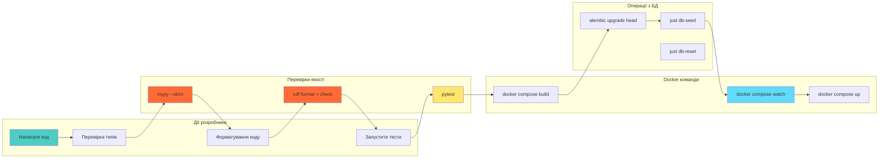

## Ключові шаблони проектування

### Подієво-орієнтована архітектура

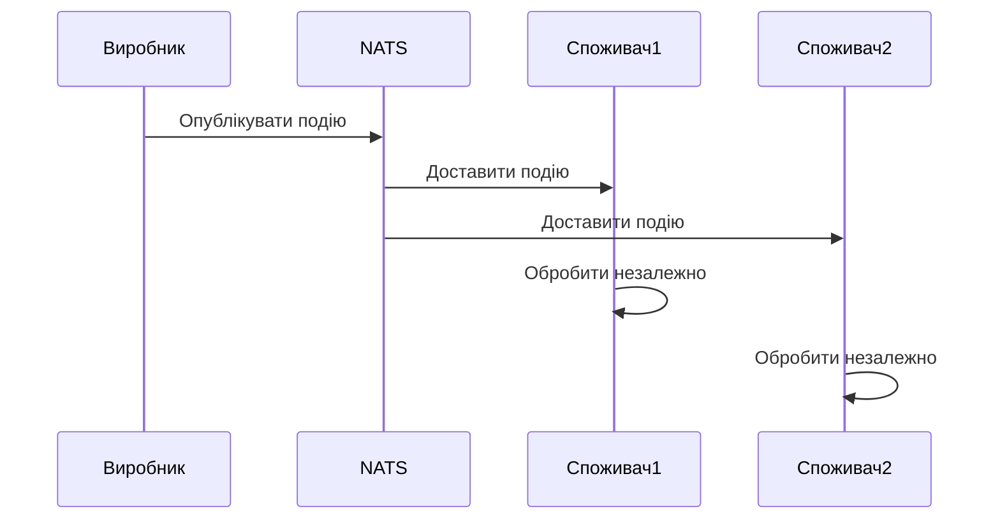

### Dependency Injection (FastAPI)

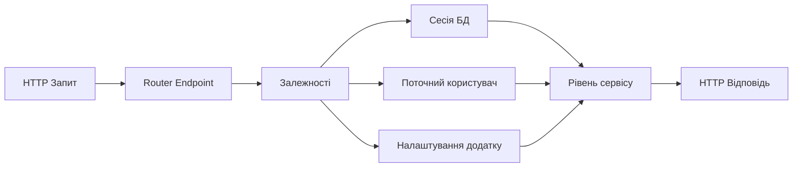

### Repository Pattern

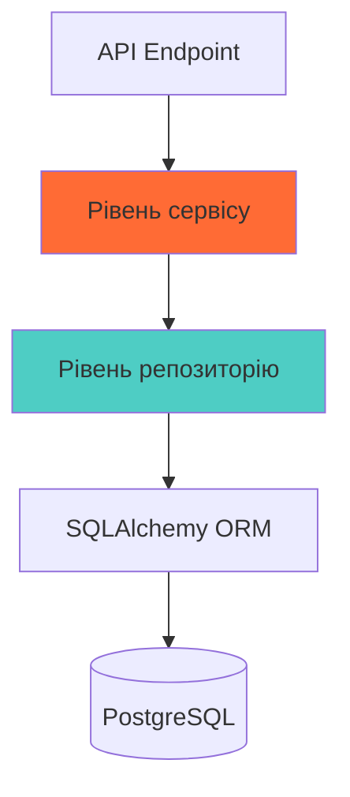

## Моніторинг та спостережуваність

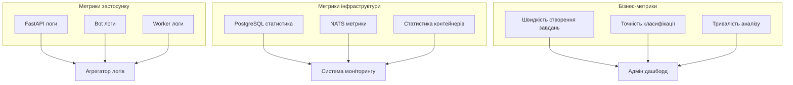

## Підсумок

Система Task Tracker побудована на сучасних архітектурних принципах:

- **Подієво-орієнтована**: Слабке зв'язування через NATS повідомлення
- **Реального часу**: WebSocket для оновлень в реальному часі
- **AI-керована**: Інтеграція локальної LLM з Ollama
- **Типобезпечна**: Сувора перевірка типів mypy у всій Python кодовій базі
- **Контейнеризована**: Повна оркестрація Docker Compose
- **Масштабована**: Незалежне масштабування сервісів
- **Спостережувана**: Комплексне логування та метрики

Для більш детальної інформації про конкретні компоненти, див. відповідну архітектурну документацію.
