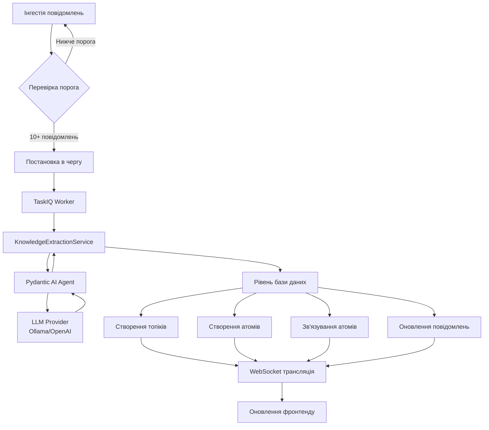

# Система витягування знань

!!! info "Посібник для розробників"
    Цей документ охоплює технічну архітектуру, деталі реалізації та патерни інтеграції для системи витягування знань.

---

## Огляд архітектури

Система витягування знань - це конвеєр фонової обробки, який перетворює неструктуровані дані повідомлень у структуровані сутності знань за допомогою аналізу на основі LLM.

### Компоненти системи



### Ключові сервіси

| Компонент | Відповідальність | Розташування |
|-----------|-----------------|--------------|
| **KnowledgeExtractionService** | Основна логіка витягування | `app/services/knowledge_extraction_service.py` |
| **extract_knowledge_from_messages_task** | Оркестрація фонових задач | `app/tasks.py` |
| **Knowledge API** | HTTP ендпоінти для ручного запуску | `app/api/v1/knowledge.py` |
| **WebSocket Manager** | Трансляція подій в реальному часі | `app/services/websocket_manager.py` |

---

## Моделі даних

### Схема бази даних

```mermaid
erDiagram
    Topic ||--o{ TopicAtom : містить
    Topic ||--o{ Message : категоризує
    Atom ||--o{ TopicAtom : належить_до
    Atom ||--o{ AtomLink : зв'язує_від
    Atom ||--o{ AtomLink : зв'язує_до

    Topic {
        int id PK
        string name UK
        text description
        string icon
        string color
        timestamp created_at
        timestamp updated_at
    }

    Atom {
        int id PK
        string type
        string title
        text content
        float confidence
        bool user_approved
        jsonb meta
        timestamp created_at
        timestamp updated_at
    }

    TopicAtom {
        int id PK
        int topic_id FK
        int atom_id FK
        text note
        timestamp created_at
    }

    AtomLink {
        int id PK
        int from_atom_id FK
        int to_atom_id FK
        string link_type
        float strength
        timestamp created_at
    }

    Message {
        int id PK
        int topic_id FK
        text content
        timestamp sent_at
    }
```

### Класи моделей

**Topic** (`app/models/topic.py`)

```python
class Topic(IDMixin, TimestampMixin, SQLModel, table=True):
    name: str = Field(unique=True, index=True, max_length=100)
    description: str = Field(sa_type=Text)
    icon: str | None = Field(default=None, max_length=50)
    color: str | None = Field(default=None, max_length=7)
```

**Atom** (`app/models/atom.py`)

```python
class Atom(IDMixin, TimestampMixin, SQLModel, table=True):
    type: str = Field(max_length=50)  # (1)!
    title: str = Field(max_length=200)
    content: str = Field(sa_type=Text)
    confidence: float = Field(ge=0.0, le=1.0)
    user_approved: bool = Field(default=False)
    meta: dict[str, Any] = Field(default_factory=dict, sa_type=JSON)  # (2)!
```

1. Тип повинен бути одним з: `problem`, `solution`, `decision`, `insight`, `question`, `pattern`, `requirement`
2. Meta зберігає ID вихідних повідомлень та метадані витягування

**TopicAtom** - Зв'язок багато-до-багатьох

```python
class TopicAtom(IDMixin, TimestampMixin, SQLModel, table=True):
    topic_id: int = Field(foreign_key="topics.id")
    atom_id: int = Field(foreign_key="atoms.id")
    note: str | None = Field(default=None, sa_type=Text)
```

**AtomLink** - Двонаправлені зв'язки атомів

```python
class AtomLink(IDMixin, TimestampMixin, SQLModel, table=True):
    from_atom_id: int = Field(foreign_key="atoms.id")
    to_atom_id: int = Field(foreign_key="atoms.id")
    link_type: str = Field(max_length=50)  # (1)!
    strength: float | None = Field(default=None, ge=0.0, le=1.0)
```

1. Типи зв'язків: `solves`, `supports`, `contradicts`, `continues`, `refines`, `relates_to`, `depends_on`

---

## Конвеєр витягування

### Фази робочого процесу

#### Фаза 1: Виявлення тригера

```python
# У app/tasks.py
async def queue_knowledge_extraction_if_needed(message_id: int, db: Any) -> None:
    cutoff_time = datetime.now(UTC) - timedelta(hours=KNOWLEDGE_EXTRACTION_LOOKBACK_HOURS)

    count_stmt = (
        select(func.count())
        .select_from(Message)
        .where(Message.topic_id.is_(None), Message.sent_at >= cutoff_time)
    )
    result = await db.execute(count_stmt)
    unprocessed_count = result.scalar() or 0

    if unprocessed_count >= KNOWLEDGE_EXTRACTION_THRESHOLD:  # (1)!
        await extract_knowledge_from_messages_task.kiq(
            message_ids=message_ids,
            provider_id=str(provider.id)
        )
```

1. Стандартний поріг: 10 повідомлень за 24 години

#### Фаза 2: Виконання фонової задачі

```python
# У app/tasks.py
@nats_broker.task
async def extract_knowledge_from_messages_task(
    message_ids: list[int],
    provider_id: str
) -> dict[str, int]:
    provider = await db.get(LLMProvider, UUID(provider_id))
    messages = await db.execute(select(Message).where(Message.id.in_(message_ids)))

    service = KnowledgeExtractionService(provider=provider)

    extraction_output = await service.extract_knowledge(messages)  # (1)!

    topic_map = await service.save_topics(extraction_output.topics, db)
    saved_atoms = await service.save_atoms(extraction_output.atoms, topic_map, db)
    links_created = await service.link_atoms(extraction_output.atoms, saved_atoms, db)
    messages_updated = await service.update_messages(messages, topic_map, extraction_output.topics, db)

    return {
        "topics_created": len(topic_map),
        "atoms_created": len(saved_atoms),
        "links_created": links_created,
        "messages_updated": messages_updated,
    }
```

1. Це викликає LLM через Pydantic AI зі структурованим виводом

#### Фаза 3: Аналіз LLM

```python
# У app/services/knowledge_extraction_service.py
async def extract_knowledge(
    self,
    messages: Sequence[Message],
    temperature: float = 0.3,
    max_tokens: int | None = 4096,
) -> KnowledgeExtractionOutput:
    prompt = self._build_prompt(messages)  # (1)!
    model = self._build_model_instance(api_key)  # (2)!

    agent = PydanticAgent(
        model=model,
        system_prompt=KNOWLEDGE_EXTRACTION_SYSTEM_PROMPT,
        output_type=KnowledgeExtractionOutput,  # (3)!
    )

    result = await agent.run(prompt, model_settings=model_settings_obj)
    return result.output
```

1. Форматує повідомлення з контекстом для аналізу LLM
2. Налаштовує провайдер Ollama або OpenAI на основі конфігурації
3. Забезпечує структурований JSON вивід, який відповідає схемі Pydantic

#### Фаза 4: Створення сутностей

```python
async def save_topics(
    self,
    extracted_topics: list[ExtractedTopic],
    session: AsyncSession,
    confidence_threshold: float = 0.7
) -> dict[str, Topic]:
    topic_map: dict[str, Topic] = {}

    for extracted_topic in extracted_topics:
        if extracted_topic.confidence < confidence_threshold:  # (1)!
            logger.warning(f"Topic '{extracted_topic.name}' нижче порога, пропуск")
            continue

        existing_topic = await session.execute(
            select(Topic).where(Topic.name == extracted_topic.name)
        )

        if existing_topic:
            topic_map[extracted_topic.name] = existing_topic
        else:
            new_topic = Topic(
                name=extracted_topic.name,
                description=extracted_topic.description,
                icon=auto_select_icon(extracted_topic.name, extracted_topic.description),
                color=auto_select_color(icon),
            )
            session.add(new_topic)
            topic_map[extracted_topic.name] = new_topic

    await session.commit()
    return topic_map
```

1. Створює тільки топіки з впевненістю >= 0.7 за замовчуванням

#### Фаза 5: Зв'язування відносин

```python
async def link_atoms(
    self,
    extracted_atoms: list[ExtractedAtom],
    saved_atoms: list[Atom],
    session: AsyncSession
) -> int:
    atom_title_to_id = {atom.title: atom.id for atom in saved_atoms}
    links_created = 0

    for extracted_atom in extracted_atoms:
        from_atom_id = atom_title_to_id[extracted_atom.title]

        for target_title, link_type in zip(
            extracted_atom.links_to_atom_titles,
            extracted_atom.link_types
        ):
            to_atom_id = atom_title_to_id.get(target_title)
            if not to_atom_id:
                continue

            new_link = AtomLink(
                from_atom_id=from_atom_id,
                to_atom_id=to_atom_id,
                link_type=link_type,
            )
            session.add(new_link)
            links_created += 1

    await session.commit()
    return links_created
```

---

## Інтеграція LLM

### Конфігурація Pydantic AI

Система використовує **Pydantic AI** для структурованого виводу LLM:

```python
from pydantic import BaseModel, Field
from pydantic_ai import Agent as PydanticAgent

class ExtractedTopic(BaseModel):
    name: str = Field(max_length=100, description="Лаконічна назва топіка (макс. 2-4 слова)")
    description: str = Field(description="Чіткий опис теми обговорення")
    confidence: float = Field(ge=0.0, le=1.0)
    keywords: list[str] = Field(description="Ключові терміни, пов'язані з цим топіком")
    related_message_ids: list[int] = Field(description="ID вихідних повідомлень")

class ExtractedAtom(BaseModel):
    type: str = Field(description="Тип атома: problem/solution/decision/insight/...")
    title: str = Field(max_length=200, description="Короткий заголовок")
    content: str = Field(description="Повний самодостатній контент")
    confidence: float = Field(ge=0.0, le=1.0)
    topic_name: str = Field(description="Назва батьківського топіка")
    related_message_ids: list[int]
    links_to_atom_titles: list[str] = Field(default_factory=list)
    link_types: list[str] = Field(default_factory=list)

class KnowledgeExtractionOutput(BaseModel):
    topics: list[ExtractedTopic]
    atoms: list[ExtractedAtom]
```

### Системний промпт

Якість витягування сильно залежить від системного промпту - див. англійську версію для повного тексту.

### Підтримка провайдерів

**Ollama** (Локальний LLM)

```python
if self.provider.type == ProviderType.ollama:
    ollama_provider = OllamaProvider(base_url=self.provider.base_url)
    return OpenAIChatModel(
        model_name=self.model_name,  # наприклад, "qwen2.5:14b"
        provider=ollama_provider,
    )
```

**OpenAI** (Хмарний LLM)

```python
elif self.provider.type == ProviderType.openai:
    openai_provider = OpenAIProvider(api_key=api_key)
    return OpenAIChatModel(
        model_name=self.model_name,  # наприклад, "gpt-4o"
        provider=openai_provider,
    )
```

---

## API інтеграція

### Ендпоінт ручного запуску

**POST /api/v1/knowledge/extract**

```python
@router.post("/extract", response_model=KnowledgeExtractionResponse, status_code=status.HTTP_202_ACCEPTED)
async def trigger_knowledge_extraction(
    request: KnowledgeExtractionRequest,
    db: DatabaseDep
) -> KnowledgeExtractionResponse:
    provider = await db.get(LLMProvider, request.provider_id)
    if not provider or not provider.is_active:
        raise HTTPException(status_code=400, detail="Невалідний або неактивний провайдер")

    await extract_knowledge_from_messages_task.kiq(
        message_ids=request.message_ids,
        provider_id=str(request.provider_id)
    )

    return KnowledgeExtractionResponse(
        message=f"Витягування знань поставлено в чергу для {len(request.message_ids)} повідомлень",
        message_count=len(request.message_ids),
        provider_id=str(request.provider_id),
    )
```

**Схема запиту**

```typescript
{
  "message_ids": number[],  // 1-100 ID повідомлень
  "provider_id": string     // UUID активного LLM провайдера
}
```

**Схема відповіді**

```typescript
{
  "message": string,
  "message_count": number,
  "provider_id": string
}
```

---

## WebSocket події

Система транслює оновлення в реальному часі підключеним клієнтам:

### Типи подій

**extraction_started**

```json
{
  "type": "knowledge.extraction_started",
  "data": {
    "message_count": 15,
    "provider_id": "uuid"
  }
}
```

**topic_created**

```json
{
  "type": "knowledge.topic_created",
  "data": {
    "topic_id": 42,
    "topic_name": "Дизайн API"
  }
}
```

**atom_created**

```json
{
  "type": "knowledge.atom_created",
  "data": {
    "atom_id": 123,
    "atom_title": "Впровадити OAuth2 flow",
    "atom_type": "solution"
  }
}
```

**extraction_completed**

```json
{
  "type": "knowledge.extraction_completed",
  "data": {
    "message_count": 15,
    "topics_created": 2,
    "atoms_created": 8,
    "links_created": 5,
    "messages_updated": 15
  }
}
```

**extraction_failed**

```json
{
  "type": "knowledge.extraction_failed",
  "data": {
    "error": "Таймаут підключення провайдера"
  }
}
```

---

## Довідник конфігурації

### Змінні середовища

```bash
# Не налаштовується безпосередньо через env, модифікуйте константи в коді:
# KNOWLEDGE_EXTRACTION_THRESHOLD = 10
# KNOWLEDGE_EXTRACTION_LOOKBACK_HOURS = 24
```

### Параметри сервісу

```python
# У KnowledgeExtractionService.__init__
model_name: str = "qwen2.5:14b"  # Модель за замовчуванням для Ollama

# У методі extract_knowledge
temperature: float = 0.3  # LLM семплування (нижче = більш сфокусовано)
max_tokens: int = 4096    # Максимум токенів відповіді

# У методах save_topics/save_atoms
confidence_threshold: float = 0.7  # Мінімальна впевненість для автоматичного створення
```

### Рекомендації з налаштування

| Параметр | Низьке значення | За замовчуванням | Високе значення |
|----------|----------------|------------------|----------------|
| **Temperature** | 0.1 (дуже сфокусовано) | 0.3 | 0.7 (креативно) |
| **Max Tokens** | 2048 (коротко) | 4096 | 8192 (детально) |
| **Confidence** | 0.5 (дозвільно) | 0.7 | 0.9 (строго) |
| **Threshold** | 5 повід. (часто) | 10 | 20 (рідко) |

---

## Тестування

### Покриття тестами

**42 тести, 96% покриття** по:

- Рівень сервісу (`test_knowledge_extraction_service.py`)
- API ендпоінти (`test_knowledge_api.py`)
- Фонові задачі (`test_knowledge_extraction_task.py`)

### Стратегія моків

Виклики LLM мокуються для детермінованого тестування - див. англійську версію для прикладів.

### Запуск тестів

```bash
# Запустити всі тести витягування знань
uv run pytest tests/ -k knowledge -v

# Запустити з покриттям
uv run pytest tests/ -k knowledge --cov=app/services/knowledge_extraction_service --cov-report=term-missing
```

---

## Усунення несправностей

Див. англійську версію для детального розбору типових проблем та їх рішень.

---

## Оптимізація продуктивності

### Запити до бази даних

**Використовуйте завчасне завантаження для зв'язків:**

```python
from sqlalchemy.orm import selectinload

stmt = (
    select(Topic)
    .options(selectinload(Topic.atoms))
    .where(Topic.id == topic_id)
)
```

**Пакетні вставки для атомів:**

```python
session.add_all(saved_atoms)  # Швидше ніж окремі додавання
await session.flush()  # Отримати ID перед комітом
```

### Виклики LLM

**Оптимізуйте розмір пакета:**

- **Малі пакети (5-10):** Швидко, але більше API викликів
- **Середні пакети (10-20):** Збалансована якість/швидкість
- **Великі пакети (30-50):** Повільніше, але менше викликів

---

## Майбутні покращення

### Заплановані функції

1. **Інкрементальне витягування** - Обробка тільки нових повідомлень з моменту останнього витягування
2. **Злиття атомів** - Автоматичне виявлення та злиття дублікатів
3. **Калібрування впевненості** - Навчання оптимального порога для кожного проекту
4. **Підтримка багатьох мов** - Витягування знань з неангломовних повідомлень
5. **Користувацькі правила витягування** - Визначені користувачем патерни
6. **Версіонування атомів** - Відстеження редагувань та покращень

---

## Посилання

- **Документація Pydantic AI:** https://ai.pydantic.dev
- **Документація TaskIQ:** https://taskiq-python.github.io
- **Документація SQLModel:** https://sqlmodel.tiangolo.com

---

!!! tip "Внесок"
    Якщо ви покращуєте систему витягування, оновіть цю документацію та додайте тести для нових функцій.
