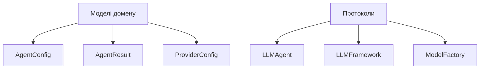
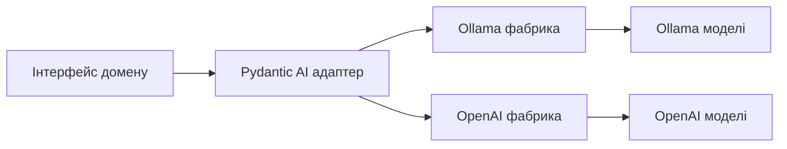
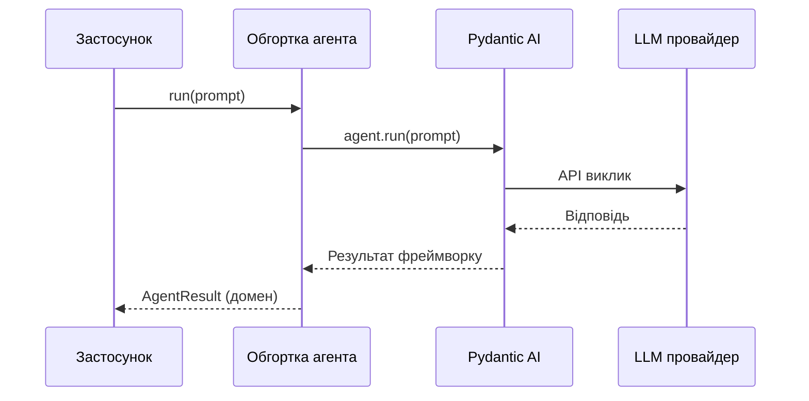
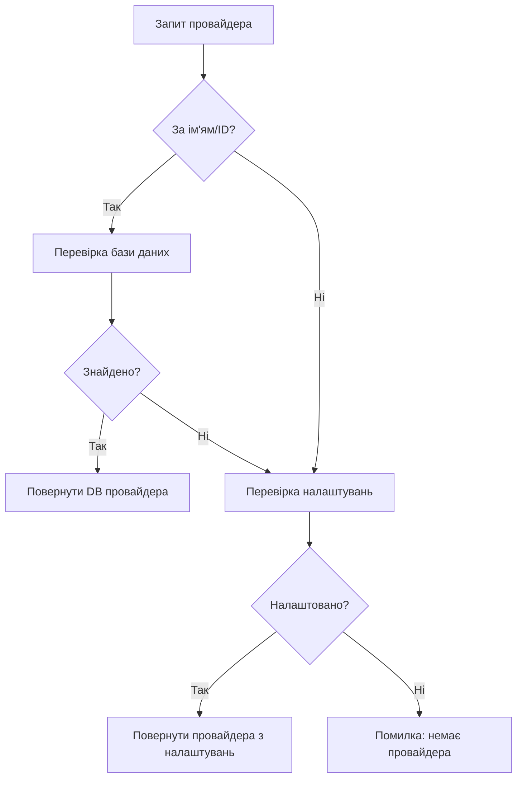
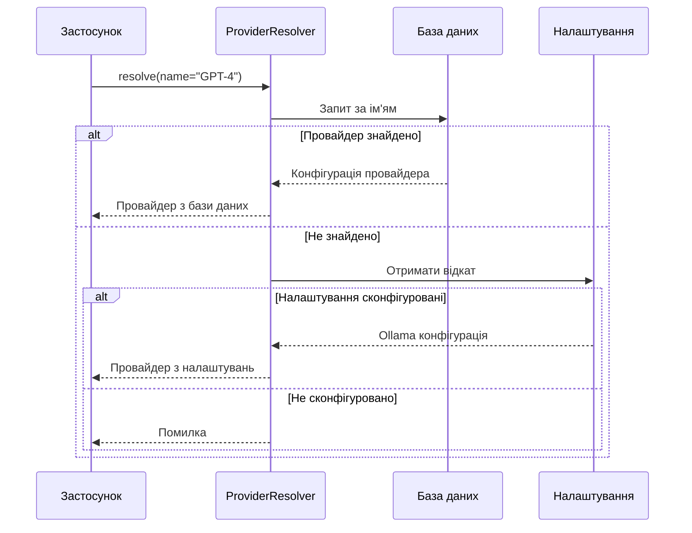

# Гексагональна архітектура LLM

**Останнє оновлення:** 21 жовтня 2025
**Статус:** Готово до продакшену
**Прогрес реалізації:** 100% (169 тестів, 96% покриття)

---

## Зміст

1. [Огляд системи](#огляд-системи)
2. [Шари архітектури](#шари-архітектури)
3. [Ключові особливості](#ключові-особливості)
4. [Налаштування провайдерів](#налаштування-провайдерів)
5. [Незалежність від фреймворків](#незалежність-від-фреймворків)
6. [Шлях міграції](#шлях-міграції)
7. [Переваги](#переваги)

---

## Огляд системи

Гексагональна архітектура LLM (також відома як Порти та Адаптери) забезпечує незалежний від фреймворку підхід до інтеграції AI. Цей дизайн дозволяє Task Tracker змінювати LLM фреймворки без переписування бізнес-логіки.

!!! info "Що таке гексагональна архітектура?"
    Гексагональна архітектура відокремлює основну бізнес-логіку від зовнішніх залежностей (таких як AI фреймворки). Це створює чіткі межі, які роблять систему тестованою, підтримуваною та адаптованою до змін технологій.

### Постановка проблеми

Традиційна інтеграція AI тісно прив'язує ваш додаток до конкретного фреймворку:

- Пряме використання Pydantic AI у всій кодовій базі
- Складно мігрувати на LangChain чи інші фреймворки
- Важко тестувати без реальних викликів LLM
- Зміни фреймворку вимагають масивного рефакторингу

### Рішення

**Трирівнева архітектура:**

<div class="grid cards" markdown>

- :material-cube-outline: **Шар домену**

    Протоколи та моделі, незалежні від фреймворків. Нульових залежностей від будь-якого LLM фреймворку.

- :material-cog: **Шар інфраструктури**

    Адаптери для конкретних фреймворків (Pydantic AI, LangChain). Перекладає між доменом та фреймворком.

- :material-application: **Шар застосування**

    Оркестрація та резолвер провайдерів. Керує життєвим циклом агентів та конфігурацією.

</div>

---

## Шари архітектури

### Шар 1: Домен (ядро, незалежне від фреймворків)

Шар домену визначає, як виглядають AI операції, не вказуючи, як вони працюють.

**Ключові компоненти:**



**Моделі домену:**

| Модель | Призначення | Приклад |
|--------|-------------|---------|
| `AgentConfig` | Конфігурація для створення агентів | Назва моделі, системний промпт, температура |
| `AgentResult` | Результат виконання агента | Згенерований текст, використання токенів, метадані |
| `ProviderConfig` | Налаштування підключення провайдера | URL API, автентифікація, таймаути |
| `StreamEvent` | Події потокової передачі в реальному часі | Дельти тексту, виклики інструментів, завершення |

**Протоколи (контракти):**

| Протокол | Призначення | Ключові методи |
|----------|-------------|----------------|
| `LLMAgent` | Інтерфейс виконання агента | `run()`, `stream()`, `supports_streaming()` |
| `LLMFramework` | Інтерфейс адаптера фреймворку | `create_agent()`, `supports_tools()` |
| `ModelFactory` | Інтерфейс створення моделей | `create_model()`, `validate_provider()` |

!!! tip "Чому протоколи?"
    Протоколи Python дозволяють структурне типізування (качина типізація з безпекою типів). Будь-який клас, що реалізує необхідні методи, автоматично задовольняє протокол без явного успадкування.

### Шар 2: Інфраструктура (адаптери фреймворків)

Шар інфраструктури надає конкретні реалізації для специфічних LLM фреймворків.

**Поточна реалізація: Pydantic AI адаптер**



**Система фабрик:**

=== "Ollama"
    Підтримує локальне розгортання LLM з Docker-свідомим резолвингом URL.

    **Особливості:**
    - Локальний інференс (без витрат на API)
    - Приватність (дані не залишають вашу інфраструктуру)
    - Docker service discovery
    - Валідація моделей та перевірка здоров'я

=== "OpenAI"
    Підтримує OpenAI API та сумісні точки доступу.

    **Особливості:**
    - GPT-3.5, GPT-4 та новіші моделі
    - Підтримка потокової передачі
    - Виклик функцій (інструменти)
    - Налаштовувані таймаути та повторні спроби

**Обгортка агента:**

Адаптер обгортає специфічні для фреймворку агенти, щоб відповідати протоколу домену:



### Шар 3: Застосування (оркестрація)

Шар застосування координує створення агентів та керує резолвингом провайдерів.

**Ключові компоненти:**

<div class="grid cards" markdown>

- :material-server: **LLMService**

    Головний оркестратор для всіх LLM операцій. Створює агентів, виконує промпти, керує життєвим циклом.

- :material-database-search: **ProviderResolver**

    Резолвить провайдерів з бази даних або налаштувань з ланцюгом відкату.

- :material-list-box: **FrameworkRegistry**

    Керує доступними фреймворками та дозволяє вибір фреймворку під час виконання.

</div>

**Ланцюг резолвингу провайдерів:**



---

## Ключові особливості

### 1. Незалежність від фреймворків

Архітектура повністю відокремлює бізнес-логіку від LLM фреймворків.

**Поточний стан:**

```
Бізнес-логіка → Протокол домену → Pydantic AI адаптер
```

**Майбутня міграція:**

```
Бізнес-логіка → Протокол домену → LangChain адаптер
                                 → LlamaIndex адаптер
                                 → Власний адаптер
```

!!! success "Оцінка міграції"
    Перехід з Pydantic AI на LangChain займе 2-3 дні, порівняно з 2-3 тижнями при традиційному тісному зв'язку.

### 2. Підтримка багатьох провайдерів

Налаштовуйте та перемикайтеся між LLM провайдерами без змін коду.

**Підтримувані провайдери:**

| Провайдер | Тип | Випадок використання |
|-----------|-----|---------------------|
| Ollama | Локальний | Розробка, конфіденційні дані |
| OpenAI | Хмарний | Продакшн, просунуті моделі |
| Власний | Будь-який | Самостійне розгортання, корпоративні API |

### 3. Docker-свідома конфігурація

Автоматично використовує правильні URL залежно від середовища розгортання.

=== "Docker розгортання"
    ```
    Base URL: http://ollama:11434
    ```
    Використовує імена Docker сервісів для комунікації між контейнерами.

=== "Локальна розробка"
    ```
    Base URL: http://localhost:11434
    ```
    Використовує localhost для розробки поза Docker.

### 4. Безпека типів

Повне покриття типами з суворою відповідністю mypy забезпечує виявлення помилок під час компіляції.

**Переваги:**

- Виявлення помилок до виконання
- Краще автодоповнення IDE та рефакторинг
- Самодокументований код через підказки типів
- Зменшені помилки інтеграції

### 5. Тестованість

Архітектура досягає 96% покриття тестами з 169 тестами.

**Стратегія тестування:**

| Шар | Підхід до тестування | Приклад |
|-----|---------------------|---------|
| Домен | Моки протоколів | Мок `LLMAgent` для юніт-тестів |
| Інфраструктура | Інтеграційні тести | Тестування реальних викликів Ollama/OpenAI |
| Застосування | Наскрізні тести | Повний робочий процес від запиту до результату |

---

## Налаштування провайдерів

### Конфігурація бази даних (продакшн)

Налаштовуйте провайдерів через UI або API для продакшн використання.

**Налаштування провайдера:**

| Поле | Опис | Приклад |
|------|------|---------|
| Назва | Людинозрозумілий ідентифікатор | "Production GPT-4" |
| Тип | Тип провайдера | `ollama`, `openai` |
| Base URL | Точка доступу API | `https://api.openai.com/v1` |
| API Key | Токен автентифікації | Зашифрований у базі даних |
| Активний | Увімкнути/вимкнути провайдера | `true` |

!!! warning "Безпека API ключів"
    API ключі зашифровані в спокої використовуючи шифрування на рівні бази даних. Ніколи не коммітьте ключі в систему контролю версій.

### Відкат до налаштувань (розробка)

Коли провайдера немає в базі даних, система відкочується до конфігурації з налаштувань.

**Джерела конфігурації:**

1. **База даних** - Налаштовані користувачем провайдери (найвищий пріоритет)
2. **Налаштування** - Стандартний Ollama з `settings.llm.ollama_base_url`
3. **Помилка** - Немає доступного провайдера

**Приклад налаштувань:**

```yaml
llm:
  running_in_docker: true
  ollama_base_url: http://localhost:11434
  ollama_base_url_docker: http://ollama:11434
```

### Потік резолвингу провайдерів



---

## Незалежність від фреймворків

### Як це працює

Архітектура використовує **інверсію залежностей**: бізнес-логіка залежить від абстракцій (протоколів), а не конкретних реалізацій.

**Традиційний підхід:**

```python
from pydantic_ai import Agent  # Пряма залежність

async def classify_message(text: str):
    agent = Agent(model="gpt-4")  # Тісно зв'язано
    result = await agent.run(text)
    return result.data
```

**Проблеми:**
- Неможливо змінити фреймворки без переписування коду
- Важко тестувати (потрібні реальні API виклики)
- Зміни фреймворку ламають все

**Гексагональний підхід:**

```python
from app.llm.domain.ports import LLMAgent  # Протокол, не реалізація

async def classify_message(text: str, agent: LLMAgent):
    result = await agent.run(text)  # Незалежно від фреймворку
    return result.output
```

**Переваги:**
- `agent` може бути Pydantic AI, LangChain або моком для тестування
- Бізнес-логіка незмінна незалежно від фреймворку
- Тестуйте з моками, запускайте з реальним фреймворком

### SOLID принципи

Архітектура отримує **оцінку A** у відповідності SOLID:

| Принцип | Реалізація | Перевага |
|---------|------------|----------|
| **S**ingle Responsibility | Кожен шар має одну мету | Легко зрозуміти та змінити |
| **O**pen/Closed | Розширення через нові адаптери | Додавайте фреймворки без зміни існуючого коду |
| **L**iskov Substitution | Всі адаптери відповідають протоколам | Будь-який фреймворк працює прозоро |
| **I**nterface Segregation | Малі, сфокусовані протоколи | Реалізуйте тільки те, що потрібно |
| **D**ependency Inversion | Залежність від абстракцій | Бізнес-логіка незалежна від фреймворків |

---

## Шлях міграції

### Застарілий код (До)

```python
# Пряме використання Pydantic AI
from pydantic_ai import Agent

agent = Agent(
    model="openai:gpt-4",
    system_prompt="Класифікуй це повідомлення..."
)

result = await agent.run(user_message)
classification = result.data
```

**Проблеми:**
- Pydantic AI імпортується у всій кодовій базі
- Важко змінити на LangChain
- Складно тестувати

### Сучасний код (Після)

```python
# Використовуйте фабричні функції
from app.llm.factories import create_classification_agent

agent = await create_classification_agent(
    session=db_session,
    provider_name="Production GPT-4"
)

result = await agent.run(user_message)
classification = result.output
```

**Переваги:**
- Немає імпортів фреймворків у бізнес-логіці
- Провайдер налаштований у базі даних
- Легко змінити фреймворки або мокати для тестування

### Додавання нових фреймворків

Щоб додати підтримку LangChain:

1. **Створити адаптер** (`app/llm/infrastructure/adapters/langchain/`)
2. **Реалізувати протоколи** (`LLMFramework`, `ModelFactory`)
3. **Зареєструвати фреймворк** (`FrameworkRegistry.register("langchain", adapter)`)
4. **Готово** - Без змін бізнес-логіки

**Оцінка зусиль:** 2-3 дні для досвідченого розробника

---

## Переваги

### Для розробників

<div class="grid cards" markdown>

- :material-test-tube: **Тестованість**

    Мокайте LLM агентів для швидких, надійних юніт-тестів без API викликів чи витрат.

- :material-shield-check: **Безпека типів**

    Сувора відповідність mypy виявляє помилки під час розробки, а не у продакшені.

- :material-book-open: **Чіткі контракти**

    Протоколи документують саме ті методи, які має реалізувати кожен компонент.

- :material-puzzle: **Модульність**

    Змінюйте один шар без впливу на інші. Змінюйте фреймворки за дні, а не тижні.

</div>

### Для операцій

<div class="grid cards" markdown>

- :material-swap-horizontal: **Гнучкість провайдерів**

    Перемикайтеся між Ollama, OpenAI або власними провайдерами через конфігурацію.

- :material-currency-usd-off: **Контроль витрат**

    Використовуйте локальний Ollama для розробки, OpenAI тільки для продакшену.

- :material-docker: **Docker-свідомість**

    Автоматично використовує правильні URL для контейнеризованого чи локального розгортання.

- :material-shield: **Безпека**

    Зашифровані API ключі, валідація провайдерів, налаштовувані таймаути.

</div>

### Для бізнесу

<div class="grid cards" markdown>

- :material-clock-fast: **Швидка міграція**

    Зміни фреймворку займають 2-3 дні замість 2-3 тижнів.

- :material-shield-lock: **Незалежність від постачальників**

    Не прив'язані до жодного LLM провайдера чи фреймворку.

- :material-cash-multiple: **Оптимізація витрат**

    Легко порівнювати провайдерів та оптимізувати на основі продуктивності/вартості.

- :material-star: **Забезпечення якості**

    96% покриття тестами забезпечує надійність та правильність.

</div>

---

## Готовність до продакшену

### Метрики якості

| Метрика | Значення | Ціль |
|---------|----------|------|
| Покриття тестами | 96% | >90% |
| Тести проходять | 169/169 | 100% |
| SOLID оцінка | A grade | A або B |
| Безпека типів | Строгий mypy | 100% |
| Документація | Повна | 100% |

### Характеристики продуктивності

| Операція | Типово | Примітки |
|----------|--------|----------|
| Створення агента | <100мс | Включає резолвинг провайдера |
| LLM виклик (Ollama) | 2-5с | Залежить від розміру моделі |
| LLM виклик (OpenAI) | 1-3с | Включає затримку API |
| Валідація провайдера | <500мс | Перевірка здоров'я + підключення |

---

## Пов'язана документація

- **Система аналізу:** Див. [Система аналізу](analysis-system.md)
- **Конфігурація провайдерів:** Див. [Діаграми системи](diagrams.md)
- **Огляд архітектури:** Див. [Огляд](overview.md)

---

*Ця архітектура забезпечує надійний фундамент для інтеграції AI, дозволяючи Task Tracker адаптуватися до еволюції LLM технологій без дорогих переписувань.*

*[LLM]: Велика мовна модель
*[API]: Програмний інтерфейс застосунку
*[SOLID]: Single Responsibility, Open/Closed, Liskov Substitution, Interface Segregation, Dependency Inversion
*[RAG]: Retrieval-Augmented Generation
