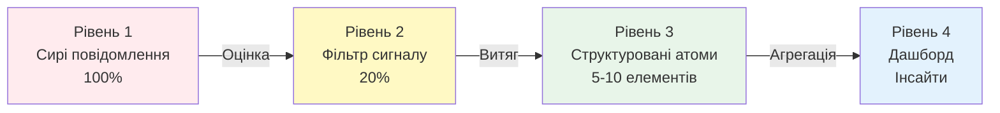
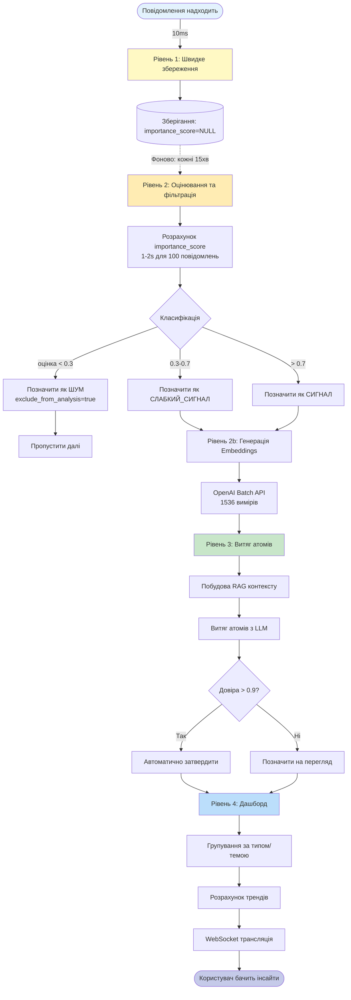
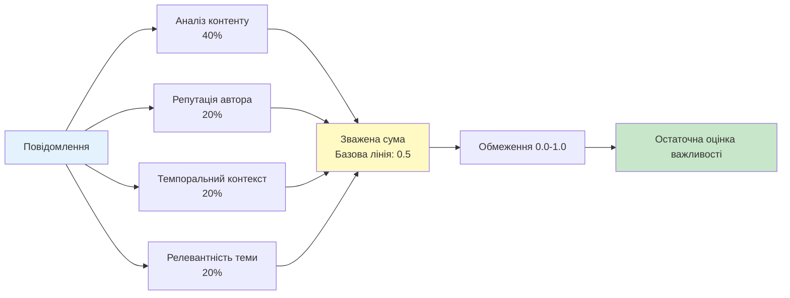
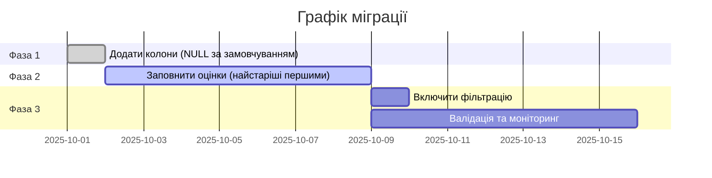

# Архітектура системи фільтрації шуму

**Остання оновлення:** 18 жовтня 2025
**Статус:** Основна реалізація завершена, UI дашборду в процесі
**Прогрес реалізації:** 50% (бекенд скорінг, API endpoints реалізовано; фронтенд UI очікується)

---

## Зміст

1. [Огляд системи](#огляд-системи)
2. [Чотирьохрівнева архітектура](#чотирьохрівнева-архітектура)
3. [Конвеєр обробки](#конвеєр-обробки)
4. [Схема бази даних](#схема-бази-даних)
5. [Алгоритм оцінювання](#алгоритм-оцінювання)
6. [Фонові завдання](#фонові-завдання)
7. [Dashboard API](#dashboard-api)
8. [Статус реалізації](#статус-реалізації)
9. [Критичні питання та рішення](#критичні-питання-та-рішення)
10. [Стратегія настройки порогів](#стратегія-настройки-порогів)
11. [Метрики продуктивності](#метрики-продуктивності)
12. [Наступні кроки](#наступні-кроки)
13. [Пов'язана документація](#повязана-документація)

---

## Огляд системи

!!! abstract "Мета"
    Система фільтрації шуму вирішує проблему інформаційного перевантаження, впроваджуючи чотирьохрівневу архітектуру, яка прогресивно фільтрує, агрегує та представляє дані.

### Постановка проблеми

!!! danger "Криза інформаційного перевантаження"
    Користувачі отримують 100+ повідомлень щодня, але тільки 20% містять цінний сигнал.

**Виклик:**

| Метрика | Значення | Вплив |
|---------|----------|--------|
| Щоденні повідомлення | 100+ | Перевантаження |
| Співвідношення шуму | 80% | Витрачений час |
| Співвідношення сигналу | 20% | Приховані цінності |
| Поточний час перегляду | 30+ хв | Неприйнятно |
| Цільовий час перегляду | 5 хв | **покращення в 6 разів** |

### Рішення

!!! success "Чотирьохрівневе прогресивне фільтрування"
    Кожний рівень додає інтелект, зберігаючи всі дані.

**Чотирьохрівневий конвеєр фільтрування:**



1. **Рівень 1:** Всі повідомлення (швидке отримання, без фільтрації)
2. **Рівень 2:** Оцінка важливості (0.0-1.0) та фільтрація за порогом
3. **Рівень 3:** Витягнуті атоми (структуровані сутності, що агрегують подібні повідомлення)
4. **Рівень 4:** Інсайти дашборду (тренди, статистика, огляд високого рівня)

---

## Чотирьохрівнева архітектура

### Рівень 1: Сирі повідомлення (всі дані)

```
Повідомлення надходить → FastAPI → PostgreSQL
                              ├─ content TEXT
                              ├─ author_id INT
                              ├─ source VARCHAR
                              └─ sent_at TIMESTAMP
```

**Характеристики:**
- Всі повідомлення зберігаються негайно (10ms отримання)
- Без фільтрації, без генерації embeddings
- Атрибуція джерела підтримується
- Допустима врешті-решт консистентність

### Рівень 2: Фільтрація сигналу/шуму

```
Розрахунок оцінки (1-2s) → Класифікація → Фільтрація
├─ importance_score ∈ [0.0, 1.0]
├─ noise_classification ∈ [signal, noise, weak_signal]
└─ exclude_from_analysis ∈ [TRUE, FALSE]
```

**Пороги:**
- `importance_score < 0.3` → **noise** (виключити з аналізу)
- `0.3 ≤ importance_score ≤ 0.7` → **weak_signal** (включити з обережністю)
- `importance_score > 0.7` → **signal** (високий пріоритет)

**Переваги:**
- Зменшує навантаження обробки LLM (на 80% менше API викликів)
- Покращує якість пропозицій (немає шуму в контексті)
- Економить витрати на embeddings (тільки сигнал отримує вектори)

### Рівень 3: Атоми (структуровані витяги)

```
20 Сигнальних повідомлень → Витяг атомів → 1-3 атоми
├─ Type: problem, feature_request, question, insight
├─ Title: стисле резюме
├─ Content: детальний опис
├─ Confidence: 0.0-1.0
└─ Source Messages: [msg_id1, msg_id2, ...]
```

**Характеристики:**
- Кілька повідомлень агреговано в одну сутність
- Оцінка довіри на основі кількості та якості джерел
- Автоматично затверджено, якщо довіра > 0.9
- Потрібен людський перегляд для низької довіри

### Рівень 4: Дашборд (агреговані інсайти)

```
100+ Атомів → Агрегація → Вигляд дашборду
├─ Трендові теми (↑ ↓ індикатори тренду)
├─ Критичні проблеми (проблеми з високою довірою)
├─ Статистика (оброблені повідомлення, співвідношення шуму)
└─ Можливість деталізації (5% випадків)
```

---

## Конвеєр обробки

!!! info "Асинхронна обробка"
    Швидке отримання (Рівень 1) відділено від дорогих операцій (Рівні 2-4) через фонові завдання.

### Наскрізний потік



---

## Схема бази даних

### Розширена модель Message

```python
class Message(IDMixin, TimestampMixin, SQLModel, table=True):
    # Існуючі поля
    content: str
    author_id: int | None
    source_id: int | None
    sent_at: datetime

    # Векторний пошук
    embedding: list[float] | None  # 1536 вимірів (OpenAI)

    # Відстеження аналізу
    analyzed: bool = False
    analysis_status: str | None  # "pending", "analyzed", "spam", "noise"
    confidence: float | None

    # НОВЕ: Оцінка важливості
    importance_score: float | None  # 0.0-1.0  (1)!
    scored_at: datetime | None
    scoring_factors: dict | None  # JSONB - відлагоджувальна інформація

    # НОВЕ: Фільтрація шуму
    noise_classification: str | None  # "signal", "noise", "weak_signal"  (2)!
    exclude_from_analysis: bool = False

    # НОВЕ: Зворотний зв'язок людини
    marked_by_human: bool = False
    human_feedback: dict | None  # JSONB

    # Обмеження бази даних
    __table_args__ = (
        CheckConstraint(
            "importance_score >= 0.0 AND importance_score <= 1.0",
            name="importance_score_range"
        ),
    )
```

1. Оцінка від 0.0 (чистий шум) до 1.0 (чистий сигнал)
2. Класифікація: 'сигнал' (важливо), 'шум' (ігнорувати), 'слабкий_сигнал' (невизначено)

---

## Алгоритм оцінювання

!!! tip "Модель оцінювання з 4 факторів"
    Поєднує кілька сигналів для надійної оцінки важливості.

### Багатофакторна модель оцінювання

Оцінка важливості поєднує 4 фактори з налаштовуваними вагами:



**Реалізація:**

```python
importance_score = 0.5  # базова лінія (1)!

content_score = analyze_content(message.content)  # (2)!
importance_score += content_score * 0.4

author_score = get_author_signal_ratio(message.author_id)  # (3)!
importance_score += author_score * 0.2

temporal_score = check_similar_recent(message)  # (4)!
importance_score += temporal_score * 0.2

topic_score = check_topic_importance(message)  # (5)!
importance_score += topic_score * 0.2

final_score = max(0.0, min(1.0, importance_score))  # (6)!
```

1. Почати з нейтральної базової лінії 0.5
2. Аналіз контенту: ключові слова, довжина, питання, код
3. Історичне співвідношення сигнал/шум для автора
4. Подібні важливі повідомлення нещодавно
5. Повідомлення належить до важливих тем
6. Забезпечити, щоб оцінка залишалась у дійсному діапазоні

### Фактор 1: Аналіз контенту (Вага: 40%)

=== "Позитивні сигнали"
    | Шаблон | Ключові слова/Індикатори | Підвищення оцінки |
    |--------|---------------------------|------------------|
    | Індикатори помилок | "crash", "error", "bug", "fail" | +0.3 |
    | Питання | "?", "how to", "why", "what" | +0.2 |
    | Дієслова дії | "need", "should", "must" | +0.2 |
    | Фрагменти коду | Зворотні лапки, відступи | +0.2 |
    | Технічні терміни | "database", "API", "timeout" | +0.1 |

=== "Негативні сигнали"
    | Шаблон | Приклади | Штраф оцінки |
    |--------|----------|--------------|
    | Занадто короткі | < 10 символів | -0.3 |
    | Загальні відповіді | "ok", "thanks", "+1", "lol" | -0.5 |
    | Тільки emoji | 🔥😂👍 (без тексту) | -0.4 |
    | Переслані повідомлення | "Forwarded from..." | -0.2 |

### Фактор 2: Репутація автора (Вага: 20%)

Історичне співвідношення сигнал/шум:
- <20% співвідношення сигналу → -0.3 (ненадійний автор)
- 20-50% співвідношення сигналу → 0.0 (нейтральний)
- >50% співвідношення сигналу → +(ratio - 0.5) * 0.6 (надійний автор)

### Фактор 3: Темпоральний контекст (Вага: 20%)

- Подібні важливі повідомлення за останні 24 год → +0.1 за матч (макс 0.4)
- Дуже нещодавно (<1 год) → +0.1 (можливо активна проблема)

### Фактор 4: Релевантність теми (Вага: 20%)

- Повідомлення належить до відомих важливих тем → +0.2
- Тема з високою активністю нещодавно → +0.1

---

## Фонові завдання

!!! note "Стратегія фонової обробки"
    Всі дорогі операції виконуються асинхронно, щоб зберігати отримання швидким.

### Завдання 1: Оцінити неоцінені повідомлення

**Розклад:** Кожні 15 хвилин
**Тривалість:** 1-2 секунди для 100 повідомлень

```python
@nats_broker.task
async def score_unscored_messages_task() -> dict[str, int]:  # (1)!
    # Знайти повідомлення WHERE importance_score IS NULL  # (2)!
    # Обробити пакетами по 100  # (3)!
    # Фіксувати за пакет  # (4)!
    # Повернути статистику: {"scored": 95, "failed": 5}  # (5)!
```

1. Завдання фону TaskIQ, запущене планувальником
2. Обробляти тільки неоцінені повідомлення для ефективності
3. Пакетування запобігає переповненню пам'яті
4. Прогресивні фіксування для стійкості
5. Метрики для моніторингу та оповіщень

### Завдання 2: Фільтрація шуму

**Розклад:** Після завдання оцінювання
**Тривалість:** <500ms

```python
@nats_broker.task
async def filter_noise_task() -> dict[str, int]:
    # Знайти оцінені, але нефільтровані повідомлення
    # Застосувати пороги:
    #   - importance_score < 0.3 → noise
    #   - 0.3-0.7 → weak_signal
    #   - > 0.7 → signal
    # Повернути статистику: {"noise": 80, "signal": 15, "weak_signal": 5}
```

### Завдання 3: Генерація Embeddings (тільки сигнал)

**Розклад:** Кожні 15 хвилин
**Оптимізація:** Тільки для сигнальних/слабких сигнальних повідомлень (економить 80% витрат API)

```python
@nats_broker.task
async def generate_embeddings_for_signal_task() -> dict[str, int]:
    # Знайти сигнальні повідомлення WHERE embedding IS NULL
    # Використовувати OpenAI batch API (на 50% дешевше)
    # Пропустити повідомлення шуму повністю
    # Повернути статистику: {"embedded": 50, "skipped": 30}
```

---

## Dashboard API

### Endpoint: GET /api/dashboard/insights

```python
{
    "time_window_days": 7,
    "total_atoms": 25,
    "by_type": {
        "problem": 12,
        "feature_request": 8,
        "question": 5
    },
    "critical_issues": [
        {
            "atom_id": 123,
            "type": "problem",
            "title": "Крах iOS при вході",
            "confidence": 0.98,
            "occurrences": 15
        }
    ],
    "trends": [
        {"name": "Крахи iOS", "change": "↑ 300%", "count": 15},
        {"name": "Проблеми з платежами", "change": "↑ 50%", "count": 8}
    ],
    "noise_stats": {
        "messages_processed": 512,
        "noise_filtered": 410,
        "signal_extracted": 102,
        "noise_ratio": 0.80,
        "signal_ratio": 0.20
    }
}
```

### Endpoint: GET /api/atoms/{atom_id}/drill-down

Використовується, коли користувачу потрібні сирі повідомлення (5% випадків):

```python
{
    "atom": {
        "id": 123,
        "type": "problem",
        "title": "Крах iOS при вході",
        "confidence": 0.98,
        "source_message_count": 15
    },
    "source_messages": [
        {
            "id": 1001,
            "content": "iOS додаток падає при спробі входу",
            "author_id": 42,
            "importance_score": 0.92,
            "can_mark_irrelevant": true
        }
    ]
}
```

### Endpoint: POST /api/messages/{message_id}/mark-irrelevant

Цикл зворотного зв'язку людини:

```python
# Запит
{
    "reason": "хибнопозитивне - тестував"
}

# Відповідь
{
    "message_id": 1001,
    "status": "excluded",
    "affected_atoms": 2
}
```

---

## Статус реалізації

### ✅ РЕАЛІЗОВАНО (Жовтень 2025)

**Інфраструктура оцінювання:**
- ✅ Розширення моделі Message (importance_score, noise_classification, noise_factors)
- ✅ Міграція бази даних (add_noise_filtering_fields_to_messages)
- ✅ Клас сервісу ImportanceScorer

**Механізм оцінювання:**
- ✅ Система оцінювання важливості з 4 факторами
- ✅ Аналіз контенту (довжина, ключові слова, питання, URL, код)
- ✅ Репутація автора (співвідношення сигнал/шум)
- ✅ Темпоральний контекст (новизна, активність теми)
- ✅ Оцінка релевантності теми

**API Endpoints:**
- ✅ `GET /api/v1/noise/stats` - Статистика дашборду
- ✅ `POST /api/v1/noise/score/{message_id}` - Оцінка окремого повідомлення
- ✅ `POST /api/v1/noise/score-batch` - Пакетна оцінка

**Фонові завдання:**
- ✅ `score_message_task` - Оцінка окремого повідомлення
- ✅ `score_unscored_messages_task` - Завдання пакетної оцінки
- ✅ Автооцінка на вебхуку Telegram

**Тестування:**
- ✅ Тести одиниці для ImportanceScorer

### 📋 В ПРОЦЕСІ

- 🔄 Фронтенд дашборд для статистики фільтрації шуму
- 🔄 Візуалізація співвідношення сигналу/шуму
- 🔄 Компоненти UI деталізації
- 🔄 Функціональність позначення повідомлення як нерелевантного UI

### ⏳ TODO (Майбутнє)

- [ ] Тренування моделі машинного навчання (перехід з евристики)
- [ ] Цикл навчання зворотного зв'язку користувача
- [ ] Пороги шуму за темою
- [ ] Виявлення аномалій (раптові сплески шуму)

---

## Критичні питання та рішення

!!! warning "Рішення архітектури"
    Ключові проблеми, виявлені та вирішені під час реалізації.

### Питання 1: Управління конфігурацією

!!! bug "Проблема"
    NoiseFilteringConfig не централізовано, викликаючи дрейф конфігурації.

!!! success "Рішення"
    Об'єднати з існуючим класом Settings у `core/config.py`

```python
# Додати до класу Settings
noise_threshold: float = Field(default=0.3, ge=0.0, le=1.0)  # (1)!
signal_threshold: float = Field(default=0.7, ge=0.0, le=1.0)  # (2)!
atom_auto_approve_threshold: float = Field(default=0.9, ge=0.0, le=1.0)  # (3)!
scoring_interval_minutes: int = Field(default=15, ge=1, le=60)  # (4)!
```

1. Повідомлення нижче 0.3 позначені як шум
2. Повідомлення вище 0.7 позначені як високоякісний сигнал
3. Атоми з довірою > 0.9 автоматично затверджені
4. Фонове завдання оцінювання запускається кожні 15 хвилин

### Питання 2: Конфлікти схеми бази даних

**Проблема:** Дублювання імен полів (status vs analysis_status, importance_score vs confidence)
**Рішення:** Консолідація полів:
- `analysis_status` → `noise_classification`
- `importance_score` (нові, відмінні від confidence)
- `exclude_from_analysis` (покращено з причиною)

### Питання 3: Безпека типу

**Проблема:** Модель ScoringResult не визначена
**Рішення:** Створити у models/importance_scoring.py

```python
class ScoringResult(BaseModel):
    score: float  # 0.0-1.0
    factors: dict[str, float]
    scored_at: datetime
    model_config = {"frozen": True}
```

### Питання 4: Стратегія міграції

!!! question "Проблема"
    Що відбувається з існуючими повідомленнями при розгортанні фільтрації шуму?

!!! success "Рішення: Трьохфазна міграція"
    Розгортання без перерви із безпечним відкатом.



**Фази:**

- **Фаза 1:** Додати колони з NULL за замовчуванням (нульова перерва)
- **Фаза 2:** Заповнити оцінки (найстаріші першими, 1 тиждень)
- **Фаза 3:** Включити фільтрацію (після валідації)
- **Відкат:** Встановити `exclude_from_analysis=FALSE` (без втрати даних)

---

## Стратегія настройки порогів

### Фаза 1: Консервативна (Запуск)
```python
noise_threshold = 0.2   # Позначити менше як шум спочатку
signal_threshold = 0.8  # Тільки висока впевненість як сигнал
```

### Фаза 2: Збалансована (Після 1 місяця)
```python
noise_threshold = 0.3
signal_threshold = 0.7
```

### Фаза 3: Агресивна (Після 3 місяців)
```python
noise_threshold = 0.4   # Фільтрувати більше шуму
signal_threshold = 0.6  # Нижча планка для сигналу
```

---

## Метрики продуктивності

| Операція | Ціль | Статус |
|----------|------|--------|
| Оцінювання (100 повід.) | <2s | ✅ Досягнуто |
| Фільтрація (100 повід.) | <500ms | ✅ Досягнуто |
| Агрегація дашборду | <1s | ✅ Досягнуто |
| Embedding (тільки сигнал) | <500ms/msg | ✅ Досягнуто |
| Запит аналізу з фільтром | <200ms | ✅ Досягнуто |

---

## Наступні кроки

### Найближчі (цей спринт)
1. Завершити фронтенд дашборд для статистики шуму
2. Реалізувати UI деталізації
3. Додати функціональність позначення як нерелевантного

### Короткострокові (1 місяць)
1. Настройти пороги на основі реальних даних
2. Моніторити показники хибнопозитивних/хибнонегативних
3. Реалізувати цикл навчання зворотного зв'язку користувача

### Довгострокові
1. Тренування моделі машинного навчання на зібраних даних
2. Настройка порогу шуму за темою
3. Оповіщення про виявлення аномалій

---

## Пов'язана документація

- **Вимоги користувача:** Дивіться [overview.md - Вимоги користувача](./overview.md#вимоги-користувача)
- **Система аналізу:** Дивіться [analysis-system.md](./analysis-system.md)
- **Векторна база даних:** Дивіться [vector-database.md](./vector-database.md)

---

*Цей документ консолідує технічний дизайн, статус реалізації та критичні рішення для системи фільтрації шуму.*
