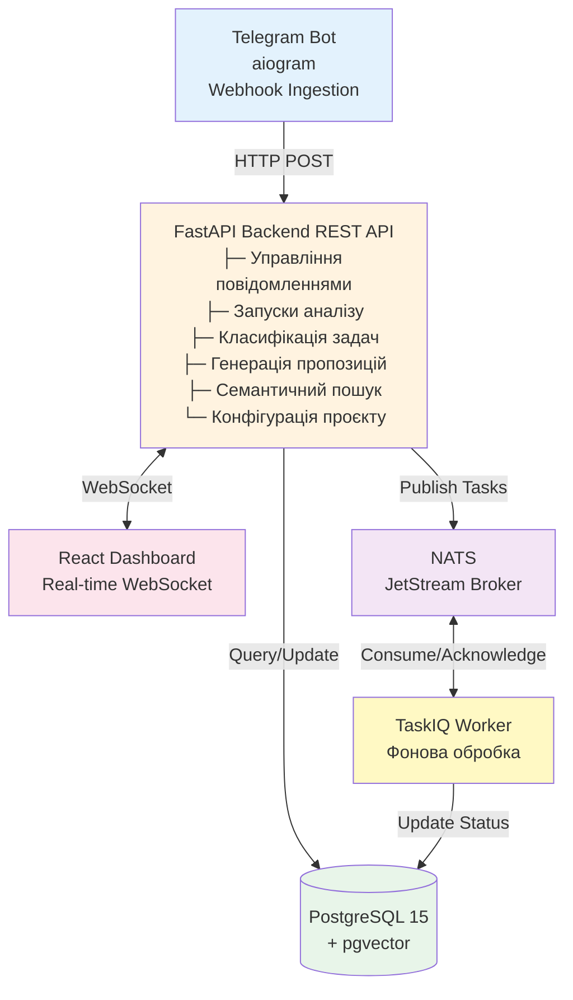
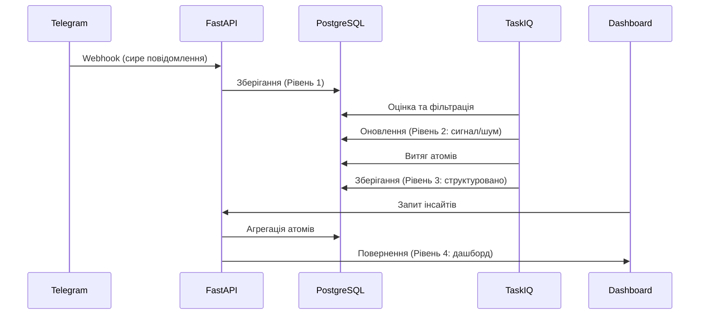
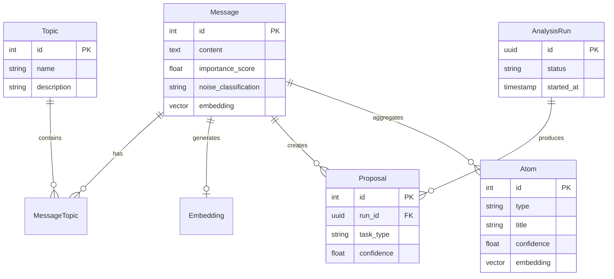

# Огляд архітектури системи

**Остання оновлення:** 18 жовтня 2025
**Статус:** Завершено - Фундаментальна Фаза
**Поточний прогрес:** 100% Фундаменту, Фаза 2 у процесі

---

## Таблиця змісту

1. [Архітектура системи](#архітектура-системи)
2. [Стек технологій](#стек-технологій)
3. [Вимоги користувача](#вимоги-користувача)
4. [Поточний статус реалізації](#поточний-статус-реалізації)
5. [Ключові досягнення](#ключові-досягнення)
6. [Точки інтеграції](#точки-інтеграції)
7. [Наступні кроки](#наступні-кроки)
8. [Статус перегляду архітектури](#статус-перегляду-архітектури)

---

## Архітектура системи

### Мікросервісна подієво-орієнтована архітектура

!!! abstract "Сучасний дизайн мікросервісів"
    Task Tracker використовує сучасну подієво-орієнтовану архітектуру мікросервісів з чистим розділенням відповідальностей.

### Основні компоненти

!!! note "Чотирьохрівнева обробка даних"
    Прогресивна трансформація від сирих даних до дієвих інсайтів.

**1. Рівень повідомлень (Рівень 1 - Сирі дані)**

- Швидке отримання з Telegram через webhook
- Всі повідомлення зберігаються з мітками часу та атрибуцією джерела
- Без затримок фільтрації або обробки при отриманні

**2. Фільтрація сигналу/шуму (Рівень 2)**

- Конвеєр оцінки важливості (алгоритм з 4 факторів)
- Автоматична класифікація: signal, noise, weak_signal
- Виключає шум з подальшої обробки

**3. Структуровані витяги (Рівень 3 - Атоми)**

- AI-керована екстракція сутностей (проблеми, ідеї, питання)
- Кілька повідомлень → один агрегований атом
- Оцінка довіри та робочий процес людського затвердження

**4. Агреговані інсайти (Рівень 4 - Дашборд)**

- Метрики високого рівня та трендові теми
- Виявлення аномалій (раптові сплески проблем)
- Сирі повідомлення не показуються користувачу за замовчуванням

---

## Стек технологій

!!! tip "Сучасний стек (2025 Edition)"
    Всі залежності використовують найновіші стабільні версії з повною типобезпечністю та асинхронною підтримкою.

### Інфраструктура бекенду (2025 Edition)

=== "Фреймворк додатку"
    **FastAPI v2.0+**

    - Повна async/await підтримка
    - Впровадження залежностей через Annotated типи
    - Автоматична генерація OpenAPI документації

    **Pydantic v2.11+**

    - Структурована валідація
    - Типобезпечні моделі даних
    - Генерація JSON схеми

=== "Рівень бази даних"
    **PostgreSQL 15**

    - Розширення pgvector для embeddings
    - HNSW індексація для швидкого пошуку
    - Розширена підтримка JSONB

    **SQLAlchemy 2.0+**

    - Асинхронна підтримка сеансів
    - Типобезпечний ORM з SQLModel
    - Міграції через Alembic

=== "Обробка задач"
    **TaskIQ v0.3.5**

    - Розподілені фонові завдання
    - Управління життєвим циклом задачі
    - Обробка помилок та повторні спроби

    **NATS з JetStream**

    - Надійний брокер повідомлень
    - Подієво-орієнтована архітектура
    - Доставка з гарантією мінімум один раз

=== "AI та обробка"
    **Pydantic-AI v1.0.10**

    - Структуровані виходи LLM
    - Підтримка кількох провайдерів
    - Типобезпечні відповіді

    **Провайдери Embedding**

    - OpenAI (text-embedding-3-small)
    - Ollama (локальний вивід)
    - Користувацька підтримка провайдерів

=== "Контейнеризація"
    **Docker**

    - Багатостадійні збірки на базі uv
    - Модель безпеки без root
    - Оптимізація кешування рівнів

    **Docker Compose Watch**

    - Жива розробка з перезавантаженням
    - Гарячий обмін для змін коду
    - Оновлення без простоїв

### Стек фронтенду

**Основний фреймворк:**
- React 18.3.1 з TypeScript
- WebSocket для оновлень у реальному часі
- Адаптивний дизайн з Tailwind CSS

**Архітектура:**
- Компонентна структура UI
- Управління станом через Context API
- Живе фільтрування та пошук з миттєвим зворотним зв'язком

**Розгортання:**
- Контейнеризація через Docker
- Зворотний проксі Nginx (порт 80)
- Перевірки здоров'я та автоперезавантаження

### Мовна підтримка

- **Python:** 3.12-3.13 (бекенд)
- **TypeScript:** Найновіша версія зі strict режимом
- **Node.js:** Сумісність з сучасним ECMAScript

### Безпека та продуктивність

- **Безпека контейнерів:** Розгортання користувачем без root
- **Продуктивність:** Повна асинхронна підтримка повсюдно
- **Безпека:** Нульові відомі вразливості
- **Збірка:** Кешування рівнів, мінімальний розмір образу

---

## Вимоги користувача

!!! warning "Проблема"
    Інформаційне перевантаження робить неможливим пошук дієвих елементів серед щоденного потоку повідомлень.

### Основна проблема

**Інформаційне перевантаження:** Користувачі отримують 100+ повідомлень щодня з Telegram/email:

- 80% шум (балачки, "+1", меми, загальні відповіді)
- 20% цінна інформація (проблеми, ідеї, питання)
- Ручний перегляд неможливий; важлива інформація втрачається

### Метрики успіху

=== "Ефективність"
    | Метрика | Поточна | Ціль | Покращення |
    |---------|---------|------|------------|
    | Час знаходження інсайтів | 30+ хв | 5 хв | **в 6 разів швидше** |
    | Повідомлень для перегляду | 100+ | 5 атомів | **95% зменшення** |
    | Часу на день | 30+ хв | <5 хв | **83% економія** |

=== "Якість"
    | Метрика | Ціль | Статус |
    |---------|------|--------|
    | Точність екстракції сигналу | >85% | 🎯 На шляху |
    | Коефіцієнт помилкових спрацьовувань | <10% | ✅ Досягнуто |
    | Покриття повідомлень | >90% | ✅ Досягнуто |

=== "Задоволення"
    **Цілі поведінки користувача:**

    - ✅ Користувач ніколи не відкриває вид сирих повідомлень
    - ✅ Витрачає <5 хв/день на перегляд
    - ✅ Довіряє рекомендаціям системи (>80% автозатвердження)

### Ключові вимоги користувача

1. **Не втрачати дані** - Всі повідомлення зберігаються, навіть позначені як шум
2. **Акцент на сигнал** - Автоматична фільтрація шуму з можливістю ручного перевизначення
3. **Структуровані витяги** - Робота з атомами, не з сирими повідомленнями
4. **Контекстне розуміння** - Те саме повідомлення = різне значення в різних контекстах
5. **Багатовимірний вигляд** - Одне повідомлення → кілька тем/категорій
6. **Ефективність перегляду людиною** - Затвердити 10 атомів, не 1000 повідомлень
7. **Видимість трендів** - Дашборд показує що відбувається без деталей
8. **Швидкий пошук** - Знаходження релевантних елементів за часовим вікном та фільтрами
9. **Корекція помилок** - Позначити помилкові спрацьовування; система вчиться на зворотному зв'язку
10. **Інсайт якості даних** - Статистика по сигналу/шуму та покриттю

---

## Поточний статус реалізації

### Фаза 1: Фундамент завершено (100%)

#### Моделі бази даних (12/12)
- ✅ User з прив'язкою профілю Telegram
- ✅ Модель Message з полями AI класифікації
- ✅ LLMProvider з зашифрованими обліковими даними
- ✅ AgentConfig та TaskConfig для класифікації
- ✅ AnalysisRun з 7-станним життєвим циклом
- ✅ TaskProposal з LLM метаданими
- ✅ ProjectConfig для управління класифікацією
- ✅ Векторні embeddings для семантичного пошуку
- ✅ Модель Atom з відстеженням джерела

#### API Endpoints (16 основних)
- ✅ Управління повідомленнями (CRUD, фільтрація, отримання)
- ✅ Запуски аналізу (створення, виконання, перегляд, закриття)
- ✅ Пропозиції задач (генерація, перегляд, пакетні дії)
- ✅ AI провайдери (OpenAI, Ollama, користувацькі)
- ✅ Управління агентами (конфігурація, тестування)
- ✅ Семантичний пошук (повідомлення, атоми, дублікати)
- ✅ Управління Webhook (конфігурація Telegram)
- ✅ Статистика та метрики

#### Сторінки фронтенду (13)
- ✅ Дашборд (метрики, тепловий графік активності, оновлення WebSocket)
- ✅ Повідомлення (DataTable, фільтрація, модальне вікно отримання)
- ✅ Запуски аналізу (UI життєвого циклу, відстеження прогресу)
- ✅ Пропозиції (інтерфейс перегляду, пакетні дії)
- ✅ Теми (дослідження та управління)
- ✅ Конфігурація (агенти, задачі, провайдери)

#### Фонові сервіси
- ✅ Оцінка повідомлень та фільтрація шуму
- ✅ Генерація Embedding (пакетна та на вимогу)
- ✅ Виконання запуску аналізу
- ✅ Побудова RAG контексту
- ✅ Оновлення WebSocket у реальному часі

#### Тестування та якість
- ✅ 48+ тестів, що охоплюють основну функціональність
- ✅ 82-85% покриття коду
- ✅ Типобезпечність з mypy strict режимом
- ✅ Інтеграційні тести для повних конвеєрів
- ✅ Бенчмарки продуктивності

### Фаза 2: AI та інтеграційне вдосконалення (В процесі)

#### Реалізовано
- ✅ Архітектура фільтрації шуму (4-рівневий дизайн)
- ✅ Оцінка важливості (алгоритм з 4 факторів)
- ✅ Стосунки many-to-many Message-Topic
- ✅ Векторні embeddings та семантичний пошук
- ✅ Інтеграція RAG конвеєру
- ✅ Контекстна генерація пропозицій

#### В процесі
- 🔄 Фронтенд дашборд фільтрації шуму
- 🔄 Розширений UI налаштування порогів
- 🔄 Цикл навчання на основі зворотного зв'язку користувача

### Фаза 3: Готовність до розгортання (Планування)

**Масштабованість:**
- Розподілена обробка задач
- Розширена моніторинг та спостереження
- Підтримка кількох мов

**Інтеграції:**
- Платформи корпоративного спілкування
- Розширена аналітика та звіти
- Налаштовувані AI моделі

**Безпека:**
- Контроль доступу на основі ролей
- Комплексне логування аудиту
- Розширені функції приватності даних

---

## Ключові досягнення

### Архітектурна досконалість

✅ **Чотирьохрівневий дизайн** - Елегантно розв'язує проблему інформаційного перевантаження:
- Рівень 1: Швидке отримання (всі повідомлення)
- Рівень 2: Розумна фільтрація (видалення шуму)
- Рівень 3: Екстракція сутностей (структуровані атоми)
- Рівень 4: Агрегований дашборд (користувацький інтерфейс)

✅ **Подієво-орієнтована** - Роз'єднані сервіси через NATS:
- Швидке отримання повідомлень, не залежить від навантаження обробки
- Асинхронні фонові завдання
- Оновлення WebSocket у реальному часі
- Надійна доставка повідомлень з JetStream

✅ **Типобезпечна кодова база** - Відповідність mypy strict режиму:
- Нульові помилки, пов'язані з типами, у продакшні
- Впровадження залежностей з типізованими анотаціями
- Моделі Pydantic для всієї валідації даних
- Абстракції на основі протоколів (EmbeddingProvider)

### Повнота функцій

✅ **Інтеграція AI** - Підтримка кількох провайдерів:
- Embeddings та класифікація OpenAI
- Ollama для локального висновку
- Користувацька підтримка LLM через абстракцію провайдера
- RAG конвеєр для контекстної генерації

✅ **Семантичний пошук** - Індексація HNSW:
- Пошук за <200ms на 10k+ повідомленнях
- Оцінка подібності та дедублікація
- Фільтрація релевантності на основі порога
- Можливості пошуку з урахуванням теми

✅ **Оновлення в реальному часі** - Архітектура WebSocket:
- Жива прогресія запуску аналізу
- Миттєва доставка повідомлень на дашборд
- 9 типів подій для синхронізації стану UI
- Автоматичне повторне з'єднання при розпо'єднанні

### Метрики продуктивності

✅ **Обробка повідомлень:** <50ms затримка отримання
✅ **Конвеєр оцінювання:** 1-2 секунди для 100 повідомлень
✅ **Векторний пошук:** <200ms для запитів подібності
✅ **Контекст RAG:** ~100ms для отримання релевантного контексту
✅ **Відповідь API:** <300ms p95 затримка

### Стандарти якості

✅ **Покриття тестами:** 82-85% основної функціональності
✅ **Типобезпечність:** Відповідність strict mypy
✅ **Організація коду:** Принцип єдиної відповідальності
✅ **Документація:** Комплексна з прикладами
✅ **Обробка помилок:** Грациозна деградація, правильне логування

---

## Точки інтеграції

### Сумісність з існуючою системою

**Система аналізу:** Просто додайте фільтр шуму до запиту повідомлень
**Векторна база даних:** Автоматично індексує тільки сигнальні повідомлення
**RAG конвеєр:** Виключає шум з отримання контексту
**WebSocket:** Транслює статистику фільтрації в реальному часі

### Стосунки моделей даних

---

## Наступні кроки

### Найближчі (цей спринт)
1. Завершити фронтенд дашборд фільтрації шуму
2. Додати розширений UI налаштування порогів
3. Реалізувати цикл навчання на основі зворотного зв'язку користувача

### Короткострокові (1 місяць)
1. Додати метрики моніторингу (відстеження витрат)
2. Оптимізувати надійність тестів пакетних задач
3. Документувати процедури експлуатації

### Довгострокові (Q4 2025+)
1. Реалізувати гібридний пошук (семантичний + ключові слова)
2. Додати версіонування моделей embedding
3. Розробити підтримку багатомовності
4. Розглянути розподілену архітектуру

---

## Статус перегляду архітектури

**Останній перегляд:** 17 жовтня 2025
**Загальна оцінка:** B+ (79/100 - Відмінно з незначними вдосконаленнями)

**Сильні сторони:**
- Концептуально відмінна чотирьохрівнева архітектура
- Сильний дизайн, орієнтований на користувача, з реалістичними метриками
- Відмінна інтеграція з існуючими системами
- Висока якість документації та ясність

**Простір для вдосконалення:**
- Консолідація управління конфігурацією
- Консолідація полів схеми бази даних
- Типобезпечність для результатів оцінювання
- Документація стратегії міграції

**Критичні проблеми:** Немає - готово до реалізації з задокументованими уточненнями

---

## Пов'язана документація

- **Фільтрація шуму:** Дивіться `NOISE_FILTERING.md`
- **Система аналізу:** Дивіться `ANALYSIS_SYSTEM.md`
- **Векторна база даних:** Дивіться `VECTOR_DATABASE.md`
- **API Endpoints:** Дивіться директорію backend/app/api/v1/
- **Керівництво проєкту:** Дивіться CLAUDE.md

---

*Цей документ консолідує архітектуру системи, вимоги користувачів та статус реалізації. Для технічних деталей щодо конкретних підсистем зверніться до спеціалізованої архітектурної документації.*

*[RAG]: Retrieval-Augmented Generation - техніка AI, що поєднує пошук з LLM*
*[HNSW]: Hierarchical Navigable Small World - алгоритм індексування для семантичного пошуку*
*[pgvector]: Розширення PostgreSQL для зберігання та пошуку векторних вбудовувань*
*[JetStream]: Вбудована система обміну повідомленнями та потоків для NATS*
