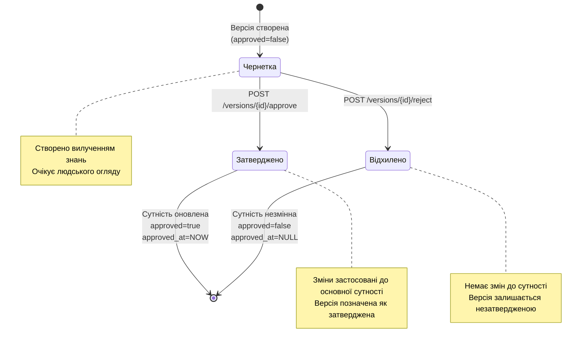

# Архітектура Системи Версіювання

**Останнє оновлення:** 26 жовтня 2025
**Статус:** Основна реалізація завершена
**Прогрес реалізації:** 100% (бекенд-версіювання, процес затвердження, API ендпоінти реалізовано)

---

## Зміст

1. [Огляд системи](#огляд-системи)
2. [Процес затвердження](#процес-затвердження)
3. [Стани версій](#стани-версій)
4. [API Ендпоінти](#api-ендпоінти)
5. [Архітектура сервісів](#архітектура-сервісів)
6. [Патерни використання](#патерни-використання)
7. [Порівняння версій](#порівняння-версій)
8. [Прогалини системи](#прогалини-системи)

---

## Огляд системи

Система версіювання забезпечує аудит-трейл та процес затвердження для згенерованих AI оновлень Тем та Атомів. Коли сервіс вилучення знань виявляє зміни в існуючих сутностях, він створює незатверджені знімки версій, які потребують людського огляду перед застосуванням.

### Призначення

**Контроль змін:** Запобігання автоматичному перезапису курованих знань AI-оновленнями:
- Вилучення знань працює безперервно на вхідних повідомленнях
- Оновлення існуючих Тем/Атомів фіксуються як версії
- Людина-рецензент затверджує або відхиляє запропоновані зміни
- Лише затверджені версії модифікують основні сутності

**Аудит-трейл:** Повна історія всіх запропонованих та затверджених змін:
- Кожна версія зберігає повний знімок даних сутності
- Створення версії відстежується з міткою часу та автором
- Затвердження відстежується з міткою часу (поле approved_by в розробці)
- Відхилення залишає версію в стані чернетки

### Коли створюються версії

**Автоматичні тригери:**
1. Вилучення знань виявляє оновлення існуючої Теми (назва/опис/іконка/колір)
2. Вилучення знань виявляє оновлення існуючого Атома (тип/вміст/заголовок/впевненість/мета)
3. Версія створена з `created_by="knowledge_extraction"` та `approved=false`

**Ручні тригери:**
- Наразі не підтримуються (немає API ендпоінтів для ручного створення версій)

### Нумерація версій

**Система послідовних цілих чисел:**
- Версії починаються з 1 для кожної сутності
- Кожна нова версія інкрементується: `latest_version.version + 1`
- Номери версій специфічні для сутності (Тема #5 може мати v1-v10, Атом #7 може мати v1-v3)
- Прогалини в послідовності вказують на видалені версії (наразі не реалізовано)

---

## Процес затвердження

### Діаграма станів

### Кроки процесу

**Чернетка → Затвердження:**
1. Рецензент отримує різницю версій для порівняння змін
2. Рецензент затверджує версію через API
3. Система застосовує дані версії до основної сутності (Тема або Атом)
4. Система встановлює `version.approved = true`
5. Система встановлює `version.approved_at = <поточна мітка часу>`
6. Зміни сутності відразу видимі всім користувачам

**Чернетка → Відхилення:**
1. Рецензент отримує різницю версій для розуміння змін
2. Рецензент відхиляє версію через API
3. **Немає змін до основної сутності**
4. Версія залишається в базі даних з `approved=false`
5. Версію можна переглянути повторно або видалити пізніше

---

## Стани версій

### Поля станів

| Поле | Тип | Опис | Значення чернетки | Значення затвердження | Значення відхилення |
|-------|------|-------------|-------------|----------------|----------------|
| `approved` | Boolean | Статус затвердження | `false` | `true` | `false` |
| `approved_at` | DateTime(TZ) | Мітка часу затвердження | `NULL` | `<мітка часу>` | `NULL` |

### Поведінка оновлення сутності

**Затвердження застосовує зміни:**

Коли версія затверджена, система оновлює основну сутність (Тема або Атом), застосовуючи всі поля з `version.data`:

| Тип сутності | Оновлені поля |
|-------------|----------------|
| **Тема** | `name`, `description`, `icon`, `color` |
| **Атом** | `type`, `content`, `title`, `confidence`, `meta` |

**Відхилення зберігає сутність:**

Коли версія відхилена:
- Основна сутність залишається незмінною
- Версія залишається в базі даних з `approved=false`
- Немає відмінності між "відхилено" та "очікує огляду" (виявлена прогалина)

---

## API Ендпоінти

### Ендпоінти версіювання тем

| Метод | Ендпоінт | Призначення | Відповідь |
|--------|----------|---------|----------|
| GET | `/api/v1/topics/{topic_id}/versions` | Список всіх версій (найновіші першими) | Масив TopicVersionResponse |
| GET | `/api/v1/topics/{topic_id}/versions/{version}/diff?compare_to={v}` | Порівняння двох версій (показує змінені поля) | VersionDiffResponse |
| POST | `/api/v1/topics/{topic_id}/versions/{version}/approve` | Затвердити версію та застосувати до сутності | TopicVersionResponse |
| POST | `/api/v1/topics/{topic_id}/versions/{version}/reject` | Відхилити версію (без змін сутності) | TopicVersionResponse |

### Ендпоінти версіювання атомів

| Метод | Ендпоінт | Призначення | Відповідь |
|--------|----------|---------|----------|
| GET | `/api/v1/atoms/{atom_id}/versions` | Список всіх версій (найновіші першими) | Масив AtomVersionResponse |
| GET | `/api/v1/atoms/{atom_id}/versions/{version}/diff?compare_to={v}` | Порівняння двох версій (показує змінені поля) | VersionDiffResponse |
| POST | `/api/v1/atoms/{atom_id}/versions/{version}/approve` | Затвердити версію та застосувати до сутності | AtomVersionResponse |
| POST | `/api/v1/atoms/{atom_id}/versions/{version}/reject` | Відхилити версію (без змін сутності) | AtomVersionResponse |

### Формати запитів/відповідей

**ApproveVersionRequest / RejectVersionRequest:**
- Порожнє тіло запиту (заповнювач для майбутніх полів типу `reason`, `approved_by`)

**VersionDiffResponse:**

| Поле | Тип | Опис |
|-------|------|-------------|
| `from_version` | Integer | Номер вихідної версії |
| `to_version` | Integer | Номер цільової версії |
| `changes` | Array | Список виявлених змін |
| `summary` | String | Зрозуміле резюме (наприклад, "2 значення змінено") |

**VersionChange:**

| Поле | Тип | Опис |
|-------|------|-------------|
| `type` | String | Тип зміни (`values_changed`, `type_changes`, `dictionary_item_added`, `dictionary_item_removed`) |
| `path` | String | JSON-шлях до зміненого поля (наприклад, `['description']`) |
| `old_value` | Any | Попереднє значення |
| `new_value` | Any | Нове значення |

---

## Архітектура сервісів

### VersioningService

**Призначення:** Основна логіка версіювання для операцій створення, затвердження, відхилення, порівняння

**Ключові відповідальності:**

| Метод | Призначення |
|--------|---------|
| `create_topic_version(db, topic_id, data, created_by)` | Створити новий знімок версії теми |
| `create_atom_version(db, atom_id, data, created_by)` | Створити новий знімок версії атома |
| `get_versions(db, entity_type, entity_id)` | Отримати всі версії для сутності (найновіші першими) |
| `get_version_diff(db, entity_type, entity_id, v1, v2)` | Згенерувати різницю між двома версіями використовуючи DeepDiff |
| `approve_version(db, entity_type, entity_id, version)` | Затвердити версію та застосувати зміни до сутності |
| `reject_version(db, entity_type, entity_id, version)` | Відхилити версію (без операцій, повертає незмінену версію) |

**Логіка створення версії:**
1. Отримати останню версію для сутності (або за замовчуванням v0, якщо немає)
2. Інкрементувати номер версії: `latest_version.version + 1`
3. Створити новий запис версії з наданим знімком даних
4. Встановити `approved=false`, `created_by=<автор>`, `created_at=NOW`
5. Зберегти в базу даних

**Логіка затвердження:**
1. Отримати версію за entity_id та version_number
2. Перевірити, що версія існує та ще не затверджена
3. Отримати основну сутність (Тема або Атом)
4. Застосувати дані версії до сутності використовуючи `setattr(entity, key, value)`
5. Встановити `version.approved = true`, `version.approved_at = NOW`
6. Зберегти транзакцію

**Порівняння різниці:**
- Використовує бібліотеку `DeepDiff` для порівняння JSON-знімків
- Виявляє зміни полів, зміни типів, додавання, видалення
- Повертає структурований список змін зі старими/новими значеннями

### KnowledgeExtractionService

**Призначення:** AI-кероване вилучення сутностей, що автоматично створює версії для оновлень

**Тригери автоматичного створення:**

| Сценарій | Дія |
|----------|--------|
| Нова Тема вилучена з повідомлень | Створити Тему безпосередньо (без версії) |
| Існуюча Тема виявлена зі змінами | Створити TopicVersion з `approved=false` |
| Новий Атом вилучений з повідомлень | Створити Атом безпосередньо (без версії) |
| Існуючий Атом виявлений зі змінами | Створити AtomVersion з `approved=false` |

**Знімки даних версій:**

Для Тем:
- `name`, `description`, `icon`, `color`

Для Атомів:
- `type`, `content`, `title`, `confidence`, `meta`

**Атрибуція автора:**
- Всі автоматично згенеровані версії мають `created_by="knowledge_extraction"`
- Відрізняє AI-згенеровані версії від майбутніх ручних версій

---

## Патерни використання

### Хто створює версії

**Поточні:**
- Сервіс вилучення знань (автоматичні AI-оновлення)

**Майбутній потенціал:**
- Ручний API для користувацьких оновлень
- Інструменти пакетного імпорту
- Зовнішні інтеграції

### Хто затверджує версії

**Поточні:**
- Будь-який API-клієнт з доступом до ендпоінтів (без ролевих дозволів)

**Виявлена прогалина:**
- Немає перевірок автентифікації/авторизації
- Немає поля `approved_by` для відстеження ідентичності затверджувача
- Немає аудит-трейлу для рішень про затвердження

**Обхідний шлях:**
- Фронтенд реалізує контроль доступу
- Система на довірі для малих команд
- Перегляд логів через мітку часу `approved_at`

### Як використовуються версії

**Аудит-трейл:**
- Повна історія всіх запропонованих змін
- Доступна для огляду через API (список версій, порівняння різниць)
- Зберігається безстроково (немає політики закінчення терміну дії)

**Контроль змін:**
- Запобігає автоматичному перезапису курованих знань
- Процес людина-в-циклі для AI-оновлень
- Можливість відхилення для некоректних AI-пропозицій

**Не використовується для:**
- Фільтрування запитів (система не застосовує режим "лише затверджені")
- Джерело істини (основні сутності використовуються безпосередньо, не версії)
- Відкат (немає прямого механізму відкату, див. обхідний шлях нижче)

---

## Порівняння версій

### Движок різниці

**Технологія:** Бібліотека DeepDiff для порівняння JSON

**Підтримувані типи змін:**

| Тип | Опис | Приклад |
|------|-------------|---------|
| `values_changed` | Значення поля змінено | `description: "Старе" → "Нове"` |
| `type_changes` | Тип поля змінено | `confidence: 0.8 → "висока"` |
| `dictionary_item_added` | Додано нове поле | `meta: null → {"tags": [...]}` |
| `dictionary_item_removed` | Поле видалено | `icon: "📝" → null` |

### Використання Diff API

**Порівняти версію 2 з версією 1:**

Ендпоінт: `GET /topics/{id}/versions/2/diff?compare_to=1`

Відповідь показує зміни з v1 → v2

**Порівняти поточну сутність з версією:**

Ендпоінт: `GET /topics/{id}/versions/0/diff?compare_to=3`

Версія 0 представляє поточний стан сутності

---

## Прогалини системи

### Виявлені обмеження

| Прогалина | Вплив | Обхідний шлях |
|-----|--------|------------|
| **Немає ролевих дозволів** | Будь-який API-клієнт може затверджувати/відхиляти | Контроль доступу фронтенду, система на довірі |
| **Немає поля `approved_by`** | Неможливо відстежити, хто затвердив версії | Переглянути мітку часу `approved_at`, співвіднести з логами |
| **Немає відстеження відхилення** | Відхилені версії невідрізнимі від очікуючих | Перевірити `approved=false` та вручну відстежувати рішення |
| **Немає механізму відкату** | Неможливо безпосередньо повернутися до попередньої версії | Вручну затвердити старішу версію (створює новий номер версії) |
| **Немає пакетних операцій** | Потрібно затверджувати/відхиляти версії поодинці | Ітерувати через API-клієнт |
| **Немає політики закінчення терміну** | Незатверджені версії зберігаються безстроково | Ручне очищення через базу даних |
| **Немає системи сповіщень** | Немає попереджень про очікуючі версії | Опитування API для незатверджених версій |

### Обхідний шлях для відкату

**Проблема:** Немає прямого API-ендпоінту для відкату

**Рішення:** Вручну затвердити старішу версію

**Процес:**
1. Визначити цільову версію для повернення (наприклад, v3)
2. Затвердити цю версію: `POST /topics/{id}/versions/3/approve`
3. Система застосовує дані v3 до основної сутності
4. Історія версій показує v3 як останню затверджену версію

**Застереження:** Це створює ефект "відкату", але не видаляє новіші версії з історії

---

## Підсумок

### Життєвий цикл версії

**Створення → Чернетка → Огляд → Затвердження/Відхилення**

1. Вилучення знань виявляє зміну існуючої сутності
2. Система створює версію з `approved=false`
3. Панель керування відображає очікуючі версії
4. Рецензент порівнює різницю
5. Рецензент затверджує (застосовує зміни) або відхиляє (без змін)
6. Версія позначена статусом затвердження та міткою часу

### Поточні можливості

✅ Автоматичне створення версій для AI-оновлень
✅ Процес затвердження з API-ендпоінтами
✅ Порівняння різниці між версіями
✅ Повний аудит-трейл змін
✅ Послідовна нумерація версій

❌ Контроль доступу на основі ролей
❌ Відстеження затвердження/відхилення (`approved_by`, `rejected_by`)
❌ Прямий механізм відкату
❌ Пакетні операції
❌ Політики закінчення терміну

---

## Дивіться також

- [Вилучення знань](./knowledge-extraction.md) - Як автоматично створюються версії
- [Фонові задачі](./background-tasks.md) - Планування вилучення знань
