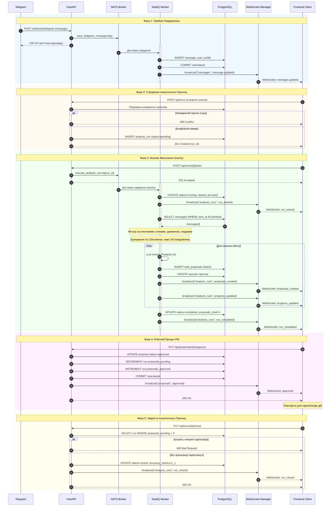
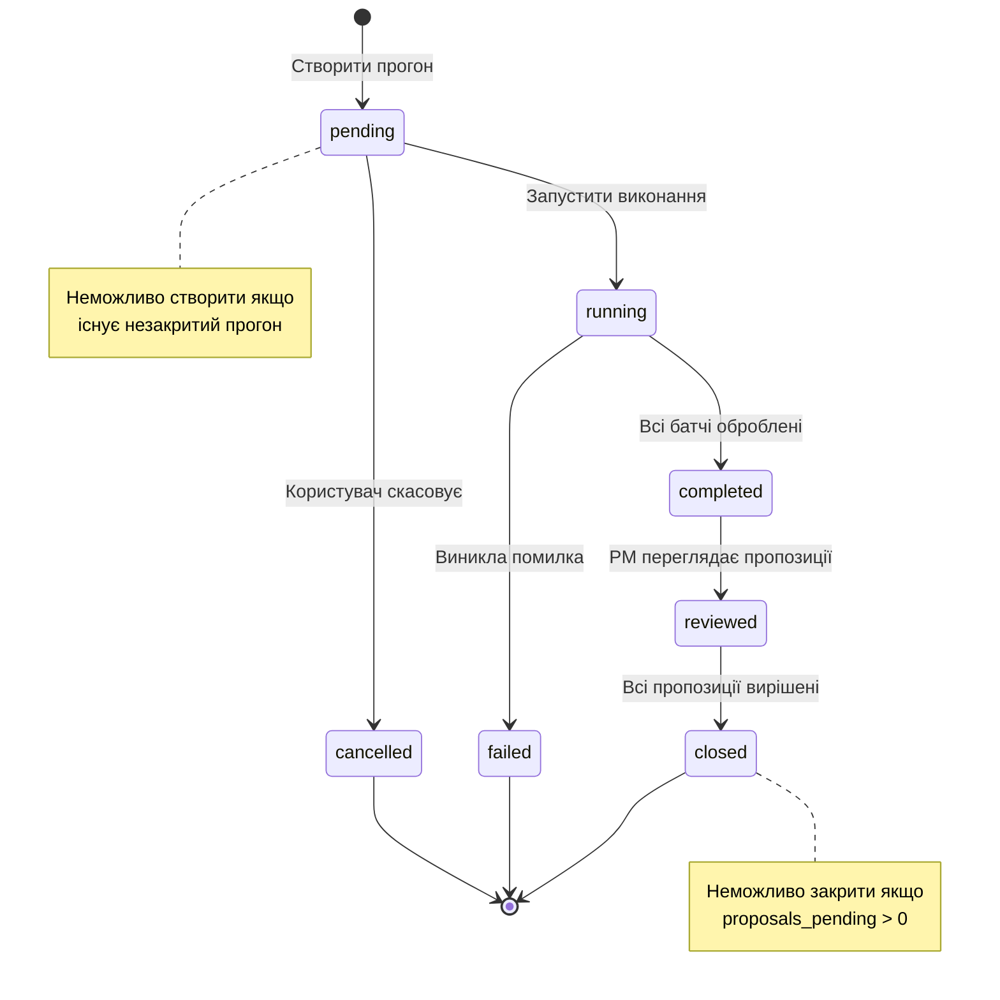
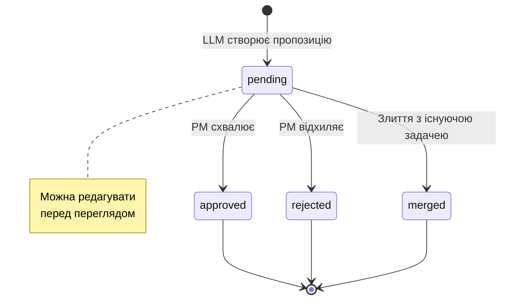

# Послідовність Подій і Топіки

!!! info "Огляд"
    Цей документ описує послідовний потік подій через WebSocket топіки та фонові завдання в системі Task Tracker.

---

## Огляд Архітектури

Система використовує **event-driven архітектуру** з:

- **WebSocket Topics** - Канали реального часу для оновлень фронтенду
- **TaskIQ + NATS** - Обробка фонових завдань з брокером повідомлень
- **PostgreSQL** - Постійне збереження стану з транзакційними гарантіями

### Основні Топіки

| Топік | Призначення | Події |
|-------|-------------|-------|
| `messages` | Оновлення Telegram повідомлень | `message.updated`, `ingestion.*` |
| `analysis_runs` | Життєвий цикл аналізу | `run_started`, `progress_updated`, `proposals_created`, `run_completed`, `run_failed` |
| `proposals` | Перегляд пропозицій задач | `approved`, `rejected`, `merged` |

---

## Повний Потік Подій



---

## Гарантії Послідовності Подій

### ✅ Сильні Гарантії

1. **Транзакції Бази Даних**
   - Всі зміни стану в межах одного запиту атомарні
   - WebSocket розсилка відбувається ПІСЛЯ успішного DB commit
   - Якщо розсилка не вдалася, це логується, але не відкочує транзакцію

2. **Життєвий Цикл Аналітичного Прогону**
   - Неможливо створити новий прогон, якщо існує незакритий (409 Conflict)
   - Неможливо закрити прогон з очікуючими пропозиціями (400 Bad Request)
   - Переходи статусу примусові: `pending → running → completed → reviewed → closed → failed → cancelled`
   - Тільки термінальні стани: `closed`, `failed`, `cancelled`

3. **Перегляд Пропозицій**
   - Кожне approve/reject атомарно оновлює пропозицію І лічильники прогону
   - Race conditions запобігаються обмеженнями БД та транзакціями

### ⚠️ Евентуальна Узгодженість

1. **Доставка WebSocket**
   - Доставка з найкращими зусиллями (не гарантована якщо клієнт відключився)
   - Клієнти повинні опитувати API при переподключенні для синхронізації

2. **Міжтопікові Події**
   - Події з різних топіків можуть прибути не по порядку
   - Фронтенд повинен впорядковувати використовуючи timestamps

---

## Машини Станів

### Стани Аналітичного Прогону



### Стани Пропозицій



---

## Міркування Продуктивності

### Стратегія Батчингу

**Поточні Налаштування:**
- Часове вікно: 10 хвилин
- Макс повідомлень на батч: 50
- Паралельна обробка батчів: Ні (послідовна)

**Чому Послідовна?**
- Запобігає rate limiting LLM
- Підтримує безперервність контексту
- Легше відновлення від помилок

### Оптимізація WebSocket

1. **Ізоляція Топіків** - Клієнти підписуються лише на потрібні топіки
2. **Пулінг З'єднань** - Повторне використання з'єднань
3. **Вибіркова Розсилка** - Відправка лише підписаним клієнтам

---

## Майбутні Покращення

### 1. Space-Context Топіки

**Поточне:** Плоска структура топіків (`messages`, `analysis_runs`, `proposals`)

**Пропоноване:** Ієрархічні топіки з областю проєкту

```
space:{project_id}:messages
space:{project_id}:analysis_runs
space:{project_id}:proposals
```

**Переваги:**
- Ізоляція подій по проєктах
- Зменшення навантаження (клієнти підписуються лише на свої проєкти)
- Підтримка мультитенантності

### 2. Event Sourcing

Зберігати всі події в append-only лозі для:
- Аудит-треку
- Time-travel debugging
- Event replay для аналітики

### 3. Dead Letter Queue

Обробка невдалих фонових завдань:
- Повтор з експоненціальною затримкою
- Ручний перегляд невдалих завдань
- Сповіщення про повторювані збої

---

!!! question "Питання?"
    Якщо у вас є питання про потік подій, перегляньте архітектурні документи або зв'яжіться з командою.