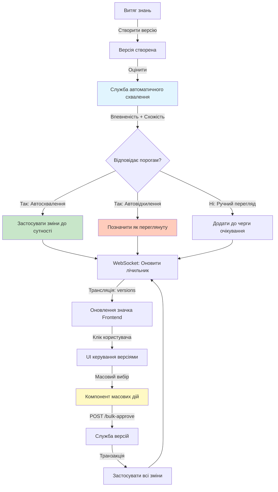
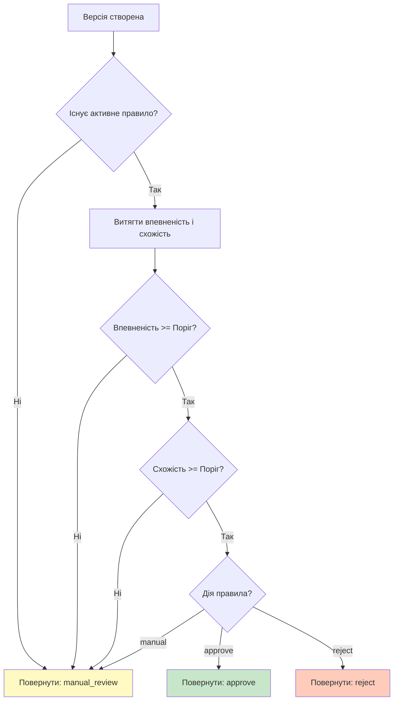

# Автоматизоване керування версіями

**Останнє оновлення:** 26 жовтня 2025
**Статус:** Готово до виробництва
**Реалізація:** Backend + Frontend + Інтеграція WebSocket

---

## Огляд

Функція автоматизованого керування версіями розширює основну [систему версій](../architecture/versioning-system.md) можливостями інтелектуальної автоматизації, розробленими для зменшення навантаження на ручний перегляд при збереженні контролю якості. Замість того, щоб вимагати людського перегляду для кожної версії, згенерованої AI, система автоматично оцінює та обробляє версії на основі налаштованих порогів якості.

Ця функція вирішує критичну проблему в робочих процесах управління знаннями: оскільки система обробляє тисячі повідомлень щодня, ручний перегляд кожної запропонованої зміни стає непрактичним. Поєднуючи оцінку впевненості, аналіз схожості та автоматизацію на основі правил, система дозволяє командам зосередити людську увагу на граничних випадках, тоді як зміни з високою впевненістю проходять автоматично.

**Ключові можливості:**

- **Автоматична оцінка якості**: Кожна версія оцінюється за впевненістю (впевненість LLM) та схожістю (векторна відстань до існуючого контенту) під час створення
- **Автоматизація на основі правил**: Налаштовувані пороги запускають автоматичне схвалення/відхилення без втручання людини
- **Масові операції**: Обробка десятків очікуючих версій в одній транзакції з комплексною обробкою помилок
- **Сповіщення в реальному часі**: Система значків на основі WebSocket сповіщає користувачів про очікуючі версії, які потребують ручного перегляду
- **Прозорий робочий процес**: Всі автоматизовані рішення реєструються з повним аудитом і можуть бути змінені вручну

---

## Постановка проблеми

### Вузьке місце ручного перегляду

**До автоматизації:**

Система витягу знань генерує 50-200 пропозицій версій щодня з аналізу повідомлень Telegram. Кожна пропозиція вимагає:

1. Користувач відкриває панель керування
2. Переглядає різницю версій (зміни імені, опису, метаданих)
3. Оцінює точність відносно контексту повідомлення
4. Натискає схвалити або відхилити
5. Повторює для наступної версії

**Вартість:** 30-60 секунд на версію × 100 версій/день = **50-100 хвилин ручної роботи щодня**

### Виклики автоматизації

**Не всі версії однакові:**

- Точні збіги з високою впевненістю (95%+ схожості) майже завжди правильні
- Пропозиції з низькою впевненістю (60% схожості) потребують ретельного перегляду
- Версії середнього діапазону потребують індивідуального судження

**Рішення:** Налаштувати правила автоматизації для обробки очевидних випадків, направляючи граничні випадки до людей.

---

## Архітектура

### Компоненти системи



### Backend компоненти

| Компонент | Розташування | Відповідальність |
|-----------|--------------|------------------|
| **Модель ApprovalRule** | `app/models/approval_rule.py` | Зберігає конфігурацію порогів (впевненість, схожість, дія) |
| **AutoApprovalService** | `app/services/auto_approval_service.py` | Оцінює версії відповідно до активного правила |
| **VersioningService** | `app/services/versioning_service.py` | Обробляє масове схвалення/відхилення з безпекою транзакцій |
| **API версій** | `app/api/v1/versions.py` | Надає ендпоінти для масових операцій |
| **Менеджер WebSocket** | `app/services/websocket_manager.py` | Транслює оновлення лічильника очікуючих версій |

### Frontend компоненти

| Компонент | Розташування | Призначення |
|-----------|--------------|-------------|
| **BulkVersionActions** | `features/knowledge/components/` | UI масового вибору з діалогом підтвердження |
| **AutoApprovalSettingsPage** | `pages/AutoApprovalSettingsPage/` | Інтерфейс конфігурації правил з попереднім переглядом |
| **PendingVersionsBadge** | `features/knowledge/components/` | Значок сповіщень в реальному часі з синхронізацією WebSocket |

### Потік даних

**Створення версії → Автооцінка → Схвалення/Вручну**

1. **Витяг знань** створює версію з оцінками впевненості/схожості в `version.data`
2. **Служба автоматичного схвалення** отримує активне правило та оцінює пороги
3. **Логіка рішення**:
   - Якщо `впевненість >= поріг AND схожість >= поріг`: Виконати налаштовану дію (схвалити/відхилити/вручну)
   - Якщо пороги не досягнуті: За замовчуванням ручний перегляд
4. **Оновлення стану версії**: Встановити `approved=true` (автосхвалено) або `approved=false` (очікує)
5. **Трансляція WebSocket**: Відправити подію `pending_count_updated` з новим лічильником
6. **Оновлення значка Frontend**: Відобразити лічильник очікуючих для черги ручного перегляду

**Масові операції → Транзакція → WebSocket → Оновлення UI**

1. Користувач вибирає 5-50 версій на панелі керування
2. Frontend відправляє `POST /bulk-approve` з ID версій
3. Backend обробляє в одній транзакції:
   - Отримує всі версії (перевіряє існування)
   - Застосовує зміни до сутностей (пропускає вже схвалені)
   - Позначає версії як схвалені
   - Фіксує транзакцію (все або нічого)
4. Транслює оновлений лічильник очікуючих через WebSocket
5. Frontend перезавантажує список версій та оновлює значок

---

## API довідка

### Ендпоінти масових операцій

#### `POST /api/v1/versions/bulk-approve`

Схвалити кілька версій в одній транзакційно-безпечній операції.

**Схема запиту (BulkVersionRequest):**

```typescript
{
  version_ids: number[];      // Масив ID версій (мін 1, макс необмежено)
  entity_type: "topic" | "atom";  // Тип сутності для всіх версій
  reason?: string;            // Опціональна причина (наразі не використовується)
}
```

**Схема відповіді (BulkVersionResponse):**

```typescript
{
  success_count: number;      // Кількість успішно схвалених версій
  failed_ids: number[];       // ID, які не вдалося обробити
  errors: Record<number, string>;  // Повідомлення про помилки за ID версії
}
```

**Приклад запиту:**

```bash
curl -X POST http://localhost/api/v1/versions/bulk-approve \
  -H "Content-Type: application/json" \
  -d '{
    "version_ids": [12, 15, 18, 22, 25],
    "entity_type": "topic"
  }'
```

**Приклад відповіді:**

```json
{
  "success_count": 4,
  "failed_ids": [18],
  "errors": {
    "18": "Версія вже схвалена"
  }
}
```

**Сценарії помилок:**

| Помилка | Умова | Обробка |
|---------|-------|---------|
| `Version not found` | ID не існує в базі даних | Додано до `failed_ids`, інші версії продовжують обробку |
| `Version already approved` | Версія раніше схвалена | Додано до `failed_ids`, інші версії продовжують обробку |
| `Entity not found` | Батьківський Topic/Atom видалено | Додано до `failed_ids`, інші версії продовжують обробку |

**Безпека транзакцій:**

- Всі успішні схвалення фіксуються в одній транзакції
- Невдалі версії не відкочують успішні
- Часткова успішність повертає точні лічильники

---

#### `POST /api/v1/versions/bulk-reject`

Відхилити кілька версій (позначити як переглянуті, але не застосовані).

**Схема запиту:** Така ж, як bulk-approve (BulkVersionRequest)

**Схема відповіді:** Така ж, як bulk-approve (BulkVersionResponse)

**Відмінності в поведінці:**

- Жодних змін не застосовується до основних сутностей (Topics/Atoms залишаються незмінними)
- Версії залишаються в базі даних з `approved=false`
- Лічильник успішності відображає версії, успішно позначені як переглянуті

---

### Ендпоінт правил автоматичного схвалення

#### `GET /api/v1/approval-rules`

Отримати конфігурацію активного правила схвалення.

**Схема відповіді (ApprovalRulePublic):**

```typescript
{
  id: number;
  confidence_threshold: number;   // 0-100 (відсоток)
  similarity_threshold: number;   // 0-100 (відсоток)
  auto_action: "approve" | "reject" | "manual";
  is_active: boolean;
  created_at: string;             // Часова мітка ISO 8601
  updated_at: string;             // Часова мітка ISO 8601
}
```

**Приклад відповіді:**

```json
{
  "id": 1,
  "confidence_threshold": 80,
  "similarity_threshold": 70,
  "auto_action": "approve",
  "is_active": true,
  "created_at": "2025-10-20T10:30:00Z",
  "updated_at": "2025-10-25T14:22:00Z"
}
```

---

#### `PUT /api/v1/approval-rules/{rule_id}`

Оновити конфігурацію правила схвалення.

**Схема запиту (ApprovalRuleUpdate):**

```typescript
{
  confidence_threshold?: number;   // 0-100 (опціонально)
  similarity_threshold?: number;   // 0-100 (опціонально)
  auto_action?: "approve" | "reject" | "manual";
  is_active?: boolean;
}
```

**Схема відповіді:** Така ж, як ендпоінт GET (ApprovalRulePublic)

**Правила валідації:**

- `confidence_threshold >= similarity_threshold` (застосовується frontend, рекомендовано для backend)
- Дозволено лише одне активне правило для всієї системи (майбутнє: правила на проект)

---

### Події WebSocket

#### Тема: `versions`

Підпишіться, підключившись до WebSocket з параметром теми:

```typescript
const ws = new WebSocket('ws://localhost/ws?topics=versions');
```

#### Подія: `pending_count_updated`

Транслюється, коли змінюється лічильник очікуючих версій (після операцій схвалення/відхилення/створення).

**Схема даних:**

```typescript
{
  event: "pending_count_updated";
  count: number;                  // Загальна кількість очікуючих версій (топіки + атоми)
  topics?: number;                // Очікуючі версії топіків (опціонально)
  atoms?: number;                 // Очікуючі версії атомів (опціонально)
  last_updated: string;           // Часова мітка ISO 8601
}
```

**Приклад даних:**

```json
{
  "event": "pending_count_updated",
  "count": 23,
  "topics": 15,
  "atoms": 8,
  "last_updated": "2025-10-26T08:45:12Z"
}
```

**Тригери:**

- Версія створена витягом знань
- Одна версія схвалена/відхилена через API
- Завершено масову операцію схвалення/відхилення

---

## Посібник користувача

### Налаштування правил автоматичного схвалення

**1. Перейдіть до Налаштувань**

Відкрийте сторінку налаштувань автоматичного схвалення з навігації панелі керування (Налаштування → Автоматичне схвалення).


**2. Увімкніть автоматизацію**

Перемкніть "Увімкнути автоматичне схвалення", щоб активувати движок правил.

**3. Налаштуйте пороги**

- **Поріг впевненості (0-100%)**: Мінімальна оцінка впевненості LLM, необхідна для автодії
  - Приклад: 80% = Автообробка лише версій, де LLM впевнена на 80%+ у змінах
- **Поріг схожості (0-100%)**: Мінімальна векторна схожість до існуючого контенту
  - Приклад: 70% = Автообробка лише версій зі схожістю 70%+ до поточної сутності

**Найкраща практика:** Почніть з консервативних порогів (впевненість: 85%, схожість: 75%) і знижуйте поступово після перегляду результатів.

**4. Виберіть дію**

Виберіть, що відбувається, коли пороги досягнуті:

- **Схвалити**: Автоматично застосувати зміни до основної сутності (рекомендовано для високоякісних даних)
- **Відхилити**: Автоматично відкинути низькоякісні пропозиції (використовуйте обережно)
- **Вручну**: Відправити до черги ручного перегляду (запасний варіант за замовчуванням)

**5. Попередній перегляд впливу**

Натисніть "Попередній перегляд", щоб побачити, скільки очікуючих версій буде охоплено поточними налаштуваннями без застосування змін.

**6. Збережіть конфігурацію**

Натисніть "Зберегти налаштування", щоб активувати правило. Нові версії будуть оцінюватися одразу після створення.

---

### Використання масових дій

**1. Перейдіть до сторінки версій**

Відкрийте чергу очікуючих версій зі значка сповіщень на панелі керування або меню навігації.


**2. Виберіть версії**

Використовуйте прапорці для вибору кількох версій для масової обробки. З'являється липка панель дій, коли вибрано 1+ версій.


**3. Попередній перегляд змін**

Натисніть на окремі картки версій, щоб переглянути відмінності перед масовою обробкою (рекомендовано для першого використання).

**4. Виконайте масову дію**

- **Схвалити вибрані**: Застосувати всі вибрані версії до їх сутностей
- **Відхилити вибрані**: Відкинути всі вибрані версії (без змін сутностей)

**5. Підтвердіть дію**

Діалог підтвердження показує:
- Загальну кількість вибраних
- Перші 10 ID версій (з індикатором переповнення)
- Резюме дії

Натисніть "Підтвердити" для виконання.

**6. Перегляньте результати**

Сповіщення-тости показують:
- Лічильник успішності (наприклад, "Успішно схвалено 12 версій")
- Лічильник невдач (наприклад, "Не вдалося обробити 2 версії")

Невдалі версії залишаються вибраними для повторної спроби або індивідуального перегляду.

---

### Розуміння значка сповіщень

**Відображення лічильника в реальному часі**

Значок очікуючих версій з'являється в навігації панелі керування з червоним індикатором, що показує загальну кількість очікуючого перегляду.

**Стани значка:**

| Стан | Відображення | Значення |
|------|--------------|----------|
| **Прихований** | Немає значка | Нуль очікуючих версій (всі автооброблені або переглянуті вручну) |
| **Видимий** | Червоний значок з номером | Очікуючі версії потребують ручного перегляду |
| **Анімований** | Анімація появи | Щойно додані нові версії до черги |

**Взаємодія:**

- **Клік на значок**: Перехід до `/versions?status=pending` (відфільтрований вигляд очікуючих)
- **Наведення на значок**: Підказка показує розбивку (наприклад, "12 топіків, 8 атомів")

**Синхронізація WebSocket:**

Значок оновлюється в реальному часі через WebSocket без перезавантаження сторінки:
- Інший користувач схвалює версії → лічильник значка зменшується
- Витяг знань створює версії → лічильник значка збільшується
- Автоматичне схвалення обробляє версії → оновлення значка відображають результати автоматизації

---

## Конфігурація

### Налаштування ApprovalRule

**Модель бази даних:** таблиця `approval_rules`

| Поле | Тип | Діапазон | Опис |
|------|-----|----------|------|
| `confidence_threshold` | Float | 0-100 | Мінімальна оцінка впевненості LLM (%) |
| `similarity_threshold` | Float | 0-100 | Мінімальна оцінка векторної схожості (%) |
| `auto_action` | Enum | approve/reject/manual | Дія при досягненні порогів |
| `is_active` | Boolean | true/false | Чи застосовується правило зараз |

**Рекомендовані конфігурації:**

| Випадок використання | Впевненість | Схожість | Дія | Обґрунтування |
|----------------------|-------------|----------|-----|---------------|
| **Консервативна** | 90% | 85% | approve | Високоякісні дані, низька кількість хибних спрацювань |
| **Збалансована** | 80% | 70% | approve | Помірна автоматизація, розумна точність |
| **Агресивна** | 70% | 60% | approve | Максимальна автоматизація, вищий ризик помилок |
| **Фільтр якості** | 50% | 40% | reject | Автовідхилення низькоякісних пропозицій |

**Багаторівнева стратегія (Майбутнє):**

Поточна система підтримує одне активне правило. Майбутнє покращення: багаторівневі правила (наприклад, схвалити 90%+, відхилити 40%-, вручну 40-90%).

---

### Поведінка за замовчуванням (Немає активного правила)

Коли `is_active=false` або правило не існує:

- Усі версії за замовчуванням `approved=false` (потрібен ручний перегляд)
- Служба автоматичного схвалення повертає `"manual_review"` для всіх оцінок
- Значок показує всі створені версії як очікуючі
- Масові операції залишаються доступними

**Стратегія переходу:**

1. Розгорніть систему без активного правила (тестуйте масові операції)
2. Моніторьте навантаження ручного перегляду (визначте кандидатів порогів)
3. Активуйте консервативне правило (моніторьте рівень хибних спрацювань)
4. Налаштуйте пороги на основі метрик точності

---

## Технічні деталі

### Безпека транзакцій у масових операціях

**Проблема:** Масове схвалення 50 версій має обробляти часткові збої витончено без пошкодження стану бази даних.

**Рішення:** Try-catch для кожної версії в межах однієї транзакції

**Шаблон реалізації:**

```python
async def _bulk_approve_topic_versions(
    db: AsyncSession, version_ids: list[int]
) -> tuple[int, list[int], dict[int, str]]:
    success_count = 0
    failed_ids = []
    errors = {}

    # Отримати всі версії одним запитом (оптимізація)
    versions = await db.execute(
        select(TopicVersion).where(TopicVersion.id.in_(version_ids))
    )
    version_map = {v.id: v for v in versions.scalars().all()}

    # Обробити кожну версію з ізоляцією помилок
    for version_id in version_ids:
        version = version_map.get(version_id)

        if not version:
            failed_ids.append(version_id)
            errors[version_id] = "Версія не знайдена"
            continue

        if version.approved:
            failed_ids.append(version_id)
            errors[version_id] = "Вже схвалена"
            continue

        try:
            # Застосувати зміни до основної сутності
            entity = await db.get(Topic, version.topic_id)
            if entity:
                for key, value in version.data.items():
                    setattr(entity, key, value)

            # Позначити версію як схвалену
            version.approved = True
            version.approved_at = datetime.now(UTC)
            success_count += 1

        except Exception as e:
            failed_ids.append(version_id)
            errors[version_id] = str(e)

    # Один commit для всіх успішних операцій
    await db.commit()

    return success_count, failed_ids, errors
```

**Ключові властивості:**

- **Атомарність**: Всі успішні схвалення фіксуються разом (запобігає частковому стану)
- **Ізоляція помилок**: Одна невдала версія не блокує інші
- **Детальний зворотний зв'язок**: Клієнт отримує повідомлення про помилки для кожної версії
- **Ідемпотентність**: Повторний запуск з тими ж ID безпечно пропускає вже схвалені версії

---

### Логіка рішення автоматичного схвалення

**Служба:** `AutoApprovalService.evaluate_version()`

**Дерево рішень:**



**Реалізація:**

```python
async def evaluate_version(
    self,
    session: AsyncSession,
    version_data: dict,
) -> Literal["approve", "reject", "manual_review"]:
    # Отримати активне правило (кешовано для продуктивності)
    active_rule = await self._get_active_rule(session)
    if not active_rule:
        return "manual_review"

    # Витягти оцінки з даних версії
    confidence = version_data.get("confidence", 0.0)
    similarity = version_data.get("similarity", 0.0)

    # Оцінити пороги (логіка AND)
    if (
        confidence >= active_rule.confidence_threshold
        and similarity >= active_rule.similarity_threshold
    ):
        # Обидва пороги досягнуті: виконати налаштовану дію
        if active_rule.auto_action == AutoAction.approve:
            return "approve"
        elif active_rule.auto_action == AutoAction.reject:
            return "reject"

    # За замовчуванням ручний перегляд
    return "manual_review"
```

**Логіка порогів:**

- **Умова AND**: Як впевненість, ТАК І схожість повинні відповідати порогам (запобігає низькоякісним схваленням)
- **Консервативний за замовчуванням**: Якщо будь-який поріг не досягнутий, направити на ручний перегляд (кращі хибні негативи, ніж хибні позитиви)
- **Без часткових оцінок**: Часткові збіги (наприклад, висока впевненість, але низька схожість) завжди йдуть на ручний перегляд

**Точка інтеграції:**

Служба витягу знань викликає `auto_approval_service.evaluate_version()` під час створення версії:

```python
# Після створення версії
decision = await auto_approval_service.evaluate_version(db, version_data)

if decision == "approve":
    await versioning_service.approve_version(db, "topic", topic_id, version.version)
elif decision == "reject":
    await versioning_service.reject_version(db, "topic", topic_id, version.version)
# else: manual_review (немає дії, версія залишається очікуючою)
```

---

### Трансляція подій WebSocket

**Служба:** `VersioningService._broadcast_pending_count_update()`

**Точки тригера:**

1. Після схвалення однієї версії: `approve_version()`
2. Після відхилення однієї версії: `reject_version()`
3. Після масового схвалення: `bulk_approve_versions()`
4. Після масового відхилення: `bulk_reject_versions()`
5. Після створення версії з оцінкою автоматичного схвалення

**Реалізація:**

```python
async def _broadcast_pending_count_update(self, db: AsyncSession) -> None:
    # Запит поточного лічильника очікуючих (топіки + атоми)
    pending_count = await self.get_pending_versions_count(db)

    # Транслювати всім клієнтам, підписаним на тему "versions"
    await websocket_manager.broadcast(
        "versions",
        {
            "event": "pending_count_updated",
            "count": pending_count,
            "last_updated": datetime.now(UTC).isoformat(),
        },
    )
```

**Frontend обробник:**

```typescript
useWebSocket({
  topics: ['versions'],
  onMessage: (data: WebSocketMessage) => {
    if (data.event === 'pending_count_updated') {
      setPendingCount({
        count: data.count ?? 0,
        topics: data.topics ?? 0,
        atoms: data.atoms ?? 0,
      });

      // Тригер анімації значка для нових версій
      if (data.count > previousCount) {
        setIsVisible(true);
      }
    }
  },
});
```

**Міркування щодо продуктивності:**

- **Накладні витрати запиту лічильника**: Кожна трансляція запитує базу даних для лічильника очікуючих (прийнятно для малочастотних подій)
- **Область трансляції**: Всі підключені клієнти отримують оновлення (ефективно для малих команд, розгляньте фільтрацію для великих розгортань)
- **Дедуплікація подій**: Кілька швидких змін запускають кілька трансляцій (прийнятно, оновлення значків ідемпотентні)

---

## Скріншоти для захоплення

### Обов'язкові скріншоти

1. **`auto-approval-settings.png`**
   - Сторінка налаштувань автоматичного схвалення з повзунками порогів та селектором дій
   - Виділіть: Поріг впевненості на 80%, Схожості на 70%, Дія встановлена на "Схвалити"
   - Показати кнопку попереднього перегляду та значок "охоплених версій"

2. **`pending-versions-badge.png`**
   - Навігація панелі керування з червоним значком сповіщень "23"
   - Виділіть: Позицію значка на бічній панелі/заголовку
   - Показати підказку при наведенні з розбивкою: "15 топіків, 8 атомів"

3. **`bulk-version-selection.png`**
   - Сторінка версій з 5-10 вибраними версіями через прапорці
   - Виділіть: Липку панель дій вгорі з кнопками "Схвалити вибрані" та "Відхилити вибрані"
   - Показати лічильник вибраних: "Вибрано: 8 версій"

4. **`bulk-confirmation-dialog.png`**
   - Діалог підтвердження перед масовим схваленням
   - Виділіть: Попередній перегляд списку версій (перші 10 ID)
   - Показати кнопки "Підтвердити" та "Скасувати"

5. **`version-diff-viewer.png`** (контекстна довідка)
   - Різниця однієї версії, що показує старі/нові значення для полів
   - Виділіть: Зміна імені, зміна опису, оцінка впевненості

### Заповнювачі скріншотів

Усі скріншоти, згадані в цьому документі, використовують заповнювачі шляхів. Захопіть скріншоти та збережіть до:

```
docs/content/uk/features/screenshots/
├── auto-approval-settings.png
├── pending-versions-badge.png
├── bulk-version-selection.png
├── bulk-confirmation-dialog.png
└── version-diff-viewer.png
```

---

## Дивіться також

- [Архітектура системи версій](../architecture/versioning-system.md) - Основні концепції версій та робочий процес схвалення
- [Витяг знань](../architecture/knowledge-extraction.md) - Як версії автоматично створюються з повідомлень
- [Архітектура WebSocket](../architecture/websocket.md) - Шаблони комунікації в реальному часі (майбутній документ)
