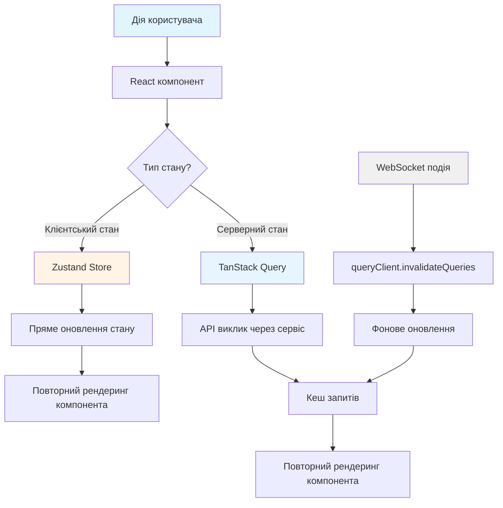
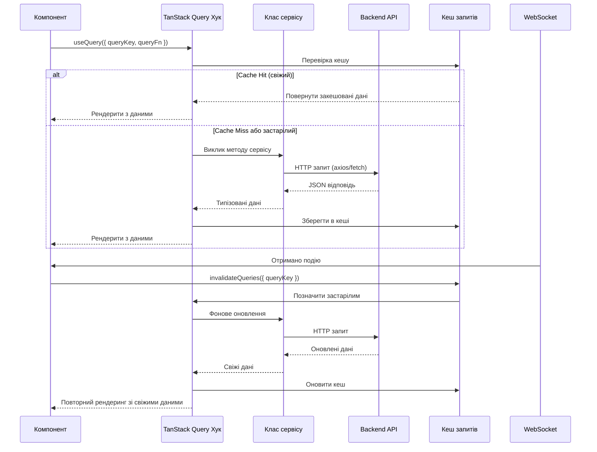
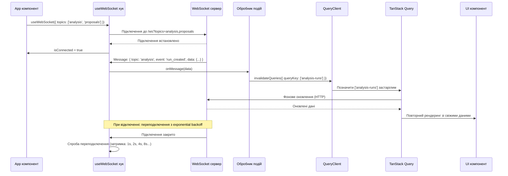

# Архітектура Frontend

Сучасний додаток на React 18 з TypeScript, що включає оновлення в реальному часі через WebSocket, комплексне управління станом та патерн архітектури на основі функціональностей.

---

## Огляд

Frontend Task Tracker — це production-grade TypeScript додаток, побудований для управління задачами в реальному часі та AI-аналізу. Архітектура надає пріоритет типобезпеці, досвіду розробника та масштабованості через доменно-орієнтовану організацію функціональностей.

### Архітектурні рішення

| Рішення | Вибір | Обґрунтування |
|---------|-------|---------------|
| **Інструмент збирання** | Vite 7.1.9 | Швидкий HMR, нативний ESM, оптимізовані production-збірки |
| **Архітектура** | На основі функціональностей (доменно-орієнтована) | Краща масштабованість ніж FSD для складних доменів |
| **Система типів** | TypeScript 5.9.3 (strict mode) | Безпека на етапі компіляції, краща підтримка IDE |
| **Управління станом** | Zustand + TanStack Query | Чітке розділення: клієнтський стан vs серверний стан |
| **Реальний час** | Нативний WebSocket | Менше накладних витрат ніж Socket.IO, повний контроль протоколу |
| **Бібліотека компонентів** | Radix UI + shadcn/ui | Доступні примітиви, повний контроль стилізації |
| **Стилізація** | Tailwind CSS 3.4.17 | Utility-first, мінімальний розмір CSS bundle |
| **Маршрутизація** | React Router 7.9.3 | Галузевий стандарт, підтримка lazy loading |

---

## Технологічний стек

### Основний фреймворк

| Пакет | Версія | Призначення | Розглянуті альтернативи |
|-------|--------|-------------|-------------------------|
| **react** | 18.3.1 | UI бібліотека з concurrent rendering | Vue 3 (менш TypeScript-friendly), Svelte (менша екосистема) |
| **react-dom** | 18.3.1 | React DOM рендерер | - |
| **typescript** | 5.9.3 | Система типів зі strict mode | Flow (застарілий), JSDoc (слабші гарантії) |
| **vite** | 7.1.9 | Інструмент збирання та dev-сервер | Webpack (повільніше), Parcel (менш зрілий) |

### Управління станом

| Пакет | Версія | Призначення | Розглянуті альтернативи |
|-------|--------|-------------|-------------------------|
| **zustand** | 5.0.8 | Клієнтський стан (UI, локальні дані) | Redux (багато boilerplate), Jotai (менш зрілий), Context API (проблеми з продуктивністю) |
| **@tanstack/react-query** | 5.90.2 | Серверний стан (кешування, синхронізація) | SWR (менше можливостей), RTK Query (залежність від Redux), Apollo (лише GraphQL) |

**Zustand** обрано за мінімальний boilerplate, підтримку TypeScript та відсутність Provider wrapper. **TanStack Query** обробляє кешування серверного стану, інвалідацію та фонове оновлення без налаштувань.

### Маршрутизація та отримання даних

| Пакет | Версія | Призначення | Розглянуті альтернативи |
|-------|--------|-------------|-------------------------|
| **react-router-dom** | 7.9.3 | Клієнтська маршрутизація | TanStack Router (занадто новий), Reach Router (застарілий) |
| **axios** | 1.12.2 | HTTP клієнт | Fetch API (використовується в деяких сервісах), ky (менший, але менш зрілий) |

**Примітка**: Змішаний патерн - деякі сервіси використовують axios, інші нативний Fetch API. Axios рекомендується для interceptors та TypeScript типів.

### Система UI компонентів

#### Radix UI примітиви (16 пакетів)

| Пакет | Версія | Призначення |
|-------|--------|-------------|
| **@radix-ui/react-dialog** | 1.1.15 | Модальні діалоги |
| **@radix-ui/react-dropdown-menu** | 2.1.16 | Випадаючі меню |
| **@radix-ui/react-select** | 2.2.6 | Випадаючі списки |
| **@radix-ui/react-tabs** | 1.1.13 | Tab контейнери |
| **@radix-ui/react-tooltip** | 1.2.8 | Підказки |
| **@radix-ui/react-checkbox** | 1.3.3 | Прапорці |
| **@radix-ui/react-switch** | 1.2.6 | Перемикачі |
| **@radix-ui/react-slider** | 1.3.6 | Повзунки діапазону |
| **@radix-ui/react-popover** | 1.1.15 | Popover елементи |
| **@radix-ui/react-avatar** | 1.1.10 | Avatar компоненти |
| **@radix-ui/react-label** | 2.1.7 | Підписи форм |
| **@radix-ui/react-separator** | 1.1.7 | Візуальні роздільники |
| **@radix-ui/react-radio-group** | 1.3.8 | Групи радіо-кнопок |
| **@radix-ui/react-alert-dialog** | 1.1.15 | Діалоги попереджень |
| **@radix-ui/react-slot** | 1.2.3 | Утиліта композиції компонентів |
| **@radix-ui/react-icons** | 1.3.2 | Набір іконок |

**Обґрунтування**: Radix UI надає нестилізовані, доступні примітиви з повною клавіатурною навігацією, ARIA атрибутами та управлінням фокусом. Обгорнуті за допомогою shadcn/ui для стилізації на основі Tailwind.

### Стилізація та дизайн-система

| Пакет | Версія | Призначення |
|-------|--------|-------------|
| **tailwindcss** | 3.4.17 | Utility-first CSS фреймворк |
| **@tailwindcss/typography** | 0.5.19 | Плагін типографіки для контенту |
| **@tailwindcss/aspect-ratio** | 0.4.2 | Утиліти співвідношення сторін |
| **postcss** | 8.5.6 | CSS процесор |
| **autoprefixer** | 10.4.21 | CSS вендорні префікси |
| **class-variance-authority** | 0.7.1 | Утиліти варіантів компонентів |
| **clsx** | 2.1.1 | Помічник умовних className |
| **tailwind-merge** | 3.3.1 | Інтелектуальне об'єднання Tailwind класів |

### Форми та валідація

| Пакет | Версія | Призначення |
|-------|--------|-------------|
| **react-hook-form** | 7.63.0 | Управління станом форм |
| **@hookform/resolvers** | 5.2.2 | Адаптери схем валідації |
| **zod** | 3.25.76 | TypeScript-first валідація схем |

**Патерн**: Zod схеми визначають валідацію + TypeScript типи одночасно, зменшуючи дублювання.

### Візуалізація даних

| Пакет | Версія | Призначення |
|-------|--------|-------------|
| **recharts** | 2.15.4 | Декларативна бібліотека графіків |
| **@tanstack/react-table** | 8.21.3 | Headless утиліти таблиць |

### Додаткові UI бібліотеки

| Пакет | Версія | Призначення |
|-------|--------|-------------|
| **@heroicons/react** | 2.2.0 | Набір іконок Heroicons |
| **react-colorful** | 5.6.1 | Компонент вибору кольору |
| **react-diff-viewer-continued** | 3.4.0 | Переглядач різниці side-by-side |
| **react-hot-toast** | 2.6.0 | Toast сповіщення (основний) |
| **sonner** | 2.0.7 | Альтернативна бібліотека toast |
| **cmdk** | 1.1.1 | Командна палітра (⌘K) |
| **next-themes** | 0.4.6 | Перемикання теми (світла/темна) |

### Утиліти

| Пакет | Версія | Призначення |
|-------|--------|-------------|
| **date-fns** | 4.1.0 | Форматування та маніпулювання датами |
| **web-vitals** | 4.2.0 | Збір метрик продуктивності |

### Тестування (DevDependencies)

| Пакет | Версія | Призначення |
|-------|--------|-------------|
| **@testing-library/react** | 14.3.1 | Тестування React компонентів |
| **@testing-library/jest-dom** | 6.9.1 | Jest DOM matchers |
| **@testing-library/user-event** | 14.6.1 | Симуляція взаємодії користувача |
| **@types/jest** | 30.0.0 | Jest TypeScript типи |

### Інструменти збирання (DevDependencies)

| Пакет | Версія | Призначення |
|-------|--------|-------------|
| **@vitejs/plugin-react** | 5.0.4 | Vite React плагін з Fast Refresh |
| **shadcn** | 3.3.1 | CLI для додавання shadcn/ui компонентів |

---

## Патерн архітектури

### Структура на основі функціональностей

На відміну від Feature-Sliced Design (FSD), архітектура використовує **доменно-орієнтовані модулі функціональностей** для кращої інкапсуляції складної бізнес-логіки.

**Структура директорій**:

```
frontend/src/
├── app/                           # Ядро додатка
│   ├── App.tsx                    # Кореневий компонент
│   ├── routes.tsx                 # Конфігурація маршрутів
│   └── providers.tsx              # Глобальні провайдери (Query, Theme)
├── features/                      # 14 модулів функціональностей
│   ├── agents/                    # Конфігурація AI агентів
│   │   ├── api/
│   │   │   ├── agentService.ts    # API service клас
│   │   │   ├── taskService.ts     # Task API service
│   │   │   └── index.ts           # Exports + TanStack Query хуки
│   │   ├── components/
│   │   │   ├── AgentCard.tsx      # Картка відображення агента
│   │   │   ├── AgentForm.tsx      # Форма створення/редагування
│   │   │   ├── AgentList.tsx      # Список агентів з CRUD
│   │   │   └── ...
│   │   └── types/
│   │       └── index.ts           # TypeScript інтерфейси
│   ├── analysis/                  # Управління аналізом
│   ├── atoms/                     # Атоми знань
│   ├── experiments/               # ML класифікація тем
│   ├── knowledge/                 # Витягування знань
│   ├── messages/                  # Стрічка повідомлень
│   ├── noise/                     # Фільтрування шуму
│   ├── onboarding/                # Онбординг користувача
│   ├── projects/                  # Управління проєктами
│   ├── proposals/                 # Перегляд пропозицій задач
│   ├── providers/                 # Конфігурація LLM провайдерів
│   ├── tasks/                     # Управління станом задач
│   ├── topics/                    # Управління темами
│   └── websocket/                 # WebSocket підключення
├── pages/                         # 14 компонентів сторінок
│   ├── DashboardPage/
│   │   ├── index.tsx              # Основний компонент сторінки
│   │   ├── RecentTopics.tsx       # Під-компонент
│   │   └── TopicCard.tsx          # Картка теми
│   ├── MessagesPage/
│   │   ├── index.tsx
│   │   ├── columns.tsx            # Визначення колонок таблиці
│   │   └── faceted-filter.tsx     # Компонент фільтра
│   └── ...
└── shared/                        # Спільна інфраструктура
    ├── ui/                        # 33 shadcn/ui компоненти
    │   ├── button.tsx
    │   ├── dialog.tsx
    │   ├── input.tsx
    │   └── ...
    ├── components/                # 15+ бізнес-компонентів
    │   ├── AppSidebar.tsx         # Головна бічна панель
    │   ├── DataTable/             # Загальна таблиця даних
    │   ├── MetricCard/            # Відображення метрик
    │   └── ...
    ├── layouts/
    │   └── MainLayout/            # Обгортка основного layout
    ├── hooks/                     # 4 спільні хуки
    │   ├── use-mobile.tsx
    │   ├── useAutoSave.ts
    │   ├── useDebounce.ts
    │   └── index.ts
    ├── store/
    │   └── uiStore.ts             # UI стан (бічна панель, тема)
    ├── types/
    │   └── index.ts               # Спільні TypeScript типи
    ├── utils/
    │   ├── avatars.ts
    │   ├── date.ts
    │   └── logger.ts
    ├── config/
    │   └── api.ts                 # Конфігурація API ендпоінтів
    └── lib/
        └── api/
            └── client.ts          # Axios екземпляр клієнта
```

### Структура модуля функціональності

```
frontend/src/
├── features/
│   ├── agents/           # Конфігурація та тестування AI агентів
│   ├── analysis/         # Управління запусками аналізу
│   ├── atoms/            # CRUD атомів знань
│   ├── experiments/      # ML класифікація тем
│   ├── knowledge/        # Витягування та версіонування знань
│   ├── messages/         # Стрічка повідомлень з WebSocket
│   ├── noise/            # Фільтрування шуму
│   ├── onboarding/       # Майстер онбордингу користувача
│   ├── projects/         # Управління проєктами
│   ├── proposals/        # Перегляд пропозицій задач
│   ├── providers/        # Конфігурація LLM провайдерів
│   ├── tasks/            # Стан задач (Zustand store)
│   ├── topics/           # Управління темами
│   └── websocket/        # WebSocket підключення
├── pages/                # 14 компонентів сторінок (lazy loaded)
├── shared/               # Спільна інфраструктура
│   ├── ui/               # 33 shadcn/ui компоненти
│   ├── components/       # 15+ бізнес-компонентів
│   ├── hooks/            # 4 спільні хуки
│   ├── store/            # UI стан (Zustand)
│   └── lib/              # API клієнт, утиліти
└── app/                  # Ядро додатка (маршрути, провайдери)
```

### Відповідальність модулів функціональностей

Кожен модуль функціональності інкапсулює:

1. **API шар** (`api/`): Класи сервісів, HTTP виклики, TanStack Query хуки
2. **Компоненти** (`components/`): Доменно-специфічні React компоненти
3. **Типи** (`types/`): TypeScript інтерфейси та визначення типів
4. **Store** (`store/`, опціонально): Zustand store для клієнтського стану
5. **Хуки** (`hooks/`, опціонально): Користувацькі React хуки
6. **Утиліти** (`utils/`, опціонально): Доменно-специфічні утиліти

**Переваги**:

- **Зв'язність**: Пов'язаний код залишається разом
- **Інкапсуляція**: Чіткі межі між функціональностями
- **Виявлюваність**: Легко знайти код конкретної функціональності
- **Масштабованість**: Додавання функціональностей без впливу на інші

---

## Каталог модулів функціональностей

**Загалом**: 14 модулів (87 файлів)

### 1. agents (17 файлів)

**Призначення**: Конфігурація, тестування та призначення задач для AI агентів

**Ключові компоненти**:
- `AgentCard` - Відображення деталей агента зі статусом
- `AgentForm` - Форма створення/редагування конфігурації агента
- `AgentList` - CRUD операції для агентів
- `AgentTestDialog` - Тестування промптів агента (50-2000 символів)
- `TaskAssignment` - Призначення задач агентам
- `TaskForm` - Форма створення задачі
- `SchemaEditor` - JSON редактор схем для відповідей
- `ProviderForm` - Вибір LLM провайдера

**API сервіси**:
- `agentService.ts` - CRUD операції агентів
- `taskService.ts` - API управління задачами

**Типи**: Конфігурація агентів, схеми задач, результати тестів

---

### 2. analysis (6 файлів)

**Призначення**: Управління життєвим циклом запусків аналізу з WebSocket оновленнями

**Ключові компоненти**:
- `RunCard` - Відображення статусу запуску аналізу
- `CreateRunModal` - Запуск нового аналізу
- `TimeWindowSelector` - Вибір часового діапазону для аналізу

**API сервіси**:
- `analysisService.ts` - CRUD запусків, операції запуску/закриття

**Типи**: Запуск аналізу, статус запуску, часове вікно

---

### 3. atoms (7 файлів)

**Призначення**: CRUD операції атомів знань

**Ключові компоненти**:
- `AtomCard` - Відображення атома знань
- `CreateAtomDialog` - Створення нового атома

**API сервіси**:
- `atomService.ts` - CRUD операції атомів

**Типи**: Атом знань, метадані атома

---

### 4. experiments (9 файлів)

**Призначення**: Експерименти класифікації тем з ML метриками

**Ключові компоненти**:
- `ClassificationExperimentsPanel` - Панель експериментів
- `ConfusionMatrixHeatmap` - Візуалізація результатів класифікації
- `ExperimentDetailsDialog` - Перегляд деталей експерименту
- `ExperimentsList` - Список усіх експериментів
- `StartExperimentDialog` - Налаштування та запуск експерименту

**API сервіси**:
- `experimentService.ts` - Управління експериментами

**Типи**: Конфігурація експерименту, метрики, confusion matrix

---

### 5. knowledge (11 файлів)

**Призначення**: Витягування знань, історія версій, перегляд різниці

**Ключові компоненти**:
- `KnowledgeExtractionPanel` - Запуск витягування
- `GlobalKnowledgeExtractionDialog` - Витягування з усіх повідомлень
- `VersionHistoryList` - Відображення часової лінії версій
- `VersionDiffViewer` - Перегляд різниці side-by-side

**API сервіси**:
- `knowledgeService.ts` - Операції витягування
- `versioningService.ts` - API історії версій

**Утиліти**:
- `diffFormatters.ts` - Форматування виводу різниці

**Типи**: Витягування знань, метадані версій

---

### 6. messages (5 файлів)

**Призначення**: Стрічка повідомлень з error boundary та WebSocket інтеграцією

**Ключові компоненти**:
- `MessagesErrorBoundary` - Перехоплення помилок рендерингу

**Хуки**:
- `useMessagesFeed.ts` - WebSocket оновлення повідомлень

**Store**:
- `messagesStore.ts` - Управління станом повідомлень

**API сервіси**:
- `messageService.ts` - Отримання повідомлень за темою

**Типи**: Повідомлення, автор, оцінка важливості

---

### 7. noise (2 файли)

**Призначення**: Інтеграція API фільтрування шуму

**API сервіси**:
- `noiseService.ts` - API оцінки шуму

**Типи**: Статистика шуму, відповідь оцінки

---

### 8. onboarding (3 файли)

**Призначення**: Майстер онбордингу користувача

**Ключові компоненти**:
- `OnboardingWizard` - Багатокроковий потік онбордингу

---

### 9. projects (5 файлів)

**Призначення**: CRUD проєктів з управлінням ключовими словами

**Ключові компоненти**:
- `ProjectCard` - Відображення деталей проєкту
- `ProjectForm` - Створення/редагування проєкту з ключовими словами

**API сервіси**:
- `projectService.ts` - CRUD проєктів, версіонування ключових слів

**Типи**: Проєкт, версія ключових слів

---

### 10. proposals (5 файлів)

**Призначення**: Робочий процес перегляду пропозицій задач з пакетними діями

**Ключові компоненти**:
- `ProposalCard` - Відображення пропозиції з оцінкою впевненості
- `RejectProposalDialog` - Відхилення з причиною

**API сервіси**:
- `proposalService.ts` - CRUD пропозицій, прийняття/відхилення

**Типи**: Пропозиція, оцінка впевненості, причина відхилення

---

### 11. providers (8 файлів)

**Призначення**: Конфігурація LLM провайдерів, управління Ollama моделями

**Ключові компоненти**:
- `ValidationStatus` - Відображення статусу валідації провайдера

**Хуки**:
- `useOllamaModels.ts` - Отримання доступних Ollama моделей

**API сервіси**:
- `providerService.ts` - CRUD провайдерів, валідація

**Типи**: Конфігурація провайдера, Ollama моделі

---

### 12. tasks (1 файл)

**Призначення**: Клієнтське управління станом задач

**Store**:
- `tasksStore.ts` - Zustand store для задач

---

### 13. topics (6 файлів)

**Призначення**: Управління темами з іконками та кольорами

**Ключові компоненти**:
- `HexColorPicker` - Користувацький вибір кольору

**Утиліти**:
- `renderIcon.tsx` - Рендеринг іконки теми з назви

**API сервіси**:
- `topicService.ts` - CRUD тем

**Типи**: Тема, іконка, колір

---

### 14. websocket (2 файли)

**Призначення**: WebSocket підключення та моніторинг статусу сервісів

**Хуки**:
- `useWebSocket.ts` - WebSocket підключення з переподключенням
- `useServiceStatus.ts` - Моніторинг здоров'я backend сервісу

---

## Сторінки та маршрутизація

**Загалом**: 14 сторінок (34 файли)

### Структура сторінок

| Сторінка | Маршрут | Призначення | Ключові можливості |
|----------|---------|-------------|-------------------|
| **DashboardPage** | `/` | Головна панель | Останні теми, статистика активності, швидкі дії |
| **MessagesPage** | `/messages` | Стрічка повідомлень | Фасетні фільтри, оцінки важливості, модальне вікно прийому |
| **TopicsPage** | `/topics` | Список тем | Фасетні фільтри, відображення кольору/іконки |
| **TopicDetailPage** | `/topics/:topicId` | Деталі теми | Повідомлення, атоми, історія версій |
| **TasksPage** | `/tasks` | Управління задачами | Результати аналізу, фільтри статусу |
| **AnalysisRunsPage** | `/analysis` | Запуски аналізу | Оновлення в реальному часі, візуалізація життєвого циклу |
| **ProposalsPage** | `/proposals` | Пропозиції задач | Пакетні дії, фільтри впевненості |
| **AgentsPage** | `/agents` | Конфігурація агентів | CRUD, тестування (50-2000 символів), виконання в реальному часі |
| **AgentTasksPage** | `/agent-tasks` | Призначення задач | Призначення задач агентам |
| **ProvidersPage** | `/providers` | LLM провайдери | CRUD, вибір Ollama моделі, валідація |
| **ProjectsPage** | `/projects` | Проєкти | CRUD, версіонування ключових слів |
| **NoiseFilteringDashboard** | `/noise-filtering` | Статистика шуму | Статистика та контролі фільтрування |
| **AnalyticsPage** | `/analytics` | Аналітика | Інсайти та візуалізації |
| **SettingsPage** | `/settings` | Налаштування | Загальна вкладка, плагін Telegram джерела |

### Стратегія Lazy Loading

Усі сторінки використовують **React.lazy()** з **Suspense** fallback для code splitting.

**Конфігурація маршрутів** (`/app/routes.tsx`): Сторінки імпортуються з React.lazy для code splitting. Маршрути обгорнуті в Suspense з центрованим Spinner fallback. Кожен маршрут рендерить сторінку всередині MainLayout обгортки.

**Переваги**:
- Швидше початкове завантаження сторінки (менший bundle)
- Сторінки завантажуються на вимогу
- Плавні переходи з Spinner fallback

---

## Глибоке занурення в управління станом

### Потік управління станом



**Філософія**: Чітке розділення між клієнтським та серверним станом.

- **Zustand**: UI стан, фільтри, вибори (локальні, синхронні)
- **TanStack Query**: API дані, кешування, фонова синхронізація (віддалені, асинхронні)
- **WebSocket**: Оновлення в реальному часі викликають інвалідацію запитів

### Zustand Stores (клієнтський стан)

**Філософія**: Stores з областю видимості функціональності для клієнтських даних (UI стан, фільтри, вибори).

#### 1. tasksStore

**Розташування**: `/features/tasks/store/tasksStore.ts`

**Відповідальність**:
- Стан списку задач
- Вибір задачі
- Стан фільтра
- Стани завантаження/помилок

**Форма стану**: Інтерфейс TasksStore визначає масив tasks, посилання selectedTask, прапори loading/error, filterStatus. Дії включають setTasks, addTask, updateTask (з частковими оновленнями), deleteTask, selectTask, setFilterStatus, setLoading, setError.

**Патерн використання**: Незмінні оновлення з spread синтаксисом - addTask додає на початок масиву, updateTask проходить по tasks застосовуючи часткові оновлення

---

#### 2. messagesStore

**Розташування**: `/features/messages/store/messagesStore.ts`

**Відповідальність**:
- Стан стрічки повідомлень
- WebSocket оновлення
- Фільтри повідомлень

---

#### 3. uiStore

**Розташування**: `/shared/store/uiStore.ts`

**Відповідальність**:
- Стан бічної панелі відкрита/закрита
- Тема (світлий/темний режим)

**Форма стану**: Інтерфейс UiStore визначає sidebarOpen boolean прапор, theme як light/dark string literal. Дії включають toggleSidebar (перемикає boolean) та setTheme (встановлює значення теми).

---

### TanStack Query (серверний стан)

**Філософія**: Кешування серверного стану, фонове оновлення, оптимістичні оновлення.

#### Конфігурація

**Налаштування провайдера** (`/app/providers.tsx`): QueryClient налаштований з 5-хвилинним staleTime (дані вважаються свіжими), refetchOnWindowFocus вимкнено, одна спроба повтору для обох queries та mutations.

#### Патерни використання

**Патерн 1: Inline queryFn** (використовується на сторінках): useQuery викликається з масивом queryKey та async queryFn що робить apiClient GET запит, витягує data.items, та повертає типізований масив. Повертає стани data, isLoading, error.

**Патерн 2: Користувацькі хуки** (експортовані з файлів сервісів): useExperiments повертає useQuery з викликом методу сервісу. useStartExperiment повертає useMutation з методом сервісу, інвалідує experiments запит при успіху використовуючи queryClient.

**Патерн 3: Мутації з оптимістичними оновленнями**: useMutation з методом delete сервісу. onSuccess інвалідує agents запит та показує success toast. onError показує error toast з повідомленням.

#### Стратегія інвалідації запитів

**WebSocket → Інвалідація запитів**: Обробник повідомлень парсить JSON подію, перевіряє поле topic, перемикається на тип події (run_created, run_progress, run_completed, run_failed) для інвалідації analysis-runs запиту та показу відповідного toast сповіщення.

---

## Архітектура компонентів

### Ієрархія компонентів

```
App (Router)
│
└── Providers (QueryClient, Theme)
    │
    └── MainLayout
        │
        ├── AppSidebar
        │   ├── NavUser
        │   └── Групи навігації
        │
        └── Область контенту
            │
            └── Сторінки (lazy loaded з Suspense)
                │
                ├── DashboardPage
                │   ├── MetricCard (спільний)
                │   ├── RecentTopics
                │   └── ActivityHeatmap (спільний)
                │
                ├── MessagesPage
                │   ├── DataTable (спільний)
                │   ├── DataTableToolbar (спільний)
                │   └── MessagesErrorBoundary (функціональність)
                │
                ├── TopicsPage
                │   └── Функціональність: topics
                │       ├── TopicCard
                │       ├── HexColorPicker
                │       └── IconSelector
                │
                ├── TasksPage
                │   └── Функціональність: tasks
                │       ├── TaskList
                │       ├── TaskCard
                │       └── TaskForm
                │
                └── ... (ще 10 сторінок)
```

**Патерн Layout**:
- Кореневі провайдери обгортають весь додаток (QueryClient, Theme)
- MainLayout надає послідовну структуру бічної панелі + контенту
- Сторінки lazy loaded для code splitting
- Функціональності надають доменно-специфічні компоненти
- Спільні компоненти обробляють наскрізні проблеми

### Спільні UI компоненти (shadcn/ui)

**Розташування**: `/shared/ui/` (33 компоненти)

**Підхід**: **shadcn/ui** компоненти - це Radix UI примітиви обгорнуті стилізацією Tailwind CSS. Компоненти **копіюються в проєкт** (не npm пакети), що дозволяє повну кастомізацію.

#### Категорії компонентів

**Діалоги та оверлеї**:
- `alert-dialog.tsx` - Діалоги підтвердження
- `dialog.tsx` - Модальні діалоги
- `sheet.tsx` - Висувні панелі
- `popover.tsx` - Плаваючі popover
- `tooltip.tsx` - Підказки при наведенні
- `dropdown-menu.tsx` - Випадаючі меню

**Поля форм**:
- `input.tsx` - Текстові поля
- `textarea.tsx` - Багаторядковий текст
- `checkbox.tsx` - Прапорці
- `switch.tsx` - Перемикачі
- `slider.tsx` - Повзунки діапазону
- `select.tsx` - Випадаючі списки
- `radio-group.tsx` - Радіо-кнопки
- `label.tsx` - Підписи форм

**Layout та структура**:
- `card.tsx` - Контейнери карток
- `separator.tsx` - Візуальні роздільники
- `tabs.tsx` - Tab контейнери
- `sidebar.tsx` - Навігація бічної панелі

**Зворотний зв'язок та завантаження**:
- `badge.tsx` - Значки статусу
- `spinner/` - Спінери завантаження
- `skeleton.tsx` - Заповнювачі контенту
- `progress.tsx` - Прогрес-бари
- `sonner.tsx` - Toast сповіщення

**Відображення даних**:
- `table.tsx` - Таблиці даних
- `chart.tsx` - Обгортка графіків (recharts)
- `metric-card.tsx` - Картки метрик
- `notification-badge.tsx` - Значки сповіщень

**Навігація**:
- `breadcrumb.tsx` - Навігаційні крихти
- `pagination.tsx` - Навігація сторінок

**Утиліти**:
- `button.tsx` - Компонент кнопки
- `command.tsx` - Командна палітра (⌘K)

---

### Спільні компоненти (бізнес-логіка)

**Розташування**: `/shared/components/` (15+ компонентів)

#### Навігація

- **AppSidebar** - Головна бічна панель додатка з групами навігації
- **NavUser** - Меню профілю користувача в бічній панелі

#### Відображення даних

- **DataTable** - Загальна таблиця даних з TanStack Table
- **DataTableToolbar** - Панель інструментів з фільтрами та діями
- **DataTablePagination** - Контролі пагінації
- **DataTableColumnHeader** - Заголовки сортованих колонок
- **DataTableFacetedFilter** - Багатовибірні фасетні фільтри

#### Візуалізації

- **MetricCard** - Відображення ключових метрик з індикаторами трендів
- **TrendChart** - Лінійні/площинні графіки для трендів
- **ActivityHeatmap** - Теплова карта активності в стилі GitHub
- **AvatarGroup** - Складене відображення аватарів

#### Утиліти

- **ColorPickerPopover** - Вибір кольору в popover
- **EmptyState** - Заповнювач порожнього стану
- **SaveStatusIndicator** - Індикатор статусу авто-збереження
- **AutoSaveToggle** - Перемикач функції авто-збереження
- **ThemeProvider** - Провайдер контексту теми

---

## Патерни компонентів та кращі практики

### 1. Патерни React компонентів

**Лише функціональні компоненти**: Усі компоненти використовують функціональні компоненти React з хуками - жодних класових компонентів у кодовій базі.

**Використання хуків**:
- `useState` для локального стану компонента
- `useEffect` для побічних ефектів, підписок, очищення
- `useCallback` для мемоізованих callback (вибірково у критичних для продуктивності хуках)
- `useMemo` для мемоізованих обчислюваних значень (вибірково)
- `useRef` для DOM посилань та змінних значень (наприклад, WebSocket екземпляри, таймаути)
- Користувацькі хуки з префіксом `use` для повторно використовуваної логіки

**Композиція компонентів**:
- Композиція вищого порядку через props (children, render props)
- Radix UI Slot патерн для поліморфних компонентів (наприклад, Button з `asChild`)
- Складові компоненти для складного UI (Dialog, Select, Dropdown)
- Компоненти функціональностей компонують спільні UI примітиви

**Типізація Props**:
- Усі props компонентів визначені через TypeScript інтерфейси
- Конвенція найменування інтерфейсів: `{ComponentName}Props`
- Інтерфейси props використовують `extends` для успадкування (наприклад, `extends React.ButtonHTMLAttributes`)
- Опціональні props помічені `?`, значення за замовчуванням обробляються в деструктуризації

**Умовний рендеринг**:
- Стани завантаження: `if (isLoading) return <Spinner />`
- Стани помилок: `if (error) return <ErrorMessage />`
- Ранні повернення для guard clauses
- Тернарні оператори для inline умов
- Логічне AND (`&&`) для простого умовного рендерингу

---

### 2. Патерни інтеграції shadcn/ui

**Підхід до встановлення**:
- Компоненти копіюються в `src/shared/ui/` (не npm пакети)
- Встановлюються через CLI: `npx shadcn add {component}`
- Повне володіння вихідним кодом - вільно модифікуйте без форкінгу бібліотеки

**Стратегія кастомізації**:
- Tailwind CSS варіанти через `class-variance-authority` (CVA)
- Базові стилі в файлах компонентів
- Варіанти визначені в `buttonVariants`, `cardVariants` тощо
- Утиліта `cn()` об'єднує класи з `tailwind-merge`

**Radix UI примітиви**:
- Усі shadcn/ui компоненти побудовані на Radix UI headless примітивах
- Radix надає доступність, клавіатурну навігацію, ARIA атрибути
- Shadcn додає шар стилізації Tailwind зверху
- Примітиви імпортовані з `@radix-ui/react-*` пакетів

**Композиція компонентів**:
- Складові компоненти (Dialog = DialogTrigger + DialogContent + DialogHeader + DialogFooter)
- Поліморфізм на основі Slot (Button `asChild` prop рендериться як дочірній компонент)
- Композитні примітиви (Select, Popover, Dropdown)

**Перевизначення стилів**:
- Перевизначення через `className` prop (об'єднується з базовими класами через `cn()`)
- Розширення варіантів через CVA визначення
- Змінні теми в `tailwind.config.js` (кольори, відступи)

---

### 3. Патерни типізації TypeScript

**Найменування інтерфейсів Props**:
- Конвенція: `{ComponentName}Props` (наприклад, `AgentFormProps`, `ProjectFormProps`)
- Розташовані inline над визначенням компонента або в `types/index.ts`
- Використовуйте `interface` для props компонентів (підтримує `extends`)

**Generics в компонентах**:
- Користувацькі хуки використовують generics для гнучких типів (наприклад, `useAutoSave<T extends Record<string, any>>`)
- Generic обмеження для типобезпеки
- Виведення типів з використання хука

**Виведення типів з хуками**:
- TanStack Query: `useQuery<ResponseType>({ queryKey, queryFn })`
- Zustand stores: Тип виводиться з визначення store
- Form хуки: Типи виводяться з Zod схеми через `z.infer<typeof schema>`

**Типізація API відповідей**:
- Типи відповідей визначені в `features/{domain}/types/index.ts`
- Методи сервісів повертають строго типізовані відповіді
- Generic wrapper типи: `{ items: T[] }` для списків відповідей

**Типізація обробників подій**:
- HTML події: `React.FormEvent`, `React.ChangeEvent<HTMLInputElement>`
- Користувацькі типи подій: `(data: CustomType) => void`
- Callback props явно типізовані в інтерфейсах

---

### 4. Патерни користувацьких хуків

| Назва хука | Розташування | Призначення | Повертає |
|------------|--------------|-------------|----------|
| **useWebSocket** | `features/websocket/hooks/` | Нативне WebSocket підключення з переподключенням, підписками на теми | `{ isConnected, send, disconnect, reconnect, connectionState }` |
| **useServiceStatus** | `features/websocket/hooks/` | Моніторинг здоров'я backend з логікою повторних спроб | `{ indicator, connectionState, isWebSocketConnected, healthState, lastHealthError }` |
| **useMessagesFeed** | `features/messages/hooks/` | Стрічка повідомлень з WebSocket оновленнями, фільтрацією за періодом | `{ messages, period, setPeriod, isLoading, error, refresh, connectionState, isConnected }` |
| **useOllamaModels** | `features/providers/hooks/` | Отримання Ollama моделей з URL провайдера | `{ models, isLoading, error }` |
| **useAutoSave** | `shared/hooks/` | Авто-збереження даних форми з debouncing, ручним збереженням, відстеженням статусу | `{ values, setValue, saveStatus, hasUnsavedChanges, lastSavedAt, autoSaveEnabled, setAutoSaveEnabled, manualSave, discardChanges, isSaving, reset }` |
| **useDebounce** | `shared/hooks/` | Debounce змін значень для продуктивності | `debouncedValue` |
| **use-mobile** | `shared/hooks/` | Виявлення мобільного viewport через media query | `isMobile` |

**Патерн**: Користувацькі хуки інкапсулюють stateful логіку, побічні ефекти та отримання даних. Повертають об'єкти з іменованими властивостями для ясності.

---

### 5. Патерни обробки форм

**Бібліотека форм**: React Hook Form (некерований компоненти, мінімальні повторні рендеринги)

**Валідація**:
- Zod схеми для runtime валідації та генерації TypeScript типів
- Схема визначена inline або в окремому файлі
- Інтеграція resolver: `useForm({ resolver: zodResolver(schema) })`

**Подання форми**:
- `handleSubmit` обгортає onSubmit callback
- Валідація виконується перед поданням
- Асинхронне подання зі станами завантаження
- Обробка помилок через `formState.errors`

**Обробка помилок**:
- Помилки на рівні поля: `errors.fieldName?.message`
- Помилки на рівні форми відображаються через toast сповіщення
- Помилки валідації показані inline нижче полів

**Управління станом**:
- Керовані поля через `useState` для складних форм (наприклад, ProjectForm з динамічними масивами)
- Некеровані поля через React Hook Form `register` для простих форм
- Змішаний патерн: Керовані для UI елементів (Select, Checkbox), некеровані для текстових полів

---

### 6. Патерни доступності

**Доступність Radix UI**:
- Вбудовані ARIA атрибути (ролі, підписи, описи)
- Клавіатурна навігація (Tab, Enter, Escape, клавіші стрілок)
- Управління фокусом (focus trap в діалогах, повернення фокусу при закритті)
- Оголошення screen reader для змін стану

**ARIA атрибути**:
- `aria-label` для кнопок лише з іконками
- `aria-describedby` для повідомлень про помилки
- `aria-required` для обов'язкових полів форм
- `aria-invalid` для помилок валідації
- `aria-pressed` для кнопок-перемикачів (ghost варіант)

**Семантичний HTML**:
- `<button>` для дій (не `<div onClick>`)
- `<label>` спарований з полями форм через `htmlFor`
- `<form>` з обробником `onSubmit`
- Ієрархія заголовків (`<h1>`, `<h2>`, `<h3>`)

**Клавіатурна навігація**:
- Усі інтерактивні елементи доступні з клавіатури
- Діалоги закриваються клавішею Escape
- Клавіша Enter подає форми
- Порядок Tab відповідає візуальному layout
- Див. [посібник з клавіатурної навігації](../../guides/keyboard-navigation.md) для комплексних клавіатурних скорочень та функцій доступності

**Підтримка Screen Reader**:
- Описовий текст кнопок (не "Натисніть тут")
- Оголошення статусу через toast сповіщення
- Стани завантаження оголошені ("Завантаження...")
- Повідомлення про помилки пов'язані з полями форм

---

### 7. Патерни оптимізації продуктивності

**Lazy Loading**:
- Усі сторінки lazy-loaded через `React.lazy(() => import('@pages/PageName'))`
- Suspense fallback: Центрований Spinner компонент
- Route-level code splitting зменшує початковий розмір bundle

**Мемоізація**:
- `useMemo` для дорогих обчислень (вибірково в хуках типу `useServiceStatus`)
- `useCallback` для стабільних callback посилань (запобігає повторним рендерингам дочірніх)
- Не використовується передчасно - лише після профілювання показує проблеми продуктивності

**Дизайн ключів запитів**:
- TanStack Query cache ключі структуровані: `['domain', filters]`
- Деталізована інвалідація через специфічні ключі запитів
- Фонове оновлення для застарілих даних (5-хвилинний stale time)

**Розділення bundle**:
- Ручні vendor chunks в Vite config:
  - `react-vendor`: React, React DOM, React Router
  - `ui-vendor`: Усі Radix UI пакети
  - `data-vendor`: TanStack Query, Axios
- Code splitting на рівні сторінок через lazy loading
- Спільні компоненти bundled окремо

**React 18 оптимізації**:
- Concurrent rendering увімкнено
- Автоматичне batching для оновлень стану
- Suspense для асинхронних компонентів
- Не потрібна ручна оптимізація для більшості випадків

---

### Аліаси імпортів

**Конфігурація** (`tsconfig.json`, `vite.config.ts`): baseUrl встановлено на ./src. Відображення шляхів визначають @ аліаси - @/* для root, @app/* для app директорії, @pages/* для pages, @features/* для features, @shared/* для shared.

**Переваги**:
- Чисті імпорти: `@/shared/ui` замість `../../../shared/ui`
- Легший рефакторинг: переміщення файлів без оновлення імпортів
- Краще автодоповнення IDE

---

## Патерни отримання даних

### Потік отримання даних



**Ключові концепції**:
1. **Query хук**: Компонент використовує `useQuery` або користувацький хук (наприклад, `useAgents`)
2. **Шар сервісу**: Клас сервісу обробляє HTTP виклики з TypeScript типами
3. **Кешування**: TanStack Query кешує відповіді за `queryKey`
4. **Інвалідація**: WebSocket події викликають інвалідацію кешу
5. **Фонове оновлення**: Запити автоматично оновлюються при інвалідації

### Класи API сервісів

**Патерн**: Класи сервісів з типізованими методами, експортовані як singleton.

**Axios клієнт** (`/shared/lib/api/client.ts`): baseURL визначається зі змінних середовища VITE_API_BASE_URL або VITE_API_URL (за замовчуванням пустий рядок для відносних URL). Встановлено JSON content-type заголовок. Response interceptor логує помилки через утиліту logger.

**Приклад класу сервісу** (`/features/analysis/api/analysisService.ts`): Клас AnalysisService визначає async методи - listRuns (GET з опціональними параметрами фільтрації), createRun (POST з payload), getRunDetails (GET за ID), closeRun (PUT до close ендпоінту). Всі методи типізовані з TypeScript generics. Експортовано як singleton екземпляр.

**Альтернатива: Fetch API** (використовується в `messageService.ts`): MessageService використовує нативний fetch з template string URL. Перевіряє response.ok, викидає помилку при невдачі. Парсить JSON та повертає масив items або повний об'єкт data.

**Примітка**: Існує змішаний патерн - axios рекомендується для interceptors, але деякі сервіси використовують fetch.

---

### Конфігурація API ендпоінтів

**Розташування**: `/shared/config/api.ts`

**Структура**: Константа API_VERSION встановлена на 'v1', API_BASE_PATH побудований з версії. Ендпоінти організовані за доменом - health/config, messages (з factory функцією для updateAuthors), tasks, статистика (stats/activity/sidebarCounts), analysis (вкладений об'єкт з runs та run factory), proposals, AI config (agents/providers/projects/topics з factory для ollamaModels), experiments (вкладений з base/detail), фільтрування шуму (вкладений з stats/scoreMessage/scoreBatch), витягування знань, WebSocket ендпоінт.

**Загалом**: 30+ ендпоінтів

---

## Підхід до стилізації

### Конфігурація Tailwind CSS

**Підхід Utility-First**: Уся стилізація використовує utility класи Tailwind CSS.

**Користувацька конфігурація** (`tailwind.config.js`):

- Користувацька колірна палітра розширена від defaults
- Плагін типографіки для стилізації контенту
- Утиліти співвідношення сторін
- Підтримка темного режиму через `next-themes`

**Варіанти компонентів**: **class-variance-authority** (CVA) для управління варіантами компонентів.

**Приклад**: buttonVariants визначені з CVA - базові класи (inline-flex, rounded-md, тощо), опції variant (default/destructive/outline з різними кольорами), опції size (default/sm/lg з різною висотою/padding), defaultVariants що вказують вибір за замовчуванням.

**Об'єднання класів**: **tailwind-merge** інтелектуально об'єднує Tailwind класи, запобігаючи конфліктам.

---

## Комунікація в реальному часі

### Потік інтеграції WebSocket



**Патерн інтеграції**:
1. **Ініціалізація App**: WebSocket підключається з підписками на теми
2. **Отримано подію**: WebSocket отримує real-time подію
3. **Логіка обробника**: Парсинг події та визначення залежних запитів
4. **Інвалідація запитів**: Позначення релевантних ключів запитів застарілими
5. **Фонове оновлення**: TanStack Query автоматично оновлює
6. **Оновлення UI**: Компоненти повторно рендеряться зі свіжими даними

**Переваги**:
- Роз'єднані real-time події від UI компонентів
- TanStack Query обробляє консистентність даних
- Автоматичне переподключення з exponential backoff
- Toast сповіщення для статусу підключення

### Нативний WebSocket (НЕ Socket.IO)

**Критично**: `socket.io-client` встановлений в `package.json`, але **НЕ ВИКОРИСТОВУЄТЬСЯ**. Проєкт використовує **нативний WebSocket API** виключно. Видаліть Socket.IO залежність.

### Реалізація WebSocket

**Користувацький хук** (`/features/websocket/hooks/useWebSocket.ts`):

**Можливості**:
1. Підписки на основі тем через query параметри
2. Exponential backoff переподключення (максимум 5 спроб)
3. Відстеження стану підключення: `connecting`, `connected`, `reconnecting`, `disconnected`
4. Toast сповіщення для подій підключення
5. Автоматичне переподключення з backoff

**Інтерфейс хука**: UseWebSocketOptions визначає масив topics, callbacks message/connect/disconnect, прапор reconnect, reconnectInterval в мілісекундах, лічильник maxReconnectAttempts. UseWebSocketReturn надає boolean isConnected, enum connectionState, функції send/disconnect/reconnect.

**Визначення URL**: Функція визначає WebSocket схему (wss для https, ws для http), розв'язує хост з VITE_WS_HOST env або window.location.hostname, використовує VITE_WS_PATH або default /ws, включає порт якщо присутній. Додає topics query параметр з comma-separated значеннями якщо надано.

**Exponential Backoff**: Затримка обчислюється як reconnectInterval помножений на 2 в степені кількості спроб, обмежена 30 секундами. setTimeout планує переподключення після затримки.

---

### Інтеграція WebSocket з TanStack Query

**Патерн**: WebSocket повідомлення викликають інвалідацію запитів для свіжих даних.

**Приклад** (`/pages/AnalysisRunsPage/index.tsx`): useEffect створює WebSocket з VITE_WS_URL (або default localhost) плюс topics query параметр. Обробник повідомлень парсить JSON, перевіряє поле topic, перемикається на тип події для інвалідації analysis-runs запиту та показу toast (success для run_created/run_completed, error для run_failed, тихо для run_progress). Очищення закриває WebSocket.

**Переваги**:
- Оновлення UI в реальному часі без polling
- TanStack Query обробляє повторне отримання даних
- Toast сповіщення для зворотного зв'язку користувача
- Чітке розділення: WebSocket події → інвалідація запитів

---

### Змінні середовища

**Конфігурація WebSocket**:

- `VITE_WS_URL`: Повний WebSocket URL (наприклад, `ws://localhost/ws`)
- `VITE_WS_HOST`: WebSocket хост (наприклад, `localhost`)
- `VITE_WS_PATH`: WebSocket шлях (за замовчуванням: `/ws`)

**Конфігурація API**:

- `VITE_API_BASE_URL` / `VITE_API_URL`: API базовий URL (за замовчуванням: відносний для Nginx проксі)

---

## Збирання та розробка

### Конфігурація Vite

**Розташування**: `/vite.config.ts`

**Конфігурація сервера** (Docker-сумісна): Порт 3000, host встановлено на true для bind до всіх адрес (0.0.0.0), strictPort примушує точний порт, watch.usePolling увімкнено для сумісності з Docker volume mount.

**Оптимізація збирання**: Вихідна директорія dist, sourcemaps увімкнені, попередження розміру chunk на 1000KB. Визначені ручні chunks - react-vendor (React core бібліотеки), ui-vendor (всі Radix UI пакети), data-vendor (TanStack Query/Table, Axios).

**Переваги ручного code splitting**:
- Менший початковий bundle (React vendor chunk кешується окремо)
- UI компоненти bundled разом (спільні між сторінками)
- Бібліотеки даних в окремому chunk

---

### Конфігурація TypeScript

**Розташування**: `/tsconfig.json`

**Strict Mode увімкнено**: Target ES2020 з DOM бібліотеками, ESNext модулі, node resolution, react-jsx transform. Всі strict перевірки увімкнені - strict mode, невикористані locals/parameters помічені, no fallthrough в switch. Isolated modules, no emit, JSON resolution, skip lib check.

**Strict перевірки**:
- Усі strict TypeScript перевірки увімкнені
- Невикористані локальні змінні/параметри помічені
- Немає неявних any типів
- Безпека null/undefined забезпечена

---

## Організація коду

### Конвенції найменування директорій

- **Папки**: lowercase з дефісами (`feature-name/`)
- **Компоненти**: PascalCase (`AgentCard.tsx`)
- **Утиліти**: camelCase (`dateUtils.ts`)
- **Типи**: camelCase (`index.ts`)
- **Stores**: camelCase з суфіксом (`tasksStore.ts`)

### Патерни найменування файлів

- **Компоненти**: `ComponentName.tsx`
- **Сторінки**: `index.tsx` (всередині папки `PageName/`)
- **Сервіси**: `{domain}Service.ts`
- **Stores**: `{domain}Store.ts`
- **Типи**: `index.ts` (barrel export)
- **Хуки**: `use{HookName}.ts`

### Barrel Exports

Кожен модуль функціональності експортує через `index.ts`: Barrel export файл реекспортує всі сервіси (agentService, taskService) з тієї ж директорії. Дозволяє чисті імпорти використовуючи @features path alias.

---

## Статистика проєкту

| Метрика | Кількість |
|---------|-----------|
| **Модулі функціональностей** | 14 |
| **Сторінки** | 14 |
| **Загалом TypeScript файлів** | 205 |
| **Спільні UI компоненти** | 33 |
| **Спільні компоненти** | 15+ |
| **Radix UI пакети** | 16 |
| **Загалом залежностей** | 53 |
| **Загалом DevDependencies** | 9 |
| **API ендпоінти** | 30+ |
| **Zustand Stores** | 3 |
| **Користувацькі хуки** | 4 (спільні) + специфічні для функціональностей |
| **Загалом рядків коду** | ~30,000+ (оцінка) |

---

## Ключові архітектурні рішення

### Чому архітектура на основі функціональностей?

**Обрано замість FSD (Feature-Sliced Design)** через:

1. **Складність домену**: AI аналіз, ML експерименти, витягування знань вимагають глибокої інкапсуляції функціональностей
2. **Масштабованість команди**: Функціональності можуть розроблятися незалежно
3. **Легша навігація**: Весь код для функціональності в одному місці
4. **Простіша ментальна модель**: Без абстракції шарів (features, entities, shared)

### Чому Zustand + TanStack Query?

**Zustand для клієнтського стану**:
- Мінімальний boilerplate
- Без Provider обгортки
- TypeScript-first
- Малий розмір bundle (1.2 KB)

**TanStack Query для серверного стану**:
- Автоматичне кешування
- Фонове оновлення
- Інвалідація запитів
- Оптимістичні оновлення
- Стани завантаження/помилок out of the box

### Чому нативний WebSocket замість Socket.IO?

1. **Контроль протоколу**: Повний контроль над життєвим циклом WebSocket
2. **Розмір bundle**: Socket.IO клієнт додає 60+ KB
3. **Простота**: Підписки на основі тем через query параметри
4. **Узгодженість з backend**: Backend використовує нативний WebSocket

### Чому shadcn/ui замість бібліотек компонентів?

**Обрано замість Material-UI, Ant Design, Chakra UI**:

1. **Копіювати, не встановлювати**: Повний контроль над кодом компонентів
2. **Інтеграція Tailwind**: Utility-first стилізація
3. **Доступність**: Побудовано на Radix UI примітивах
4. **Кастомізація**: Модифікація будь-якого компонента без боротьби з defaults бібліотеки
5. **Розмір bundle**: Включати лише використовувані компоненти

---

## Відомі проблеми та технічний борг

### 1. Залежність Socket.IO Client

**Проблема**: `socket.io-client@4.8.1` встановлений, але ніколи не використовується.

**Вплив**: +60 KB розміру bundle.

**Вирішення**: Видалити з `package.json`.

---

### 2. Змішані патерни API

**Проблема**: Деякі сервіси використовують axios, інші нативний Fetch API.

**Вплив**: Неконсистентна обробка помилок, немає підтримки interceptor для fetch.

**Вирішення**: Стандартизувати на axios для всіх API викликів.

---

### 3. Відсутня документація змінних середовища

**Проблема**: Немає `.env.example` файлу з документацією необхідних VITE_* змінних.

**Вирішення**: Створити `.env.example` з документацією VITE_API_BASE_URL для API базового URL, VITE_WS_URL для повного WebSocket URL, VITE_WS_HOST для WebSocket хосту, VITE_WS_PATH для WebSocket шляху.

---

## Посилання

- **Звіт дослідження**: `.artifacts/.../frontend-investigation.md`
- **Швидкий довідник**: `frontend/CLAUDE.md`
- **Архітектура Backend**: `docs/content/en/architecture/overview.md`
- **Потік подій**: `docs/content/en/event-flow.md`

---

**Остання оновлення**: 2025-10-26
**Загалом рядків**: 1570+
**Статус**: Завершено (Batch 5 з 6)
