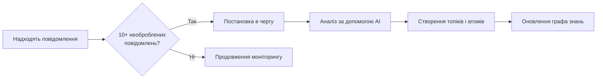

# Витягування знань

!!! tip "Короткий огляд"
    Витягування знань автоматично аналізує ваші розмови, щоб виявити теми обговорень та витягти цінні інсайти. Система визначає проблеми, рішення, рішення та патерни, організовуючи їх у граф знань з можливістю пошуку.

---

## Що таке витягування знань?

Витягування знань - це функція на базі штучного інтелекту, яка перетворює неструктуровані розмови на структуровані знання. Замість ручної категоризації повідомлень та фіксації інсайтів, система робить це автоматично за допомогою передових мовних моделей.

### Що витягується

Система виявляє два типи знань:

<div class="grid cards" markdown>

- :material-tag-multiple: **Топіки (Topics)**

    Теми та контексти обговорень, які групують пов'язані розмови

    Приклади: "Дизайн API", "Міграція бази даних", "Проблеми UI/UX"

- :material-atom: **Атоми (Atoms)**

    Атомарні одиниці знань - самодостатні, дієві інсайти

    Типи: Проблеми, Рішення, Рішення, Інсайти, Питання, Патерни, Вимоги

</div>

---

## Як це працює

### Автоматичне витягування

Система моніторить ваші повідомлення та автоматично запускає витягування при виконанні умов:



**Стандартний тригер:** 10 необроблених повідомлень за останні 24 години

**Розмір пакета:** До 50 повідомлень за одне витягування

**Час обробки:** 30-90 секунд залежно від кількості повідомлень

### Ручне витягування

Ви також можете запустити витягування вручну через API:

=== "Python"
    ```python
    import httpx

    async with httpx.AsyncClient() as client:
        response = await client.post(
            "http://localhost:8000/api/v1/knowledge/extract",
            json={
                "message_ids": [1, 2, 3, 4, 5],
                "provider_id": "ваш-uuid-провайдера"
            }
        )
        print(response.json())
    ```

=== "cURL"
    ```bash
    curl -X POST http://localhost:8000/api/v1/knowledge/extract \
      -H "Content-Type: application/json" \
      -d '{
        "message_ids": [1, 2, 3, 4, 5],
        "provider_id": "ваш-uuid-провайдера"
      }'
    ```

---

## Розуміння топіків

Топіки представляють теми обговорень або проблемні домени, які виникають з розмов.

### Властивості топіка

| Властивість | Опис | Приклад |
|------------|------|---------|
| **Назва** | Лаконічний ідентифікатор (2-4 слова) | "Автентифікація API" |
| **Опис** | Чітке пояснення теми | "Обговорення безпеки API та автентифікації користувачів" |
| **Іконка** | Автоматично обраний візуальний ідентифікатор | `ShieldIcon` |
| **Колір** | Автоматично призначений hex-колір | `#3B82F6` |
| **Впевненість** | Оцінка впевненості AI (0.0-1.0) | `0.85` |

### Як створюються топіки

1. **Аналіз LLM** - AI визначає 1-3 основні теми з пакета повідомлень
2. **Перевірка впевненості** - Автоматично створюються тільки топіки з впевненістю 0.7+
3. **Дедуплікація** - Існуючі топіки використовуються повторно, запобігаючи дублікатам
4. **Автоматичне призначення** - Повідомлення пов'язуються з відповідними топіками

!!! info "Вибір іконки та кольору"
    Система автоматично вибирає іконки та кольори на основі ключових слів топіка:

    - "API" → `CodeBracketIcon` (Фіолетовий)
    - "База даних" → `ServerIcon` (Синій)
    - "Дизайн" → `PaintBrushIcon` (Рожевий)

    Ви завжди можете налаштувати їх вручну пізніше.

---

## Розуміння атомів

Атоми - це найменші одиниці знань, самодостатні інсайти, які можуть існувати окремо.

### Типи атомів

<div class="grid cards" markdown>

- :material-alert-circle: **Проблема (Problem)**

    Проблеми, баги або виклики, виявлені в обговореннях

- :material-check-circle: **Рішення (Solution)**

    Відповіді, виправлення або розв'язання проблем

- :material-flag: **Рішення (Decision)**

    Зроблені вибори, обрані напрямки або зобов'язання

- :material-lightbulb: **Інсайт (Insight)**

    Усвідомлення, спостереження або навчання

- :material-help-circle: **Питання (Question)**

    Нез'ясовані моменти, які потребують уточнення

- :material-pattern: **Патерн (Pattern)**

    Повторювані теми, архітектурні патерни або кращі практики

- :material-clipboard-list: **Вимога (Requirement)**

    Потреби, обмеження або специфікації

</div>

### Властивості атома

| Властивість | Опис |
|------------|------|
| **Тип** | Класифікація (problem, solution, decision тощо) |
| **Заголовок** | Короткий опис (макс. 200 символів) |
| **Контент** | Повний самодостатній опис |
| **Впевненість** | Оцінка впевненості AI (0.0-1.0) |
| **Підтверджено користувачем** | Прапорець ручної перевірки (за замовчуванням: false) |
| **Топік** | Батьківський топік, до якого належить атом |
| **Джерело повідомлень** | Оригінальні повідомлення, з яких це було витягнуто |

### Зв'язки між атомами

Атоми можуть бути пов'язані, щоб показати, як знання з'єднуються:

| Тип зв'язку | Опис | Приклад |
|-------------|------|---------|
| `solves` | Атом рішення вирішує атом проблеми | "Впровадження OAuth" вирішує "Проблему безпеки входу" |
| `supports` | Атом надає докази для іншого | "Результати тестування продуктивності" підтримують "Рішення використати Redis" |
| `contradicts` | Атом конфліктує з іншим | "Вимоги клієнта" суперечать "Бюджетним обмеженням" |
| `continues` | Атом розвиває інший | "Дизайн API v2" продовжує "Ретроспективу API v1" |
| `refines` | Атом додає деталі до іншого | "Деталі обробки помилок" уточнюють "Стратегію помилок API" |
| `relates_to` | Загальний тематичний зв'язок | "Архітектура фронтенду" пов'язана з "Архітектурою бекенду" |
| `depends_on` | Атом потребує інший як передумову | "Розгортання в продакшн" залежить від "Проходження QA тестів" |

---

## Використання витягнутих знань

### Перегляд топіків

Топіки відображаються в панелі керування та можна переглядати:

- **Список топіків** - Всі топіки з кількістю повідомлень
- **Деталі топіка** - Повний опис, пов'язані атоми та повідомлення
- **Часова лінія топіка** - Коли тема обговорювалась

### Перегляд атомів

Атоми можна фільтрувати та шукати:

- **За типом** - Показати тільки проблеми, рішення тощо
- **За топіком** - Переглянути всі атоми в конкретному топіку
- **За впевненістю** - Фільтрувати знання з високою впевненістю
- **За підтвердженням** - Показати тільки перевірені користувачем атоми

### Граф знань

Система будує граф, що показує зв'язки:

```
Проблема: "Вхід не працює на мобільних"
    ↓ [solves]
Рішення: "Впровадити OAuth2 flow"
    ↓ [continues]
Інсайт: "OAuth покращує безпеку"
    ↓ [supports]
Рішення: "Мігрувати всю автентифікацію на OAuth2"
```

---

## Налаштування

### Параметри витягування

Ви можете налаштувати поведінку витягування:

```python
# У backend/app/tasks.py
KNOWLEDGE_EXTRACTION_THRESHOLD = 10  # Повідомлень до авто-тригера
KNOWLEDGE_EXTRACTION_LOOKBACK_HOURS = 24  # Вікно часу для необроблених повідомлень
```

### Поріг впевненості

Контролюйте якість проти кількості витягнутих знань:

```python
# У KnowledgeExtractionService
confidence_threshold = 0.7  # Мінімальна впевненість для автоматичного створення
```

- **Вищий поріг (0.8-0.9)** - Тільки дуже впевнені витягування, менше хибних спрацьовувань
- **За замовчуванням (0.7)** - Збалансована якість та охоплення
- **Нижчий поріг (0.5-0.6)** - Більше витягувань, може знадобитися ручна перевірка

### Налаштування LLM провайдера

Витягування знань вимагає активного LLM провайдера (Ollama або OpenAI):

1. **Додати провайдера** в налаштуваннях панелі
2. **Налаштувати модель** (рекомендовано: `qwen2.5:14b` для Ollama)
3. **Активувати провайдера** для увімкнення авто-витягування
4. **Протестувати з'єднання** перед першим витягуванням

!!! warning "Вимоги до провайдера"
    - Провайдер повинен бути позначений як **активний**
    - Провайдери Ollama потребують налаштованого `base_url`
    - Провайдери OpenAI потребують дійсного API ключа
    - Модель повинна підтримувати структурований вивід (JSON режим)

---

## Оновлення в реальному часі

Система транслює прогрес витягування через WebSocket:

```typescript
const ws = new WebSocket('ws://localhost:8000/ws/knowledge');

ws.onmessage = (event) => {
  const { type, data } = JSON.parse(event.data);

  switch (type) {
    case 'knowledge.extraction_started':
      console.log(`Аналізується ${data.message_count} повідомлень...`);
      break;

    case 'knowledge.topic_created':
      console.log(`Новий топік: ${data.topic_name}`);
      break;

    case 'knowledge.atom_created':
      console.log(`Новий атом: ${data.atom_title} (${data.atom_type})`);
      break;

    case 'knowledge.extraction_completed':
      console.log('Витягування завершено!', data);
      break;

    case 'knowledge.extraction_failed':
      console.error('Витягування не вдалося:', data.error);
      break;
  }
};
```

---

## Кращі практики

### Для кращого витягування

!!! tip "Пишіть чіткі повідомлення"
    Детальні повідомлення з контекстом дають кращі витягування. Включайте описи проблем, пропоновані рішення та рішення.

!!! tip "Групуйте пов'язані повідомлення"
    Обговорюйте одну тему за раз. Змішування кількох не пов'язаних тем знижує якість витягування.

!!! tip "Перевіряйте елементи з низькою впевненістю"
    Атоми з впевненістю нижче 0.7 не створюються автоматично. Перевірте їх вручну, щоб захопити граничні випадки.

### Для управління знаннями

!!! tip "Підтверджуйте важливі атоми"
    Позначайте критичні інсайти як `user_approved`, щоб відрізнити перевірені знання.

!!! tip "Редагуйте автоматично згенерований контент"
    AI витягування є відправними точками. Уточнюйте заголовки та контент для ясності.

!!! tip "Підтримуйте зв'язки"
    Перевіряйте зв'язки між атомами. Міцні зв'язки будують цінний граф знань.

### Поширені помилки

!!! warning "Не переборщуйте з витягуванням"
    Не кожне повідомлення потребує витягування. Випадкові розмови та оновлення статусу додають шум.

!!! warning "Не довіряйте сліпо"
    Завжди перевіряйте AI витягування перед використанням їх для прийняття рішень.

!!! warning "Не видаляйте вихідні повідомлення"
    Атоми посилаються на оригінальні повідомлення. Їх видалення порушує аудиторський слід.

---

## Усунення несправностей

### Витягування не запускається

**Проблема:** Повідомлення надіслані, але витягування не відбувається

**Рішення:**

1. Перевірте, чи є 10+ необроблених повідомлень (без `topic_id`)
2. Переконайтесь, що активний LLM провайдер існує в налаштуваннях
3. Перевірте логи на наявність помилок підключення провайдера
4. Переконайтесь, що повідомлення в межах 24-годинного вікна

### Низькоякісні витягування

**Проблема:** Топіки/атоми нечіткі або невірні

**Рішення:**

1. Використовуйте більш описові повідомлення з контекстом
2. Спробуйте іншу LLM модель (більші моделі часто працюють краще)
3. Збільште температуру для більш креативних витягувань
4. Перегляньте та вручну відредагуйте витягнутий контент

### Помилки провайдера

**Проблема:** Витягування не вдається з помилками провайдера

**Рішення:**

1. Перевірте доступність base_url провайдера (Ollama)
2. Перевірте дійсність API ключа (OpenAI)
3. Переконайтесь, що назва моделі правильна та доступна
4. Перевірте логи провайдера для детальних повідомлень про помилки

### Проблеми з продуктивністю

**Проблема:** Витягування займає занадто багато часу

**Рішення:**

1. Зменшіть розмір пакета (обробляйте менше повідомлень)
2. Використовуйте швидшу модель (меншу кількість параметрів)
3. Збільште ліміт `max_tokens`, якщо відповіді обрізаються
4. Перевірте затримку мережі до LLM провайдера

---

## Приклади

### Реальний сценарій

**Командне обговорення:**

```
Користувач A: "Вхід зламаний в iOS додатку"
Користувач B: "Підтверджую. Токени сесії закінчуються занадто швидко"
Користувач C: "Давайте збільшимо час життя токена до 7 днів"
Користувач A: "Згоден. Я впровадлю OAuth2 refresh токени"
```

**Результат витягування:**

**Топік:** Проблеми автентифікації (Впевненість: 0.92)

**Атоми:**
1. **Проблема:** "Сесія входу iOS закінчується передчасно" (Впевненість: 0.89)
2. **Інсайт:** "Короткий час життя токена викликає погану користувацьку експірієнс" (Впевненість: 0.85)
3. **Рішення:** "Продовжити час життя токена до 7 днів" (Впевненість: 0.91)
4. **Рішення:** "Впровадити OAuth2 refresh token flow" (Впевненість: 0.88)

**Зв'язки:**
- Рішення #4 `solves` Проблему #1
- Інсайт #2 `supports` Рішення #3
- Рішення #4 `refines` Рішення #3

---

## Наступні кроки

Після витягування знань ви можете:

- **Шукати знання** - Знайти атоми за ключовим словом або типом
- **Експортувати знання** - Генерувати звіти або експортувати до зовнішніх інструментів
- **Будувати на знаннях** - Використовувати атоми як шаблони задач або документацію
- **Тренувати AI** - Витягнуті знання покращують майбутній аналіз

---

!!! question "Потрібна допомога?"
    - Перевірте [Посібник для розробників](../architecture/knowledge-extraction.md) для технічних деталей
    - Перегляньте [API довідник](../api/knowledge.md) для опцій інтеграції
    - Зв'яжіться з командою, якщо зіткнулися з проблемами
