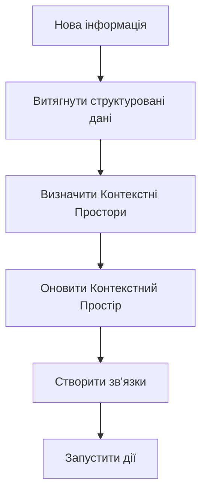

# Контекстні Простори (Топіки)

!!! tip "Швидкий огляд"
    Контекстні Простори — це розумні контейнери, які організовують всю інформацію вашого проєкту в одному місці. Уявіть їх як живі папки, що розуміють свій вміст і ростуть разом із проєктом.

---

## Що таке Контекстні Простори?

**Контекстні Простори** (також звані Топіками) — це центральна організаційна концепція в Task Tracker. Вони представляють контекстні домени, які агрегують і структурують всю пов'язану з проєктом інформацію в одному місці.

!!! info "Ключова відмінність"
    На відміну від традиційних систем управління задачами, де задачі є основною сутністю, в Task Tracker **Контекстні Простори служать центральним хабом** для організації знань, активностей та артефактів.

---

## Основна Концепція

Контекстний Простір — це не просто категорія чи мітка, це **живий контейнер знань**, який:

✓ **Накопичує інформацію** з різних джерел
✓ **Підтримує контекст** та зв'язки
✓ **Еволюціонує автоматично** з надходженням нової інформації
✓ **Живить AI аналіз** та автоматизацію

!!! example "Подумайте про це так"
    Контекстні Простори — це розумні папки, які розуміють свій вміст і можуть автоматично збагачуватися AI.

---

## Що Може Належати до Контекстного Простору?

Контекстний Простір може містити різнорідні сутності:

| Тип сутності | Опис | Приклади |
|-------------|------|----------|
| **Задачі** | Дії, які потрібно виконати | Виправлення багів, нові фічі, покращення |
| **Повідомлення** | Розмови та обговорення | Командний чат, рішення, питання |
| **Результати аналізу** | Структуровані дані від AI | Класифікації, інсайти, підсумки |
| **Звіти** | Згенеровані підсумки та інсайти | Звіти про прогрес, аналітика |
| **Зовнішні посилання** | Лінки на зовнішні системи | Jira тікети, GitHub issues, Redmine задачі |
| **Документація** | Знання проєкту | Нотатки, специфікації, записи рішень |
| **Посилання на код** | Лінки на код | Шляхи до файлів, коміти, PR |

---

## Ієрархічна Структура

Контекстні Простори можуть бути організовані ієрархічно відповідно до структури проєкту:

```
Проєкт: Редизайн Мобільного Додатку
  ├─ Компонент: Аутентифікація
  │   ├─ Фіча: OAuth Інтеграція
  │   └─ Фіча: Скидання Паролю
  └─ Компонент: UI/UX
      ├─ Фіча: Темна Тема
      └─ Фіча: Адаптивний Лейаут
```

### Переваги ієрархії

- **Детальна організація** - Розбивайте складні проєкти
- **Успадкування властивостей** - Налаштування передаються вниз по дереву
- **Контекстне обмеження** - Тримайте пов'язану роботу разом
- **Гнучка навігація** - Легко знаходьте інформацію

!!! warning "Не перевкладайте"
    Тримайте ієрархії простими. 2-3 рівні зазвичай достатньо для більшості проєктів.

---

## AI-Збагачення Знань

Коли нова інформація потрапляє в систему (повідомлення, задача, подія), AI конвеєр автоматично її обробляє:

### Процес збагачення



1. **Витягує структуровані дані** з сирого контенту
2. **Визначає релевантний Контекстний Простір(и)** використовуючи семантичний аналіз
3. **Оновлює Контекстний Простір** новою інформацією
4. **Створює зв'язки** між пов'язаними просторами
5. **Запускає дії** на основі змін у контексті

### Реальний приклад

???+ example "Від повідомлення до дії"
    **Користувач надсилає повідомлення:**

    ```
    "Потрібно пофіксити баг з логіном на iOS"
    ```

    **AI аналіз витягує:**

    - Тип: Баг
    - Компонент: Аутентифікація
    - Платформа: iOS
    - Дія: Потрібен фікс

    **AI знаходить Контекстний Простір:**

    ```
    Мобільний Додаток → Аутентифікація
    ```

    **Система оновлює:**

    - ✓ Додає баг до списку проблем
    - ✓ Зв'язує з пов'язаними повідомленнями
    - ✓ Оновлює метрики статусу
    - ✓ Запускає нотифікацію відповідальній команді

---

## Сценарії Використання

### 1. 📋 Управління Проєктами

Відстежуйте весь життєвий цикл проєкту в його Контекстному Просторі:

- Документи планування та дорожні карти
- Задачі та віхи
- Обговорення та рішення команди
- Звіти про прогрес та метрики

### 2. 📚 База Знань

Будуйте живу документацію, що росте разом із командою:

- Рішення, прийняті з часом
- Технічні обговорення та дебати
- Рішення проблем
- Виявлені найкращі практики

### 3. 🔗 Хаб Інтеграції

Безперешкодна синхронізація з зовнішніми системами:

- Створюйте Jira issues з задач Контекстного Простору
- Імпортуйте GitHub issues в релевантні простори
- Експортуйте звіти в інструменти управління проєктами
- Посилайтеся на зовнішню документацію

### 4. 📊 Аналітичний Движок

Генеруйте інсайти на основі даних Контекстного Простору:

- Час, витрачений на компонент
- Ідентифікація вузьких місць
- Метрики продуктивності команди
- Аналіз трендів та прогнози

---

## Життєвий Цикл Контекстного Простору

Контекстні Простори еволюціонують через різні стани:

### 🟢 Активний
В даний момент ведеться робота, накопичується інформація, AI активно обробляє нові дані.

!!! success "Найкраще для"
    Поточні проєкти, активна робота, активна розробка

### 📦 Архівний
Історичний запис, доступний для пошуку, але не активно оновлюється.

!!! info "Найкраще для"
    Завершені проєкти, довідкові матеріали, історичні дані

### 🔗 Зв'язаний
Пов'язаний з іншими просторами, інформація може текти між ними.

!!! tip "Найкраще для"
    Пов'язані проєкти, спільні залежності, міжфункціональна робота

---

## Переваги

!!! success "Чому варто використовувати Контекстні Простори?"

    **1. Єдиний вигляд**
    Вся пов'язана інформація в одному місці - більше не треба шукати по різних інструментах

    **2. Розумна організація**
    AI підтримує структуру автоматично - фокусуйтеся на роботі, а не на організації

    **3. Збереження знань**
    Історія та контекст зберігаються назавжди - ніколи не втрачайте важливі рішення

    **4. Гнучка інтеграція**
    Підключайте будь-які зовнішні інструменти - Jira, GitHub, Slack і більше

    **5. Контекстний інтелект**
    AI розуміє контекст вашого проєкту - отримуйте розумніші пропозиції

---

## Найкращі Практики

### ✓ Рекомендації

!!! tip "Починайте широко, деталізуйте пізніше"
    Спочатку створюйте загальні простори. Розділяйте на під-простори, коли вони стають занадто великими.

!!! tip "Дозволяйте AI допомагати"
    Дозволяйте системі пропонувати призначення просторів. Вона вчиться на ваших патернах.

!!! tip "Перевіряйте зв'язки"
    Періодично перевіряйте, що простори правильно з'єднані для кращих інсайтів.

!!! tip "Архівуйте завершену роботу"
    Тримайте активні простори сфокусованими на поточній роботі для кращої продуктивності.

### ✗ Чого не варто робити

!!! warning "Не перевкладайте"
    Уникайте глибоких ієрархій. 2-3 рівні зазвичай достатньо.

!!! warning "Не створюйте занадто багато просторів"
    Починайте з меншої кількості просторів і розділяйте за потреби. Забагато просторів розмиває контекст.

!!! warning "Не ігноруйте пропозиції"
    Коли AI пропонує перемістити контент, розгляньте це. Система вчиться на патернах.

---

## Технічна Реалізація

??? note "Для розробників: Технічні деталі"
    Контекстні Простори реалізовані як:

    - **Сутності бази даних** з гнучкою JSONB схемою для метаданих
    - **Граф зв'язків** між просторами використовуючи PostgreSQL
    - **Event-driven оновлення** через TaskIQ workers та NATS
    - **WebSocket real-time нотифікації** для live оновлень
    - **AI конвеєр аналізу** використовуючи Pydantic-AI для збагачення

---

## Майбутні Напрямки

Фічі, над якими ми працюємо:

- 🤖 **Автоматичне створення просторів** на основі виявлених патернів
- 🔍 **Міжпросторовий пошук** та аналітика
- 📝 **Шаблони просторів** для типових типів проєктів
- 📄 **AI-генеровані підсумки** вмісту просторів
- 👥 **Колаборативне редагування просторів** з синхронізацією в реальному часі

---

!!! question "Потрібна допомога?"
    Якщо у вас є питання про Контекстні Простори, перегляньте FAQ або зв'яжіться з командою.