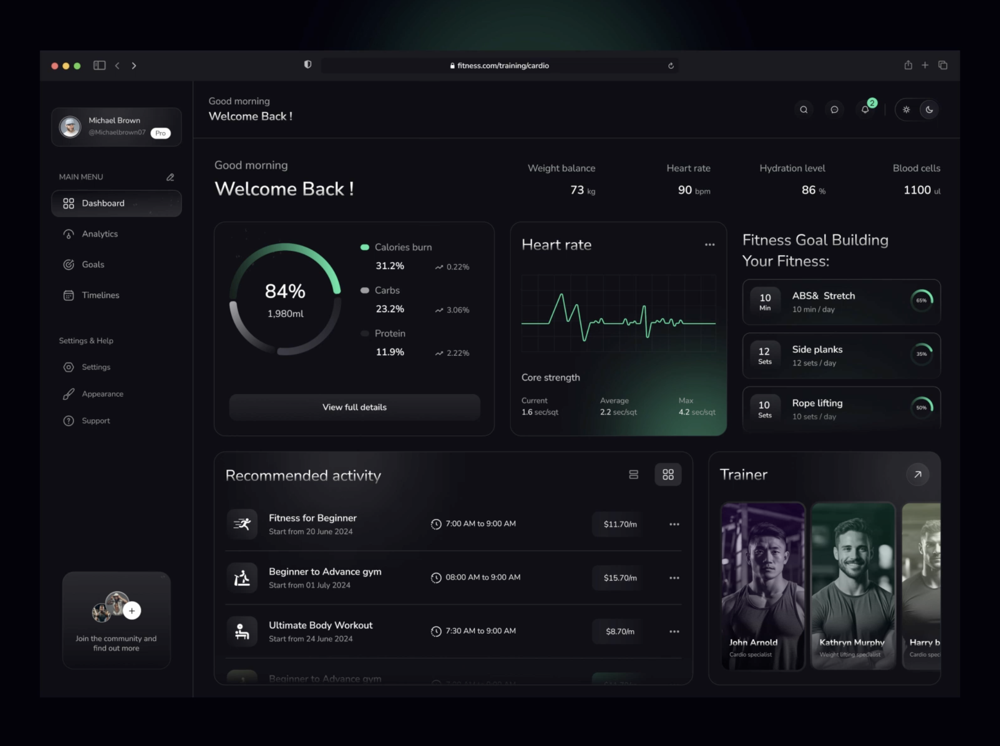

# REF-001: Fitness Trainer Dashboard

**Джерело:** [Dribbble](https://dribbble.com/shots/24613603-Fitness-trainer-dashboard)
**Автор:** Muhammad Shofiuddoula for Zeyox Studio

## Що подобається

- [x] **Темна тема** — глибокий чорний (#0D0D0D або близько), не сірий
- [x] **Metric cards** — чисті, з великими числами та трендом (↗ 0.22%)
- [x] **Зелений акцент** — яскравий mint/lime (#4ADE80) для позитивних значень
- [x] **Графіки** — мінімалістичні line charts без сітки
- [x] **Activity list** — компактний, з часом та ціною
- [x] **Progress rings** — circular progress для fitness goals
- [x] **Trainer cards** — фото з overlay текстом

## Ключові елементи

### Кольори
| Роль | Колір | Застосування |
|------|-------|--------------|
| Background | `#0D0D0D` | Основний фон |
| Card | `#1A1A1A` | Картки, панелі |
| Accent | `#4ADE80` | Позитивні метрики, графіки |
| Text primary | `#FFFFFF` | Заголовки, числа |
| Text secondary | `#9CA3AF` | Описи, labels |

### Layout
- **Sidebar** — темний, collapsed з іконками
- **Grid** — 3-колонки для метрик, гнучкий для контенту
- **Spacing** — багато "повітря", ~24-32px між секціями
- **Border radius** — м'які кути ~12-16px

### Компоненти для Pulse Radar

| Компонент | Опис | Пріоритет |
|-----------|------|-----------|
| **Metric Card** | Велике число + тренд + sparkline | 🔥 High |
| **Activity List** | Час + назва + ціна/значення | 🔥 High |
| **Progress Ring** | Circular progress з числом всередині | Medium |
| **Line Chart** | Мінімалістичний, без сітки | Medium |

### Типографіка
- **Numbers** — великі, bold (~32-48px)
- **Labels** — маленькі, uppercase, letter-spacing
- **Hierarchy** — чіткий контраст розмірів

## Як застосувати в Pulse Radar

| Елемент з референсу | Де в Pulse Radar | Статус |
|---------------------|------------------|--------|
| Dark theme palette | Альтернативна темна тема | 🔜 TODO |
| Metric cards style | Dashboard метрики | 🔜 TODO |
| Activity list | Recent messages/atoms | 🔜 TODO |
| Green accent | Success/positive states | ✅ Є (semantic-success) |

## Нотатки

**Що НЕ копіювати:**
- Fitness-specific елементи (trainer photos, workout icons)
- Занадто темний контраст може бути проблемою для accessibility

**Ідеї для адаптації:**
- Metric cards для: Messages today, Atoms extracted, Topics active
- Activity list для: Recent extractions, Latest messages
- Progress rings для: Processing status, Daily goals
