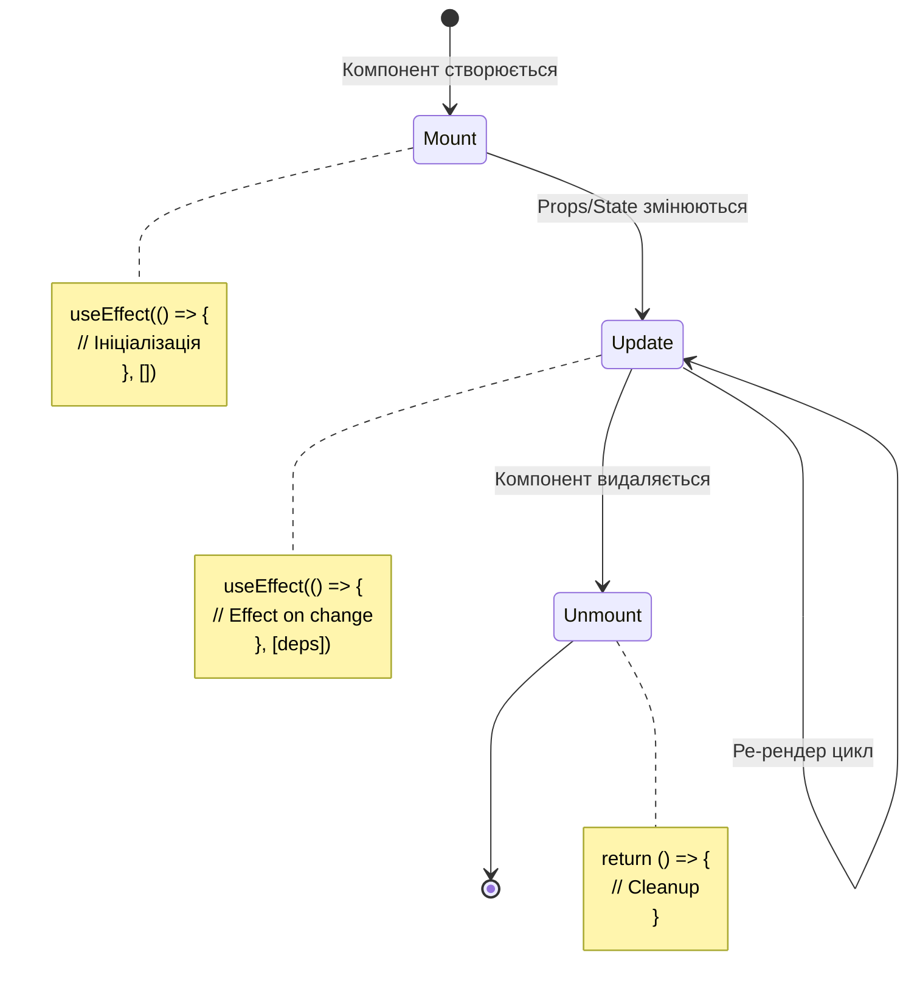
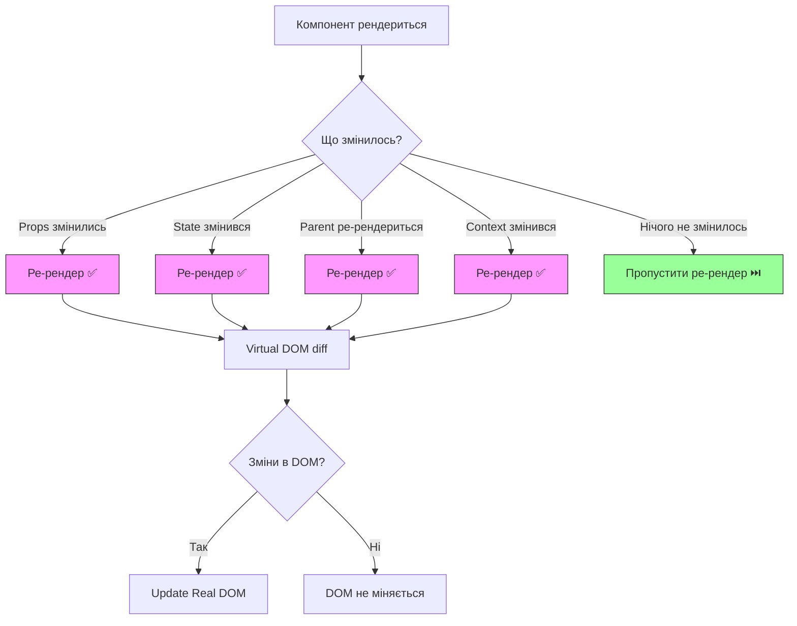

# Module 00: React Foundations

**Розуміння React mental model для backend розробників**

---

## 🎯 Що це

React - JavaScript бібліотека для побудови UI через **компоненти**. Замість HTML templates (Django/Jinja) → JavaScript функції що повертають JSX.

**Key concept:** UI = function(state)

---

## 🔄 Backend аналогія

| Backend (FastAPI) | Frontend (React) |
|-------------------|------------------|
| `def create_user()` | `function UserCard()` |
| Jinja template | JSX (JavaScript XML) |
| Instance variables | `useState` hook |
| `__init__` + `__del__` | `useEffect` (mount/unmount) |
| Function args | Component props |

---

## 📂 У твоєму проекті

**Приклад простого компонента:**
```tsx
// src/shared/ui/badge.tsx:34-42
const Badge = React.forwardRef<HTMLDivElement, BadgeProps>(
  ({ className, variant, ...props }, ref) => {
    return (
      <div ref={ref} className={cn(badgeVariants({ variant }), className)} {...props} />
    )
  }
)
```

**Приклад з state:**
```tsx
// src/pages/ProjectsPage/index.tsx:14-16
const [formOpen, setFormOpen] = useState(false)
const [selectedProject, setSelectedProject] = useState<ProjectConfig>()
```

---

## 💡 Основні концепції

### 1. Components (Функції)

```tsx
// Backend analog: def user_card(user):
function UserCard({ user }) {
  return <div>{user.name}</div>
}
```

### 2. JSX (HTML в JavaScript)

```tsx
// Замість template string
const html = `<div class="card">${name}</div>`

// JSX
const element = <div className="card">{name}</div>
```

### 3. Props (Function arguments)

```tsx
// Backend: def greet(name: str, age: int)
function Greet({ name, age }: { name: string, age: number }) {
  return <p>Hello {name}, you are {age}</p>
}
```

### 4. State (Instance variables)

```python
# Backend
class Counter:
    def __init__(self):
        self.count = 0  # Instance variable
```

```tsx
// Frontend
function Counter() {
  const [count, setCount] = useState(0)  // State
  return <button onClick={() => setCount(count + 1)}>{count}</button>
}
```

### 5. Effects (Lifecycle)

```python
# Backend
class Service:
    async def startup(self):  # Initialize
        self.db = await connect()
    
    async def shutdown(self):  # Cleanup
        await self.db.close()
```

```tsx
// Frontend
function DataFetcher() {
  useEffect(() => {
    // Mount: fetch data
    fetchData()

    return () => {
      // Unmount: cleanup
      cancel()
    }
  }, [])
}
```

#### 📊 Візуалізація: Component Lifecycle



**Backend Аналогія:**
```python
# FastAPI Lifespan (схоже на React lifecycle)
@asynccontextmanager
async def lifespan(app: FastAPI):
    # Mount: startup
    db = await connect_db()
    yield  # Running...
    # Unmount: cleanup
    await db.close()
```

#### 📊 Візуалізація: Коли Відбувається Ре-рендер?



**Ключові Правила:**
1. **Props change** → Parent передав нові props → ре-рендер
2. **State change** → `setState()` викликано → ре-рендер
3. **Parent re-render** → Parent ре-рендериться → всі діти ре-рендеряться
4. **Context change** → `Context.Provider` value змінився → всі consumers ре-рендеряться

**Backend Аналогія:**
```python
# Як кеш в FastAPI
@lru_cache()  # Пропускає обчислення якщо args не змінились
def expensive_calc(param):
    return heavy_operation(param)

# React.memo() робить те саме для компонентів
const MemoizedComponent = React.memo(MyComponent)  # Пропустить ре-рендер якщо props не змінились
```

---

## ✅ Коли використовувати React

- ✅ Interactive UI (forms, tables, filters)
- ✅ Real-time updates (WebSocket)
- ✅ Single Page Applications
- ✅ Reusable component library

## ❌ Коли НЕ використовувати

- ❌ Static content (blog posts)
- ❌ SEO-critical pages (use Next.js instead)
- ❌ Simple forms (HTMX може бути простіше)

---

## 🚫 Типові Помилки

### 1. Мутація State Напряму

```tsx
// ❌ НЕ РОБИ: Пряма мутація state
const [user, setUser] = useState({ name: 'Maks', age: 30 })

function updateAge() {
  user.age = 31  // Мутація напряму - React не побачить зміну!
  setUser(user)  // Той самий об'єкт в пам'яті - НЕ СПРАЦЮЄ
}

// ✅ РОБИ: Створи новий об'єкт
function updateAge() {
  setUser({ ...user, age: 31 })  // Новий об'єкт - React побачить зміну ✅
}
```

**Чому:** React порівнює об'єкти через reference equality (`===`). Якщо reference не змінився → React вважає що state не змінився → компонент не ре-рендериться.

**Backend Аналогія:**
```python
# Подібно до immutable Pydantic models
class User(BaseModel):
    name: str
    age: int

user = User(name="Maks", age=30)
# user.age = 31  # ❌ Error: cannot assign to field 'age'
updated_user = user.model_copy(update={"age": 31})  # ✅ Новий об'єкт
```

---

### 2. Забуті Dependencies в useEffect

```tsx
// ❌ НЕ РОБИ: Забув додати count в dependencies
const [count, setCount] = useState(0)

useEffect(() => {
  const interval = setInterval(() => {
    console.log(count)  // Завжди виводить 0 (stale closure!)
  }, 1000)

  return () => clearInterval(interval)
}, [])  // ❌ Порожній array - useEffect не реагує на count

// ✅ РОБИ: Додай всі використані змінні в dependencies
useEffect(() => {
  const interval = setInterval(() => {
    console.log(count)  // Виводить актуальне значення
  }, 1000)

  return () => clearInterval(interval)
}, [count])  // ✅ useEffect оновиться коли count зміниться
```

**Чому:** useEffect створює closure над змінними. Якщо dependency відсутній → closure "застряє" зі старим значенням (stale closure).

**Як Уникнути:** Використовуй ESLint rule `react-hooks/exhaustive-deps` - автоматично попереджає про забуті dependencies.

---

### 3. Нескінченний Re-render Цикл

```tsx
// ❌ НЕ РОБИ: setState в render викликає нескінченний цикл
function BadComponent() {
  const [count, setCount] = useState(0)

  setCount(count + 1)  // ❌ setState викликається при кожному render!
  // Render → setState → render → setState → render → ...

  return <div>{count}</div>
}

// ✅ РОБИ: setState лише в event handlers або useEffect
function GoodComponent() {
  const [count, setCount] = useState(0)

  useEffect(() => {
    setCount(count + 1)  // ✅ setState в useEffect з порожніми deps - 1 раз
  }, [])

  // Або в event handler
  const increment = () => setCount(c => c + 1)

  return <div onClick={increment}>{count}</div>
}
```

**Чому:** `setState` → ре-рендер → `setState` знову → ре-рендер → ... React зупинить після ~50 ітерацій з помилкою "Too many re-renders".

**Backend Аналогія:**
```python
# Подібно до recursive call без base case
def bad_function():
    bad_function()  # ❌ Нескінченна рекурсія - stack overflow

def good_function(count=0):
    if count >= 10:  # ✅ Base case зупиняє рекурсію
        return
    good_function(count + 1)
```

---

### 4. Забутий Cleanup в useEffect

```tsx
// ❌ НЕ РОБИ: WebSocket без cleanup
useEffect(() => {
  const ws = new WebSocket('ws://localhost:8000/ws')

  ws.onmessage = (event) => {
    console.log(event.data)
  }
  // ❌ Немає cleanup - connection залишається після unmount
}, [])

// ✅ РОБИ: Завжди cleanup ресурси
useEffect(() => {
  const ws = new WebSocket('ws://localhost:8000/ws')

  ws.onmessage = (event) => {
    console.log(event.data)
  }

  return () => {
    ws.close()  // ✅ Cleanup - закрити connection при unmount
  }
}, [])
```

**Коли Треба Cleanup:**
- WebSocket connections
- setInterval / setTimeout
- addEventListener
- Subscriptions (NATS, Zustand)

**Backend Аналогія:**
```python
# FastAPI lifespan (startup + cleanup)
@asynccontextmanager
async def lifespan(app: FastAPI):
    # Startup
    ws = await connect_websocket()
    yield
    # Cleanup
    await ws.close()  # ✅ Обов'язково close
```

---

### 5. Використання Index як Key в Списках

```tsx
// ❌ НЕ РОБИ: Index як key - проблеми при додаванні/видаленні
const items = ['Apple', 'Banana', 'Cherry']

items.map((item, index) => (
  <li key={index}>{item}</li>  // ❌ Index змінюється при reorder
))

// ✅ РОБИ: Унікальний ID як key
const items = [
  { id: 1, name: 'Apple' },
  { id: 2, name: 'Banana' },
  { id: 3, name: 'Cherry' },
]

items.map(item => (
  <li key={item.id}>{item.name}</li>  // ✅ ID стабільний
))
```

**Чому:** React використовує `key` для optimізації ре-рендерів. Якщо key - це index, при видаленні першого елемента всі keys зміщуються → React думає що це нові елементи → повний ре-рендер списку.

**Коли Index OK:** Якщо список статичний (не змінюється), index можна використовувати.

---

## 📚 Офіційна документація

- [React Official Docs](https://react.dev/) ✅
- [Quick Start](https://react.dev/learn) ✅
- [Thinking in React](https://react.dev/learn/thinking-in-react) ✅
- [TypeScript with React](https://react.dev/learn/typescript) ✅

---

## 🛠️ Практика

1. Знайди простий компонент (Badge, Card)
2. Прочитай код - що він рендерить?
3. Подивись де він використовується
4. Спробуй змінити текст/колір

**Estimated time:** 1-2 години на розуміння basics

---

**Далі:** Вивчи [JSX Syntax](jsx-syntax.md) | [TypeScript Setup](typescript-setup.md)

**Повернутись до:** [Learning Home](../index.md)
