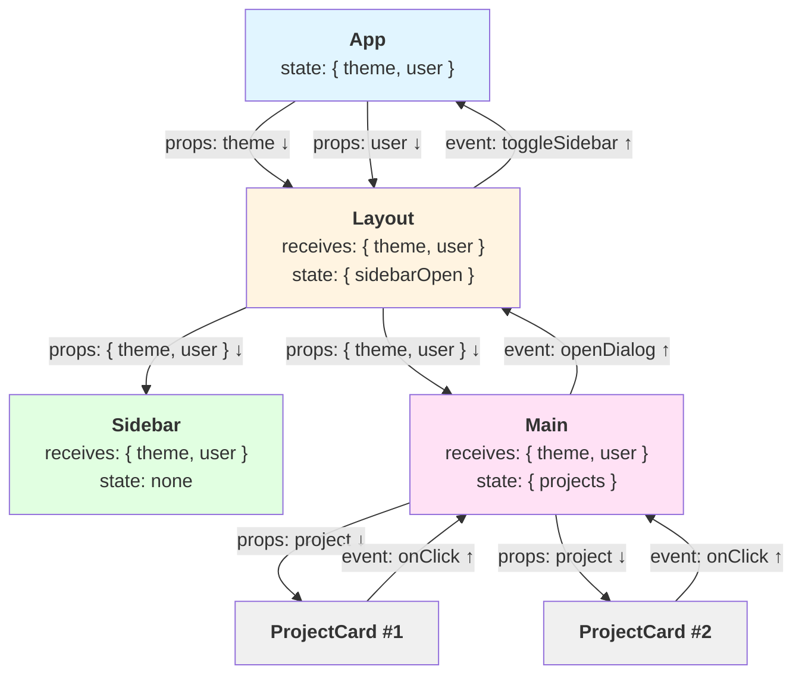

# Module 03: Component Patterns

**Composition та patterns для побудови складних компонентів**

---

## 🎯 Що це

React компоненти будуються через **composition** (складання частин), не inheritance. Замість одного великого компонента → набір дрібних що комбінуються.

**Key pattern:** DialogRoot + DialogContent + DialogHeader = Dialog

---

## 🔄 Backend аналогія

| Backend (FastAPI) | Frontend (React) |
|-------------------|------------------|
| `class BaseModel` → fields | Component → Props |
| Pydantic composition | React composition |
| Mixin classes | Compound components |
| `**kwargs` spread | `{...props}` spread |
| `ref` argument | `React.forwardRef` |

---

## 📂 У твоєму проекті

**Dialog composition:**
- `src/shared/ui/dialog.tsx:1-121` - DialogRoot, DialogContent, DialogHeader, DialogFooter

**Card composition:**
- `src/shared/ui/card.tsx:5-77` - Card, CardHeader, CardContent, CardFooter

**forwardRef pattern:**
- `src/shared/ui/button.tsx:28-45` - Button з ref forwarding
- `src/shared/ui/input.tsx:15-33` - Input з ref

---

## 💡 Ключові концепції

### 1. Composition Over Configuration
Замість монолітного компонента з 20 props → дрібні частини

### 2. Compound Components
DialogRoot містить context → DialogContent читає context → автоматичний зв'язок

### 3. forwardRef
Передача DOM ref через компонент wrapper (потрібно для focus, scroll)

### 4. Props Spreading
`{...props}` - передача всіх props далі (як `**kwargs` в Python)

### 5. Children Pattern
`<Card><CardHeader>Title</CardHeader></Card>` - nested content

---

## 📊 Візуалізація: Component Tree & Data Flow



**Ключові Правила:**

1. **Props Flow Down** ⬇️ - Дані йдуть з parent до child через props
2. **Events Flow Up** ⬆️ - Події піднімаються з child до parent через callbacks
3. **State Lives High** - State зберігається в parent, діти його не mutують
4. **One-Way Data Flow** - Дані йдуть лише в одному напрямку (передбачуваність)

**Код Приклад:**

```tsx
// App - top-level state
function App() {
  const [theme, setTheme] = useState('dark')
  const [user, setUser] = useState({ name: 'Maks' })

  return <Layout theme={theme} user={user} onThemeChange={setTheme} />
}

// Layout - intermediate component, passes props down
function Layout({ theme, user, onThemeChange }) {
  const [sidebarOpen, setSidebarOpen] = useState(true)

  return (
    <div>
      <Sidebar theme={theme} user={user} open={sidebarOpen} />
      <Main theme={theme} user={user} onThemeChange={onThemeChange} />
    </div>
  )
}

// Main - renders list, handles clicks, events flow up
function Main({ theme, user, onThemeChange }) {
  const [projects, setProjects] = useState([...])

  const handleProjectClick = (project) => {
    // Event bubbles up, може викликати onThemeChange
    console.log('Project clicked:', project)
  }

  return (
    <div>
      {projects.map(project => (
        <ProjectCard
          key={project.id}
          project={project}
          onClick={handleProjectClick}  // Callback вниз ↓
        />
      ))}
    </div>
  )
}

// ProjectCard - leaf component, just displays and emits events
function ProjectCard({ project, onClick }) {
  return (
    <div onClick={() => onClick(project)}>  {/* Event вгору ↑ */}
      {project.name}
    </div>
  )
}
```

**Backend Аналогія:**

```python
# Backend: Layered Architecture (схожа flow)

# Layer 1: Router (як App - top level)
@router.get("/projects")
async def get_projects(
    db: Session = Depends(get_db),  # Dependency injection ↓
    user: User = Depends(get_current_user)  # Dependency ↓
):
    projects = await project_service.get_all(db, user)  # Call down ↓
    return projects  # Response up ↑

# Layer 2: Service (як Layout - intermediate)
class ProjectService:
    async def get_all(self, db: Session, user: User):
        projects = await project_repo.find_all(db, user.id)  # Call down ↓
        return projects  # Return up ↑

# Layer 3: Repository (як ProjectCard - leaf)
class ProjectRepo:
    async def find_all(self, db: Session, user_id: int):
        result = await db.execute(select(Project).where(...))
        return result.scalars().all()  # Data up ↑
```

**Аналогія:**
- **Props Down** ⬇️ = Dependency Injection (db, user передаються вниз)
- **Events/Data Up** ⬆️ = Return values (результати повертаються вгору)
- **One-Way Flow** = Чіткі boundaries між layers

**Чому Це Важливо:**
- Передбачувана flow - легко відслідковувати зміни
- Debugging простіший - дивишся вгору на parent для state
- Ре-використання - компоненти не прив'язані до global state

---

## ✅ Коли використовувати

- ✅ Складні UI з багатьма частинами (Dialog, Card, Dropdown)
- ✅ Потрібна гнучкість composition
- ✅ Shared context між частинами
- ✅ Ref forwarding для DOM access

## ❌ Коли НЕ використовувати

- ❌ Прості компоненти без nested parts (Button, Badge)
- ❌ Немає потреби в гнучкості (hardcoded structure)

---

## 🚫 Типові Помилки

### 1. Prop Drilling (Передача Props Через 5+ Рівнів)

```tsx
// ❌ НЕ РОБИ: Props drilling через багато рівнів
function App() {
  const [theme, setTheme] = useState('dark')
  return <Layout theme={theme} setTheme={setTheme} />
}

function Layout({ theme, setTheme }) {
  return <Sidebar theme={theme} setTheme={setTheme} />
}

function Sidebar({ theme, setTheme }) {
  return <Menu theme={theme} setTheme={setTheme} />
}

function Menu({ theme, setTheme }) {
  return <MenuItem theme={theme} onClick={() => setTheme('light')} />
}

// ✅ РОБИ: Використовуй Context або Zustand
const ThemeContext = createContext()

function App() {
  const [theme, setTheme] = useState('dark')
  return (
    <ThemeContext.Provider value={{ theme, setTheme }}>
      <Layout />
    </ThemeContext.Provider>
  )
}

function MenuItem() {
  const { theme, setTheme } = useContext(ThemeContext)
  return <button onClick={() => setTheme('light')}>{theme}</button>
}
```

**Чому:** Prop drilling робить код хрупким. Зміна в середині дерева = зміна всіх компонентів.

**Backend Аналогія:**
```python
# Prop drilling - передача через усі рівні
def layer1(db):
    return layer2(db)

def layer2(db):
    return layer3(db)

# Context - dependency injection
from fastapi import Depends

def get_db():
    ...

@router.get("/")
def endpoint(db = Depends(get_db)):  # Не треба передавати через layers
    ...
```

---

### 2. Гігантські Компоненти (500+ Рядків)

```tsx
// ❌ НЕ РОБИ: Все в одному компоненті
function ProjectsPage() {
  // 100 рядків state
  // 200 рядків handlers
  // 200 рядків JSX
  return <div>...500+ рядків...</div>
}

// ✅ РОБИ: Розбий на дрібні компоненти
function ProjectsPage() {
  return (
    <div>
      <ProjectsHeader />
      <ProjectsFilters />
      <ProjectsList />
      <ProjectsFooter />
    </div>
  )
}

function ProjectsList() {
  const projects = useProjects()
  return projects.map(p => <ProjectCard key={p.id} project={p} />)
}
```

**Правило:** Якщо компонент > 200 рядків → розбий на частини.

---

### 3. Мутація Props

```tsx
// ❌ НЕ РОБИ: Мутація props напряму
function UserCard({ user }) {
  user.name = "Updated"  // ❌ Props read-only!
  return <div>{user.name}</div>
}

// ✅ РОБИ: Props тільки для читання, зміни через callbacks
function UserCard({ user, onUpdate }) {
  const handleClick = () => {
    onUpdate({ ...user, name: "Updated" })  // ✅ Новий об'єкт
  }
  return <div onClick={handleClick}>{user.name}</div>
}
```

**Чому:** Props - це аргументи функції, immutable. Мутація порушує one-way data flow.

**Backend Аналогія:**
```python
# Props як function arguments - не мутуємо
def process_user(user: User):
    # user.name = "Updated"  # ❌ Не мутуємо arguments
    updated = user.model_copy(update={"name": "Updated"})  # ✅ Новий об'єкт
    return updated
```

---

### 4. Забутий key в .map()

```tsx
// ❌ НЕ РОБИ: Без key - React не може оптимізувати
{projects.map(project => (
  <ProjectCard project={project} />  // ❌ Немає key!
))}

// ✅ РОБИ: Завжди key з унікальним ID
{projects.map(project => (
  <ProjectCard key={project.id} project={project} />  // ✅ Stable key
))}
```

**Чому:** React використовує `key` для оптимізації ре-рендерів. Без key - full re-render списку.

**Примітка:** Вже згадували в Module 00, але це настільки частая помилка що варто повторити.

---

### 5. Неправильний forwardRef

```tsx
// ❌ НЕ РОБИ: Забув forwardRef - ref не працює
function Input({ className }) {
  return <input className={className} />
}

// Usage
const inputRef = useRef()
<Input ref={inputRef} />  // ❌ Warning: Function components cannot be given refs

// ✅ РОБИ: Використовуй React.forwardRef
const Input = React.forwardRef<HTMLInputElement, InputProps>(
  ({ className }, ref) => {
    return <input ref={ref} className={className} />
  }
)

// Usage
const inputRef = useRef()
<Input ref={inputRef} />  // ✅ Працює!
inputRef.current.focus()
```

**Коли Треба forwardRef:**
- Wrapper над native elements (input, button, div)
- Треба DOM access ззовні (focus, scroll)
- shadcn/ui компоненти (усі використовують forwardRef)

---

## 📚 Офіційна документація

- [Composition vs Inheritance](https://react.dev/learn/passing-props-to-a-component#passing-jsx-as-children) ✅
- [forwardRef API](https://react.dev/reference/react/forwardRef) ✅
- [Compound Components](https://www.patterns.dev/react/compound-pattern) ✅

---

## 🛠️ Практика

1. Відкрий `src/shared/ui/dialog.tsx`
2. Подивись як DialogRoot + DialogContent комбінуються
3. Знайди використання Dialog в проекті (CreateAtomDialog)
4. Спробуй створити свій compound component

**Estimated time:** 2-3 години

---

## ❓ FAQ

**Q: Навіщо forwardRef якщо можна просто div?**
A: Для доступу до DOM (focus, scroll). Без forwardRef ref = undefined.

**Q: Чому Dialog розбито на 5 частин замість одного компонента?**
A: Гнучкість. Можеш комбінувати DialogHeader + DialogFooter як хочеш.

**Q: Що таке compound components?**
A: Pattern коли батьківський компонент містить context, дочірні читають context → автоматичний зв'язок.

---

**Далі:** [Composition Pattern](composition.md) | [forwardRef Deep Dive](forwardRef.md)

**Повернутись до:** [Learning Home](../index.md)
