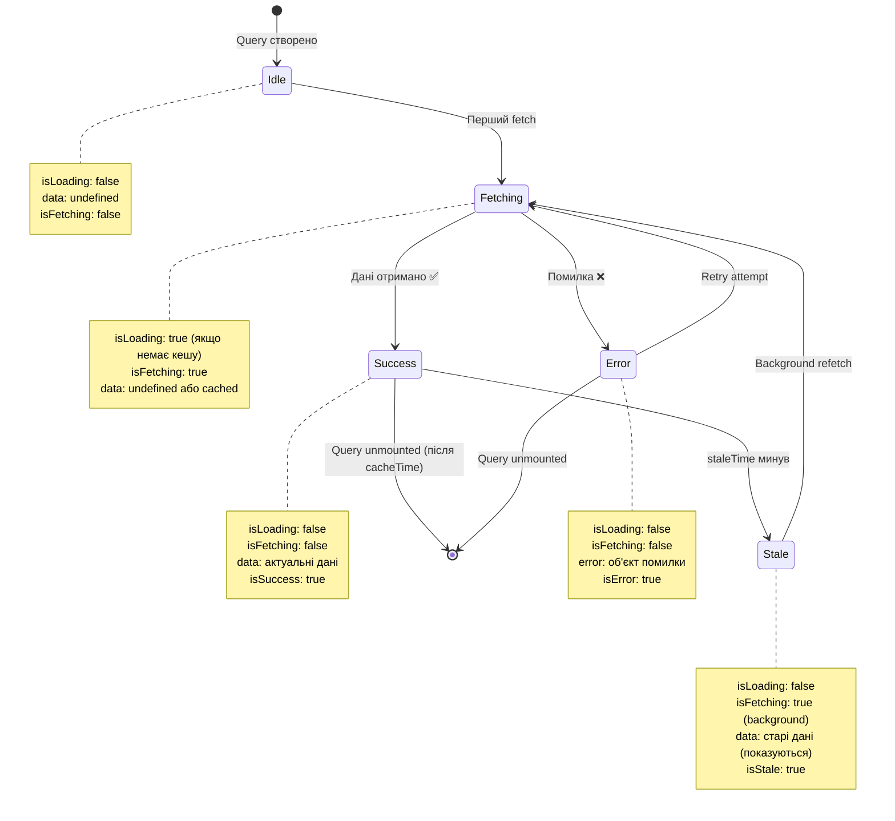

# Module 05: State Management - TanStack Query

**Server state caching, refetching, invalidation**

---

## 🎯 Що це

**TanStack Query (React Query)** - бібліотека для server state. Автоматичний caching, background refetching, stale data handling.

**Key concept:** `useQuery(key, fetcher)` → автоматичне управління lifecycle

---

## 🔄 Backend аналогія

| Backend (SQLAlchemy) | Frontend (TanStack Query) |
|----------------------|---------------------------|
| Session cache | Query cache |
| `session.get(User, id)` | `useQuery(['user', id])` |
| `session.commit()` | `useMutation()` |
| `session.expire_all()` | `invalidateQueries()` |
| Lazy loading | `enabled: false` |
| Database triggers | WebSocket → invalidate |

```python
# Backend (SQLAlchemy cache)
user = session.get(User, 1)  # Cache hit
user = session.get(User, 1)  # Cached, no SQL query

# Frontend (TanStack Query analog)
const { data } = useQuery(['user', 1], fetchUser)  # Cache hit
const { data } = useQuery(['user', 1], fetchUser)  # Cached, no network
```

---

## 📂 У твоєму проекті

**QueryClient setup:**
- `src/app/providers.tsx:7-18` - staleTime: 5 min, retry: 1

**Query usage examples:**
- `src/pages/ProjectsPage/index.tsx:21-114` - projects query + mutations
- `src/features/agents/hooks/useAgents.ts` - agents query

**Mutation patterns:**
- Create/Update → `useMutation()` → `invalidateQueries()`

**WebSocket integration:**
- WebSocket message → `queryClient.invalidateQueries(['messages'])`

---

## 💡 Ключові концепції

### 1. queryKey
Унікальний ідентифікатор: `['projects']`, `['project', id]`

### 2. queryFn
Fetch function: `() => projectService.getProjects()`

### 3. staleTime
Час до "застарілості" (5 min у твоєму проекті)

### 4. cacheTime
Час зберігання в кеші (default: 5 min)

### 5. invalidateQueries
Оновлення після mutation: `queryClient.invalidateQueries(['projects'])`

### 6. Optimistic Updates
Update UI before server response (advanced pattern)

### 7. WebSocket Sync
`ws.onmessage` → `invalidateQueries()` → auto refetch

---

## 📊 Візуалізація: Query Lifecycle (States)



**Код Приклад:**

```tsx
const { data, isLoading, isError, isFetching, isStale } = useQuery({
  queryKey: ['users'],
  queryFn: fetchUsers,
  staleTime: 5 * 60 * 1000, // 5 хвилин
})

// State flow:
// 1. Idle → Fetching (перший запит, isLoading=true)
// 2. Fetching → Success (дані прийшли, isLoading=false, data доступна)
// 3. Success → Stale (через 5 хв, isStale=true)
// 4. Stale → Fetching (background refetch, isFetching=true, але data ще показується!)
// 5. Fetching → Success (нові дані прийшли, isFetching=false)
```

**Backend Аналогія:**

```python
# SQLAlchemy Session States
session = Session()

# 1. Idle (session створена, немає об'єктів)
user = None

# 2. Fetching (query виконується)
user = session.get(User, 1)  # SQL запит до БД

# 3. Success (об'єкт в session, tracked)
print(user.name)  # Дані доступні

# 4. Stale (об'єкт може бути застарілим)
session.expire(user)  # Позначити як stale

# 5. Background refetch
session.refresh(user)  # Оновити дані з БД
```

**Ключові Відмінності Станів:**

| Стан | isLoading | isFetching | data | Показувати UI |
|------|-----------|------------|------|---------------|
| **Idle** | false | false | undefined | Skeleton / Placeholder |
| **Fetching (1st time)** | **true** | true | undefined | Loading spinner ⏳ |
| **Success** | false | false | ✅ Дані | Контент 🎉 |
| **Stale + Fetching** | false | **true** | ✅ Старі дані | Контент + subtle spinner |
| **Error** | false | false | undefined | Error message ❌ |

**Pro Tip:** Використовуй `isLoading` для першого завантаження (skeleton), `isFetching` для background refetch (subtle indicator).

---

## ✅ Коли використовувати

- ✅ Server data (API calls)
- ✅ Lists з CRUD operations
- ✅ Caching потрібен
- ✅ Background refetching
- ✅ WebSocket → query invalidation

## ❌ Коли НЕ використовувати

- ❌ Global UI state (use Zustand)
- ❌ Form state (use react-hook-form)
- ❌ Synchronous data (не API)

---

## 📊 Матриця Рішень

**Не впевнений коли використовувати TanStack Query vs Zustand vs Context vs useState?**

👉 [**Матриця Вибору: State Management**](../decision-matrices/state-management.md)

Порівняння всіх інструментів state management з use cases, backend аналогіями та реальними прикладами.

---

## 🚫 Типові Помилки

### 1. Неправильна Структура Query Keys

```tsx
// ❌ НЕ РОБИ: Inconsistent keys - немає cache sharing
useQuery(['user', id])
useQuery(['users', id])  // Різні ключі для того самого entity!

// ✅ РОБИ: Ієрархічна структура
useQuery(['users', 'list'])
useQuery(['users', 'detail', id])
useQuery(['users', 'detail', id, 'projects'])
```

**Чому:** Query keys - це cache keys. Ієрархія дозволяє invalidate групи queries:
```tsx
queryClient.invalidateQueries(['users'])  // Invalidate ВСІ users queries
queryClient.invalidateQueries(['users', 'detail', id])  // Тільки конкретний user
```

**Backend Аналогія:**
```python
# Як ієрархічні URL patterns
/users/           # List
/users/{id}/      # Detail
/users/{id}/projects/  # Nested resource
```

---

### 2. Забута Invalidation Після Mutation

```tsx
// ❌ НЕ РОБИ: Mutation без invalidation - stale data
const createProject = useMutation({
  mutationFn: (data) => api.createProject(data),
  // ❌ Немає invalidation - список не оновиться!
})

// ✅ РОБИ: Завжди invalidate після mutation
const createProject = useMutation({
  mutationFn: (data) => api.createProject(data),
  onSuccess: () => {
    queryClient.invalidateQueries(['projects'])  // ✅ Refetch projects list
  },
})
```

**Чому:** Mutation змінює серверні дані, але Query cache не знає про це. Треба явно invalidate.

**Коли Invalidate:**
- Create → invalidate list
- Update → invalidate detail + list
- Delete → invalidate list (detail видалиться сам)

---

### 3. Мутація data Напряму з useQuery

```tsx
// ❌ НЕ РОБИ: Мутація кешу напряму
const { data: projects } = useQuery(['projects'], fetchProjects)

function addProject(newProject) {
  projects.push(newProject)  // ❌ Пряма мутація cache - НЕ СПРАЦЮЄ!
}

// ✅ РОБИ: Використовуй queryClient.setQueryData
function addProject(newProject) {
  queryClient.setQueryData(['projects'], (old) =>
    [...old, newProject]  // ✅ Immutable update
  )
}
```

**Чому:** TanStack Query відслідковує зміни через immutability. Пряма мутація → React не побачить зміну.

---

### 4. Плутанина isLoading vs isFetching

```tsx
// ❌ НЕ РОБИ: Використання isLoading для background refetch
const { data, isLoading } = useQuery(['users'], fetchUsers)

if (isLoading) return <Spinner />  // ❌ Spinner при background refetch - погана UX

// ✅ РОБИ: isLoading для первинного завантаження, isFetching для background
const { data, isLoading, isFetching } = useQuery(['users'], fetchUsers)

if (isLoading) return <Skeleton />  // ✅ Skeleton для первинного завантаження
return (
  <div>
    {isFetching && <SmallSpinner />}  {/* ✅ Subtle indicator для background */}
    {data.map(...)}
  </div>
)
```

**Різниця:**
- `isLoading` = `true` тільки при **первинному** завантаженні (немає кешу)
- `isFetching` = `true` **кожен раз** коли йде fetch (включаючи background refetch)

**Дивись діаграму Query Lifecycle вище** - показує різницю між станами.

---

### 5. Забуті Error Handlers в Mutation

```tsx
// ❌ НЕ РОБИ: Mutation без error handling
const createProject = useMutation({
  mutationFn: (data) => api.createProject(data),
  onSuccess: () => {
    toast.success('Created!')
  },
  // ❌ Немає onError - user не дізнається про помилку
})

// ✅ РОБИ: Завжди onError handler
const createProject = useMutation({
  mutationFn: (data) => api.createProject(data),
  onSuccess: () => {
    toast.success('Created!')
    queryClient.invalidateQueries(['projects'])
  },
  onError: (error) => {
    toast.error(`Failed: ${error.message}`)  // ✅ User feedback
    console.error('Creation failed:', error)
  },
})
```

**Чому:** Mutations можуть падати (network, validation, server errors). Треба обробляти помилки.

**Backend Аналогія:**
```python
# FastAPI exception handlers
@router.post("/projects")
async def create_project(data: ProjectCreate):
    try:
        return await service.create(data)
    except ValidationError as e:
        raise HTTPException(400, detail=str(e))  # onError equivalent
```

---

## 📚 Офіційна документація

- [TanStack Query Docs](https://tanstack.com/query/latest) ✅
- [Quick Start](https://tanstack.com/query/latest/docs/framework/react/quick-start) ✅
- [useQuery](https://tanstack.com/query/latest/docs/framework/react/reference/useQuery) ✅
- [useMutation](https://tanstack.com/query/latest/docs/framework/react/reference/useMutation) ✅
- [Query Invalidation](https://tanstack.com/query/latest/docs/framework/react/guides/query-invalidation) ✅

---

## 🛠️ Практика

1. Відкрий `src/pages/ProjectsPage/index.tsx`
2. Знайди `useQuery` для projects
3. Подивись mutation для create project
4. Після create → `invalidateQueries` → auto refetch
5. Подивись Network tab - caching працює

**Estimated time:** 3-4 години (важливий модуль!)

---

## ❓ FAQ

**Q: TanStack Query vs Zustand - коли що?**
A: Server data = TanStack Query. Global UI state = Zustand.

**Q: Навіщо invalidateQueries якщо можна просто refetch?**
A: invalidateQueries оновлює ВСІ queries з цим ключем (у всіх компонентах).

**Q: Що таке staleTime vs cacheTime?**
A: staleTime = час до "застарілості" (не refetch). cacheTime = час в пам'яті (garbage collection).

---

**Далі:** [Queries Deep Dive](queries.md) | [Mutations & Invalidation](mutations.md) | [WebSocket Sync](websocket-sync.md)

**Повернутись до:** [Learning Home](../index.md)
