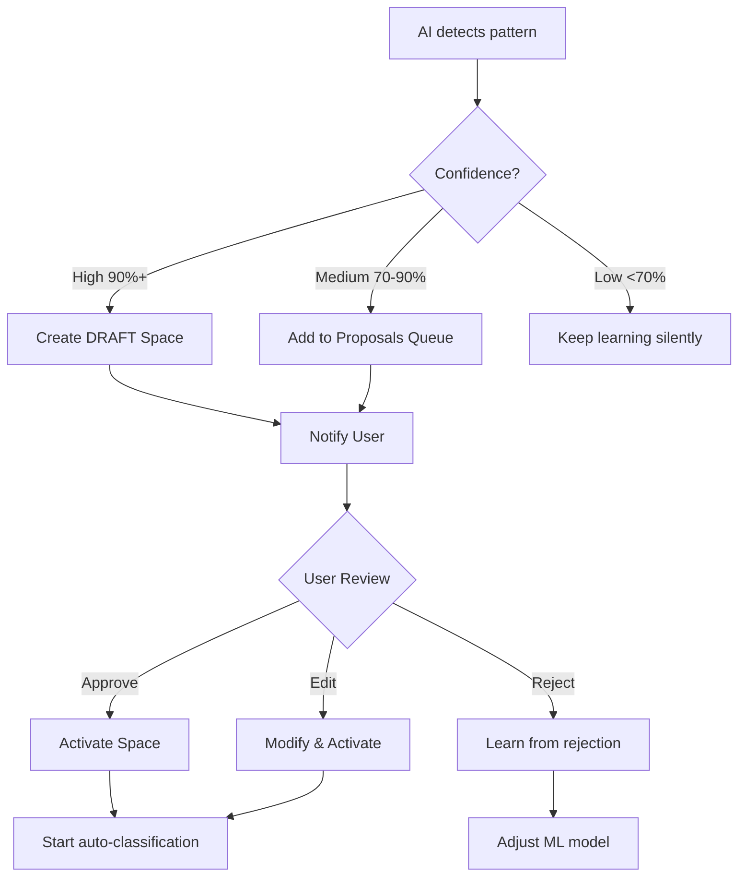

# Context Spaces + Zettelkasten: Architecture Design Discussion

**Date:** 2025-10-13
**Status:** Conceptual Design
**Purpose:** AI-driven topic discovery and knowledge management system

---

## Executive Summary

Система для автоматичного виявлення тем (Context Spaces) з Telegram історії за допомогою AI з використанням принципів Zettelkasten для організації знань.

**Core Philosophy:**
- **Human-in-the-loop:** AI пропонує, людина затверджує
- **Emergent structure:** Структура виникає природно з даних
- **Knowledge graph:** Зв'язки між ідеями важливіші за ієрархію
- **Continuous learning:** Система вчиться на кожному повідомленні

---

## Problem Statement

### Challenge: 80-90% шуму в офісних чатах

Telegram історія містить:
- 🗑️ **Pure Noise (80%):** "Привіт", "Дякую", small talk
- 💬 **Contextual Chat (15%):** Обговорення без actionable content
- 💎 **Valuable Content (5%):** Problems, features, decisions, важлива інфо

**Goal:** Виявити цінні теми та структурувати знання автоматично.

---

## Core Concepts

### 1. Context Spaces (Topics)

**NOT** просто категорії або папки.

**Definition:** Living knowledge containers - точки входу для exploration знань.

**Характеристики:**
- Верхнього рівня (high-level)
- Довгий lifecycle (архівуються тільки після закриття функціоналу)
- Створюються/схвалюються людиною
- Можуть бути реактивовані
- AI пропонує, user затверджує

**Lifecycle States:**
```
🆕 DRAFT (AI proposal)
   ↓ user approves
📘 ACTIVE (збирає знання, AI працює)
   ↓ functionality closed
📦 ARCHIVED (read-only, searchable)
   ↓ re-opened if needed
🔄 REACTIVATED
```

**Auto-detection архівації:**
- Немає нових messages 3+ місяці
- Всі entities в статусі "done"
- Related code merged/deployed
- User explicitly marked as "completed"

---

### 2. Knowledge Atoms (замість простих Entities)

**Inspiration:** Zettelkasten permanent notes

**Definition:** Atomic unit of knowledge - мінімальна самодостатня ідея.

**Key Properties:**
- **Self-contained:** Зрозуміла БЕЗ додаткового контексту
- **Reusable:** Може бути в багатьох topics одночасно
- **Linked:** Bidirectional links до інших atoms
- **Timestamped:** Unique ID based on creation time (Zettelkasten style)

**Types:**
- Problem
- Solution
- Decision
- Question
- Insight
- Pattern
- Requirement

**Structure:**
```yaml
Atom ID: 20251013-143052
Type: Problem
Title: "iOS login crash on biometric auth failure"

Content: |
  Self-contained description with enough context
  to understand without reading source messages

Links to:
  - 20251012-091234  # Solution: Add error handling
  - 20251010-153421  # Related: Android biometric flow
  - 20251008-103311  # Decision: Use biometric auth

Topics: [Mobile App, Authentication]
Tags: [ios, bug, critical, biometric]
Source: Telegram #12453, #12467, #12501
Confidence: 0.92
User Approved: true
```

**Critical difference:** Atom живе НЕЗАЛЕЖНО від topic. Один atom, багато contexts.

---

### 3. Sub-features (Hub Notes)

**Purpose:** Curated collections of related atoms + tasks

**Position in hierarchy:**
```
Topic (Structure Note - entry point)
  ├─ Sub-feature (Hub Note - aggregation)
  │   ├─ Atom
  │   ├─ Atom
  │   └─ Task
  └─ Sub-feature (Hub Note)
      └─ ...
```

**Example:**
```yaml
Sub-feature: "Biometric Authentication"
Type: Hub Note
Parent Topic: Mobile App Development

Summary: |
  Implementation of biometric auth for mobile login.
  Current status: iOS broken, Android working.

Key Atoms:
  Decisions:
    - 20251008-103311  # Use native biometric APIs
  Problems:
    - 20251013-143052  # iOS crash on failure
  Solutions:
    - 20251012-091234  # Error handling wrapper

Tasks:
  - [OPEN] Fix iOS crash
  - [DONE] Implement Face ID

Stats:
  - 12 atoms linked
  - 3 open tasks
  - Last updated: 2h ago
```

**Flexibility:** Sub-features можуть "вирости" в окремий topic якщо стануть великими.

---

### 4. Bidirectional Links (Graph Power)

**Philosophy:** Зв'язки між ідеями важливіші за ієрархію.

**Link Types:**

| Type | Description | Example |
|------|-------------|---------|
| `continues` | Atom B продовжує думку A | Insight → Deeper Insight |
| `relates` | Схожа тема | Problem A ↔ Problem B |
| `contradicts` | Конфлікт | Decision A ⊗ Decision B |
| `solves` | Рішення проблеми | Solution → Problem |
| `implements` | Реалізація | Task → Decision |
| `depends_on` | Технічна залежність | Feature A → Backend B |
| `derives_from` | Походження знання | Atom → Source Message |

**Backlinks - найцінніша фіча:**
```yaml
Atom: "Problem: Authentication timeout"

Backlinks (автоматичні):
  Referenced by:
    - Decision: Use JWT with 24h expiry
    - Solution: Implement refresh token
    - Question: Should we support remember me?

  Mentioned in Messages:
    - Telegram #12453
    - Telegram #12891
```

**Why critical:** Коли дивишся на Problem, ти МАЄШ бачити всі пов'язані рішення, навіть якщо вони в інших topics.

---

## Zettelkasten Integration

### Mapping to Zettelkasten Concepts

| Zettelkasten | Our System | Purpose |
|--------------|------------|---------|
| Fleeting Notes | Telegram Messages | Raw input, 90% noise |
| Literature Notes | Extracted Data | AI-processed structure |
| Permanent Notes | Knowledge Atoms | Verified, high-quality knowledge |
| Structure Notes | Topics | Entry points to knowledge graph |
| Hub Notes | Sub-features | Curated subgraphs |

### Progressive Summarization (5 Levels)

```
Level 0: Raw Messages (fleeting)
  → 90% noise, 10% value
  → Зберігаємо короткий час

Level 1: Extracted Data (literature notes)
  → AI витяг структуру
  → Чекає на верифікацію

Level 2: Verified Atoms (permanent notes)
  → User approved
  → Високоякісне знання
  → Живе вічно

Level 3: Synthesized Insights (structure notes)
  → Patterns з багатьох atoms
  → Hub notes, topics
  → Еволюціонують

Level 4: Meta-knowledge (MOCs - Maps of Content)
  → Зв'язки між topics
  → Стратегічний рівень
  → Рідко змінюється
```

### Emergent Structure

**Key insight:** Структура НЕ створюється заздалегідь, вона виникає з даних.

**AI Role:**
- Виявляє clusters схожих atoms
- Пропонує створити hub notes
- Знаходить зв'язки між atoms
- Детектує коли topic потребує розбиття

**Example:**
```
AI аналізує atoms:
  - 20251013-143052  # iOS crash
  - 20251013-150912  # iOS version compatibility
  - 20251013-162340  # iOS certificate issue
  - 20251014-091205  # iOS build failure

Common tags: [ios, mobile, deployment]
Similarity: 0.87

💡 Suggestion: Create Hub Note "iOS Deployment Issues"?
```

---

## AI Processing Pipeline

### Continuous Learning Flow

```
📱 Telegram Message arrives
    ↓
[1. Noise Filter]
    Quick classification: noise vs valuable
    ├─ 80% → DROP (don't store)
    └─ 20% → Continue
    ↓
[2. Content Extraction] (Pydantic-AI)
    - Extract entities
    - Identify topics mentioned
    - Detect relationships
    - Calculate value score
    ↓
[3. Classification] (Vector similarity)
    - Compare with existing topics
    - Find best match(es)
    - Calculate confidence
    ↓
[4. Decision Engine]
    ├─ High confidence (90%+) → Auto-assign + notify
    ├─ Medium (70-90%) → Add to proposals
    ├─ New pattern → Flag for topic creation
    └─ Low (<70%) → Log for learning
    ↓
[5. Graph Update]
    - Update topic embeddings
    - Refresh relationships
    - Trigger dependent updates
    ↓
[6. User Notification] (if needed)
    - WebSocket push to dashboard
    - Summary of changes
    - Pending proposals
```

### Noise Filter Strategy

**Signals of "valuable content":**
- Contains technical terms
- Mentions problems/bugs/features
- Has questions requiring decisions
- Contains deadline/priority keywords
- Length > 50 tokens
- Thread with many replies
- Team reactions (emoji votes)

**Storage Strategy:**
- Pure noise → Don't store
- Contextual chat → Store only metadata (timestamp, participants)
- Valuable → Full text + embeddings

---

## Human-in-the-Loop Architecture

### Core Principle

**AI Suggests → Human Approves → System Acts**

### Confidence Thresholds

| AI Confidence | Topics (top-level) | Entities inside Topics |
|--------------|-------------------|----------------------|
| 95%+ | Propose creation | Auto-add + notification |
| 80-95% | Propose creation | Auto-add |
| 60-80% | Wait for more data | Propose |
| <60% | Don't show | Don't show |

### Approval Workflow



### Learning from User Actions

**Reinforcement Learning signals:**

| User Action | AI Learns |
|-------------|-----------|
| Moved task from "Work" to "DevOps" | Associate DevOps terms with DevOps topic |
| Created new topic manually | Gap in AI understanding |
| Deleted AI-proposed topic | Confidence threshold too low |
| Renamed topic | AI naming needs improvement |
| Merged 2 topics | AI over-segments |
| Split topic | AI under-segments |

**Feedback loop:**
```
1. AI classifies message → Topic A
2. User moves to Topic B
3. AI remembers mistake
4. Next similar message → Topic B (confidence++)
```

---

## Graph Relationships

### Topic-Level Relationships

```python
class TopicRelationship:
    DEPENDS_ON = "depends_on"      # A needs B to work
    BLOCKS = "blocks"              # A prevents B progress
    RELATED_TO = "related_to"      # Similar context
    EVOLVED_FROM = "evolved_from"  # A is continuation of B
    CONFLICTS_WITH = "conflicts"   # Tech/design conflicts
    SHARES_TEAM = "shared_team"    # Same people work on both
```

### AI Relationship Detection

```
Message: "We can't implement push notifications
          until backend API is ready"

AI extracts:
  Topic A: "Mobile App" / Feature: "Push Notifications"
  Topic B: "Backend API"
  Relationship: A DEPENDS_ON B
  Confidence: 92%

AI creates proposed edge in graph
User approves → relationship established
```

### Graph Queries

**Examples:**

```
🔍 "Show me what blocks Mobile App launch"
   → Backend API, iOS Certificate Issue

🔍 "What depends on Authentication?"
   → Mobile App, Web Dashboard, API Gateway

🔍 "Find orphan topics"
   → Topics with no dependencies

🔍 "Critical path to Release v2.0"
   → Shows dependency chain
```

### Visualization

**Options:**
- Separate "Topic Graph" page with interactive viz
- Inline relationships on topic detail page
- Both (graph for exploration, inline for quick reference)

---

## Smart Metrics (не тупі)

### Принцип

Метрики мають давати **actionable insights**, не просто числа.

### Тупі метрики (уникати):
- ❌ "243 messages analyzed" - і що?
- ❌ "15 topics created" - а скільки треба?
- ❌ "AI accuracy: 87%" - в чому це виражається?

### Розумні метрики:

**System Health:**
```
🎯 AI Usefulness Score
   - 89% of suggestions accepted this month ↑
   - Saved you from creating 12 topics manually
   - Auto-classified 156 messages (3h saved)
```

**Topic Activity:**
```
📊 Topic Activity Pattern
   "Backend API" is:
   - 🔥 Hot topic (45 msgs this week vs 12 avg)
   - ⚠️ Blocking 3 other topics
   - 👥 Most active: @dev1, @dev2
   - 📈 Trend: growing complexity
```

**Decision Support:**
```
💡 Insights
   - "Authentication" mentioned in 4 different topics
     → Maybe extract to separate topic?

   - "Mobile App" has 47 open entities
     → Consider splitting or prioritizing

   - "DevOps" idle for 2 weeks
     → Archive or waiting for something?
```

**Leading Indicators (early warnings):**
```
⚠️ Potential Issues:
   - Topic "API Gateway" growing 300% this week
     → Potential issue brewing?

   - 15 messages mention "performance" in 3 days
     → New topic emerging: "Performance Issues"?
```

---

## Database Schema (Conceptual)

### Core Tables

```sql
-- Knowledge Atoms (Permanent Notes)
CREATE TABLE atoms (
    id TEXT PRIMARY KEY,  -- timestamp-based: 20251013-143052
    type TEXT,  -- problem, solution, decision, etc.
    title TEXT,
    content TEXT,  -- Self-contained description
    metadata JSONB,
    created_at TIMESTAMP,
    updated_at TIMESTAMP,

    -- Vector embedding for similarity search
    embedding vector(1536),

    -- Quality
    confidence FLOAT,
    user_approved BOOLEAN DEFAULT FALSE
);

-- Bidirectional Links between Atoms
CREATE TABLE atom_links (
    from_atom TEXT REFERENCES atoms(id),
    to_atom TEXT REFERENCES atoms(id),
    link_type TEXT,  -- continues, solves, contradicts, etc.
    strength FLOAT,  -- 0-1, connection strength
    created_at TIMESTAMP,

    PRIMARY KEY (from_atom, to_atom)
);

-- Topics as Structure Notes
CREATE TABLE topics (
    id SERIAL PRIMARY KEY,
    name TEXT,
    description TEXT,
    type TEXT DEFAULT 'structure',  -- structure, hub, moc
    parent_id INTEGER REFERENCES topics(id),
    status TEXT DEFAULT 'active',  -- draft, active, archived
    metadata JSONB,

    created_at TIMESTAMP,
    archived_at TIMESTAMP
);

-- Many-to-Many: Atoms can be in multiple topics
CREATE TABLE topic_atoms (
    topic_id INTEGER REFERENCES topics(id),
    atom_id TEXT REFERENCES atoms(id),
    position INTEGER,  -- Order in topic structure
    note TEXT,  -- Why atom is in this topic

    PRIMARY KEY (topic_id, atom_id)
);

-- Topic Relationships (Graph edges)
CREATE TABLE topic_relationships (
    from_topic INTEGER REFERENCES topics(id),
    to_topic INTEGER REFERENCES topics(id),
    relationship_type TEXT,  -- depends_on, blocks, etc.
    metadata JSONB,

    PRIMARY KEY (from_topic, to_topic)
);

-- Source Messages (Fleeting Notes)
CREATE TABLE telegram_messages (
    id SERIAL PRIMARY KEY,
    telegram_id BIGINT,
    chat_id BIGINT,
    user_id BIGINT,
    content TEXT,
    timestamp TIMESTAMP,
    metadata JSONB,

    processing_level INTEGER,  -- 0-4 (fleeting → meta)
    value_score FLOAT,  -- How valuable (0-1)
    extracted_atoms TEXT[]  -- Which atoms derived
);

-- AI Proposals (pending user approval)
CREATE TABLE space_proposals (
    id SERIAL PRIMARY KEY,
    proposed_name TEXT,
    description TEXT,
    confidence FLOAT,
    source_messages INTEGER[],
    extracted_entities JSONB,
    status TEXT,  -- pending, approved, rejected
    created_at TIMESTAMP
);
```

---

## UI Concepts

### 1. Atom Detail View

```
┌─────────────────────────────────────┐
│ 💎 iOS login crash on biometric    │
│ Type: Problem  •  ID: 20251013-143052│
├─────────────────────────────────────┤
│ [Self-contained description]        │
│                                     │
│ Links to (3):                       │
│  → Solution: Error handling wrapper │
│  ← Decision: Use biometric auth     │
│  ↔ Related: Android flow            │
│                                     │
│ Found in topics (2):                │
│  • Mobile App Development           │
│  • Authentication                   │
│                                     │
│ Backlinks (5):                      │
│  • Mentioned in Message #12453      │
│  • Referenced by Task #891          │
│  • Solved by Atom 20251012-091234   │
│                                     │
│ Source:                             │
│  Telegram: #12453, #12467, #12501   │
│  Confidence: 92%                    │
│  ✅ User Approved                   │
│                                     │
│ [Edit] [Add Link] [Move to Topic]  │
└─────────────────────────────────────┘
```

### 2. Topic View (Structure Note)

```
┌─────────────────────────────────────┐
│ 📁 Mobile App Development           │
│ Structure Note  •  Active           │
├─────────────────────────────────────┤
│ Description: Entry point for mobile │
│ development knowledge               │
│                                     │
│ Key Areas:                          │
│                                     │
│ 🔐 Authentication (12 atoms)        │
│    Most recent:                     │
│    • iOS crash ⚠️ (2h ago)          │
│    • Error handling ✅              │
│    [View all atoms]                 │
│                                     │
│ 🚀 Performance (7 atoms)            │
│    • Lazy loading images            │
│    • Caching strategy               │
│    [View all atoms]                 │
│                                     │
│ 💡 AI Suggestions:                  │
│    7 atoms about "Push              │
│    Notifications" detected.         │
│    Confidence: 87%                  │
│    [Create Hub Note] [Ignore]       │
│                                     │
│ 🔗 Relationships:                   │
│    Depends on: Backend API          │
│    Related to: User Experience      │
│    [View Graph]                     │
│                                     │
│ 📊 Activity:                        │
│    45 msgs this week (↑ 300%)       │
│    3 open tasks                     │
│    Last enriched: 2h ago            │
└─────────────────────────────────────┘
```

### 3. Graph View

Interactive visualization:
- **Nodes:** Atoms (colored by type)
- **Edges:** Links (styled by type)
- **Clusters:** Visual grouping of related atoms
- **Topics:** Entry points (larger nodes)
- **Actions:**
  - Click node → Open atom detail
  - Drag to explore
  - Zoom: topic level ↔ atom level
  - Filter by type, date, topic

### 4. Proposals Queue

```
┌─────────────────────────────────────┐
│ 🤖 AI Suggestions (3 pending)       │
├─────────────────────────────────────┤
│ 1. Create Topic: "iOS Deployment"   │
│    Confidence: 89%                  │
│    Based on 12 messages, 4 atoms    │
│    [Review] [Quick Approve] [Reject]│
│                                     │
│ 2. Link Atom: 20251013-143052       │
│    to Solution: 20251012-091234     │
│    Confidence: 94%                  │
│    [Approve] [Reject]               │
│                                     │
│ 3. Split Topic: "Mobile App"        │
│    Detected 2 clusters: iOS/Android │
│    Confidence: 76%                  │
│    [Review] [Ignore]                │
└─────────────────────────────────────┘
```

---

## Key Advantages of Zettelkasten Approach

### 1. Flexibility
```
Atom: "Performance optimization pattern"

Can be in:
  - Topic: Mobile App
  - Topic: Backend API
  - Topic: Best Practices

Without duplication! One atom, many contexts.
```

### 2. Knowledge Compounds
```
Atom A: "Firebase has quota limits"
  +
Atom B: "We need high availability"
  =
New Insight: "Need fallback auth"
  (AI can detect this!)
```

### 3. No Information Silos
```
Traditional:
  Topic A: contains Entity X
  Topic B: doesn't know about X
  ❌ Knowledge isolated

Zettelkasten:
  Atom X: linked to both Topic A and B
  ✅ Knowledge flows
```

### 4. Natural Evolution
```
Small project:
  - Few atoms
  - 2-3 topics
  - Simple links

Project grows:
  - Atoms accumulate
  - Clusters emerge → new hubs
  - Topics reorganize naturally
  - Structure adapts
```

### 5. Reusability
```
Atom: "Decision: Use JWT for auth"

Used in:
  - Mobile App (why we chose JWT)
  - Backend API (implementation details)
  - Security Review (audit trail)
  - New Developer Onboarding (architecture decisions)

Single source of truth, multiple contexts.
```

---

## Implementation Challenges

### 1. Complexity for Users

**Challenge:** Zettelkasten має learning curve.

**Solution:**
- UI приховує складність
- User бачить звичні topics
- Graph view optional (power users)
- AI автоматизує зв'язки
- Progressive disclosure

### 2. Atom Creation Strategy

**Question:** Коли AI має створити atom?

```
Message: "Треба пофіксити логін на айфоні"

Options:
  A. Одразу створити atom (low confidence)
  B. Зачекати більше messages для context
  C. Створити тільки якщо confidence > 80%
```

**Recommendation:** Створити одразу з low confidence. Якщо схожі atoms виникають → merge або strengthen links.

### 3. Atom Granularity

**Guidelines:**

```
TOO ATOMIC:
  "Error on line 45"
  ❌ Занадто дрібно, немає context

GOOD ATOMIC:
  "iOS crash due to missing error handling"
  ✅ Self-contained, reusable

TOO BROAD:
  "All mobile authentication issues"
  ❌ Це hub note, не atom
```

### 4. Multi-topic Messages

**Question:** Message про кілька topics?

```
Message: "Нам треба зробити authentication для
          мобілки, інтегрувати з backend API"

Це про:
  - 🔐 Authentication
  - 📱 Mobile App
  - ⚙️ Backend API

Options:
  A. Primary topic only (Authentication)
  B. Multiple assignment (all three)
  C. Primary + references (Auth, refs to others)
```

**Recommendation:** Create atom in primary topic, add bidirectional links to related topics. Best of both worlds.

### 5. Entity Lifecycle при архівації

**Question:** Що з atoms коли topic архівується?

**Approach A:** Архівувати все разом
- Atoms стають read-only
- Показуються тільки в search

**Approach B:** Atoms можуть мігрувати
- Atom переміщується в новий topic
- History: "Originally from: Mobile v1"

**Recommendation:** Atoms залишаються доступними (read-only), але можуть бути re-linked до нових active topics. History зберігається.

---

## Open Questions

### Technical

1. **Vector DB:** PostgreSQL pgvector чи окремий vector DB (Pinecone, Weaviate)?
2. **Embeddings:** OpenAI embeddings чи local model (BERT)?
3. **Real-time vs Batch:** Process кожне message чи батчами?
4. **Latency goal:** <5 sec для real-time feel?

### AI/ML

1. **AI Provider:** OpenAI, Anthropic, чи локальна модель?
2. **Fine-tuning:** Чи тренувати custom model на project data?
3. **Learning storage:** Де зберігати accumulated knowledge? (model weights, prompt context, separate KB?)

### Product

1. **Graph viz:** Must-have чи nice-to-have?
2. **Explicit feedback:** "👍/👎" buttons чи тільки implicit learning?
3. **Privacy:** Зберігати full text чи тільки embeddings?
4. **Telegram access:** Яким чином отримувати історію? (Bot API, export, webhook?)

---

## Next Steps

### Phase 1: Foundation (Current)
- ✅ Topic CRUD with autosave
- 🔄 Basic topic structure
- ⏳ Telegram message ingestion

### Phase 2: AI Pipeline
- Noise filter implementation
- Entity extraction (Pydantic-AI)
- Vector embeddings storage
- Classification engine

### Phase 3: Atoms & Links
- Atom creation workflow
- Bidirectional links
- Basic graph visualization
- User approval UI

### Phase 4: Intelligence
- Continuous learning
- Pattern detection
- Proposal queue
- Smart metrics

### Phase 5: Advanced
- Advanced graph queries
- Temporal evolution
- Cross-topic analytics
- Meta-knowledge layer

---

## References

### Concepts
- **Zettelkasten Method:** Niklas Luhmann's note-taking system
- **Progressive Summarization:** Tiago Forte's PARA method
- **Building a Second Brain:** Personal knowledge management
- **Knowledge Graphs:** Semantic networks, entity relationships

### Existing Documentation
- `docs/content/en/topics.md` - Context Spaces concept
- Project architecture docs

---

## Appendix: Terminology

| Term | Definition |
|------|------------|
| **Context Space** | Top-level organizing concept, entry point to knowledge |
| **Knowledge Atom** | Atomic, self-contained unit of knowledge |
| **Hub Note** | Curated collection of related atoms (sub-feature) |
| **Structure Note** | Map of content, shows relationships between atoms |
| **Fleeting Note** | Raw, unprocessed information (Telegram messages) |
| **Literature Note** | AI-extracted structured data, awaiting verification |
| **Permanent Note** | User-approved, high-quality knowledge atom |
| **Bidirectional Link** | Two-way connection between atoms with backlinks |
| **Emergent Structure** | Organization that arises naturally from data patterns |
| **Human-in-the-loop** | AI proposes, human approves paradigm |
| **Progressive Summarization** | Multi-level processing from raw to synthesized |

---

**End of Design Document**

*This is a living document and will evolve as the system is implemented and insights are gained.*